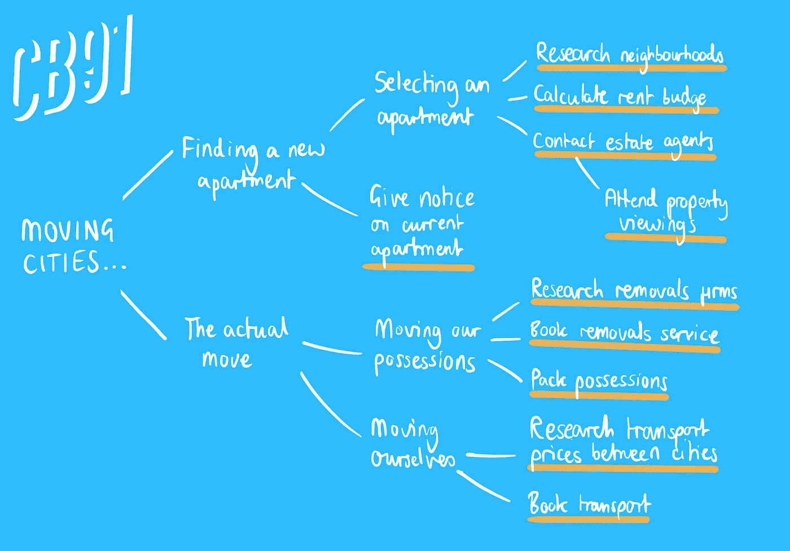
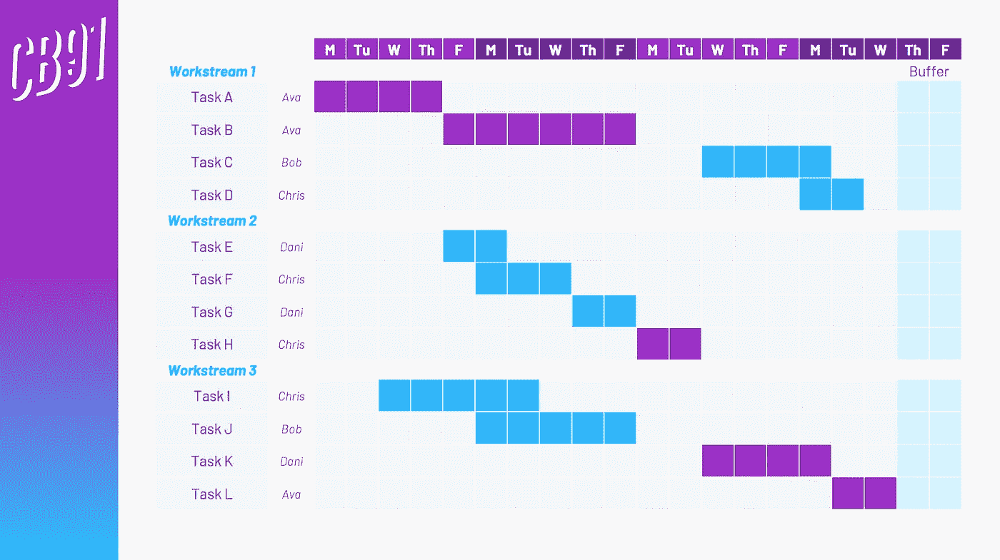

# 阻止你的项目脱轨的 6 个步骤

> 原文：<https://towardsdatascience.com/6-steps-to-stop-your-project-going-off-the-rails-9fe336d71074?source=collection_archive---------30----------------------->

## 如何撰写能够按时交付的项目计划

rossrail 是欧洲最大的基础设施项目。这是一条 73 英里长的铁路线，直通伦敦市中心。它本应在 2018 年底完工并投入运行。现在预计它将于“2021 年末”开业。这一延迟预计将导致[13.5 亿*亿*的收入损失](https://www.theguardian.com/uk-news/2019/dec/13/crossrail-delays-cost-tfl-london-up-to-135bn-lost-revenue)。

横梁。项目规划的噩梦，失控的螺旋上升…

考虑到与项目超支相关的成本，你可能会认为管理者更擅长于编写他们实际上可以坚持的计划。然而，一次又一次，时间表被打破，预算被抹杀。Stephen J. Dubner(因《魔鬼经济学》而出名)探讨了这一现象，**规划谬误——过度乐观和未能从经验中学习的有害混合，导致糟糕的规划，进而导致糟糕的项目结果。**

> **“计划谬误是一种倾向，它低估了完成一个项目所需的时间，而知道类似的项目在过去通常需要更长的时间。因此，这是对一个特定案例的乐观预测与更普遍的知识的结合，而更普遍的知识会提出不同的看法……”——[罗杰·布勒教授](https://www.wlu.ca/academics/faculties/faculty-of-science/faculty-profiles/roger-buehler/index.html)**

**即使我们中的大多数人不必担心在一个主要的欧洲城市下面挖掘一条巨大的隧道的复杂性，我们也远远不能避免日常生活中的规划谬误(这就是为什么你的新花园平台仍然没有建设，靠在你房子的一侧)。**

# **准备失败，准备失败**

**我现在生活中有一个大项目。**

**我正在完成一门数据科学的课程，一旦毕业，我将搬到一个新的城市，并试图给自己找一份闪亮的新工作。坦白地说，我不能让这个项目对我产生任何负面影响，所以我需要一个无懈可击的项目计划。**

**尽管我们在这篇博客中关注的是一个相对较小的单人项目，但以下几点适用于规划几乎任何范围的任何项目；与一个 30 人的团队在你的公司推出一个新产品，与一个商业伙伴一起发展一个新公司，或者，事实上，自己在你的花园里建造一个新的平台。管理这些示例项目的主要区别在于实际的实现过程中。**

**现在，让我们深入我们的六步计划，更好地进行项目规划！**

# **1.定义您的项目范围**

**这听起来是显而易见的，但是一个真正可靠的项目定义将会为你以后省去一大堆痛苦。为了确保项目定义良好，可以使用 [SMART 原则](https://en.wikipedia.org/wiki/SMART_criteria)。这通常是在设定目标时部署的(例如，为了职业发展)，但它在项目管理中有很多适用性。**

*   *****特异。*** 深入了解你的项目的*产出*实际上会是什么的具体细节。*“我要搬到伦敦去找份工作”*不具体。*“我将在伦敦 2 区租一套公寓，并在一家科技公司获得一个数据科学职位”*情况开始好转。在这一点上，知道你的项目将*而不是*实现什么也是值得的。这将有助于防止“[范围蔓延](https://www.wrike.com/project-management-guide/faq/what-is-scope-creep-in-project-management/)”——原始计划中没有考虑到的不可预见的项目增加(因此将导致超支)。**
*   *****可测。你知道你的项目实际上什么时候完成吗？有没有一个可测量的*条件或标准能说明这一点？****
*   *****可分配。我们应该能够将项目任务分配给实际上有能力完成它们的人(这对于更大的项目更有意义)。稍后我们将更详细地讨论责任分配。*****
*   *****现实主义。尽管有这样一句老话:如果你用心去做，就能做任何事情，但是“用心去做”在一个项目计划中是很难解释的，所以要确保这个项目实际上是可行的。*****
*   *****有时限。有没有可能给这个项目设定一个结束日期？如果没有，那么我们会让自己很难“按时”完成…*****

# **2.列出项目需要的一切**

**我指的是 ***一切*** 。**

**虽然“搬到一个新的城市”听起来像是一个独立的“行动”，但这并不是一项简单的任务。事实上，这相当令人生畏——你甚至从哪里开始呢？我之前写了一篇博客，谈到“MECE”问题树是分解复杂分析问题的一种方式。我会在这里采取类似的方法。**

** [## 所有数据科学家的关键问题是:“那又怎样？”

### 如何撰写假设和进行分析，让你的老板刮目相看

towardsdatascience.com](/the-key-question-for-all-data-scientists-so-what-25139fb352c6) 

让我们举一个移动城市的例子，并依次将大的、可能势不可挡的行动分解成它们的组成部分。

这个过程只花了我五分钟，但我已经把“移动城市”分解成十个更小、更易管理的任务。我们总是可以进一步推进这个过程(例如,“打包物品”可以分解到房子的不同房间，我们可能希望在不同的日子处理这些物品)。事实上，在这一点上你越细化，你的最终计划就可能越精确。

无论哪种方式，这十个子任务都是需要填充您的项目计划的项目——而不是我们开始时的高级行动。值得注意的是，每个子任务也应该符合 S.M.A.R.T .框架。

# 3.分配责任

不管你的项目有多大，这一步都很重要。对于我们在上面定义的每项任务，确切地决定谁:

*   将会完成这项任务
*   对完成任务负有责任

这些可能不是同一个人！

当然，你应该确保每项任务都分配给既有能力*又有时间*完成任务的人。如果一个人被另一个经理拉去做别的事情，那么把任务分配给这个人是没有好处的。

即使你在计划一个人的项目，你也应该完成这一步。看看你列出的所有子任务(并分配给自己)。这对你来说是一个合理的工作量吗？你能自己完成所有的任务吗？注意——如果你需要学习一些东西(例如研究一个特定的 Python 库),那么这个“学习行为”需要成为你计划中的一个单独的项目！

# 4.对时机要非常诚实

这是成功的项目计划的关键。接受你在第二阶段定义的单个任务，并对每个任务独立完成的时间做一个*诚实的*评估。

***不要把整个项目的最后期限*** 考虑在内。这将扭曲你对每项任务的判断，并导致你低估它们需要多长时间(这是计划谬误的关键因素之一)。

# 5.创建关键路径

我们的项目可能会包含必须依次完成的各种任务序列，一个接一个。以我们的“移动城市”为例，这样的顺序可以是:研究居住区域->联系这些区域的房地产经纪人->安排看房->参加看房->选择公寓->支付公寓定金，等等…

当然，我们可以构建另一个序列，在城市之间转移我们的财产。注意，调查搬家公司并不一定要求我事先安排好看房。

项目的 [*关键路径*](https://en.wikipedia.org/wiki/Critical_path_method) 是总工期最长的单个序列。下面的视频展示了关键路径计算的数学(比数学更有逻辑性和横向思维！)

本练习的主要收获是:

*   关键路径精确地定义了整个项目需要多长时间
*   不在关键路径中的任务具有一定的灵活性，但会有开始和结束日期的范围，这直接取决于它们对关键路径中其他任务的依赖性

如果关键路径表明你的项目要超支了，你该怎么办？也许给你三个月完成的项目看起来要花四个月…

*   重新检查项目的范围。你想做得太多了吗？
*   增加你花在项目上的活跃天数——你能在其中加入几个周末吗？
*   增加项目的人员配备(使用项目计划草案作为您需要它的证据！)
*   作为最后的手段，试着推迟整个项目的截止日期

你当然应该**而不是**做的是回去减少你在第四阶段设定的时间估计。请记住，我们在设定这些估计值时是诚实的。现在就改变它们，简单地把所有事情塞进一个任意的时间框架里，就相当于在你开始之前就屈服于计划谬误。

一般来说，你也应该试着为项目建立一个“缓冲区”(计划末尾的空白空间)，以便在令人沮丧的可能情况下，出现问题或花费的时间比计划的长。

甘特图可能是可视化项目任务排序的最佳方式。微软 Excel 是一个非常适合手工制作的地方，尽管有软件解决方案可以自动生成它们(如果 Python 是你的障碍，那么 Plotly 有很好的[甘特图功能](https://plot.ly/python/gantt/))。

以甘特图表示的项目计划示例。注意紫色的关键路径、职责分配和项目结束时设置的缓冲期，以防万一…

# 6.实际使用你的计划

你已经花时间写了一个杀手级的项目计划。**用吧！**

当然，一个项目计划如何实施取决于项目的规模和参与的人数。这不是深入研究[scrum 和 sprint](https://www.dummies.com/careers/project-management/the-function-of-the-scrum-and-sprint-within-an-agile-project/)的时间和地点，但是，有一些经验法则是适用于所有领域的。

*   **根据计划定期检查。**根据项目的规模，可以是每天、每周或每两周一次。确保每个人都充分了解他们应该做什么，并确保这些事情确实在做。
*   **保持诚实。**如果你落后于计划，试着理解原因，并解决它。不要把计划藏在抽屉里，忘记它曾经存在过。
*   **如果需要，更新计划。**如果你低估了某些任务需要的时间，或者其他事情出了大问题，那么你需要修改计划——这没什么不好意思的。理想情况下，你可以吃掉你在第 5 阶段建立的缓冲区。然而，如果这是不可能的，你可能需要以某种方式缩小项目范围。** 

> ***感谢一路阅读到博客结尾！当然，项目管理还有许多其他方面可以帮助您的项目取得成功，但我希望这已经给了您一个良好的开端。我很想听到对上述建议的任何评论，或者这篇文章涉及的任何概念。欢迎在下方随意留言，或者通过*[*LinkedIn*](https://www.linkedin.com/in/callum-ballard/)*联系我。***