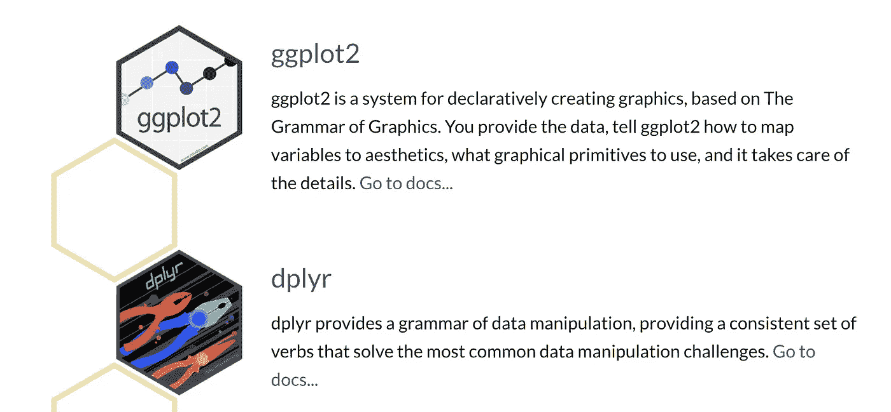
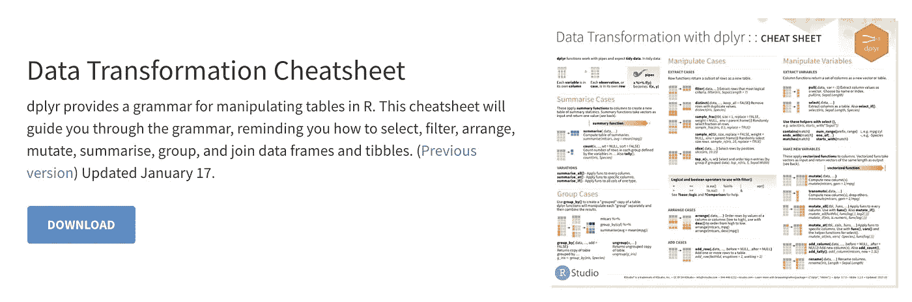
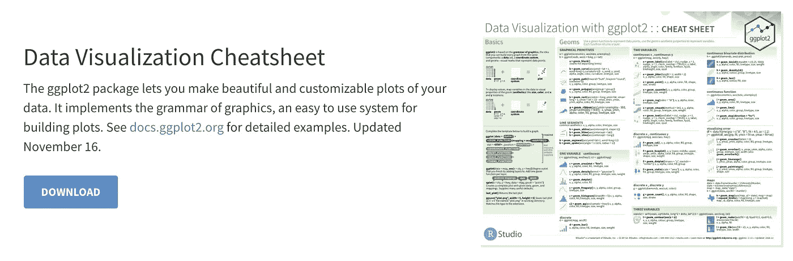
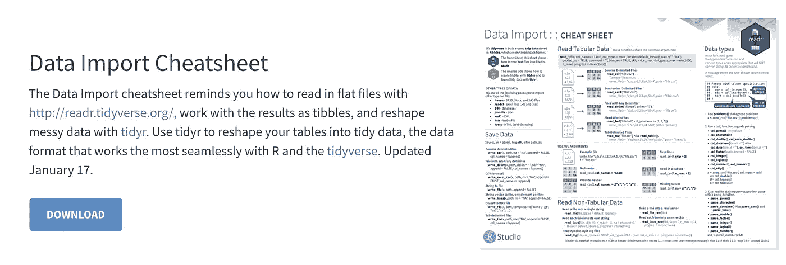
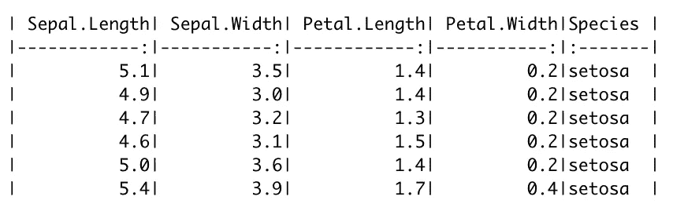

# 我在脸书教 R 学到的 6 件事

> 原文：<https://towardsdatascience.com/6-things-i-learned-from-teaching-r-at-facebook-806fc2832ec0?source=collection_archive---------21----------------------->


格雷格·布拉在 [Unsplash](https://unsplash.com?utm_source=medium&utm_medium=referral) 上的照片

## 在工作场所有效使用 R 的技巧

B2018 年至 2019 年间，我在脸书工作，担任数据科学家——在此期间，我参与开发和教授一个面向 R 初学者的课程。这是一个为期两天的课程，大约一个月一次，大约有 15-20 名学生参加，目标是让他们能够在日常工作中使用 R。

这篇文章分享了我在教授这些课程中学到的一些东西，重点是对学生有效的东西。希望这六个建议对任何使用 R 的人都有用，尤其是那些刚刚开始旅行的人。

# 但是首先，我个人学习 R 的经历

我最初是在伯克利读统计学本科时学到 R 的。在大学里，我鄙视使用 R，并把它作为完成项目和习题集的一种手段，这样我就可以毕业了。

一旦我进入职场，开始从同事那里学习 R，我对这门语言的看法开始转变。我意识到在大学里如何教授 R 有一些关键的差距——主要是我们在课堂环境中学习 R，这不能很好地转化为工作环境。

大学毕业后，我开始完全接受 R——我在脸书和 Doordash 开发过 R 包，在脸书教过 R，也参加过几次 R 会议。由于我的背景不清楚，我想分享一些技巧和建议给那些在日常生活中使用 R 的人。

*注意:我是 2015 年大学毕业的，所以课程可能会有所改进，所以我的个人经历可能与最近的大学毕业生不太相关。*

# 1.r 不仅仅是数据科学家的专利，有一个使用这种语言的理由会让学习变得更容易

在教授 R 之前，我假设我们的大部分学生都是数据科学家，希望通过将 R 引入他们的 SQL/Excel 工作流来增加他们的影响力。然而，我真的对参加这些课程的人的多样性感到惊讶。我们有软件工程师、数据科学家、数据工程师、研究人员和财务/运营人员，仅举几例。


照片由[普里西拉·杜·普里兹](https://unsplash.com/@priscilladupreez?utm_source=medium&utm_medium=referral)在 [Unsplash](https://unsplash.com?utm_source=medium&utm_medium=referral) 上拍摄

对于数据科学家来说，他们参加这门课的主要原因很清楚——他们经常与数据打交道，学习 R 将为他们提供一种更有效、更灵活的数据处理方式。此外，学习 R 会更自然，因为他们有很多机会练习语言，同时对他们的工作产生直接影响。

当试图了解为什么其他一些学生报名参加该课程时，有各种各样的原因，例如:

*   希望提高数据修改和可视化能力的工程师。
*   运营和财务部门正在寻找每天/每周重复更新 Excel 的替代方案。
*   已经熟悉 R，但想在脸书大学更新知识并学习如何有效使用它的人。

在上面的三个例子中，我们看到了非数据科学家可以从学习 R 中获得价值的方法。一般来说，如果您不是数据科学家/分析师，您希望成为这两类人中的一员:

1.  你已经在做一些事情了，通过学习 R，你可以做得更好/更快
2.  你想做一些事情，但是如果不知道 R *(或者其他一些编程语言)*，那将会非常困难/不可能

关于这个话题的最后一点——有时 R 并不是工作的最佳工具。例如，如果您已经知道如何使用 SQL+Excel，那么您就已经拥有了聚合、分析和可视化数据的致命工具组合。在我自己使用 R 大约 7 年之后，我经常发现自己求助于 SQL + Excel，仅仅是因为它更快，更容易共享。所以，如果你花了很多时间学习 R，不要觉得你需要把它用在所有事情上，因为有时它实际上会比你使用你已经是专家的工具花费两倍的时间。

# 2.蒂德维斯是国王


资料来源:tidyverse.org

**什么是**[](https://www.tidyverse.org/)****？**tidy verse 是专为数据科学设计的 R 包的自以为是的集合。所有的包共享一个底层的设计哲学、语法和数据结构。**

****tidy verse 中最流行和最有用的两个包是:****

****

**资料来源:tidyverse.org**

**为了使这一部分简明扼要: **Tidyverse 是在 R** 中聚集和修改数据的最快和最直接的方法。不仅如此，它使学习 R 变得更加有趣和容易。我第一次在没有 Tidyverse 的情况下学习 R，这是一次悲惨的经历，其他以类似方式学习 R 的人分享了我的观点。Tidyverse 在 R 用户中变得如此普遍，以至于我不建议学习/教授没有它的 R。**

**如果你从未使用过 Tidyverse，它的设置非常简单，我强烈建议你开始使用它(网上有很多资源可以学习)**

```
# This is all you need to install tidyverse:install.pacakges('tidyverse')
library(tidyverse)
```

*****注:*** 我在本文后面引用了一些软件包，如果你曾经需要安装一个新的软件包，你可以使用上面的函数来这样做。安装后，使用`library()`将其加载到 R 中**

# **3.备忘单，备忘单，备忘单**

**这与前一个主题非常吻合，因为 Tidyverse 独特的语法和长长的函数列表让学习 tidy verse 的人望而生畏。幸运的是，RStudio 团队已经创建了一堆备忘单。**对于我们的面授课程，我们会确保为所有学生打印备忘单，这样他们就不必不停地切换标签来搜索功能**。如果你可以的话，我强烈推荐你打印和层压你自己的小抄供个人使用。即使已经使用这种语言超过 5 年，我仍然会参考我的小抄。**

**[该网站](https://rstudio.com/resources/cheatsheets/)包含 RStudio 团队发布的清单。这里的一些主题更高级，但我想说下面是两个入门的**基本**备忘单:**

****

**来源:[https://rstudio.com/resources/cheatsheets/](https://rstudio.com/resources/cheatsheets/)**

****

**来源:https://rstudio.com/resources/cheatsheets/**

# **4.通过使用内部数据集进行学习**

**在上课的第一个小时内，我们让学生将内部数据库中的数据查询到 r 中。在脸书，这就像使用我们的内部软件包并编写以下代码一样简单:**

```
df <- presto("SELECT * from example_table limit 10000")
```

**我建议使用内部数据集学习有两个主要原因:**

*   **能够直接在简历中查询内部数据增强了你使用公司数据的能力。如果您不能将内部数据直接查询到 R 中，您必须采取某种变通办法，例如将数据导出到 csv 文件中，然后将其读入 R 中。这浪费了大量时间，因此我会尽可能早地熟悉如何将数据直接导入 R 中，即使这意味着额外的一两个小时的初始设置/获得正确的权限。**
*   ****公司的数据是其最有价值的资源之一。**如果你在脸书工作，那么你应该利用你拥有世界上最丰富、最有趣的数据集这一事实。这同样适用于任何其他公司——优步的乘车数据，Airbnb 的预订数据，Medium 的商品数据。许多在线资源会让你使用通用数据集，所以我会尝试采取额外的步骤，在可能的情况下引入关键的公司数据集来帮助你学习。通过这样做，你已经有了将 R 放松到你的工作流程中的想法。**

# **5.导入和导出数据的重要性**

**R 是分析数据的一个很好的工具，但是如果你不能把数据输入或输出 R，那就真的是一个很大的问题。前一节稍微提到了这一点，所以这一节更实用，回顾了一些将不同类型的数据输入/输出 r 的主要方法。**

**通过关注这些方法，你应该能够几乎 100%地导入/导出必要的东西。当然，还有一个[备忘单](https://rstudio.com/resources/cheatsheets/)，你可能会发现对这很有帮助:**

****

**来源:[https://rstudio.com/resources/cheatsheets/](https://rstudio.com/resources/cheatsheets/)**

****用于导入数据:****

*   ****Csv:** `read_csv()` (Tidyverse)**
*   ****Excel:** `read_excel()` (Tidyverse)**
*   ****Google Sheets:** 与上面类似，但是对于私有工作表可能需要额外的步骤。你想用谷歌工作表的软件包。最坏的情况是，你将谷歌表单导出为 csv 格式，并使用`read_csv()`读取**
*   ****内部数据库:**使用 SQL 将数据直接导入 r。您需要咨询您的数据团队，看看是否有内部包来完成这项工作。在脸书，`presto("SELECT * FROM tbl")`是你从表格中抓取数据所需要的全部。在较小的公司，将 R 连接到内部数据库可能需要一些额外的步骤，但是至少建立 ODBC 连接应该可以让你获取数据。**

****用于导出数据:****

*   ****复制到剪贴板:`clipr`包中的** `write_clip()`将数据帧直接复制到您的剪贴板中。如果你的公司使用 Google Sheets，这是获取数据的最快方式，所以这是你可以学习的最有用的功能之一。本质上，它减少了从`Export df to csv -> Open csv and copy contents -> Paste into Sheets`到`Copy df to clipboard -> Paste into Sheets`的步骤**
*   ****复制一个 plot/graph:** 当你在 R 中做了一个 graph，最简单的分享出来的方法就是复制/粘贴。简单地放大一个图，使它进入自己的窗口，你可以右键单击并复制图像。**
*   ****直接从 R 截图:**如果你想更非正式地分享出一张小桌子(即 Slack)，给你的 R 主机截图大概是最好的选择。如果你想变得更有趣，你可以使用`knitr`包中的`kable()`功能来清理你的桌子，以便更容易阅读。**

```
# Format the iris table to be a little neateriris %>% head %>% kable
```

****

**这就是结果**

*   ****写入 CSV:****
*   ****写入内部数据库:**这通常比从内部数据库读取要复杂得多，但是如果您认为您会经常这样做，那么肯定会与您的数据团队讨论。**

# **6.保持简单，专注于基础**

**你可以用 R 做很多事情，一开始可能会有点不知所措。例如，仅在[备忘单链接](https://rstudio.com/resources/cheatsheets/)中，您就已经看到了 R 能够处理的如此多的主题/包，甚至这还只是皮毛。不要被这个暗示。**

****我们发现专注于基本面是学习 R 的最好方法:****

1.  **如何导入数据**
2.  **用`dplyr`修改数据进行分析**
3.  **使用`ggplot2`创建可视化效果**
4.  **导出结果以与您的队友共享**

**如果你能做好这些，那么你就有了用 r 做很多事情的坚实基础。**

# **结束语**

**我想写这篇文章是因为我喜欢在脸书教授 R 课程，并且认为我作为一名教师的独特经历可以对那些没有机会接触这类课程或者正在寻找在自己的工作中更有效地使用 R 的建议的人有所帮助。**