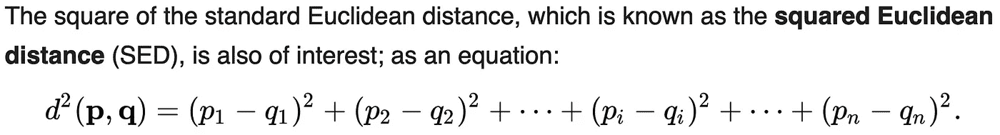

# 掌握 K-均值聚类需要知道的 6 件事

> 原文：<https://towardsdatascience.com/6-things-to-know-to-master-k-means-clustering-1d5be9b189dd?source=collection_archive---------53----------------------->

## 了解最流行的聚类方法之一

亚历山大·安德鲁斯在 [Unsplash](https://unsplash.com?utm_source=medium&utm_medium=referral) 上拍摄的照片

市场上有多少种类型的客户？NBA 有多少种类型的球员？常春藤盟校有多少种学生？

现实生活中有很多这样的问题——这些问题试图理解特定环境中的人(以及物体)的类型。通过了解我们对什么类型的人感兴趣，我们可以制定相应的策略来满足我们的特殊需求。

例如，我们假设市场研究发现市场上有两种类型的客户——一种对价格上涨更敏感，另一种对价格上涨不太敏感。通过研究你产品的顾客，你可以决定是否要提高产品价格来弥补增加的成本。假设你的大多数顾客对价格敏感，那么如果你决定提价，你应该更加小心潜在的销售下降。

这只是一个说明聚类分析实际应用的小例子。这是来自[维基百科](https://en.wikipedia.org/wiki/Cluster_analysis)页面的聚类定义。

> **聚类分析**或**聚类**是对一组对象进行分组的任务，使同一组中的对象(称为**聚类**)比其他组(聚类)中的对象彼此更加相似(在某种意义上)。

与上面给出的例子相关，为你的产品识别客户类型的过程是进行聚类分析。需要注意的是，聚类方法有很多种，最常用的一种叫做 **K-means 聚类**。在本文中，我将回顾 K-means 的一些关键方面，并希望您对这种流行的聚类方法有更好的理解。

在我们开始研究 K-means 之前，下图直观地向您展示了一个常见的 K-means 如何通过多次迭代来达到最终的聚类结果。

来自 K-means [维基百科](https://en.wikipedia.org/wiki/K-means_clustering#/media/File:K-means_convergence.gif)(由 [Chire](https://commons.wikimedia.org/wiki/User:Chire) 创作，授权: [CC BY-SA 4.0](https://creativecommons.org/licenses/by-sa/4.0) )

## 1.K-means 是基于原型的。

第一个问题是我们如何确定聚类，或者我们如何确定一个特定的样本应该被分配到哪个聚类。有几种可用的聚类方法，包括基于连接性的(即分层的)、基于网格的、基于分布的、基于密度的和基于原型的。其中 **K-means 聚类属于基于原型的范畴。**

为了概念化基于原型的聚类方法，您可以认为对于每个聚类，都有一个原型数据点，它表示特定聚类的典型成员应该是什么样子。应该注意的是，原型数据点是从属于该聚类的数据点估计的，并且不必是原始数据集的实际情况。

然而，一些算法要求原型数据点必须是实际的数据点，这被称为 **K-medoid** 聚类。在大多数涉及连续特征的应用中，K 均值指的是使用**质心**作为原型数据点。

## 2.聚类分配和迭代

使用如上所示的动画图像作为例子，假设我们已经为聚类选择了三个质心作为初始种子。我们如何确定应该将样本分配给哪个组？

要指定一个数据点，我们需要计算该数据点和我们刚才选择的每个质心之间的距离。距离被认为是数据点之间的相似性-数据点与质心之间越接近越相似。最常用的度量是平方欧几里德距离(sed)，如上所示。如果考虑一个二维特征，它基本上是我们最熟悉的笛卡尔平面上两个数据点之间的距离。

截图来自[维基百科](https://en.wikipedia.org/wiki/Euclidean_distance)

通过计算这些距离，我们能够将数据点分配给产生最小 SED 的聚类。一旦分配了每个数据点，我们就能够为我们的聚类获得更新的质心，并计算每个聚类中所有适用 SED 的误差平方和(SSE)。如果你熟悉机器学习的术语。您可以将**类内 SSE 视为 K 均值聚类试图最小化的成本函数的输出，这使得 K 均值或多或少成为一个优化问题。**

在下一次迭代中，我们将数据点分配给更新后的质心，并再次计算 SSE 以查看它是否减少。直到没有进一步的改进(上证指数已经变得足够小和稳定)，我们可以得出结论，K 均值聚类已经完成。

## 3.您必须事先指定聚类的数量。

当我们运行 K-means 聚类分析时，我们必须指定聚类的数量，*先验*。这有时被认为是 K-means 方法的一个缺点，因为对于某些数据集，我们不知道有多少个聚类是合理的。毕竟，我们没有关于我们的数据点所属的聚类的基本事实，否则，如果我们有，它就变成了一个监督学习任务。

如果我们只处理 2 维或 3 维数据，我们可以将数据可视化，以获得一些关于聚类数量的假设。然而，对于更高的维度，以人类可理解的方式可视化数据是不太可能的。因此，您最好使用相关的背景内容专业知识，并对您的数据的大概聚类数进行有根据的猜测。以此为起点，看看您的集群效果如何。

但是突出的问题是 ***当我们有不同数量的聚类时，我们如何评估哪一个聚类性能比其他的好。***

## 4.聚类评估和肘方法

我们已经在第 2 节中讨论了使用 SED 的数据点聚类分配和使用 SSE 的迭代优化。在迭代结束时，我们得到了一个 SSE 最少的模型(所有成员的特定集群分配)。

通过改变同一数据集的每次聚类分析的聚类数，我们可以得出每个模型的 SSE 值。有了这些数据，我们可以绘制一个线图，作为聚类数和 SSE 值的函数，后者通常被称为失真。下面显示了一个假设聚类模型的简单示例。

肘法(作者自创)

如图所示，当簇数为 3 时，有一个急转弯。这意味着除了这三种聚类方法之外，我们的聚类性能没有任何有意义的提高(没有多少降低)。因此，说 3 是一个很好的聚类数是有意义的。

请注意，除了肘方法，我们还可以使用侧影图来评估不同聚类数的模型之间的性能。如果你感兴趣，这里有一篇关于这个话题的极好的[中型文章](/clustering-metrics-better-than-the-elbow-method-6926e1f723a6)。

## 5.你需要标准化你的数据点。

当 K-means 聚类有多个特征时，这些特征的初始数据集可能有不同的尺度。例如，让我们说一个尺度是以米为单位测量的学生身高，另一个尺度是以千克为单位测量的体重。正如您所料，这些尺度的方差绝对值可能会非常不同。

对于身高，方差可能在小数值水平，然而，体重可以有大得多的方差。当我们的 K-means 聚类迭代优化模型时，它会尽最大努力更多地依赖于减少权重贡献的 SSE。看到问题了吗？通过或多或少地忽略来自高度尺度的贡献，优化将走捷径。

解决方案是，我们应该通过将单个尺度带到相同或相似的范围水平来标准化数据点。通常，我们可以运行 Z 分数归一化，并对每个要素使用标准化的 Z 分数。或者，您也可以运行最小-最大缩放。请注意，这两种方法的性能将取决于数据集，并且没有关于哪一种方法一定比另一种方法更好的固定规则。

## 6.初始化很重要

当我们运行 K-means 聚类分析时，我们从随机选取的质心开始。通过多次迭代，我们将能够得到一个 SSE 达到最小值的模型——这个最小值可能与随机选取的初始质心直接相关。如前所述，质心迭代更新，每次迭代都建立在前一次迭代的结果上。

因此，我们将得到的最终模型将与第一次迭代之前选取的质心相关。换句话说，质心的初始化直接影响我们得到的最终模型。

因此，在实践中，例如，在 scikit-learn 实现中，我们通常多次运行 K-means 聚类分析，并在这些模型中挑选最佳表现者。虽然我们可以随机选择初始质心，但更好的方法是使用所谓的 K-means++初始化方法。简而言之，K-mean++不是随机选择质心，而是一种使用概率分布来挑选初始质心的算法，这提高了 K-means 聚类的性能。

顺便提一下，在 scikit-learn K-means 实现中，默认的初始化方法是 K-means++方法，所以我们不需要担心初始质心的选择。

## 结论

总之，本文回顾了进行 K-means 聚类分析的一些关键方面。下面是一个典型的 K 均值聚类分析步骤的快速概述。

*   使用 K-means++初始化方法选取初始质心，其数量与指定的聚类数匹配(请注意，我们可以使用 elbow 方法来确定特定数据集的聚类数)
*   使用平方欧几里得距离(SED)将数据集的每个数据点分配到最近的质心
*   用每个簇中的所有成员更新质心
*   通过最小化组内误差平方和(SSE)重复前两步
*   在指定的迭代次数之后，或者模型没有更好的改进(例如，SSE 中的变化)，我们得到了最终的模型