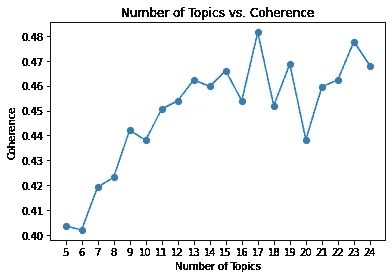
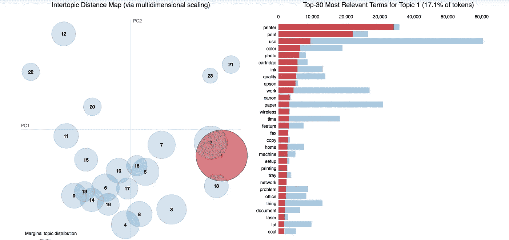
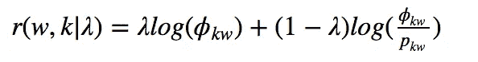
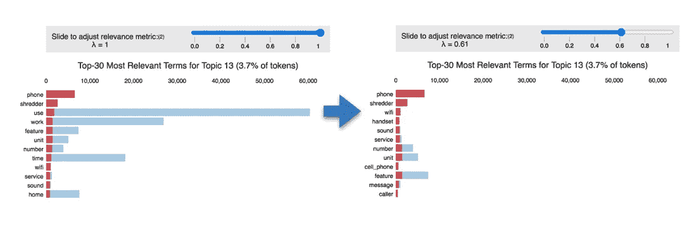
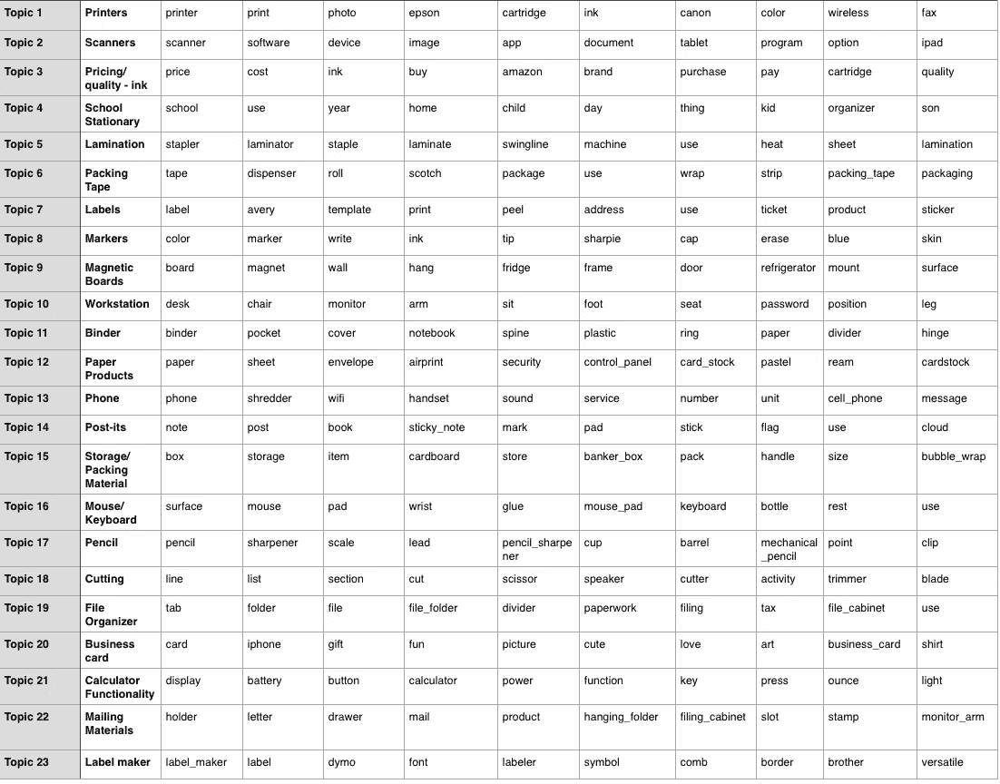

# 可解释主题模型的 6 个技巧

> 原文：<https://towardsdatascience.com/6-tips-to-optimize-an-nlp-topic-model-for-interpretability-20742f3047e2?source=collection_archive---------3----------------------->

## 关于调整 LDA 主题模型以获得易于理解的输出的 Python 实践教程。

随着如此多的文本在数字平台上输出，自动理解关键主题趋势的能力可以揭示巨大的洞察力。例如，企业可以从了解客户围绕其品牌和产品的对话趋势中受益。提取关键主题的一种常用方法是潜在狄利克雷分配(LDA)。然而，输出通常很难解释为有用的见解。我们将探索提高可解释性的技术。

# **什么是潜在狄利克雷分配(LDA)？**

潜在狄利克雷分配(LDA)是一种生成统计模型，有助于在不同数据部分的集合中提取相似性。在主题建模中，每个数据部分是一个 word 文档(例如产品页面上的单个评论)，文档集合是一个语料库(例如产品页面上的所有用户评论)。重复出现的相似单词集合可能指示主题。

LDA 假设每个**文档由固定数量的主题分布**表示，**每个主题是单词分布**。

近似这些分布的算法的高级关键步骤:

1.  用户选择 K，即当前主题的数量，调整到适合每个数据集。
2.  浏览每份文件，并随机将每个单词分配到 K 个主题中的一个。由此，我们有了计算主题 p 的**文档分布(主题 t |文档 d)** 、文档 d 中分配给主题 t 的单词的比例的起点。我们还可以计算单词 p 的**主题分布(单词 w |主题 t)** 、单词 w 在分配给主题 t 的所有文档单词中的比例。由于随机性，这些将是较差的近似。
3.  为了提高近似性，我们遍历每个文档。对于每个文档，浏览每个单词并重新分配一个新主题，其中我们根据上一轮的分布以概率 **p(主题 t |文档 d)÷p(单词 w |主题 t)** 选择主题 t。这本质上就是题目 t 生成单词 w 的**概率。从这些新作业中重新计算 p(题目 t |文档 d)和 p(单词 w |题目 t)。**
4.  不断迭代，直到主题/单词分配达到稳定状态，不再有太大变化，(即收敛)。使用最终分配来估计每个文档的主题混合(该文档中分配给每个主题的单词的百分比)和与每个主题相关的单词(该单词分配给每个主题的总次数)。

# **数据准备**

我们将探索在亚马逊 Office 产品评论上使用 LDA 优化可解释性的技术。为了准备评论数据，我们使用典型的文本清理步骤来清理评论文本:

1.  删除非 ascii 字符，例如à∅
2.  将单词转换为最基本的形式，如“running”和“ran”到“run ”,以便它们被识别为同一个单词
3.  删除标点符号
4.  删除非英语注释(如果有)

教程中的所有代码都可以在[这里](https://nicharuc.github.io/topic_modeling/)找到，这里清理的函数位于 clean_text.py，整个过程的主笔记本是 [topic_model.ipynb](https://nicharuc.github.io/topic_modeling/) 。

# **优化可解释性的步骤**

**提示 1:通过 n 元语法识别短语，过滤名词型结构**

我们想要识别短语，以便主题模型能够识别它们。二元词是包含两个词的短语，例如“社交媒体”。同样，三元组是包含 3 个单词的短语，例如“Proctor and Gamble”。有很多方法可以检测 n-gram，这里解释[这里](http://bit.ly/2HGWhl8)。在本例中，我们将使用*点态互信息(PMI)得分。*这衡量了单词比独立出现时更有可能同时出现。该度量对罕见的单词组合敏感，因此它与出现频率过滤器一起使用，以确保短语相关性。下面的二元模型示例(三元模型代码包含在 Jupyter 笔记本中):

```
**# Example for detecting bigrams** bigram_measures = nltk.collocations.BigramAssocMeasures()finder =nltk.collocations.BigramCollocationFinder\
.from_documents([comment.split() for comment in\ clean_reviews.reviewText])**# Filter only those that occur at least 50 times** finder.apply_freq_filter(50)
bigram_scores = finder.score_ngrams(bigram_measures.pmi)
```

此外，我们过滤带有名词结构的二元或三元模型。这有助于 LDA 模型更好地聚类主题，因为名词是正在谈论的主题的更好指示符。我们使用 NLTK 包来标记词性并过滤这些结构。

```
***# Example filter for noun-type structures bigrams* def** bigram_filter(bigram):
    tag = nltk.pos_tag(bigram)
    **if** tag[0][1] not in ['JJ', 'NN'] and tag[1][1] not in ['NN']:
        return False
    **if** bigram[0] in stop_word_list or bigram[1] in stop_word_list:
        return False
    **if** 'n' in bigram or 't' in bigram:
        return False
    **if** 'PRON' in bigram:
        return False
    **return** True***# Can eyeball list and choose PMI threshold where n-grams stop making sense
# In this case, get top 500 bigrams/trigrams with highest PMI score*** filtered_bigram = bigram_pmi[bigram_pmi.apply(lambda bigram:\                                             bigram_filter(bigram['bigram'])\
and bigram.pmi > 5, axis = 1)][:500]bigrams = [' '.join(x) for x in filtered_bigram.bigram.values\
if len(x[0]) > 2 or len(x[1]) > 2]
```

最后，我们将这些短语连接成一个单词。

```
**def** replace_ngram(x):
    **for** gram **in** bigrams:
        x = x.replace(gram, '_'.join(gram.split()))
    **for** gram **in** trigrams:
        x = x.replace(gram, '_'.join(gram.split()))
    **return** xreviews_w_ngrams = clean_reviews.copy()
reviews_w_ngrams.reviewText = reviews_w_ngrams.reviewText\
.map(lambda x: replace_ngram(x))
```

**提示 2:过滤名词的剩余单词**

在“商店很好”这个句子中，我们知道这个句子是在说“商店”。句子中的其他单词提供了关于主题(“商店”)本身的更多上下文和解释。因此，对名词进行过滤可以提取出对主题模型更具解释力的单词。另一种方法是过滤名词 ***和动词*** 。

```
**# Tokenize reviews + remove stop words + remove names + remove words with less than 2 characters**
reviews_w_ngrams = reviews_w_ngrams.reviewText.map(lambda x: [word for word in x.split()\
if word not in stop_word_list\
and word not in english_names\
and len(word) > 2])**# Filter for only nouns
def** noun_only(x):
    pos_comment = nltk.pos_tag(x)
    filtered =[word[0] for word in pos_comment if word[1] in ['NN']]
    **return** filteredfinal_reviews = reviews_w_ngrams.map(noun_only)
```

**提示#3:通过连贯性测量优化主题数量的选择**

LDA 要求指定主题的数量。我们可以通过优化预测似然性、困惑度和一致性等指标来调整这一点。许多文献表明，最大化一个被命名为[Cv](https://svn.aksw.org/papers/2015/WSDM_Topic_Evaluation/public.pdf)【1】的一致性度量，会导致更好的人类可解释性。我们可以测试许多主题并评估 Cv 衡量标准:

```
coherence = []
for k in range(5,25):
    print('Round: '+str(k))
    Lda = gensim.models.ldamodel.LdaModel
    ldamodel = Lda(doc_term_matrix, num_topics=k, \
               id2word = dictionary, passes=40,\
               iterations=200, chunksize = 10000, eval_every = None)

    cm = gensim.models.coherencemodel.CoherenceModel(\
         model=ldamodel, texts=final_reviews,\
         dictionary=dictionary, coherence='c_v')   

    coherence.append((k,cm.get_coherence()))
```

**绘制此显示:**



在 15 个主题后，改善停止。Cv 最高的地方并不总是最好的，所以我们可以尝试多个来找到最好的结果。我们在这里尝试了 15 和 23，23 产生了更清晰的结果。添加主题有助于揭示更多的子主题。尽管如此，如果相同的单词开始出现在多个主题中，那么主题的数量就太多了。

**提示#4:调整 LDA 超参数**

```
Lda2 = gensim.models.ldamodel.LdaModel
ldamodel2 = Lda(doc_term_matrix, num_topics=23, id2word = dictionary, passes=40,iterations=200,  chunksize = 10000, eval_every = None, random_state=0)
```

如果您的主题仍然没有意义，尝试增加遍数和迭代次数，同时将 chunksize 增加到您的内存可以处理的范围。

`**chunksize**`是每次训练要加载到内存中的文档数。`**passes**` 是通过整个语料库的训练迭代次数。`**iterations**`是每个文档达到收敛的最大迭代次数——限制这意味着一些文档可能无法及时收敛。如果训练语料有 200 个文档，`**chunksize**` 为 100，`**passes**`为 2，`**iterations**`为 10，算法经过这几轮:

第一轮:文件 0–99
第二轮:文件 100–199
第三轮:文件 0–99
第四轮:文件 100–199

每一轮将迭代每个文档的概率分布分配最多 10 次，如果已经达到收敛，则在 10 次之前移动到下一个文档。这基本上是前面解释的算法的关键步骤 2-4，重复`**passes**`的数量，而步骤 3 重复 10 `**iterations**`或更少。

在每个`**chunksize**`和每个`**passes**`之后，更新整个语料库的主题分布。增加`**chunksize**`到你的内存可以处理的程度将会提高速度，因为主题分布更新是昂贵的。然而，增加`**chunksize**`需要增加`**passes**`的数量，以确保足够的语料库主题分布更新，特别是在小语料库中。`**iterations**`还需要足够高，以确保大量文档在继续前进之前达到收敛。当主题仍然没有意义时，我们可以尝试增加这些参数，但是日志记录也可以帮助调试:

```
import logging
logging.basicConfig(filename='gensim.log',
                    format="%(asctime)s:%(levelname)s:%(message)s",
                    level=logging.INFO)
```

在日志中查找如下所示的行，它将重复您设置的`**passes**`的数量:

```
2020-07-21 06:44:16,300 - gensim.models.ldamodel - DEBUG - 100/35600 documents converged within 200 iterations
```

在`**passes**`结束时，大部分文档应该已经收敛了。如果没有，增加`**passes**`和`**iterations**`。

**提示 5:使用 pyLDAvis 可视化主题关系**



Python 中的 pyLDAvis 包给出了两条重要的信息。圆圈代表每个主题。圆圈之间的距离显示了主题的关联性。这些通过对每个主题的概率分布之间的距离进行降维(PCA/t-sne)映射到 2D 空间。这表明我们的模型是否开发了不同的主题。我们希望调整模型参数和主题数量，以最小化圆圈重叠。

主题距离也显示了主题的相关程度。专题 1、2、13 讨论电子产品(打印机、扫描仪、电话/传真)。象限 3 中的主题如 6、14、19 是关于办公文具(包装材料、便利贴、文件管理器)。此外，圆圈大小代表主题流行度。例如，主题 1 构成了文档中被谈论的主题的最大部分，构成了标记的 17.1%。

**提示#6:调整相关性分数，以优先考虑更专属于某个主题的术语**

代表给定主题的单词可以排名较高，因为它们在语料库中是全局频繁的。相关性分数有助于优先考虑更专门属于给定主题的术语，使主题更加明显。术语 w 与主题 k 的相关性被定义为:



其中，ϕ_kw 是单词 w 在主题 k 中的概率，ϕ_kw/p_kw 是术语在主题中的概率相对于其在整个语料库中的边际概率的提升(这有助于丢弃全局频繁出现的术语)。λ越低，第二项(ϕ_kw/p_kw)越重要，第二项越重要，主题排他性越重要。为此我们可以再次使用 pyLDAvis。例如，当将λ降低到 0.6 时，我们可以看到主题 13 对与电话主题更相关的术语进行了排序。



调整λ以获得最有意义的结果，并应用最佳λ值以获得输出:

```
all_topics = {}
lambd = 0.6  ***# Adjust this accordingly***
**for** i **in** range(1,22): ***#Adjust number of topics in final model***
    topic = topic_data.topic_info[topic_data.topic_info\
            .Category == 'Topic'+str(i)]
    topic['relevance'] = topic['loglift']*(1-lambd)\
                         +topic['logprob']*lambd
    all_topics['Topic '+str(i)] = topic.sort_values(by='relevance\
    , ascending=False).Term[:10].values
```

# 决赛成绩



从这里，我们可以围绕这些主题关键词进一步分析情感(例如，搜索相关的形容词或评论星级)。在业务应用程序中，这提供了对客户认为重要的主题的洞察，以及他们对此的感受。这使得有针对性的产品开发和客户体验的改善成为可能。这个例子包含了各种各样的产品，但是每个产品的单独主题模型可能揭示了客户关心的方面。例如，这一分析已经开始揭示计算器(主题 21)的重要方面，如显示器、易按按钮、电池、重量。然后，销售者需要确保在他们的产品描述中突出这些特征，或者提高这些方面的竞争力。

# **来源:**

[1]迈克尔·罗德尔、安德里亚斯都、亚历山大·欣内堡、 [**探索话题连贯的空间措施**](https://svn.aksw.org/papers/2015/WSDM_Topic_Evaluation/public.pdf))

[2]卡森·西维尔，肯尼斯·e·雪莉，LDAvis: [**一种可视化和解释主题的方法**](https://nlp.stanford.edu/events/illvi2014/papers/sievert-illvi2014.pdf)