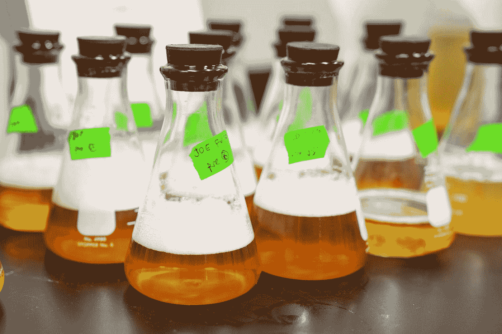

# 让您的数据科学项目脱颖而出的 6 种方法

> 原文：<https://towardsdatascience.com/6-ways-to-make-your-data-science-projects-stand-out-1eca46f5f76f?source=collection_archive---------63----------------------->

## 提高您的数据科学项目并获得关注的简单步骤

全球新冠肺炎疫情让许多人有大量的时间来处理他们的数据科学项目组合。每个人都在申请工作，你如何确保你的工作脱颖而出？请继续阅读，寻找答案。

# 1.使用更多独特的数据

兰迪·法特在 [Unsplash](https://unsplash.com?utm_source=medium&utm_medium=referral) 上的照片

Iris，Galton，Titanic，Northwind Traders，Superstore，Go 数据仓库。当您在学校学习数据科学时，您无疑会遇到至少一个这样的数据集。这是有原因的，它们有助于演示诸如聚类、回归、逻辑回归、数据库结构、数据可视化或构建报告等概念。每个数据集都很干净，很小，但这并不是它们所有的共同点:**每个人都使用过这些数据集**。没有新的或令人兴奋的项目建立在训练数据集上。没有招聘人员会看着你的泰坦尼克号项目(Kaggle 上最受欢迎的数据集之一)说，我们的团队需要这个人。

> 没有新的或令人兴奋的项目建立在训练数据集上

我们生活在数据时代，这意味着不缺少可以轻松下载的数据集。从比 Kaggle 或你在其上学习机器学习的数据更令人兴奋的地方获取你的数据。拓展业务的好地方是 Data.gov。2013 年，奥巴马总统签署了一项行政命令，将开放和机器可读数据作为政府信息的新默认。这意味着有大量可搜索的信息可以从 Data.gov 下载。联邦学生贷款计划数据、联邦对各州的援助数据和意外药物相关死亡数据只是可供您使用的 200，000 多个数据集的一小部分。请务必查看文件中提供的元数据，以便理解您正在处理的内容。

想让事情变得更私人一点吗？用自己的数据！你做的任何事情都可以变成数据。许多健身房在“呆在家里”命令期间关闭，也许你在家工作。你正在做的所有练习都可以被追踪。看看你做了多少次，你在锻炼哪些肌肉群，以及哪天你在锻炼。使用你自己的数据的最大好处是你是主题专家。您可能最终会处理一些较小的数据集，但是您将对它是如何被捕获的有更深刻的理解，并且可以控制向它添加新的变量或维度。

这些听起来都不够先进吗？看看网页抓取。[网络搜集](https://youtu.be/Ct8Gxo8StBU)是从互联网上收集非结构化数据的自动化过程。您将不得不用诸如 R 或 python 之类的语言编写代码来捕获数据。你必须自己研究你获得的价值，以及你抓取的网站是如何获得这些价值的。最终结果将更加独特，但也将产生更多的工作来了解数据和清理您收集的数据。

# 2.做一个数据清理项目

由[凯利·西克玛](https://unsplash.com/@kellysikkema?utm_source=medium&utm_medium=referral)在 [Unsplash](https://unsplash.com?utm_source=medium&utm_medium=referral) 上拍摄的照片

说到数据清理，真实世界的数据很恶心，使用它的时候一定要戴上口罩。玩笑归玩笑，当有人要求一个使用数据来预测客户流失的模型时，几乎从来没有一个干净的、现成的数据源来构建这个模型。大多数课程不会让您准备好处理组织可用的各种脏数据。这是一项关键技能，你需要在至少一个项目中展示出来。

> 说到数据清理，真实世界的数据很恶心

有许多任务可以与清理数据相关联。理解数据是一个很好的起点。政府和公共可用数据通常有一个数据字典，其中包含数据中每个维度、度量、观察和表的描述。这将帮助您了解收集了哪些数据、何时收集的以及由谁收集的。

理解你在看什么是数据验证的关键。一旦你知道什么是变量，你就可以使用数据字典、常识或主题专家来确定哪些值没有意义。例如，温度应该落在某个数值范围内。如果是温度数据，并且数据字典将测量单位指定为开尔文，则任何 0 或负值都是可疑的。如果这是来自百慕大的温度数据，气温升高是有道理的。在这里，任何太热或太冷的东西都是可疑的。对于像制造焊接温度这样的事情，你可能想找一位教授或工程系学生给你更多的指导。这一步的关键是找到看起来不对的值。

另一个需要研究的领域是如何处理缺失值。像数据验证一样，在处理缺失值时，上下文也很重要。如果您正在查看汽车的金融贷款数据，并且贷款信誉良好，并且收楼状态的值缺失，您不会担心该值缺失。如果你的项目涉及心理评估，而你错过了很多问题的答案，你可能会采取不同的行动，比如消除观察。有时缺失值在您的上下文中是有意义的。与数据验证一样，与您的主题专家和同行合作，了解如何处理丢失的值。

> 有时缺失值在您的上下文中是有意义的

# 3.使用版本控制

照片由[扬西·敏](https://unsplash.com/@yancymin?utm_source=medium&utm_medium=referral)在 [Unsplash](https://unsplash.com?utm_source=medium&utm_medium=referral) 上拍摄

在做数据科学项目时，你可能会花很多时间与其他人一起工作，这只是使用[版本控制](https://youtu.be/zbKdDsNNOhg)的众多原因之一。如果您不熟悉版本控制，它将所有代码保存在一个地方，并允许多人同时使用它。每个人都可以添加他们的贡献，并审查他人的代码。如果有人离开公司，将最新的代码转移到其他人的机器上不会与 IT 部门发生冲突。所有代码都存在于一个集中的、有组织的存储库中。

> 所有代码都存在于一个集中的、有组织的存储库中

另一个困扰学生的问题是命名文件的版本。再也不会有 20 个版本的“project_02_final.py”与“project _ 12 _ final _ done _ finished . py”不同了。有了版本控制，每个版本都有注释，您可以与任何其他版本的代码进行逐行比较，以查看删除了什么和添加了什么。您甚至不必担心旧版本被删除，您总是可以回滚到旧版本的代码。

版本控制软件最好的一点是，一旦你开始使用，它就很容易使用。它可以是一个独立的程序，可以集成到您喜欢的集成开发环境(IDE)中，也可以通过命令行界面使用。许多系统都有额外的功能，允许您基于您的存储库创建一个网站，测试您的代码的构建，并通过将代码嵌入到其他地方来共享您的代码。这不仅是一种让你的项目有条理的方法，也可以用来开始展示你的项目。

# 4.构建您的表示层

亚历克斯·利特温在 [Unsplash](https://unsplash.com?utm_source=medium&utm_medium=referral) 上的照片

数据科学家这个术语仍然相对较新，高管不完全理解数据概念的情况并不少见。无论他们是否对数据科学和机器学习有深刻的理解，他们都需要一种方法来快速获得您的项目必须提供的最重要的信息。这是你的表示层。

大多数有抱负的数据科学家没有足够重视沟通技巧。解释如何在云中使用并行计算来训练和测试一个模型，然后使用自定义 API 部署给其他人使用，不会引起任何人的注意。管理层不会总是对你如何做这件事感兴趣，而是对你为什么做这件事感兴趣。这并不是说技术方面不重要，而是要记住你的观众。业务方面将希望了解您的模型对底线的影响，而 it 方面将更关心 IT 的实际实现。

> 大多数有抱负的数据科学家对沟通技巧关注不够

您的表示层可以采用许多不同的形式。再次强调，记住你的听众。有些人只想要电子表格和表格，而有些人想要图表和颜色。一些人希望通过电子邮件发送，另一些人希望在同一页上看到不同地区的所有数据。利用您可以使用的工具，针对不同的受众创建不同的表示层。

# 5.尝试各种技术

照片由[在](https://unsplash.com/@elevatebeer?utm_source=medium&utm_medium=referral) [Unsplash](https://unsplash.com?utm_source=medium&utm_medium=referral) 上提升

大学一毕业，我经历的最困难的事情之一就是看到我想去的公司有职位空缺，却没有任何相关的技术技能。许多公司都在努力解决入职和内部培训的问题。对他们来说，雇佣一个已经知道他们需要什么的人要容易得多。熟悉更广泛的技术将有助于你的搜索。许多组织甚至将多种技术结合在一起，以拼凑他们的数据管道和数据科学环境。

有一个老笑话说，数据科学 80%是准备数据，20%是建立模型。这是有道理的。我曾经和一些数据科学家一起工作过，他们在一个项目上花费了大量的时间让代码在服务器上而不是在他们的桌面上正确运行。我曾在一些小公司面试过，在这些公司里，数据科学家需要与数据工程师密切合作，构建数据结构来收集数据并支持他们的模型。使用多种语言和软件包来构建数据科学项目的不同部分有巨大的好处。

> 数据科学 80%是准备数据，20%是构建模型

外面有大量的资源，学习一门新技术或编程语言并不一定很难或很贵。当然，有专业指导的培训，费用可能超过 1500 美元，但也有几乎任何东西的免费视频，学生们只需拥有一个. edu 电子邮件地址，就可以免费享受许多昂贵软件包的许可和培训。在他们的网站上搜索，看看有什么。一旦你学会了一种软件或语言，学习另一种类似的软件或语言通常不会太难。如果你能使用强力 BI，Tableau 并不难用。

# 6.将所有内容整合到一个管道中

罗曼·彭丁在 [Unsplash](https://unsplash.com?utm_source=medium&utm_medium=referral) 上拍摄的照片

说到多种工具，为什么不一起使用它们呢？作为一名学生，很多时候你会得到简单格式的数据，例如. csv。这不是不可能得到的。csv 文件，但数据通常不会以这种方式存储。数据将来自多个来源，具有多个转换和存储层，并且会涉及许多不同的技术。你的项目的一个小管道表明你理解这些部分如何一起工作。

> 每个人都知道如何阅读. csv 文件

管道可以非常简单，只需将文件加载到数据库中，选择数据并将其导入分析工具，然后将结果发送到表示层。它不一定要漂亮或完全自动化，它只需要展示你对数据管道如何工作的理解。每个人都知道如何阅读. csv 文件，但不是每个人都可以将数据、分析和演示过程集成到一个连贯的项目中，以反映组织是如何做的。

# 摘要

这绝不是一个全面的列表，但会给你一些如何让你的数据科学项目引起注意的想法！请记住，数据科学项目是您技能的直接反映。通过将这些技能应用到反映真实世界数据科学复杂性的项目中，展示您擅长的东西。确保使用有趣的数据，清理数据，使用版本控制来保持有序，有效地传达您的信息，使用各种技术，并将一切结合在一起，以实现真正全面的数据科学项目。

 [## 用我的推荐链接加入媒体！

### 作为一个媒体会员，你的会员费的一部分会给你阅读的作家，你可以完全接触到每一个故事…

realdrewdata.medium.com](https://realdrewdata.medium.com/membership)