# 68–95–99.7—在 Power BI 中使用的三适马经验法则。

> 原文：<https://towardsdatascience.com/68-95-99-7-the-three-sigma-rule-of-thumb-used-in-power-bi-59cd50b242e2?source=collection_archive---------15----------------------->

## 采用微软 POWER BI 的数据科学

## 在无代码的 Power BI 中使用三西格马经验法则检测异常值和异常


照片由 [timJ](https://unsplash.com/@the_roaming_platypus?utm_source=medium&utm_medium=referral) 在 [Unsplash](https://unsplash.com?utm_source=medium&utm_medium=referral) 上拍摄

即使在最小的数据项目中，最重要的步骤之一是检测数据结构中的异常值、离群值或异常。

在这个简短的指南中，我将向您展示不使用任何代码来检测这些值的最基本的方法。除了在 Power BI 中实现这一点的许多方法之外，这是最直接的和 UI 驱动的方法，并且仍然非常有用。

# 什么是异常值，如何识别？

定义异常值的常用方法是“标准偏差的 3 倍”规则，通常称为**三西格马经验法则。**

*想要更多背景？在* [*维基百科*](https://en.wikipedia.org/wiki/68%E2%80%9395%E2%80%9399.7_rule) *上找到。*

假设我们的数据集中有一个值为的列，我们想要检测它是否包含异常值。Todo 因此我们查看| *value — average* |，以测量该值与平均值的差距。

如果这个绝对值是我们的标准偏差的 3 倍以上，那么我们可以认为这个值是异常值。

# 数据

这种方法最适用于符合标准正态分布的数据。

但是，即使对于非正态分布的变量，**三西格马规则**告诉我们，至少 88.8%的情况应该落在正确计算的三西格马区间内。

为了遵循这个指南，你可以选择你自己的数据集或者下载我的数据集，这个数据集按照标准的正态分布填充了 5000 个随机值。具体地说，它填充了从均值为 0、方差为 1 的单变量“正态”(高斯)分布中采样的随机浮点数。

[](https://github.com/sebastianzolg/filtering-outliers-with-powerbi) [## sebastianzolg/使用 powerbi 过滤异常值

github.com](https://github.com/sebastianzolg/filtering-outliers-with-powerbi) 

*想知道如何用 python 创建这样的数据？请参见本指南末尾的奖金部分。*

# 移除异常值

让我们从存储库中的 **randoms.csv** 文件中提取数据，并将其加载到 Power BI 中。

打开 Power BI，点击**获取数据**。

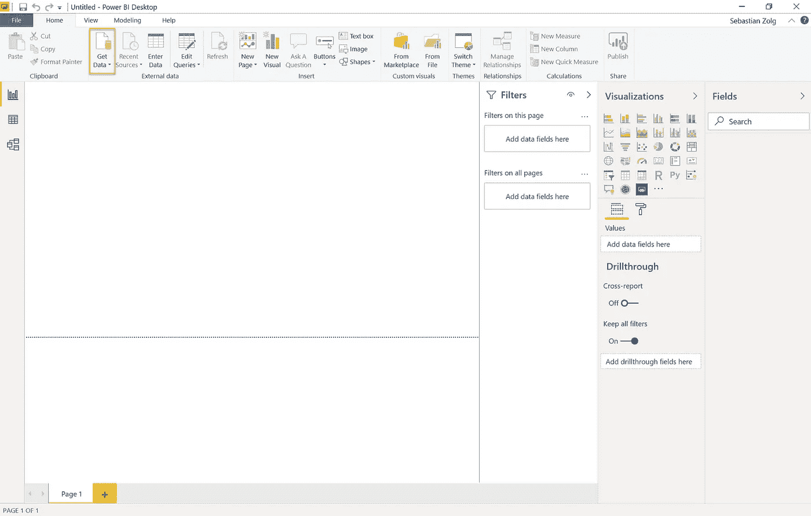

选择 **Text/CSV** ，点击**连接**，选择之前下载的 **randoms.csv** 文件。

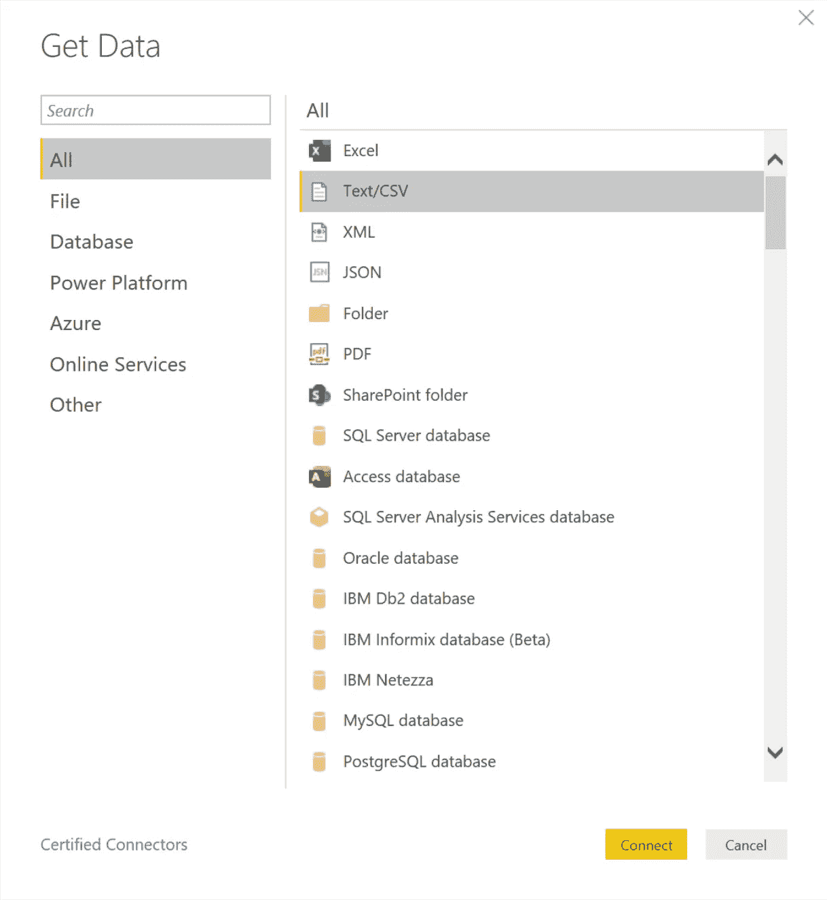

检查数据，确保数据加载正确。点击**转换数据**将其提取到 Power BI 中。

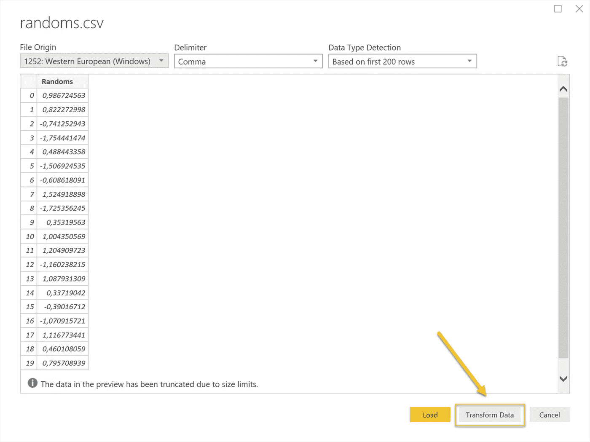

我们希望有一个自定义列，使我们能够轻松地过滤离群值。为了识别异常值，我们首先需要计算所有数据的平均值和标准差。

为此，我们将初始查询*复制两次*。选择初始查询，**右击**并从上下文菜单中选择**复制**。第二次重复这个步骤，这样总共有 3 个查询。

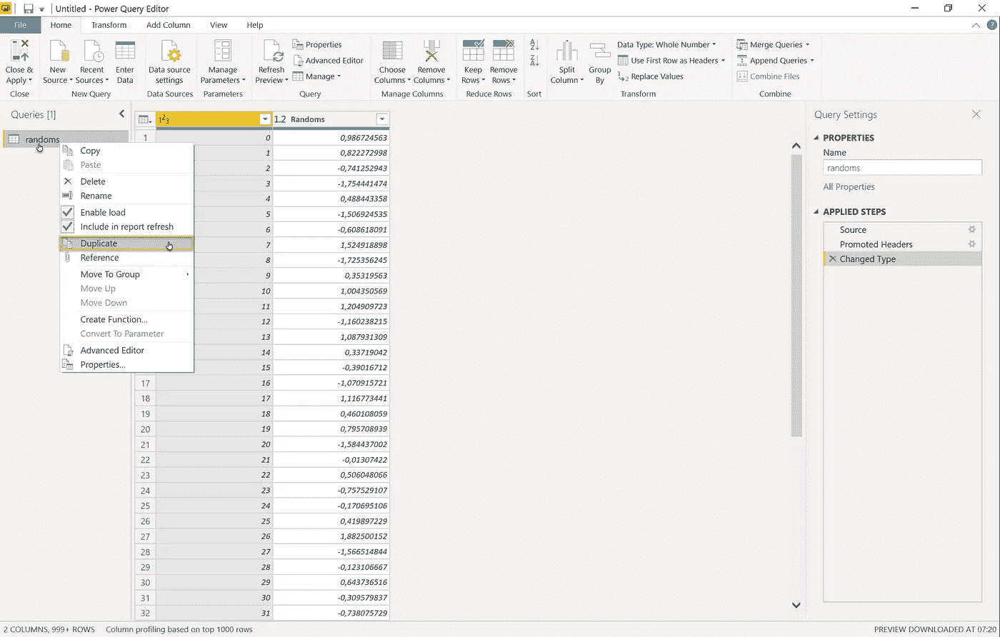

现在，我们很快*将我们重复的查询重命名为**表示**和**标准差**，这样就反映了我们的意图。**右键点击**两个查询，并点击上下文菜单中的**重命名**。*

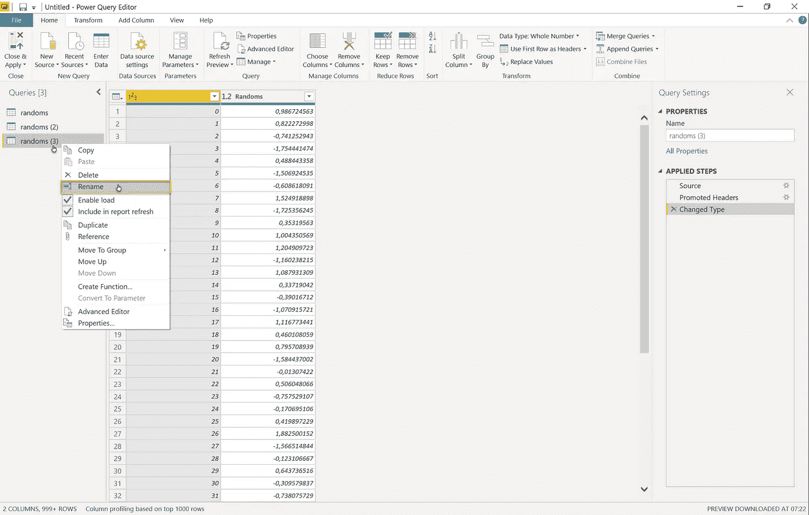

既然我们已经正确地命名了我们的查询，我们就可以继续在我们的 **Randoms** 列上对**均值**和**标准差**查询进行快速计算。

选择**均值**查询，点击**随机数**列的标题。现在选择控制功能区中的**转换**选项卡，并注意**统计**。打开**统计**的右键菜单，从列表中选择**平均值**。

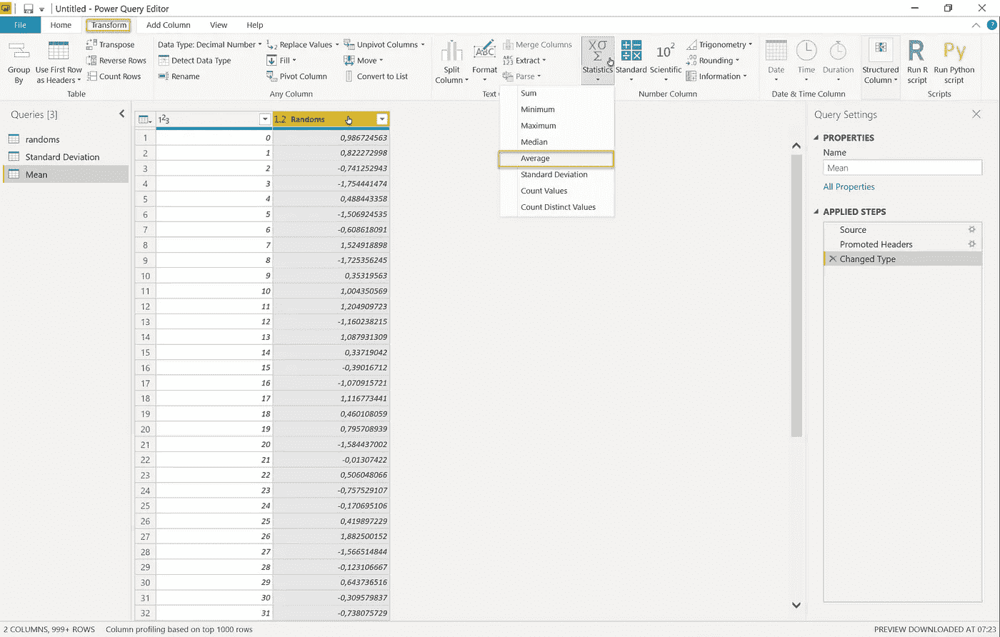

这立即将查询转换成一个十进制数，表示我们的 **Randoms** 列的 **Mean** 值。

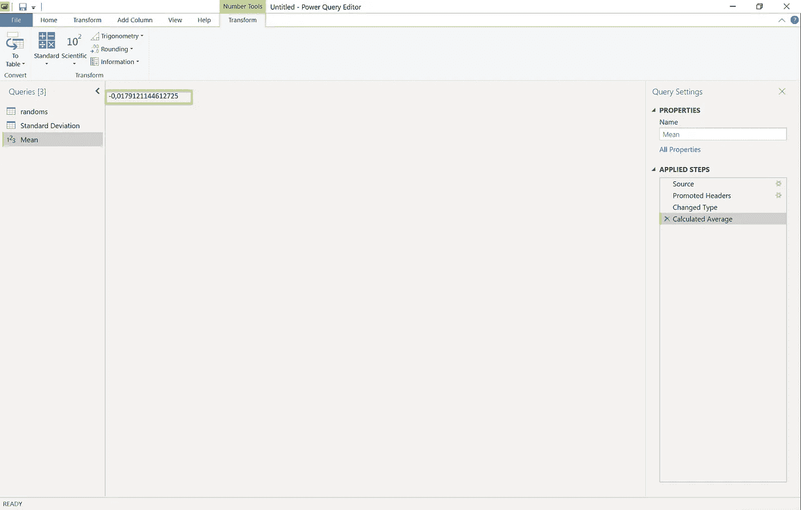

对**标准差**查询重复此步骤，但这次从**统计**的上下文菜单中选择**标准差**。

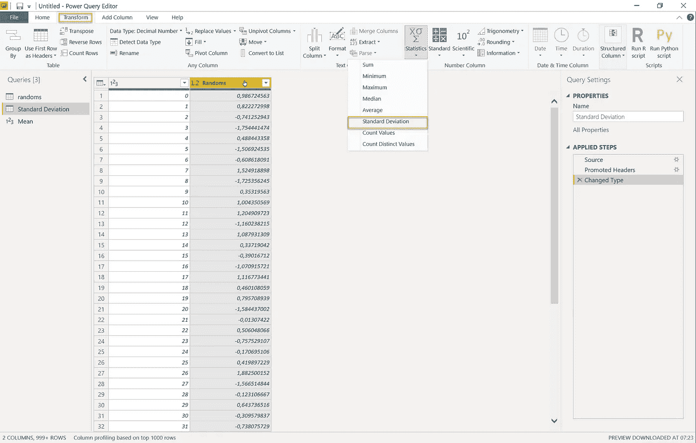

同样，这将把查询转换成表示我们的 **Randoms** 列的**标准偏差**的单个十进制值。

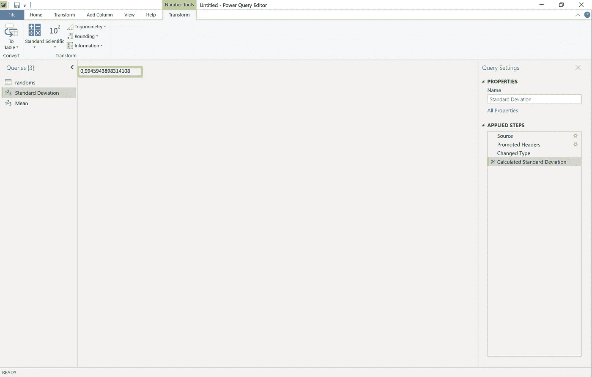

现在我们不用一行代码就可以快速计算出**均值**和**标准差**，我们现在可以计算出异常值。

我们希望用一个专用的列来过滤异常值。跳转到**添加列**功能区选项卡，点击**自定义列**。

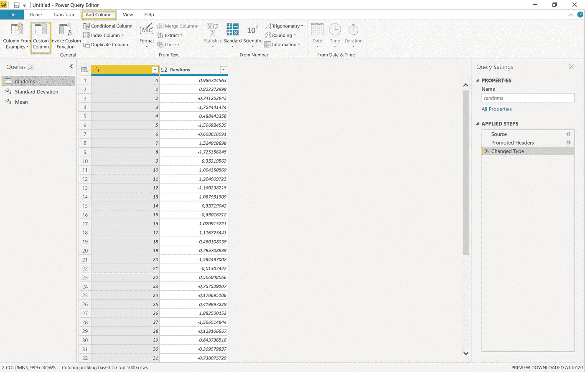

这将立即打开幂查询公式编辑器，我们可以在其中计算这个新列的值。将该列命名为类似于**is outer**的名称。

现在，我们必须将我们对**三西格马规则**的了解转化为一个幂 BI 公式。这是最终的公式，易于阅读和理解。

```
Number.Abs([Randoms] — Mean) > (3 * #”Standard Deviation”)
```

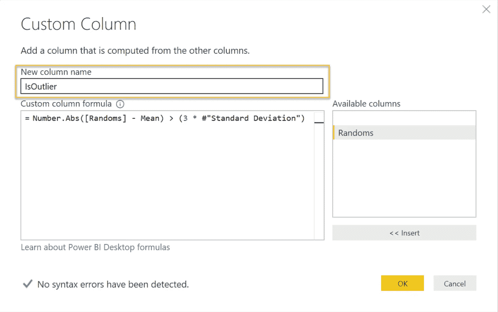

我们来分解一下。首先，我们取列`[Random]`中的每个值*，并减去总的`Mean`，这是我们查询**平均值**的结果。用函数`Number.Abs()`包围这个计算，该函数返回计算的绝对数。*

现在我们验证结果是否大于标准偏差的三倍。我们通过`> (3 * #"Standard Deviation")`来实现，这里`Standard Deviation`是我们的**标准差**查询的结果。

就是这样！点击 **OK** ，您就可以过滤异常值并检测异常情况了。

回到编辑器，您可以看到新创建的列及其值是根据我们的公式计算出来的。让我们通过单击列标题旁边的**向下箭头**图标，将我们的**外部**列过滤到`TRUE`。

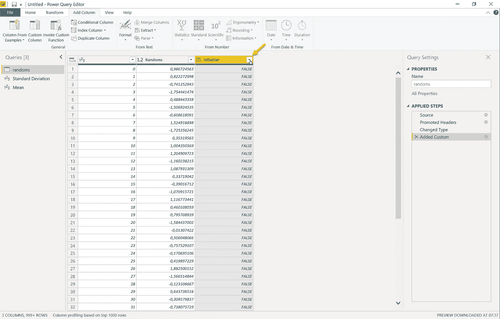

通过使用我的数据集，我们发现了 19 个异常值。正如你从数字中看到的，这些异常值确实代表了我们随机范围的外部边缘。

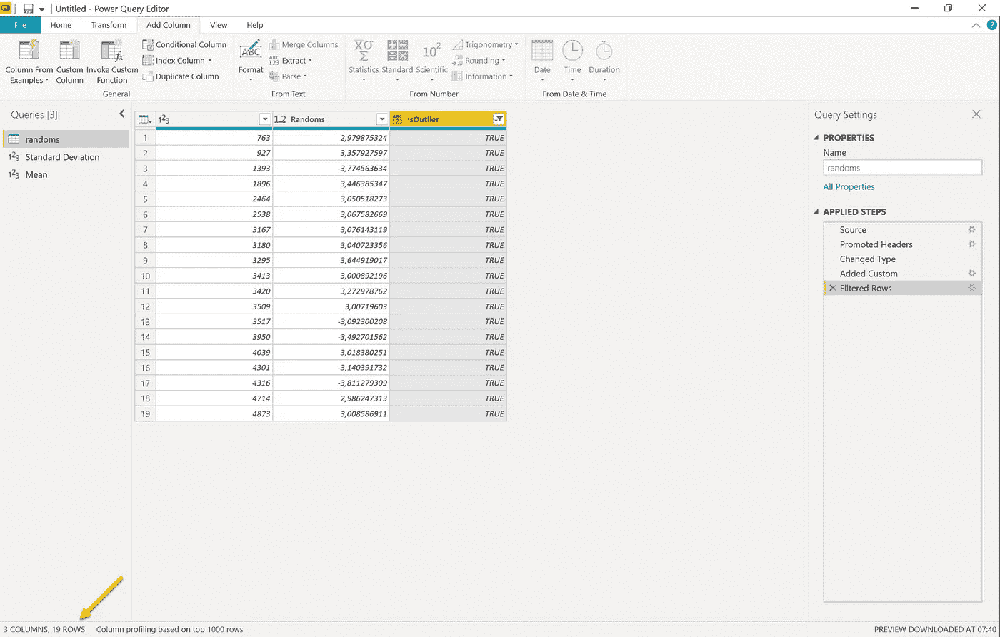

**恭喜！**您成功检测到数据集中的异常值。随意反转过滤器，使用非异常值的数据。这会给你统计上更好的结果。

就这样吧。

—塞巴斯蒂安

# 额外收获:用 python 创建随机数

使用下面的代码片段，你可以快速生成你自己的随机数，并随意使用。通过点击[链接](https://docs.scipy.org/doc/numpy-1.13.0/reference/generated/numpy.random.randn.html)了解更多关于生成它的函数的信息。