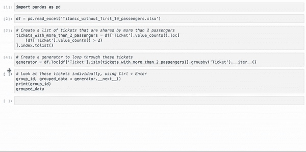
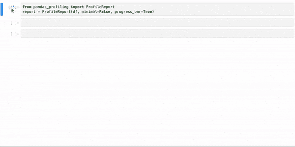
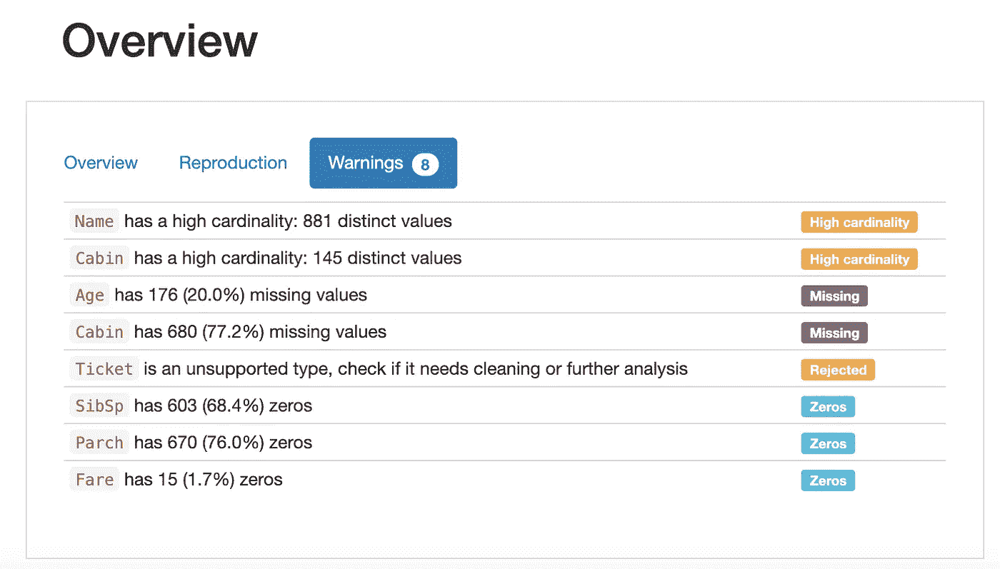
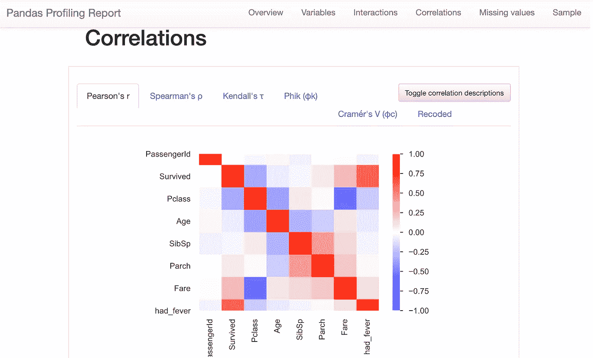
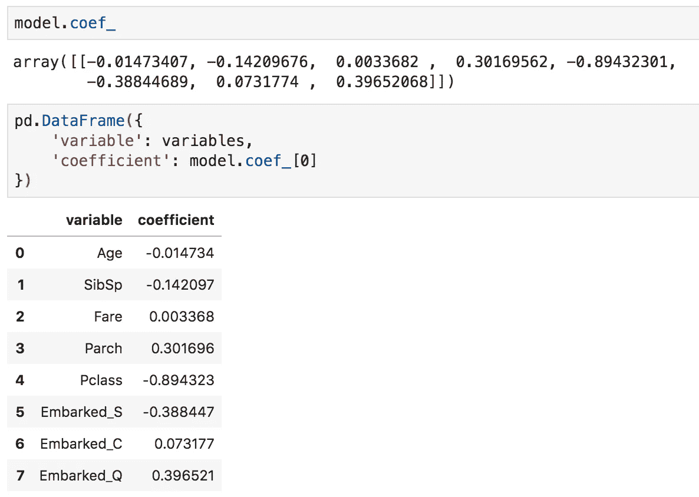
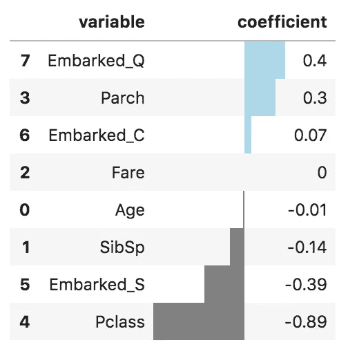
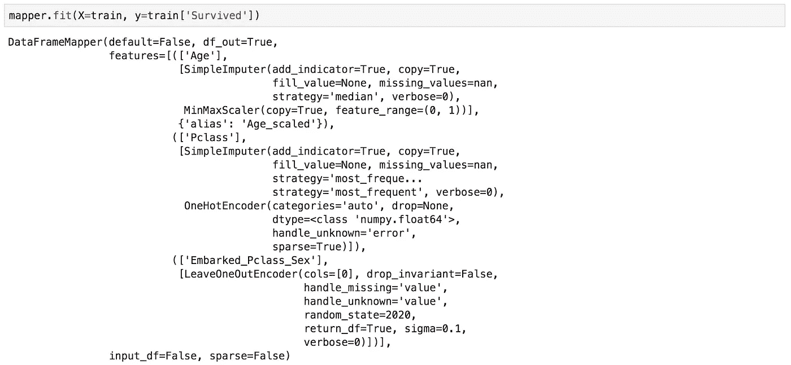
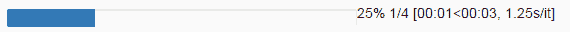

# 数据科学的 7 个高级熊猫技巧

> 原文：<https://towardsdatascience.com/7-advanced-tricks-in-pandas-for-data-science-41a71632b5d9?source=collection_archive---------8----------------------->

## Pandas 是数据科学的首选图书馆。这些是我用来更快更简单地完成重复性数据科学任务的捷径。

# 1.使用 df.groupby()分析数据帧的样本。__iter__()

与使用 Excel 相比，在 Jupyter 笔记本中逐行或逐组浏览数据集通常很难。一个有用的技巧是使用生成器并使用 *Ctrl + Enter* 而不是 *Shift + Enter* ，以便迭代地查看同一单元格内的不同样本，而不会在您的笔记本中造成混乱。

首先用生成器创建一个单元。groupby()(或。iterrows())并添加。__iter__():

然后，使用键盘快捷键 *Ctrl + Enter* 任意多次运行下面的单元格**来观察对您最重要的数据:**

这里有一个分析泰坦尼克号数据集中拥有完全相同机票号码的乘客的例子。您无法单独隔离每组乘客，因此使用这种方法可以让您以一种非常简单的方式逐个分析各组乘客:

使用 df.groupby()在 Titanic 数据集中搜索具有相同“机票”号码的乘客。__iter__()和键盘快捷键 Ctrl + Enter。

# 2.用于数据探索和数据质量评估的熊猫概况分析

在数据科学中，我们倾向于从头开始编写数据探索代码。既然所有的数据集都不一样，那就说得通了。然而，有一个神奇的 **pandas_profiling** 包让这个推理变得毫无意义。该软件包实际上自动化了数据探索和数据质量评估步骤！看一看:

点击“警告”以评估您的数据质量。

熊猫图谱相关分析。人们可以选择 5-6 个相关度。

它就像一个魔咒！

显然，它不能解决所有的数据探索，例如，如果您的数据中有自由文本变量。但这应该是你开始分析任何数据集的方式。

# 3.多重链接

一旦您理解了可以使用链接方法组合多个操作，Pandas 就会变得非常有趣。链接基本上是在同一行代码中添加操作。

有了下面这行代码，我就

*   在我的数据集中添加新列(。合并)
*   算上女乘客的比例(。申请(女性 _ 比例))
*   对于超过 1 名乘客的团体(df。Ticket.value_counts()>1)
*   有相同的票号(。groupby('Ticket '))。

我不需要创建新的数据框架，新的变量，任何新的东西。链式方法允许你把你的想法“翻译”成实际的操作。

下面的例子也是链式方法的一个很好的例子:

# 4.用样式绘制系数/特征重要性

如果你在做机器学习，你知道用通俗易懂的语言解释清楚你的机器学习模型有多困难。这里有一种方法可以帮助你很好地了解模型中的系数或变量的重要性。

你可以将系数(或变量重要性)放入数据框架中，以便可视化它们。

我从多个来源收集了代码，得到了以下我一直在重复使用的可视化效果(避免重复发明轮子):

它给出了以下输出:

变量根据系数(或变量重要性)进行排序，彩色条让我们可以快速找到最重要的变量。这里，“Pclass”列具有最大的(负)系数，其绝对值是第二大系数的两倍:“apollowed _ Q”。

很漂亮吧？

# 5.sklearn _ 熊猫

如果你是一个熊猫倡导者，你会不止一次地意识到与熊猫 DataFrame 和 sklearn 合作并不总是最合适的。但是不要就此打住。一些积极的贡献者创造了 sklearn_pandas，这是两个软件包之间的桥梁。它用熊猫友好的**数据帧映射器**取代了 sklearn 的**列变换器**。这几天开始只用 sklearn_pandas，没有失望。我希望我以前知道这件事。

下面是使用。fit()方法:

# 6.tqdm

当处理大型数据集时，数据操作需要时间。使用 **tqdm** 来跟踪你的代码是否正在运行以及运行了多长时间，而不是在你的 Jupyter 笔记本前面无表情地等待，不知道发生了什么。对于运行速度太慢的脚本，这也是提前中止的好方法。

现在所有的熊猫数据框架都有了新的方法:

*   。进度 _ 应用，。进度 _ 应用地图
*   。用于列的 progress_map

**

*它们与应用、应用地图和地图相同，不同之处在于它们会绘制进度条。多有用啊！*

**

*tqdm pandas 方法生成的进度条示例。*

# *7.的。要粘贴到 Excel 中的 to_clipboard()*

*作为一名狂热的 Excel 用户，我开发了一些技巧来绘制性感的图表和漂亮的格式来展示数据的洞察力。尽管 pandas 有许多选项，但很难用最少的代码获得类似的输出水平。*

*有一件事我最终做了很多来应对，那就是将我的结果导出到 Excel。但不使用。to_excel 方法。相反，我使用平滑。to_clipboard(index=False)将数据复制到剪贴板。然后，我使用 Excel 中的 *Ctrl + V* 将数据粘贴到我当前的电子表格中。给你，你可以释放你体内的 Excel 野兽。*

*许多数据科学家容易忘记的一件事是，非数据科学家通常擅长 Excel。与他们共享 Excel 文件比共享笔记本或导出为 html 文件的笔记本更容易。*

*如果这对你有用，请在评论中告诉我！感谢阅读，如果你喜欢就鼓掌吧:)*