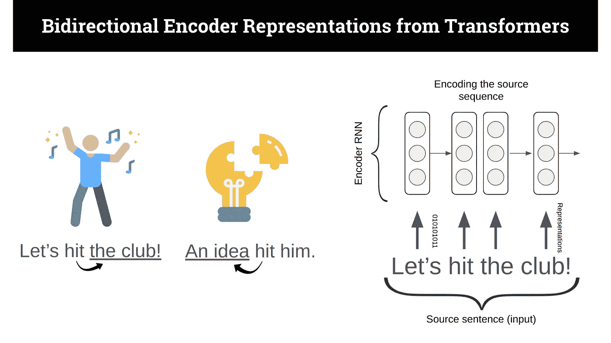
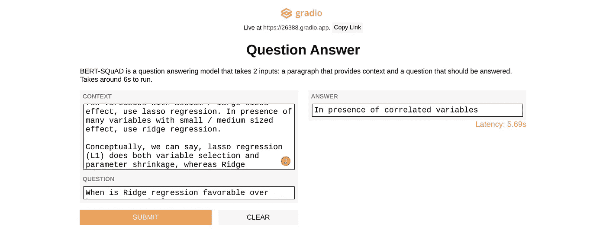

# 7 个 AI 面试问题…由 AI 回答

> 原文：<https://towardsdatascience.com/7-ai-interview-questions-answered-by-ai-881e4542e3c3?source=collection_archive---------42----------------------->

## 使用问答模型 BERT-SQuAD 回答 AI 问题。

塞巴斯蒂安·赫尔曼在 [Unsplash](https://unsplash.com?utm_source=medium&utm_medium=referral) 上的照片

如果你正在寻找一份[数据科学的工作](https://www.apteo.co/post/100-companies-hiring-data-scientists-right-now)，你可能已经注意到这个领域竞争异常激烈。AI 现在甚至可以用任何语言生成代码。下面，我们将探讨 AI 如何从段落中提取信息来回答问题。

有一天，你可能会与人工智能竞争——如果 [AutoML](/will-automl-be-the-end-of-data-scientists-9af3e63990e0?source=user_profile---------3-----------------------) 还不是竞争对手的话。

# 伯特小队是什么？

BERT-SQuAD 是谷歌 BERT 和斯坦福问答数据集的交叉。

BERT 是一种先进的自然语言处理算法，可用于问题回答(我们将在这里深入探讨)、情感分析、垃圾邮件过滤、文档聚类等任务——都是语言！

理解伯特。跳舞图标由 [Freepik](https://www.flaticon.com/authors/freepik) 制作，灯泡图标由 [Becris](https://www.flaticon.com/authors/becris) 在 [Flaticon](http://www.flaticon.com) 上制作。作者图解。

“双向性”指的是许多单词根据上下文变化的事实——比如“让我们*击中*俱乐部”与“一个想法*击中*他”——所以它会考虑关键字两边的单词。

“编码”仅仅意味着给字符分配数字，或者把像“让我们去俱乐部”这样的输入转换成机器可操作的格式。

“表示”是通过在文本语料库中查看单词的许多编码而获得的对单词的总体理解。

“变形金刚”是你用来从嵌入到表现的东西——这是最复杂的部分。

如前所述，BERT 可以被训练完成基本上任何类型的语言任务，因此 SQuAD 参考了我们用来训练它完成特定语言任务的数据集:问答。

SQuAD 是一个阅读理解数据集，包含众包工作者在维基百科文章上提出的问题，每个问题的答案都是相应段落中的一段文字。

然后，BERT-SQuAD 允许我们通过从大量文本中找出答案来回答一般性问题。它不是从零开始编造答案，而是理解文本的上下文，足以找到答案的特定区域。

例如，这里有一个关于套索和岭回归的上下文段落:

> “你可以引用 ISLR 的作者 Hastie，Tibshirani 的话，他断言，在存在几个具有中/大规模效应的变量的情况下，使用套索回归。在存在许多具有中小影响的变量的情况下，使用岭回归。
> 
> 从概念上讲，我们可以说，套索回归(L1)既做变量选择又做参数收缩，而岭回归只做参数收缩，最后包括模型中的所有系数。在存在相关变量的情况下，岭回归可能是首选。此外，岭回归在最小二乘估计具有较高方差的情况下效果最好。因此，这取决于我们的模型目标。"

现在，我们可以问伯特班:

> "什么时候岭回归优于套索回归？"

它会回答:

> “存在相关变量时”

虽然我在这里显示了大约 100 个单词的上下文，但是您可以向 BERT-SQuAD 中输入更多的上下文，比如整个文档，并快速检索答案——如果您愿意，可以使用智能 Ctrl-F。

为了测试下面的 7 个问题，我使用了 [Gradio](http://gradio.app) ，这是一个让开发者用模型制作界面的库。在这种情况下，我使用了由 Google Colab 创建的 BERT-SQuAD 界面。

作者正在使用的 BERT-SQuAD [Gradio](http://gradio.app) 界面截图。

我使用这个 [Kaggle 线程](https://www.kaggle.com/general/97881)的上下文作为输入，为了简单起见修改了问题。

# Q1:如果你不旋转 PCA 组件会发生什么？

> *PCA 的效果会减弱*

# Q2。你如何降低数据的维度来减少计算时间？

> *我们可以分离数字变量和分类变量，并移除相关变量*

# Q3:为什么朴素贝叶斯“幼稚”？

> *它假设数据集中的所有特征同等重要且独立*

# Q4:您应该使用哪种算法来解决低偏差和高方差问题？

> *装袋*

# 问题 kNN 和 kmeans 聚类有什么不同？

> *kmeans 本质上是无监督的，而 kNN 本质上是有监督的*

# 问题 6:岭回归何时优于套索回归？

> *存在相关变量时*

# Q7:什么是凸包？

> *代表两组数据点的外边界*

# 附加阅读

要部署和服务像 BERT-SQuAD 这样的模型，请查看我关于 10 个简单选项的文章:

 [## 部署和服务人工智能模型进行预测的 10 种方法

### 探索 Flask、云巨头、小众玩家、AutoML 和其他部署 AI 的方式。

towardsdatascience.com](/10-ways-to-deploy-and-serve-ai-models-to-make-predictions-336527ef00b2) 

如果你想深入了解《变形金刚》,可以看看[这本图文并茂的指南](https://jalammar.github.io/illustrated-transformer/),因为伯特就是在那个架构之上构建的。