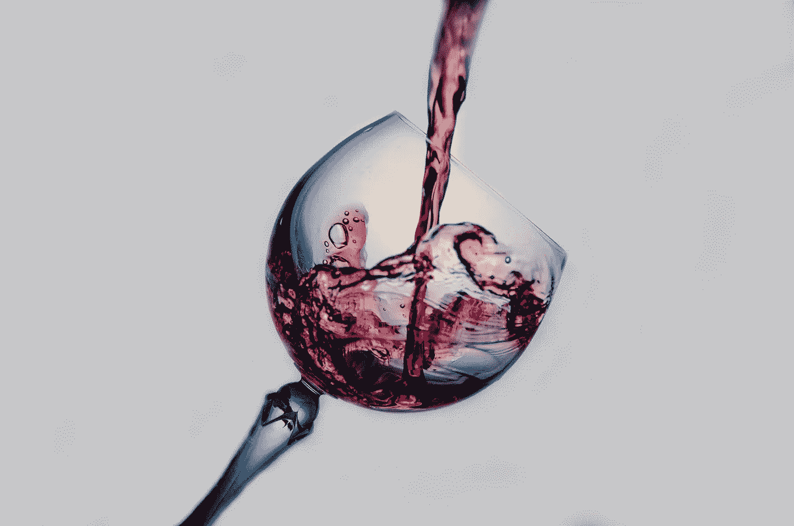

# 面向有抱负的数据科学家的 7 个数据科学项目创意

> 原文：<https://towardsdatascience.com/7-data-science-project-ideas-for-aspiring-data-scientists-7defd62e07a7?source=collection_archive---------18----------------------->

## 2020 年 5 月数据科学项目的初学者友好列表

在 [Unsplash](https://unsplash.com/s/photos/programming?utm_source=unsplash&utm_medium=referral&utm_content=creditCopyText) 上由 [Max Duzij](https://unsplash.com/@max_duz?utm_source=unsplash&utm_medium=referral&utm_content=creditCopyText) 拍照

由于普遍的需求和许多请求，我决定为那些开始数据科学家之旅的人创建一个独特的数据科学项目列表。可视化项目、探索性数据分析项目和预测性建模混合在一起。我希望你喜欢这篇文章，并祝你好运！

# 印度的降雨量

项目类型:可视化
链接到数据集[此处](https://www.kaggle.com/rajanand/rainfall-in-india)。

照片由[朱利安·于](https://unsplash.com/@littlej1428?utm_source=unsplash&utm_medium=referral&utm_content=creditCopyText)在 [Unsplash](https://unsplash.com/s/photos/india?utm_source=unsplash&utm_medium=referral&utm_content=creditCopyText) 上拍摄

该数据集包含印度 36 个分区的月降雨量详情。以下是一些你可以自己尝试的可视化想法:

*   您可以创建条形图或饼图来比较各地区的降雨量
*   您可以创建一个折线图来比较一段时间内各地区的降雨量
*   您可以创建一个动画 choropleth 地图来显示随着时间的推移在哪里下雨！*如果你想学习如何构建一个 choropleth 可视化，请查看我的教程* [*这里*](/visualizing-the-coronavirus-pandemic-with-choropleth-maps-7f30fccaecf5) *。*

# 全球自杀率

项目类型:探索性数据分析
链接到数据集[此处](https://www.kaggle.com/russellyates88/suicide-rates-overview-1985-to-2016)。

[萨莎·弗里明德](https://unsplash.com/@sashafreemind?utm_source=unsplash&utm_medium=referral&utm_content=creditCopyText)在 [Unsplash](https://unsplash.com/s/photos/depression?utm_source=unsplash&utm_medium=referral&utm_content=creditCopyText) 上拍摄的照片

这是一个整合的数据集，包含各国每年的自杀率、人类发展指数(HDI)数据、国内生产总值和人口统计数据。这个数据集的目的是看是否有任何与自杀率增加相关的指标。

探索数据，看看哪些国家和大陆的自杀率最高。你注意到了什么趋势？自杀率总体上是上升还是下降了？男女自杀人数的比例是多少？看看你能否找到任何与自杀率相关的变量。

# 夏季奥运会奖牌

项目类型:探索性数据分析
链接到数据集[此处](https://www.kaggle.com/divyansh22/summer-olympics-medals)。

布莱恩·特纳在 [Unsplash](https://unsplash.com/s/photos/olympics?utm_source=unsplash&utm_medium=referral&utm_content=creditCopyText) 上的照片

不那么可怕的是，这里有一个数据集，包含了从 1976 年蒙特利尔到 2008 年北京夏季奥运会的所有奖牌获得者。探索数据，看看哪些国家赢得了最多的奖牌。随着时间的推移，有没有表现更好的国家？随着时间的推移会变得更糟吗？

# 世界幸福报告

项目类型:探索性数据分析
链接到数据集[此处](https://www.kaggle.com/unsdsn/world-happiness)。

由 [KAL VISUALS](https://unsplash.com/@kalvisuals?utm_source=unsplash&utm_medium=referral&utm_content=creditCopyText) 在 [Unsplash](https://unsplash.com/s/photos/happiness?utm_source=unsplash&utm_medium=referral&utm_content=creditCopyText) 上拍摄的照片

幸福指数是一个国家平均“幸福度”的量化指标。这是基于六个因素:经济生产、社会支持、预期寿命、自由、没有腐败和慷慨。

这个数据集包含了 2015 年至 2019 年的 155 个国家及其相关的幸福得分和 6 个因素。我们每年在全球范围内变得更快乐还是更不快乐？哪个洲最幸福？最不开心？六个因素中哪一个对幸福感的影响最大？影响最小呢？

# 美国的污染

项目类型:可视化
链接到数据集[此处](https://www.kaggle.com/sogun3/uspollution)。

图片由 [Ella Ivanescu](https://unsplash.com/@punkidu?utm_source=unsplash&utm_medium=referral&utm_content=creditCopyText) 在 [Unsplash](https://unsplash.com/s/photos/pollution?utm_source=unsplash&utm_medium=referral&utm_content=creditCopyText) 上拍摄

该数据集包含美国从 2000 年到 2016 年每天的四种主要污染物(二氧化氮、二氧化硫、一氧化碳和臭氧)的信息。

以下是一些可视化的想法:

*   哪些州是最大的污染者？最少？
*   随着时间的推移，美国污染了多少？他们污染的是 10 多年前还是更少？
*   看看你是否可以创建一个 choropleth 地图来显示地理上的污染水平随着时间的推移！

# 麦当劳菜单的营养事实

项目类型:探索性数据分析
链接到数据集[此处](https://www.kaggle.com/mcdonalds/nutrition-facts)。

照片由 [XUNO 拍摄。](https://unsplash.com/@xu_noz?utm_source=unsplash&utm_medium=referral&utm_content=creditCopyText) on [Unsplash](https://unsplash.com/s/photos/mcdonalds?utm_source=unsplash&utm_medium=referral&utm_content=creditCopyText)

该数据集提供了美国麦当劳菜单上每个菜单项的营养分析，包括早餐、牛肉汉堡、鸡肉和鱼肉三明治、薯条、沙拉、苏打水、咖啡和茶、奶昔和甜点。

一般的麦当劳超值餐含有多少卡路里？点烤鸡而不是脆皮真的更健康吗？为了满足日常营养需求，你必须吃的最健康的食物组合是什么？

# 红酒质量

项目类型:预测建模
链接到数据集[此处](https://www.kaggle.com/uciml/red-wine-quality-cortez-et-al-2009)。

特里·维利迪斯在 [Unsplash](https://unsplash.com/s/photos/red-wine?utm_source=unsplash&utm_medium=referral&utm_content=creditCopyText) 上拍摄的照片

该数据集包含各种葡萄酒、其成分和葡萄酒质量的数据。这可能是一个回归或分类问题，取决于你如何设计它。看看你能否预测给定 11 个输入(固定酸度、挥发性酸度、柠檬酸、残糖、氯化物、游离二氧化硫、总二氧化硫、密度、pH、硫酸盐和酒精)的红酒质量。

> 更多项目灵感，请查看[明明艾的博客](https://www.obviously.ai/blog-categories/creativity)！

# 感谢阅读！

如果你喜欢我的工作并想支持我，我会非常感谢你在我的社交媒体频道上关注我:

1.  支持我的最好方式就是在**媒体**T2 上关注我。
2.  在**推特** [这里](https://twitter.com/terence_shin)关注我。
3.  点击这里订阅我的新 **YouTube 频道** [。](https://www.youtube.com/channel/UCmy1ox7bo7zsLlDo8pOEEhA?view_as=subscriber)
4.  在 **LinkedIn** 这里[关注我](https://www.linkedin.com/in/terenceshin/)。
5.  在我的**邮箱列表** [这里](https://forms.gle/UGdTom9G6aFGHzPD9)报名。
6.  查看我的网站[terenceshin.comT21](https://terenceshin.com/)。