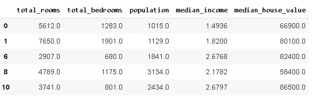
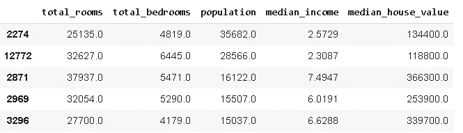
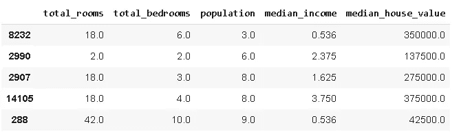
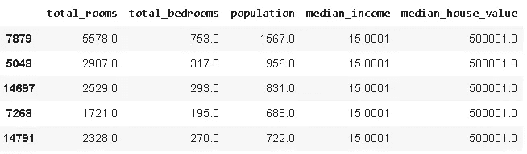
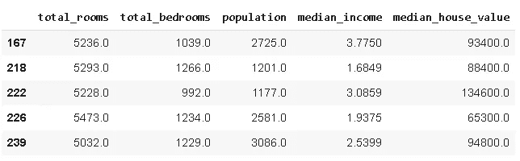
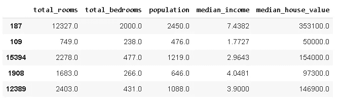
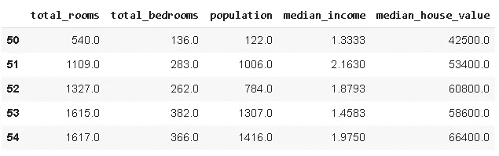
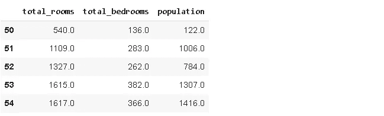
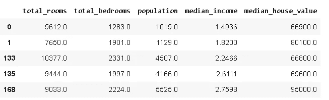
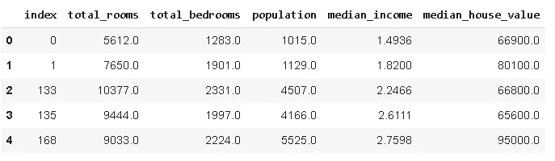

# 7 种不同的方法来过滤熊猫数据帧

> 原文：<https://towardsdatascience.com/7-different-ways-to-filter-pandas-dataframes-9e139888382a?source=collection_archive---------22----------------------->

## 灵活性很重要。

Pandas 是一个非常强大和通用的 Python 数据分析库，它加速了数据分析和探索过程。熊猫的优势之一是它通常提供多种方式来完成一项任务。


在 [Unsplash](https://unsplash.com/s/photos/seven?utm_source=unsplash&utm_medium=referral&utm_content=creditCopyText) 上由 [Waldemar Brandt](https://unsplash.com/@waldemarbrandt67w?utm_source=unsplash&utm_medium=referral&utm_content=creditCopyText) 拍照

在数据分析过程中，我们几乎总是需要根据条件或通过选择数据帧的子集进行一些过滤。在这篇文章中，我们将通过 7 种不同的方法来过滤熊猫数据帧。

我将在加州住房数据集上做例子，这个数据集在 google colab 的 sample data 文件夹下。

```
import numpy as np
import pandas as pddf = pd.read_csv("/content/sample_data/california_housing_train.csv",
usecols =['total_rooms','total_bedrooms','population', 'median_income','median_house_value'])df.head()
```


最常用的方法是像选择列一样在方括号内指定条件。

```
#1df[df['population'] > 10][:5]
```



我们只得到人口数大于 1000 的行。

特定列中具有最大值的行可以用 **nlargest** 函数过滤。

```
#2df.nlargest(5, 'population')
```



将显示人口列中具有 5 个最大值的行。

类似地，我们可以选择具有最小值的行。

```
#3df.nsmallest(5, 'population')
```



根据列选择最大值或最小值的另一种方法是对行进行排序，然后进行切片。

```
#4df.sort_values(by='median_income', ascending=False)[:5]
```



dataframe 根据 median_income 列按降序排序，然后选择前 5 行。

熊猫**查询**功能是一种非常灵活的过滤方式。它允许将条件指定为字符串。

```
#5df.query('5000 < total_rooms < 5500')[:5]
```



在某些情况下，我们可能希望从数据帧中随机选择一个样本。它更像是一个选择而不是过滤，但绝对值得一提。 **sample** 函数返回指定大小的随机样本。

```
#6df.sample(n=5)
```



该示例包含 5 行。也可以指定一个分数。例如，以下代码将返回大小等于原始数据帧 1%的样本。

```
df.sample(frac=0.01)
```

我们还可以选择指定的指数范围。就像 sample 函数一样，这个方法更像是一个选择，而不是基于条件的筛选。但是，对于顺序数据(如时间序列)，可以认为是一种过滤方式。

我们将使用的方法是 **iloc** ，它返回指定索引范围内的行或列。

```
#7df.iloc[50:55, :]
```



返回索引在(50:55)范围内的行。我们可以选择只选择一些列。

```
df.iloc[50:55, :3]
```



您可能已经注意到返回行的索引没有改变。它们仍然具有与原始数据帧中相同的索引。如果您想在过滤后创建一个新的数据帧，您可能想要重置索引，这可以通过 **reset_index** 函数来实现。

```
#without reset_indexdf_new = df.query('total_rooms > 5500')
df_new.head()
```



```
#with reset_indexdf_new = df.query('total_rooms > 5500').reset_index()
df_new.head()
```



我们已经介绍了过滤数据帧或选择其一部分的不同方法。尽管许多方法都可以完成相同的操作，但是由于语法或其他原因，您可能更喜欢其中一种方法。

拥有完成一项任务的灵活性和多种方式总是好的。而且，熊猫提供了大量的食物。

感谢您的阅读。如果您有任何反馈，请告诉我。