# 7 个必不可少的人工智能 YouTube 频道

> 原文：<https://towardsdatascience.com/7-essential-ai-youtube-channels-d545ab401c4?source=collection_archive---------11----------------------->

## 如何跟上最新最酷的机器学习进展

Kon Karampelas 在 [Unsplash](https://unsplash.com?utm_source=medium&utm_medium=referral) 上拍摄的照片

几年来，机器学习一直是最热门的话题之一。每个人都在谈论它；各种规模的组织都在采用这些技术。

《哈佛商业评论》将数据科学家的角色描述为“[21 世纪最性感的工作](https://hbr.org/2012/10/data-scientist-the-sexiest-job-of-the-21st-century)”。它们对商业决策至关重要，而且需求量很大。

机器学习研究的支出正在增长，从 2017 年的 15.8 亿美元增长到 2024 年的 208.3 亿美元。在学术领域，研究人员每天在 Arxiv 上发布大约 100 篇新的机器学习论文。

每 15 分钟一篇论文！

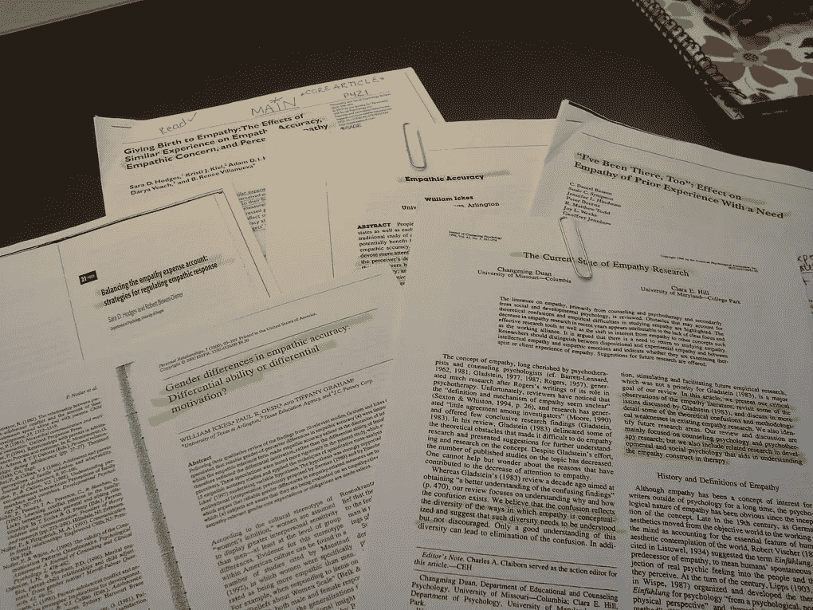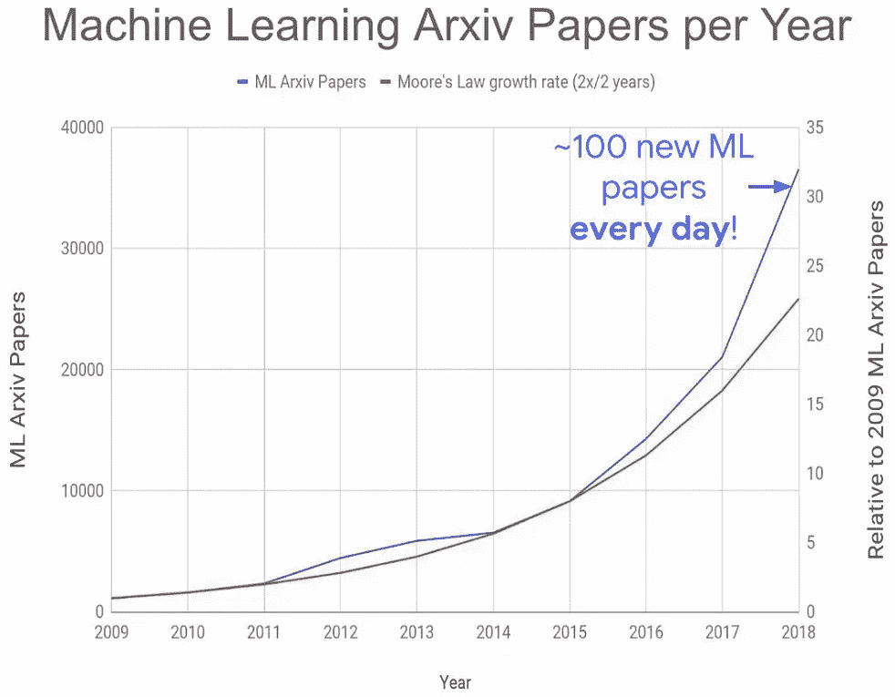

左:一堆研究，文章，高亮文章[ [来源](https://www.pinterest.co.uk/pin/390828073888995357/) ] |右:Arxiv 上每天 100 篇新的机器学习论文[来源]

这张图表显示了机器学习的兴奋程度和进展。谁能跟上这一领域的发展呢？🤔

在这篇文章中，我将介绍分享我们兴奋的七个 YouTube 频道。这些频道旨在揭示机器学习领域最新、最酷的发展。

我们开始吧。

# #1.两份会议记录文件

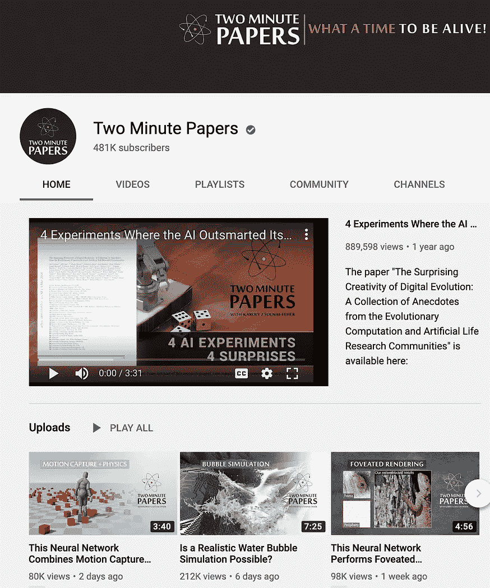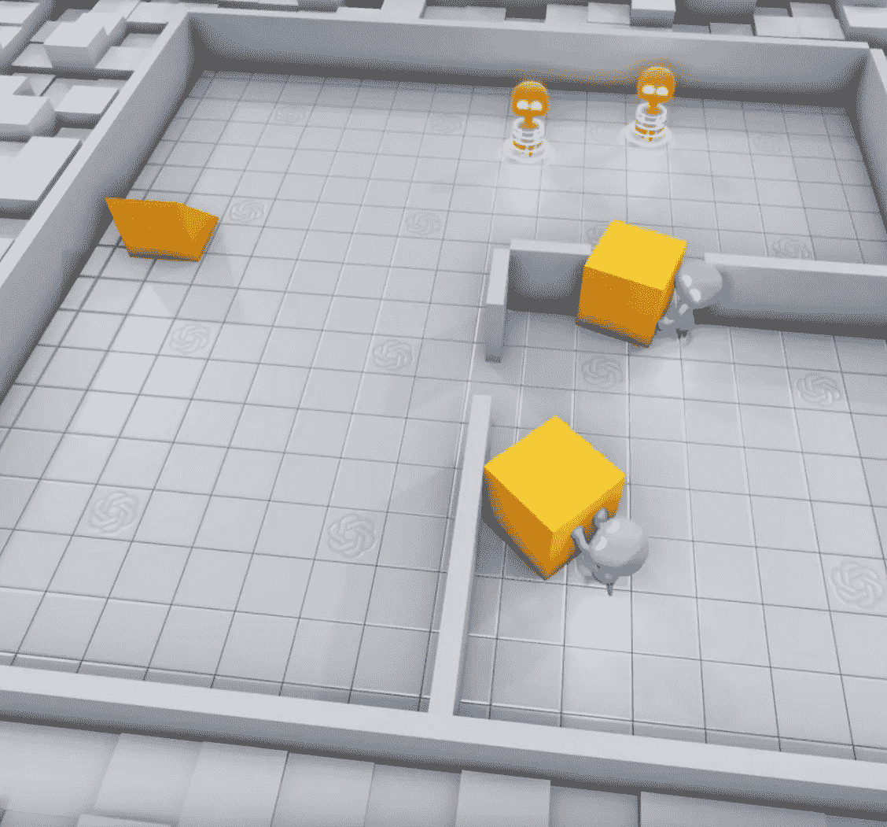

[两份会议纪要](https://www.youtube.com/user/keeroyz/featured)

名单上的第一个，是我最喜欢的，由卡罗利·佐尔奈-菲尔撰写的*两分钟论文*。他的视频很有趣，很吸引人，看起来绝对是一种享受。他挑选并评论最令人兴奋的研究进展。DotA 游戏上的 OpenAI，检测 DeepFake，模拟物理，或者克隆你的声音。他在他的频道里拥有一切。

Károly 将描述他正在回顾的研究中有哪些精彩之处。即使是最先进和最新的人工智能研究，观看他的视频也不需要计算机科学博士学位。他的演示非常清晰，没有机器学习知识的人也能理解。

既然这是我最喜欢的频道，那就给你看其中一个视频， [*OpenAI 玩捉迷藏，破游戏*](https://www.youtube.com/watch?v=Lu56xVlZ40M) ！🤖我相信你会喜欢的。

讲的是两个 AI 团队(隐藏者和寻求者)互相玩捉迷藏。当一方学会了新的策略，另一方就会适应反击。代理人一直玩到他们学会滥用游戏物理引擎的程度。太棒了。

YouTube: [*两分钟论文*](https://www.youtube.com/user/keeroyz/)

# #2.莱克斯·弗里德曼

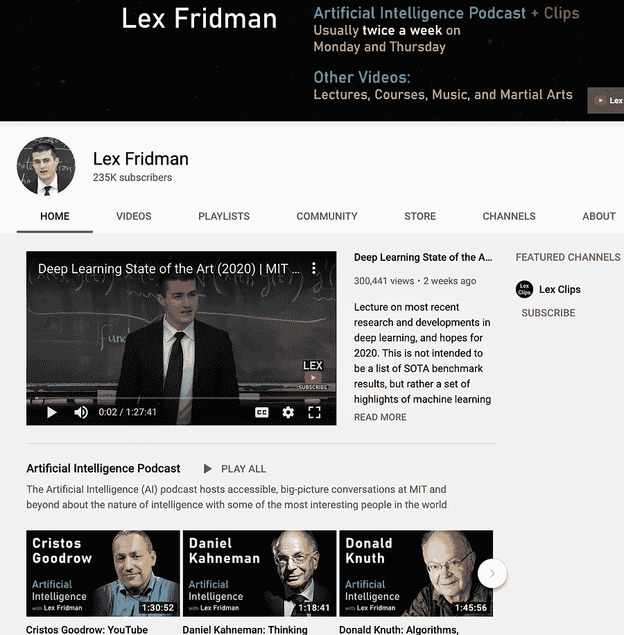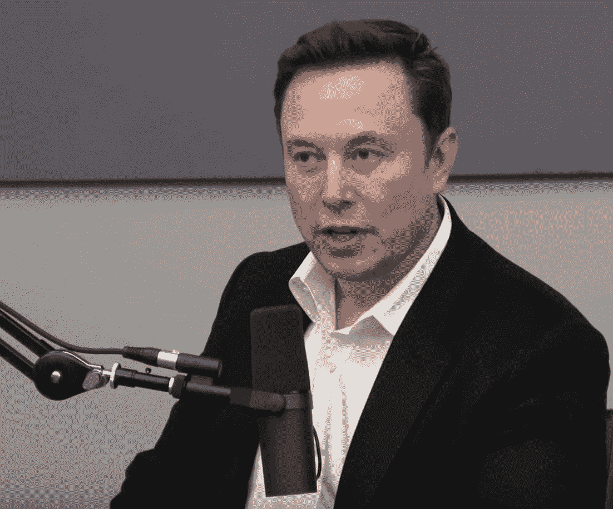

*Lex Fridman* 采访人工智能行业的超级明星。埃隆·马斯克、扬·勒昆、约舒阿·本吉奥、埃里克·施密特？是的，莱克斯已经采访过他们了。

这些采访可以让你对未来有所了解，因为他们会分享他们正在做的事情。利用人工智能找到癌症的治疗方法；Adobe 在做 AI；Neuralink 新的 iRobot 真空能力:YouTube 算法。你可以找到大量可供选择的主题。

莱克斯·弗里德曼是麻省理工学院的研究科学家。他进行深度学习和自动驾驶汽车讲座。如果你对参加麻省理工学院的深度学习讲座感兴趣，Lex 也会在他的频道上分享它们。

YouTube: [*莱克斯弗里德曼*](https://www.youtube.com/user/lexfridman/)

# #3.亨利·艾实验室

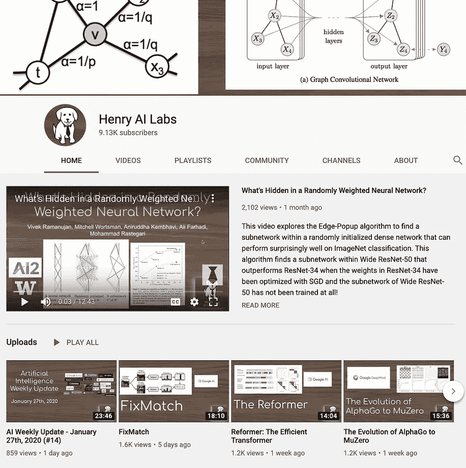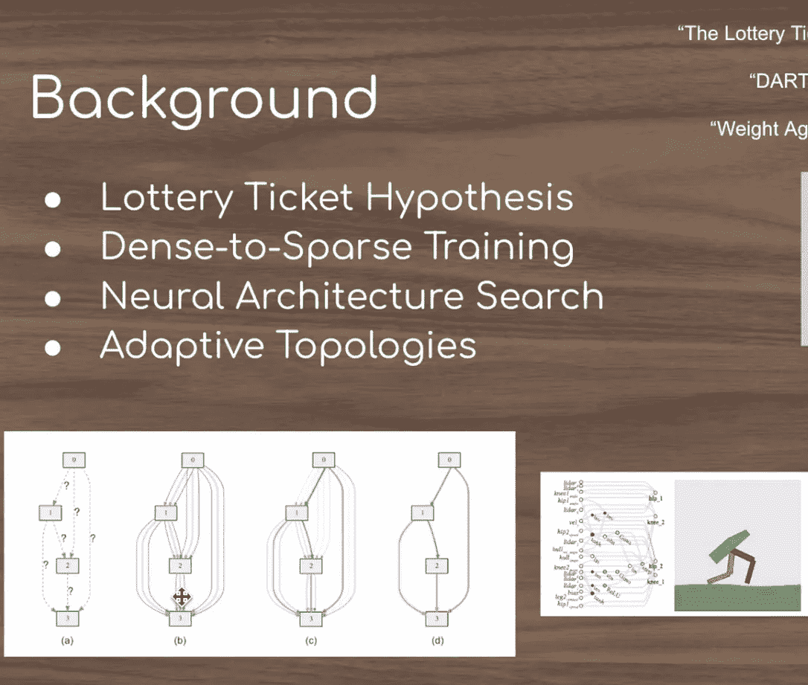

[亨利·艾实验室](https://www.youtube.com/channel/UCHB9VepY6kYvZjj0Bgxnpbw)

*亨利艾实验室*。这个渠道丰富！自然语言处理，强化学习，生成对抗网络，弱监督学习。涵盖了所有最热门的话题。

亨利总结了谷歌和脸书等公司的研究实验室发表的新论文。如果你想跟上人工智能的最新发展，这绝对有用。他概述了最新的研究课题和现实世界的应用，你不必自己消化整篇论文。

YouTube: [*亨利·艾实验室*](https://www.youtube.com/channel/UCHB9VepY6kYvZjj0Bgxnpbw)

# #4.ArXiv 见解

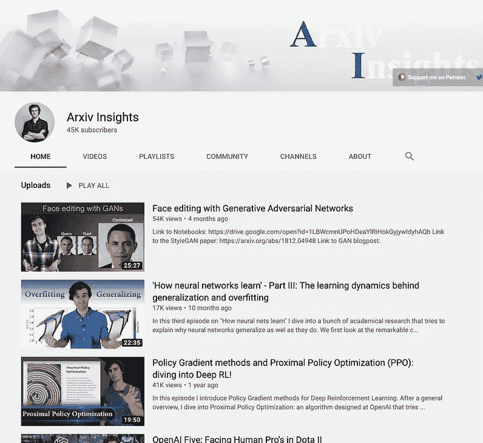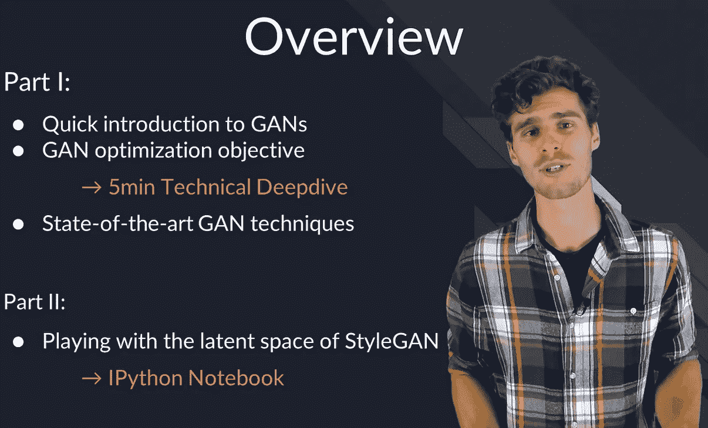

[ArXiv 洞见](https://www.youtube.com/channel/UCNIkB2IeJ-6AmZv7bQ1oBYg/featured)

研究论文可能有点枯燥&需要一段时间来阅读，对吗？史云光·斯廷布鲁格将为您提供帮助！他旨在简化和解释机器学习论文中的技术细节。

在撰写本文时，该频道只有 11 个视频。但是他的高质量和可靠的内容已经吸引了 4.5 万订户。他将复杂的主题，如*生成对立网络*，分解成一步一步的微小解释。

在观看他的视频时，我在想，“伙计，*我多么希望我的讲师能像他一样解释概念。*

YouTube:[ArXiv 洞见 ](https://www.youtube.com/channel/UCNIkB2IeJ-6AmZv7bQ1oBYg)

# #5.扬尼克·基尔彻

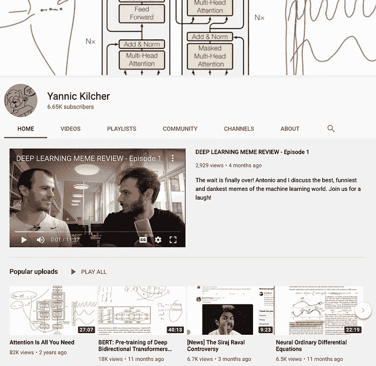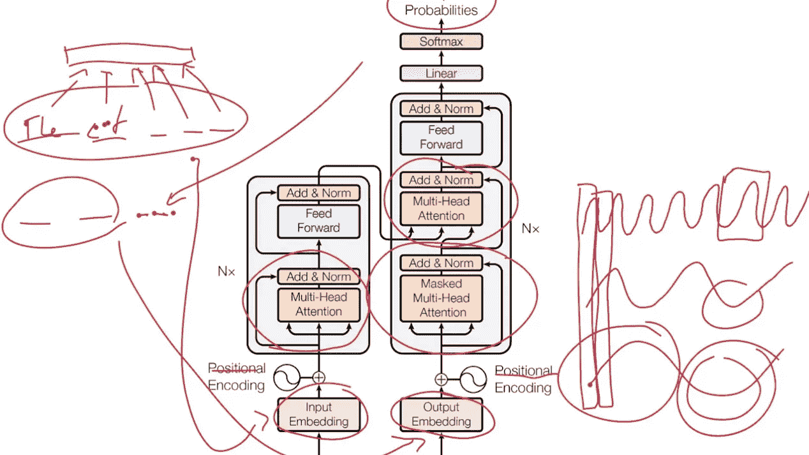

[扬尼克·基尔彻](https://www.youtube.com/channel/UCZHmQk67mSJgfCCTn7xBfew/featured)

*Yannic Kilcher* 重点讲解深度学习研究论文。他介绍了这篇论文，并描述了它背后的新颖性。他一丝不苟地给你读论文，他像讲故事一样讲。他涵盖了关于深度学习架构、自然语言处理和强化学习的主题。

细节的水平令人难以置信。扬尼克把一本厚厚的纸分成几部分，一段一段地揭示每个想法。他解释并在屏幕上涂鸦，引导你思考整个过程。当有论文没有涉及的概念时，他会参考其他资源来揭示论文之外的任何概念。

在视频的最后，感觉我已经对论文有了充分的理解，就好像我已经通读了至少三遍。我多么希望他能评论我正在阅读的论文。

YouTube: [*扬尼克·基尔彻*](https://www.youtube.com/channel/UCZHmQk67mSJgfCCTn7xBfew/featured)

# #6.利奥·伊西克多根

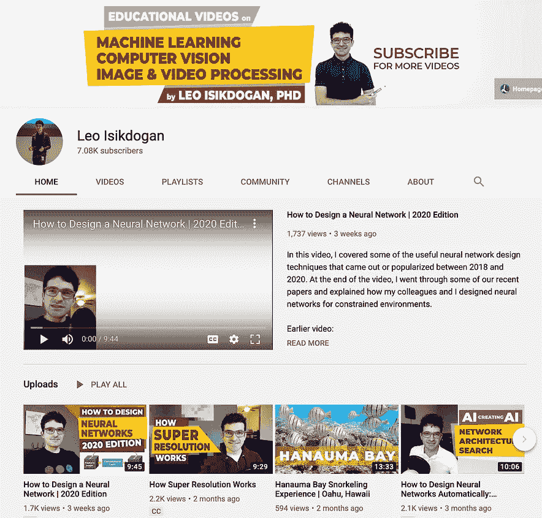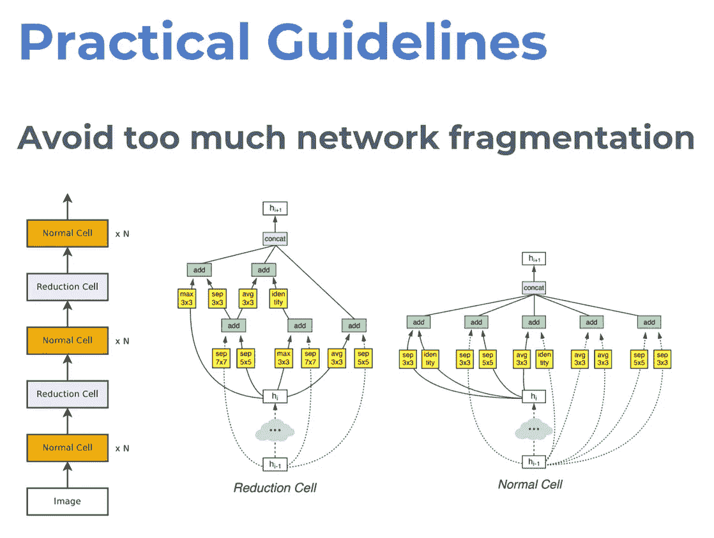

利奥·伊西克多根

*Leo Isikdogan* 展示了将简明的研究课题转化为实际的、真实的应用。他涉及机器学习和计算机视觉的主题。他还创建了指导性的机器学习教程。

Leo 是英特尔的一名研究员，他在频道中介绍了自己的工作。我喜欢的一项研究是利用深度神经网络进行[眼神交流矫正。在他的视频中，他解释说，在通话中保持目光接触需要看着摄像头，而不是屏幕。他的工作是纠正凝视，提高视频会议体验的质量。](https://arxiv.org/pdf/1906.05378.pdf)

我喜欢研究有现实世界的应用和影响。

这个频道对任何开始深度学习的人来说也很棒，有很多东西可以学习。查看他的频道中的播放列表、*深度学习速成系列课程*和*tensor flow 编码实践课程*。

YouTube: [*利奥伊西多根*](https://www.youtube.com/channel/UC-YAxUbpa1hvRyfJBKFNcJA/featured)

# #7.卡格尔

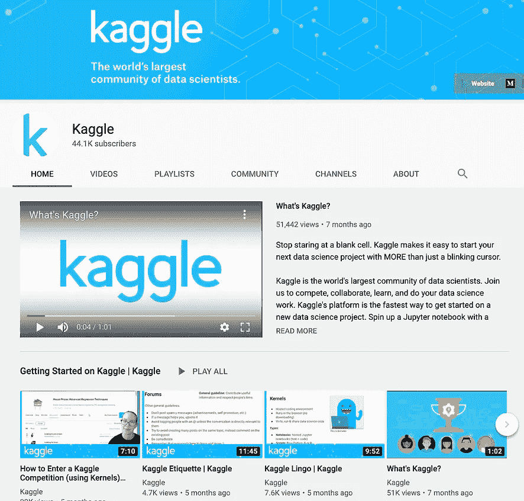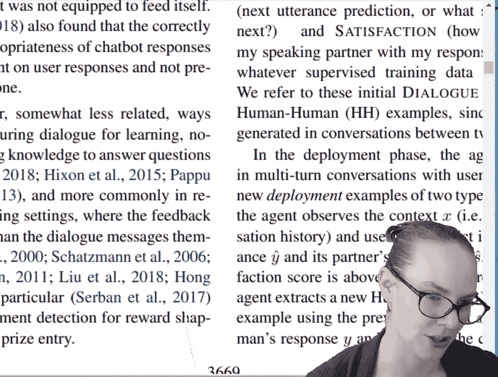

[卡格尔](https://www.youtube.com/channel/UCSNeZleDn9c74yQc-EKnVTA)

最后同样重要的是， [Kaggle](https://kaggle.com/) ，*你的数据科学之家*。这是最大的数据科学社区。用户可以在 Kaggle 平台中找到数据集和代码。他们可以发布笔记本来共享代码、协作和相互学习。有现金奖的比赛；竞争是一种很好的学习方式，现金绝对是取得好成绩的巨大动力。

如果说 [Kaggle](https://www.kaggle.com/) 是你做和学的地方，那么 [Kaggle YouTube 频道](https://www.youtube.com/channel/UCSNeZleDn9c74yQc-EKnVTA)就是你看和学的地方。

有关于深度学习、构建仪表板和数据处理的“how-to”编码教程。他们有关于如何解决数据科学问题的现场编码会议。

关于最新 NLP 研究的更新，有一个播放列表， [Kaggle 阅读小组](https://www.youtube.com/playlist?list=PLqFaTIg4myu8t5ycqvp7I07jTjol3RCl9)。她阅读和讨论 NLP 的研究论文。她会向你解释每一个段落，图表，代码，数学方程式。如果你是一名新的研究人员或刚接触学术论文，观看这些视频，你将学会如何剖析论文。

YouTube:[*ka ggle*](https://www.youtube.com/channel/UCSNeZleDn9c74yQc-EKnVTA)

这就对了。我希望你会喜欢这些频道。如果你有渠道推荐，请在评论中告诉我(和其他读者)。

如果机器学习让你兴奋，那就跟着我上 Medium ( [顺口溜](https://medium.com/u/641197e9ee36?source=post_page-----d545ab401c4--------------------------------))；因为我会写更多关于机器学习的应用。特别是在医疗保健中，对视网膜和脑机接口的影响。我也开发[原型来展示机器学习](/time-series-forecasting-with-tensorflow-js-1efd48ff2201)。

 [## 顺口溜-中等

### 阅读介质上的顺口溜。博士生|阿里巴巴|医疗保健中的机器学习| TDS 副主编|…

medium.com](https://medium.com/@jinglesnote) 

我将引用罗伊·班尼特的话来结束我的演讲。

> 过上成功而充实的生活有五件重要的事情:永远不要停止梦想，永远不要停止相信，永远不要放弃，永远不要停止尝试，永远不要停止学习。

 [## 数据科学家:21 世纪最肮脏的工作

### 40%的吸尘器，40%的看门人，20%的算命师。

towardsdatascience.com](/data-scientist-the-dirtiest-job-of-the-21st-century-7f0c8215e845) 