# 用 Jupyter 笔记本写作的 7 个基本技巧

> 原文：<https://towardsdatascience.com/7-essential-tips-for-writing-with-jupyter-notebook-60972a1a8901?source=collection_archive---------1----------------------->

## 数据科学

## 第一篇数据科学文章指南


照片由[蒂姆·特拉德](https://unsplash.com/@timtrad?utm_source=medium&utm_medium=referral)在 [Unsplash](https://unsplash.com?utm_source=medium&utm_medium=referral) 拍摄

```
**Table of Contents**[**Introduction**](#792b)1\. [Help, shortcuts, and number lines](#7358)
2\. [Theme](#78aa) and [Font & font size](#4f95)
3\. [Markdown](#53a8)
4\. [Jupyter Notebook LaTeX](#36a1)
5\. [Jupyter Notebook LaTeX equation numbering & alignment](#ece0)
6\. [Two columns](#231d)
7\. [Page break](#28da)
8\. [Footnotes](#699a)
9\. [Writing tools](#b5ba)
10\. [How to print out from Jupyter Notebook without code blocks](#87e5)
11\. [Exporting to an MS Word file](#13be)[**Conclusion**](#e6f0)
```

# 介绍

Jupyter Notebook 是创建和共享包含代码、可视化和文本的文档的好工具。在本文中，我将介绍使用 Jupyter Notebook 撰写第一篇数据科学文章的有用技巧。

如果你想看 Jupyter 笔记本入门指南，请阅读[这篇文章。](/beginners-guide-to-jupyter-notebook-8bb85b85085)

我们开始吧！

# 帮助、快捷键和数字行

快捷方式会加快你的写作速度。按下`h`切换键盘快捷键屏幕。你可以通过按⌘⇧f.看到所有的命令。我经常使用下面的快捷键，如果你能记住它们会很有用。

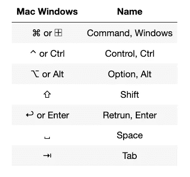

Mac 和 Windows 键盘符号。摄影:冈田新一

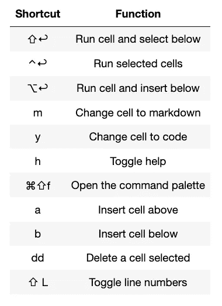

Mac Jupyter 笔记本快捷方式。摄影:冈田新一

## 行号

在你的笔记本上放上行号是个好主意。当你有一个错误，很容易找到线。除了上述快捷方式，您还可以使用视图>切换行号。

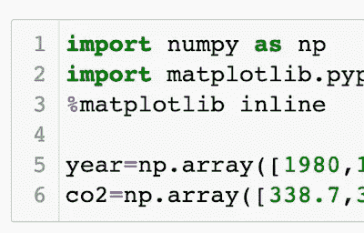

Jupyter 笔记本单元格中的行号。摄影:冈田新一

# 主题

为你的 Jupyter 笔记本设计一个漂亮的 Jupyter 主题就像一个舒适的枕头。你将花很多时间用 Jupyter 笔记本写作，让我们为你的口味找一个好的主题，并修改字体大小。

让我们安装 [JupyterThemes](https://github.com/dunovank/jupyter-themes) 。打开您的终端并键入以下内容。对于 PIP 用户；

```
pip install jupyterthemes
pip install --upgrade jupyterthemes
```

对于康达用户；

```
conda install -c conda-forge jupyterthemes
```

有九个主题，chesterish，3 年级，ggruvboxd，gruvboxl，monokai，oceans16，onedork，solarizedd，solarizedl。

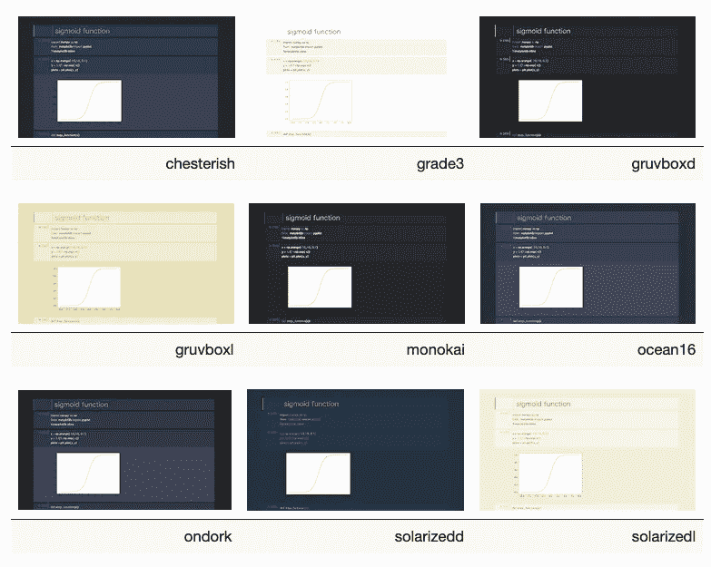

Jupyter 笔记本主题。摄影:冈田新一

如果你想使用 ocean16，请在 Jupyter 笔记本单元格中输入以下内容，然后按 shift+enter。

```
!jt -t oceans16
```

**当你改变一个主题时，你需要刷新你的浏览器！**

如果您想重置主题，请使用以下代码。

```
!jt -r
```

[](/how-to-run-jupyter-notebook-on-docker-7c9748ed209f) [## 如何在 Docker 上运行 Jupyter 笔记本

### 不再有 Python 环境和包更新

towardsdatascience.com](/how-to-run-jupyter-notebook-on-docker-7c9748ed209f) [](/hands-on-jupyter-notebook-hacks-f59f313df12b) [## 手把手的 Jupyter 笔记本黑客

### 您应该使用的技巧、提示和快捷方式

towardsdatascience.com](/hands-on-jupyter-notebook-hacks-f59f313df12b) 

## 字体和字体大小

**方法一**

下图显示了字体的位置。

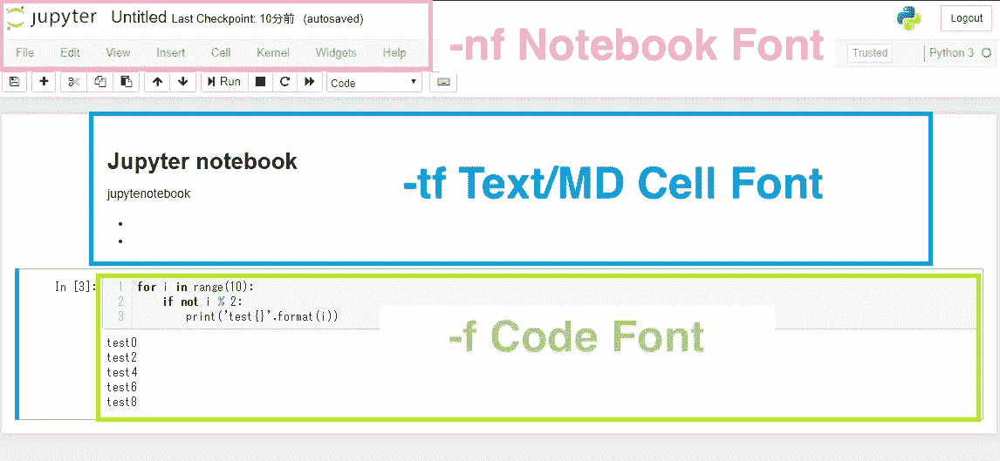

Jupyter 笔记本字体名称及其选项名称。

下图显示了字体大小。

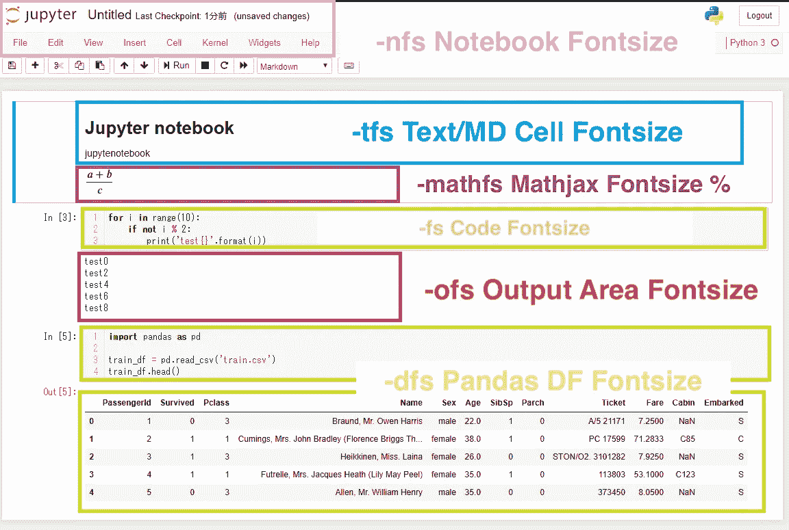

Jupyter 笔记本字体大小名称及其选项名称。

如果您想要更改文本单元格的字体和字体大小，您可以在单元格中键入以下内容，然后按 shift+enter。

```
!jt -t oceans16 -tf merriserif -tfs 14 -nf ptsans -nfs 14
```

**不要忘记刷新浏览器以使更改生效。**

你可以在这里找到所有的字体类型。

让我们试试不同的设置。

```
!jt -t grade3 -tf firacode -tfs 13 -mathfs 110 -fs 13 -N -T
```

**方法二**

如果你不想改变主题，但想改变字体大小和字体，那么你需要改变 Jupyter 笔记本的 CSS。在编辑器中打开`.jupyter/custom/custom.css`。如果没有编辑器，请安装 [VS 代码](https://code.visualstudio.com/download)。

并将以下内容粘贴到文件中。你可以把`font-size:130%`改成你喜欢的任何数字。

```
div#notebook p, div#notebook{
    font-size: 130%;
    line-height: 125%;
}.rendered_html pre, .rendered_html table{
    font-size:130%;
    line-height: 125%;
}.CodeMirror, .CodeMirror pre, .CodeMirror-dialog, .CodeMirror-dialog .CodeMirror-search-field, .terminal-app .terminal {
    font-size: 130%;
    line-height: 125%;
}
```

保存文件并重新加载页面以查看更改。

**方法三(仅针对代码单元格)**

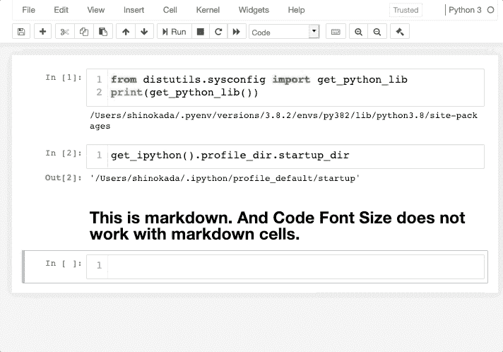

这可能是最容易的代码单元字体。这不适用于减价单元格。

在 Nbextensions 中，您可以启用代码字体大小。

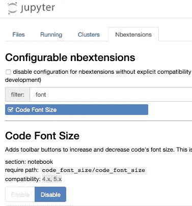[](/beginners-guide-to-jupyter-notebook-8bb85b85085) [## Jupyter 笔记本初学者指南

### 从设置到描述性统计

towardsdatascience.com](/beginners-guide-to-jupyter-notebook-8bb85b85085) [](/version-control-with-jupyter-notebook-b9630bc5996e) [## 使用 Jupyter 笔记本进行版本控制

### Jupytext 循序渐进指南

towardsdatascience.com](/version-control-with-jupyter-notebook-b9630bc5996e) 

# 降价

Markdown 是一种具有纯文本格式语法的轻量级标记语言。([维基百科](https://en.wikipedia.org/wiki/Markdown))

## 如何将单元格改为降价

将单元格更改为 markdown 的一种方法是从下拉列表中选择 Markdown。


单元格选项。摄影:冈田新一

另一种方法是使用`m`快捷键，选中一个单元格后。如果您正在单元格中键入`m`、`y`转换为代码和`r`转换为原始数据，您可能需要按 escape 键。

## **标题**

使用`#`表示 H1，`##`表示 H2 等。

```
# Main title
## Sub title
### H3 title
#### H4 title
```

上面将打印出以下内容。


Jupyter 笔记本降价标题示例。摄影:冈田新一

## 目录

您可以使用*或-来创建一个嵌套的无序列表，并将数字用于有序列表。

```
- main 1
  - sub 1
  - sub 2
- main 2
- main 31\. Main list 1
2\. Main list 2
  - Sub list 2-1
  - Sub list 2-2
3\. Main list 3
```

以上产生了以下内容。

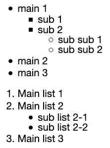

Jupyter 笔记本降价清单示例。摄影:冈田新一

## 链接

像`[Link name](url)`一样，降价链接在链接文本后立即使用括号。

```
[Google]([https://www.google.com](https://www.google.com))
```

上面的代码产生， [Google](https://www.google.com) 。

## 图像

Markdown image 语法类似于 Links 语法，但是您可以在它前面加上一个感叹号，如``。

```
 "Logo Title Jupyter Notebook logo")
```

上述降价产生:


Jupyter 笔记本图像示例。

## 桌子

要添加表格，请使用三个或更多连字符创建每列的标题，并使用竖线(|)分隔每列。您可以选择在表格的任意一端添加管道。使用`:---:`将一列居中，`:---`向左对齐。

```
Id | Syntax      | Description 
--|:---------:|:-----------:
1|Header      | Something very long long long here      
2|Long long long paragraph   | Text
```

渲染输出如下所示:

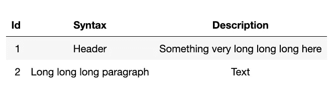

Jupyter 笔记本降价表示例。摄影:冈田新一

如果你想了解更多关于减价的信息，请阅读本页。

[](/stepping-into-intermediate-with-jupyter-f6647aeb1184) [## Jupyter 用户的生产力提示

### 使用 Jupyter 笔记本和 JupyterLab 让您的工作流程更加高效

towardsdatascience.com](/stepping-into-intermediate-with-jupyter-f6647aeb1184) [](/how-to-create-an-attractive-bubble-map-5cf452c244e9) [## 如何创建一个有吸引力的泡泡图

### 从 Github repo 抓取数据的分步指南

towardsdatascience.com](/how-to-create-an-attractive-bubble-map-5cf452c244e9) 

# Jupyter 笔记本乳胶

[LaTeX](https://en.wikipedia.org/wiki/LaTeX) 在学术界被广泛用于多个领域的科学文献的交流和发布。

*   您需要用美元($)符号将它们括起来。

若要向左对齐，请使用一个美元($)符号。`$P(A)=\frac{n(A)}{n(U)}$`


Jupyter 笔记本乳胶示例左对齐。摄影:冈田新一

*   要居中对齐，请使用双美元($$)符号。`$$P(A)=\frac{n(A)}{n(U)}$$`

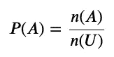

Jupyter 笔记本乳胶例子，对齐中心。摄影:冈田新一

*   使用`\limits`的`\lim`、`\sum`和`\int`为每个标志的顶部和底部添加限制。
*   使用反斜杠来转义 LaTeX 特殊单词，如数学符号、拉丁单词、文本等。

下表显示了基本的 LaTeX 命令。

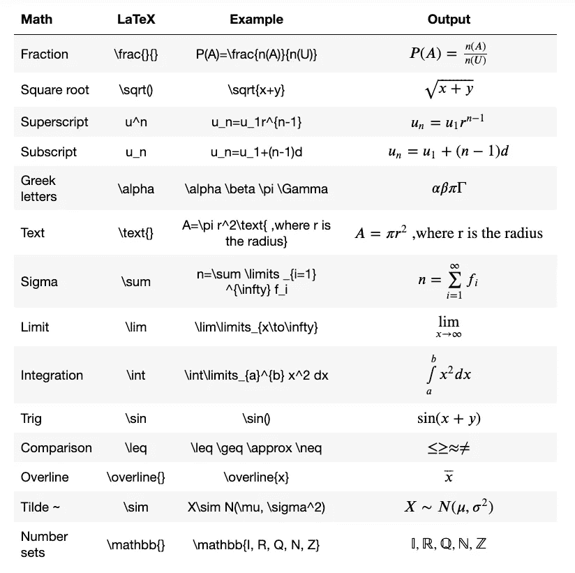

Jupyter 笔记本乳胶例子。摄影:冈田新一

更多信息请参见此[文章](https://davidhamann.de/2017/06/12/latex-cheat-sheet/)或[此链接](https://www.overleaf.com/learn/latex/Integrals,_sums_and_limits)。有关数学符号，请参见此[链接](https://oeis.org/wiki/List_of_LaTeX_mathematical_symbols)。

你能写出下列乳胶中平均值的方程式吗？

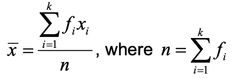

Jupyter 笔记本乳胶方程的例子。摄影:冈田新一

## 矩阵

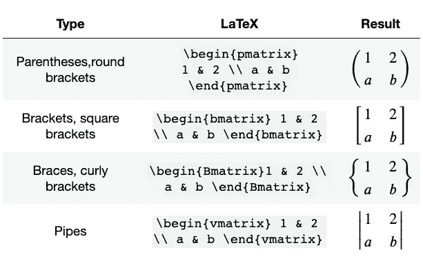

Jupyter 笔记本乳胶矩阵的例子。摄影:冈田新一

## `**cases**` **为分段函数**

用左花括号渲染多行。

```
$$
\begin{align}
\text{Probability density function:}\\
\begin{cases}
\frac{1}{b-a}&\text{for $x\in[a,b]$}\\
0&\text{otherwise}\\
\end{cases}
\\
\text{Cumulative distribution function:}\\
\begin{cases}
0&\text{for $x<a$}\\
\frac{x-a}{b-a}&\text{for $x\in[a,b)$}\\
1&\text{for $x\ge b$}\\
\end{cases}
\end{align}
$$
```

上述代码产生以下内容。

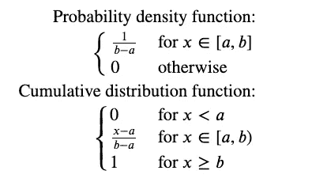

Jupyter 笔记本乳胶分段函数的例子。摄影:冈田新一

# Jupyter 笔记本乳胶方程式编号和对齐

## 方程式编号

对于方程编号，需要加上`[jupyter_contib_nbextensions](https://jupyter-contrib-nbextensions.readthedocs.io/en/latest/install.html#install-the-python-package)`。

**PIP**

如果你用`pip`安装了 Jupyter 笔记本，你可以用 Jupyter 笔记本的电池安装`[jupyter_contib_nbextension](https://jupyter-contrib-nbextensions.readthedocs.io/en/latest/install.html#install-the-python-package)`。

```
!pip install jupyter_contrib_nbextensions
```

然后需要安装 CSS。

```
!jupyter contrib nbextension install --user
```

或者从没有`!`的终端。

```
pip install jupyter_contrib_nbextensions
```

**康达**

如果您的安装是通过 Conda，那么从 Jupyter 笔记本手机或终端运行以下程序。

```
jupyter contrib nbextension install --user
```

刷新您的浏览器，您应该在主菜单中看到 Nbextensions 选项卡。

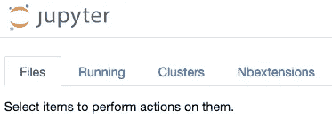

Jupyter 笔记本 nb 扩展标签。摄影:冈田新一

单击 Nbextensions 选项卡并搜索公式自动编号。单击该框以启用扩展。

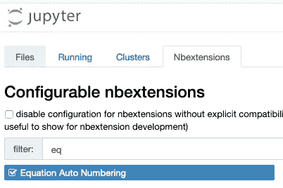

Jupyter 笔记本方程自动编号。摄影:冈田新一

刷新浏览器并尝试以下方程以查看方程编号。请将以下内容添加到减价单元格中。它在 1 到 3 的末尾添加方程式编号。你需要从`\begin{align}` and end with `\end{align}`开始。

```
$$
\begin{align}
{x} = \sigma(y-x) \\
{y} = \rho x - y - xz \\
{x+y+z} = -\beta z + xy 
\end{align}
$$
```


Jupyter 笔记本乳胶方程编号示例。摄影:冈田新一

## 换行和标记

刷新浏览器并尝试以下方程以查看方程编号。您可以使用`\tag{}`添加方程式编号。双反斜杠`\\`代表一个新行。你需要用`\begin{align}` and `\end{align}`把所有方程括起来。

```
$$
\begin{align}
{x} = \sigma(y-x) \tag{1-1}\\
{y} = \rho x - y - xz \tag{1-2}\\
{x+y+z} = -\beta z + xy \tag{1-3}
\end{align}
$$
```


Jupyter 笔记本乳胶方程编号示例使用对齐和制表符。摄影:冈田新一

## 等式对齐

**右对齐**

正常情况下，等式与上面的示例一样向右对齐。

**等号对齐**

通过添加&符号，等式将在该点对齐。例如，如果你想在等号处对齐等式，使用`&=`。

```
$$
\begin{align}
{x} & = \sigma(y-x) \tag{3-1}\\
{y} & = \rho x - y - xz \tag{3-2}\\
{x+y+z} & = -\beta z + xy \tag{3-3}
\end{align}
$$
```


Jupyter 笔记本乳胶方程对齐等号。摄影:冈田新一

**左对齐**

```
$$
\begin{align}
& {x} = \sigma(y-x) \tag{4-1}\\
& {y} = \rho x - y - xz \tag{4-2}\\
& {x+y+z} = -\beta z + xy \tag{4-3}
\end{align}
$$
```


Jupyter 笔记本乳胶方程左对齐。摄影:冈田新一

**混合对齐**

如果你想让文本靠左对齐，公式居中对齐，你可以使用下面的方法。

```
$
\text{Normal distribution} \\
$
$$
X \sim N(\mu,\sigma^2) \\
$$
$
\text{Probability density function} \\
$
$$
\frac{1}{\sigma \sqrt{2 \pi}}e^{-\frac{(x- \mu)^2}{2 \sigma^2}}
$$
```

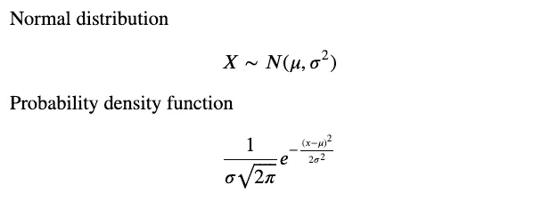

Jupyter 笔记本 LeTeX 方程混合对齐。摄影:冈田新一

# 两列

如果你想创建两列布局，你可以试试这个方法。

请将以下内容复制并粘贴到其中一个单元格中。

```
<div class="row">
  <div class="column">
    Lorem ipsum dolor sit amet, consectetur adipiscing elit.    Maecenas quis nunc pulvinar urna faucibus tincidunt ut vestibulum ligula. Sed placerat sollicitudin erat, quis dapibus nibh tempor non. 
      <br/>

Id | Syntax      | Description 
--|:---------:|:-----------:
1|Header      | Something  here
2|More here   | Text

  </div>

  <div class="column">
Lorem ipsum dolor sit amet, consectetur adipiscing elit. Maecenas quis nunc pulvinar urna faucibus tincidunt ut vestibulum ligula. Sed placerat sollicitudin erat, quis dapibus nibh tempor non. 
  <br/>

  $$
  \begin{align}
  {x} & = \sigma(y-x) \tag{3-1}\\
  {y} & = \rho x - y - xz \tag{3-2}\\
  {x+y+z} & = -\beta z + xy \tag{3-3}
  \end{align}
  $$

  </div>
</div>
```

接下来，您需要向其中一个单元格添加 CSS 样式。(这包括“如何在没有代码块的情况下从 Jupyter 笔记本中打印”中的代码，您可以在本文的后面找到它。)

```
%%html
<style>
    [@media](http://twitter.com/media) print { 
        * {
             box-sizing: border-box;
          } .row {
             display: flex;
         } /* Create two equal columns that sits next to each other */
       .column {
          flex: 50%;
          padding: 10px;

        }

        div.input {
          display: none;
          padding: 0;
        }
        div.output_prompt {
          display: none;
          padding: 0;
        }
        div.text_cell_render {
          padding: 1pt;
        }
        div#notebook p,
        div#notebook,
        div#notebook li,
        p {
          font-size: 10pt;
          line-height: 115%;
          margin: 0;
        }
        .rendered_html h1,
        .rendered_html h1:first-child {
          font-size: 10pt;
          margin: 3pt 0;
        }
       .rendered_html h2,
       .rendered_html h2:first-child {
          font-size: 10pt;
          margin: 3pt 0;
       }
       .rendered_html h3,
       .rendered_html h3:first-child {
         font-size: 10pt;
         margin: 3pt 0;
       }
       div.output_subarea {
         padding: 0;
       }
       div.input_prompt{
         display: none;
         padding: 0;
      }}
```

这里我用的是 [CSS flexbox](https://css-tricks.com/snippets/css/a-guide-to-flexbox/) 。Flexbox 是一种创建多列的现代方法。您需要执行单元格，并使用浏览器的打印来查看效果。

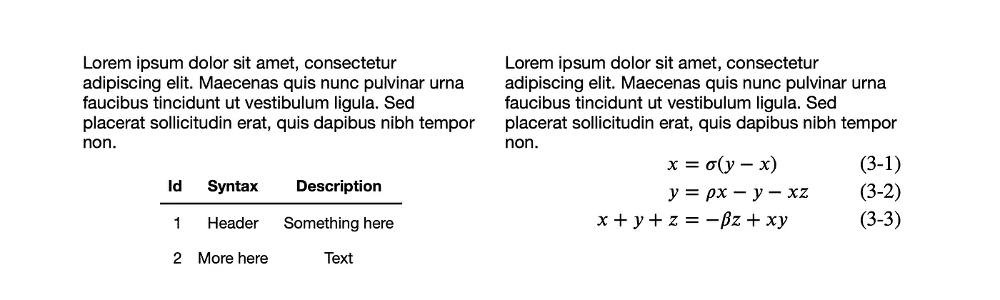

两列

# 分页

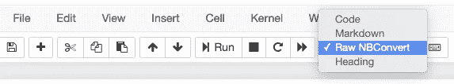

原始 NBConvert

创建一个原始的 NBConvert 单元格并添加以下代码。

```
<div style="page-break-after: always;"></div>
```

转到 Jupyter 笔记本，文件，打印预览。

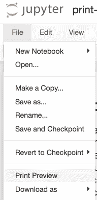

打印预览

然后转到浏览器的文件、打印或 Cmd+p 来打印页面。

# 脚注

将以下内容添加到单元格中。

```
This is a example of footnote[<sup>1</sup>](#fn1). And this is another footnote[<sup>2</sup>](#fn2).
```

在另一个单元格中，添加以下内容。

```
<span id="fn1"> Your footnote 1 here.</span>
<span id="fn2"> Your footnote 2 here.</span>
```

通过点击上标，它将跳转到它的脚注。

# 书写工具

在发表你的文章之前，我总是需要检查语法和单词。

*   语法上

截至撰写本文时，Grammarly 还不能在浏览器上运行。所以你必须复制粘贴到[的网络应用](https://app.grammarly.com/)或者[的桌面应用](https://www.grammarly.com/native/mac)。

*   海明威编辑

检查完语法后，海明威应用程序是让你的文章变得大胆清晰的下一个工具。即使你的观众是成年人，海明威应用程序的可读性也要达到 6 级。

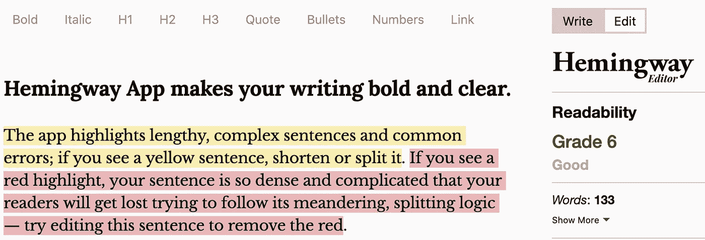

朱庇特笔记本写作工具，海明威编辑。

*   拼写检查器

您可以在 Nbextensions 中启用[拼写检查器](https://jupyter-contrib-nbextensions.readthedocs.io/en/latest/nbextensions/spellchecker/README.html)。

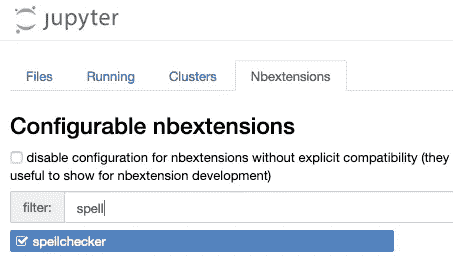

作者图片

# 如何在没有代码块的情况下从 Jupyter 笔记本中打印出来

一旦你完成了你的写作，如果你想把它导出为 PDF 文件，你可以把它打印成 PDF 格式。

有几种方法可以做到这一点。但是我想到了一个最简单灵活的方法。

您需要将下面的代码复制并粘贴到您的一个单元格中。然后转到文件，打印预览。代码块和输出块将被删除。为打印调整标题填充和边距。使用这种方法，您可以随意调整代码。

我发现原始的 NBConvert 块在打印视图中没有 div 或 class，所以很难控制这些块。我建议不要使用 Raw NBConvert 进行打印。

```
%%html
 <style>
    @media print { 
    div.input {
      display: none;
      padding: 0;
    } div.output_prompt {
      display: none;
      padding: 0;
    } div.text_cell_render {
      padding: 1pt;
    } div#notebook p,
    div#notebook,
    div#notebook li,
    p {
      font-size: 11pt;
      line-height: 135%;
      margin: 0;
    } .rendered_html h1,
    .rendered_html h1:first-child {
      font-size: 16pt;
      margin: 7pt 0;
    } .rendered_html h2,
    .rendered_html h2:first-child {
      font-size: 14pt;
      margin: 6pt 0;
    } .rendered_html h3,
    .rendered_html h3:first-child {
      font-size: 13pt;
      margin: 6pt 0;
    } div.output_subarea {
      padding: 0;
    }
  } @page {
      size: A4;
  }
  </style>
```

进入浏览器打印，文件>打印，需要在页眉和页脚选择空白。

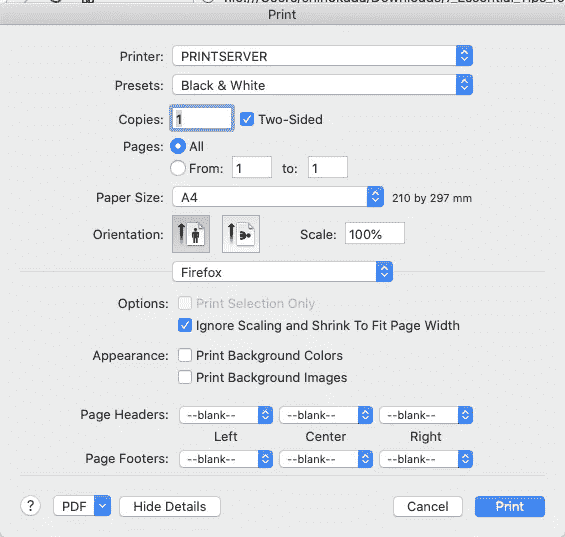

您需要在页眉和页脚中选择空白。摄影:冈田新一

现在，您可以打印出这个 HTML 页面或将其导出为 PDF 格式，而无需代码和页眉/页脚。

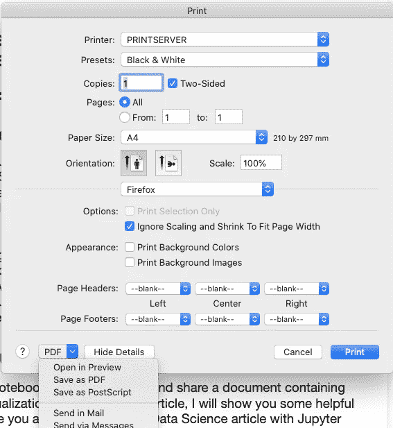

选择在预览中打开或另存为 PDF。摄影:冈田新一

# 导出到 MS Word 文件

是否要在 MS Word 中编辑 Jupyter 笔记本文件？这是你能做的。

首先，你需要安装 [Pandoc](https://pandoc.org/installing.html) 。下载 macOS 的最新安装程序，或者按照 Windows 的[说明](https://pandoc.org/installing.html)进行操作。通过`pandoc --version`检查是否安装正确。

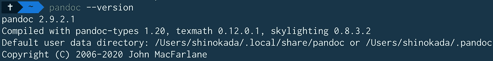

接下来，您需要从您的终端安装 [jupyter-docx-bundler](https://github.com/m-rossi/jupyter-docx-bundler) 。

```
$ pip install jupyter-docx-bundler
$ jupyter bundlerextension enable --py jupyter_docx_bundler --sys-prefix
```

**移除输入或代码单元格**

转到视图>单元格工具栏>标签，并将`nbconvert-remove-input`添加到标签字段。这将删除单元格的输入代码。

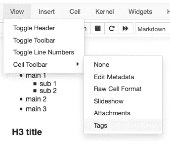

如何查找单元格标记

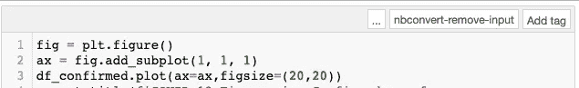

隐藏代码单元格

您可以通过添加`nbconvert-remove-cell`来删除整个单元格。

在您的终端运行中:

```
jupyter nbconvert --execute --to=docx <source notebook>.ipynb --output <target document>.docx
```

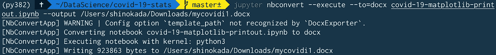

运行 nbconvert 将 ipynb 转换为 docx 文件

# 结论

我希望这将节省您的时间，并为您的第一篇数据科学文章做好准备。如果你还有其他建议，请写在评论里。

**通过** [**成为**](https://blog.codewithshin.com/membership) **会员，可以完全访问媒体上的每个故事。**

***如果你喜欢在我发表文章时收到电子邮件，请在这里注册***[](https://blog.codewithshin.com/subscribe)****。****

**

*[简讯注册链接。](https://blog.codewithshin.com/subscribe)*

# *参考*

*   *[https://markdown-guide . readthedocs . io/en/latest/basics . html # markdown-basics](https://markdown-guide.readthedocs.io/en/latest/basics.html#markdown-basics)*
*   *[https://github . com/Adam-p/Markdown-here/wiki/Markdown-cheat sheet](https://github.com/adam-p/markdown-here/wiki/Markdown-Cheatsheet)*
*   *[https://www.markdownguide.org/extended-syntax/](https://www.markdownguide.org/extended-syntax/)*
*   *[https://qiita.com/koikoi_jam/items/29d9ef4e16a42038325c](https://qiita.com/koikoi_jam/items/29d9ef4e16a42038325c)*
*   *[https://github . com/duno vank/jupyter-themes # monospace-fonts-code-cells](https://github.com/dunovank/jupyter-themes#monospace-fonts-code-cells)*
*   *[https://www . over leaf . com/learn/latex/Integrals，_sums_and_limits](https://www.overleaf.com/learn/latex/Integrals,_sums_and_limits)*

*你好。你坚持到了最后。既然你来了，请帮我传播这篇文章。您也可以关注我，获取更多的 Jupyter、统计和技术文章。*

*[](https://medium.com/series/jupyter-hacks-and-tips-1b1a3a10bc79) [## Jupyter 的技巧和窍门

### Jupyter 技巧和提示的集合

medium.com](https://medium.com/series/jupyter-hacks-and-tips-1b1a3a10bc79)*