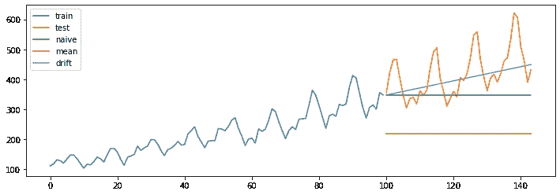
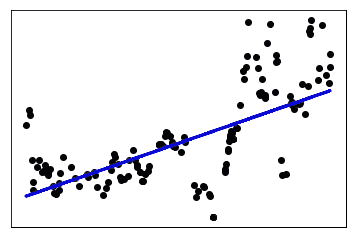

# 7 种你永远不会使用，但无论如何都应该知道的预测技巧

> 原文：<https://towardsdatascience.com/7-forecasting-techniques-youll-never-use-but-should-know-them-anyway-c9ba645c8ba0?source=collection_archive---------64----------------------->

## 基准技术作为复杂预测的垫脚石


照片由[在](https://unsplash.com/@finding_dan?utm_source=medium&utm_medium=referral) [Unsplash](https://unsplash.com?utm_source=medium&utm_medium=referral) 上寻找丹|丹·格林维斯

时间序列预测工具箱就像瑞士军刀，有许多选项可供选择。这些选项经常让数据科学家不知所措、迷惑不解，有时甚至彻底困惑。

据我所知，至少有 25 种不同的技术。但幸运的是，它们彼此之间并没有太大的不同。例如，ARIMA 技术(如 AR、MA、ARIMA、SARIMA、ARIMAX)看似不同，但实际上一种只是另一种的变体。

然而，今天我要写一些简单的技巧，这些技巧人们很少谈论，但对理解预测基础却非常有用。这些模型被称为“基准”或“基线”预测。

正如您将在下面看到的，这些技术很少在实践中应用，但它们有助于建立预测直觉，并在此基础上增加额外的复杂性。首先我将演示一些代码作为例子，然后在文章的后半部分讨论它们的相似之处和不同之处。

让我们首先实现三种技术:天真、均值和漂移模型。我在演示中使用的数据集是只有一个变量的[航空乘客](https://www.kaggle.com/chirag19/air-passengers)数据集。当然，我将使用 python！

*导入库和数据*

```
import pandas as pd
import matplotlib.pyplot as plt
import numpy as np
df = pd.read_csv("../gasprice.csv")
```

*将数据分成训练集和测试集*

```
train = df.iloc[0:556, ]
test = df.iloc[556:,]yhat = test.copy().drop('value', axis=1)
```

*建模*

```
# model building
yhat['naive'] = train.loc[len(train)-1, 'value'] #Naive
yhat['average'] = train['value'].mean() #Average
yhat['drift'] = train.loc[len(train)-1]['value'] +  (train.loc[len(train)-1]['value'] 
- train.loc[0]['value'])/len(train)* np.linspace(0, len(yhat)-1, len(yhat)) # Drift# visualization
plt.figure(figsize=(12,4))
plt.plot(train['value'], label = "train")
plt.plot(test['value'], label = "test")
plt.plot(yhat['naive'], label = "naive")
plt.plot(yhat['average'], label = "mean")
plt.plot(yhat['drift'], label = "drift")
plt.legend()
plt.show()
```

*评估*

```
# model evaluation
eval = pd.concat([test, yhat], axis = 1)
eval['error_naive'] = eval['value'] - eval['naive']
mae_naive = np.mean(np.abs(eval['error_naive']))
rmse_naive = np.sqrt(np.mean(eval['error_naive']**2))
print('MAE_naive:', round(mae_naive))
print('RMSE_naive:', round(rmse_naive))eval = pd.concat([test, yhat], axis = 1)
eval['error_average'] = eval['value'] - eval['average']
mae_average = np.mean(np.abs(eval['error_average']))
rmse_average = np.sqrt(np.mean(eval['error_average']**2))
print('MAE_average:', round(mae_average))
print('RMSE_average:', round(rmse_average))eval = pd.concat([test, yhat], axis = 1)
eval['error_drift'] = eval['value'] - eval['drift']
mae_drift = np.mean(np.abs(eval['error_drift']))
rmse_drift = np.sqrt(np.mean(eval['error_drift']**2))
print('MAE_drift:', round(mae_drift))
print('RMSE_drift:', round(rmse_drift))
```

*   *MAE_naive: 16*
*   *RMSE_naive: 20*
*   *MAE_average: 25*
*   *RMSE _ 平均:28*
*   *MAE_drift: 17*
*   *RMSE _ 漂移:21*



现在，让我们进入一些细节，以了解基本知识。

1.  **天真的预测**:

在简单预测中，未来值被假定为等于过去值。因此，某一特定产品在周三的销量将与周二的销量相似。

天真的预测很像一个 ***零假设*** ，与另一个假设*进行比较，明天的销售收入会因为这样那样的原因*。

**2。季节性天真:**

顾名思义，季节性天真在其预测中考虑了季节性因素。所以在某种程度上，这是对幼稚方法的改进。在这种情况下，12 月的收入预测将等于前一年 12 月的收入。这样做是为了考虑到节日的影响。

同样，它仍然像 ***零假设*** 一样工作，但认为季节性是其相对于天真预测的关键改进。

**3。平均模型**

简单预测采用一个过去的值作为预测值。相比之下，均值模型采用所有过去的观察值，进行平均，并将该平均值用作预测值。

如果数据是随机分布的，没有清晰的模式和趋势(也称为*白噪声*)，均值模型比朴素模型更适合作为基准。

**4。漂移模型**

漂移模型是简单预测的另一种变体，但有明显的改进。与 Naive 一样，它采用最后一次观察，然后根据过去值的变化调整观察。

> 预测值=过去观察值+/-过去观察值的平均变化

**5。线性趋势**

上述均值模型是一条不随时间变化的水平恒定线，因为它处理的是没有趋势的训练数据。但是，如果检测到趋势，线性模型比均值模型提供更好的预测值。

实际上使用线性趋势预测实际上是下面形式的最佳拟合线(即回归线):

> y(t)=α+β* t

RSME 或 R2 值决定了拟合线的预测效果。



**6。随机漫步**

在这种情况下，预测值从其当前位置向前“行走”随机一步(类似于[布朗运动](https://en.wikipedia.org/wiki/Brownian_motion#Mathematics))。就像一个蹒跚学步的孩子，下一步可以是任意方向，但不会离上一步太远。

> Y(t+1)=Y(t) +噪声(t)

周三的股价可能会接近周二的收盘价，因此随机漫步可以提供合理的猜测。但是预测太多的时间步是不合适的，因为，嗯，每一步都是随机的。

7。几何随机漫步

在几何随机游走中，对下一个值的预测将等于上一个值加上一个常数变化(例如，收入的月增长百分比)。

> ŷ(t)= y(t-1)+α

它也被称为“随机增长模型”。长期的股票价格遵循某种几何随机游走模型。

## 最后的想法

本文的目的是挖掘一些非典型的时间序列预测技术。即使它们没有在实践中使用，它们也是一个重要的垫脚石，为预测如何工作以及如何开发高级预测模型建立直觉。

关于一些高级预测技术的其他文章正在准备中，敬请关注。关于新闻和更新，你可以在推特上找到/关注我。