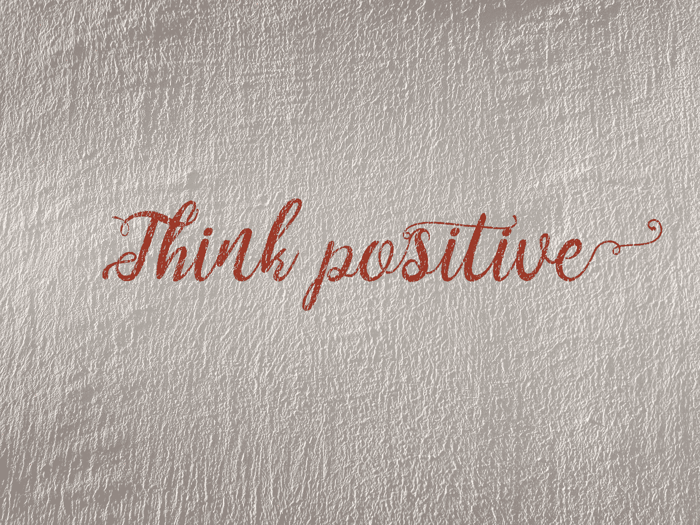

# 2020 年每个数据科学家都应该阅读的 7 本免费电子书

> 原文：<https://towardsdatascience.com/7-free-ebooks-every-data-scientist-should-read-in-2020-32508ad704b7?source=collection_archive---------5----------------------->

## 学习一项新技能不一定要很贵。2020 年你只需要时间和付出就能学会一项新技能。


照片由[库马·库姆](https://unsplash.com/@kumakum?utm_source=medium&utm_medium=referral)在 [Unsplash](https://unsplash.com?utm_source=medium&utm_medium=referral) 上拍摄

T 这里有许多学习数据科学的在线资源。有些免费，有些付费。也有专门研究人工智能的昂贵的大学课程。你应该选择哪一个？

让我告诉你一个秘密。学习一项新技能不一定要很贵。2020 年学一门新技能，只需要时间和付出。

在这篇文章中，我整理了 7 本免费电子书，可以帮助你学习数据科学和机器学习。坚持学习！

**我关于这个话题的其他文章:**

[](/7-free-programming-books-every-data-scientist-should-read-in-2020-608c00d7cf3c) [## 2020 年每个数据科学家都应该阅读的 7 本免费编程书籍

### 这些书将向你展示如何培养许多数据科学家缺乏的技能。都是免费的！

towardsdatascience.com](/7-free-programming-books-every-data-scientist-should-read-in-2020-608c00d7cf3c) [](/top-7-free-artificial-intelligence-courses-from-the-ivy-league-universities-7c951f787a55) [## 常春藤大学的 7 大免费人工智能课程

### 顶级人工智能课程精选列表。向该领域最优秀的人学习——有选择地使用你的时间、精力和…

towardsdatascience.com](/top-7-free-artificial-intelligence-courses-from-the-ivy-league-universities-7c951f787a55) 

> 在 2020 年，你只需要时间和奉献来学习一项新技能

**如果您想投资自己，请查看以下课程:**

```
- [Labeling and Data Engineering for Conversational AI and Analytics](https://www.humanfirst.ai/)- [Data Science for Business Leaders](https://imp.i115008.net/c/2402645/880006/11298) [Course]- [Intro to Machine Learning with PyTorch](https://imp.i115008.net/c/2402645/788201/11298) [Course]- [Become a Growth Product Manager](https://imp.i115008.net/c/2402645/803127/11298) [Course]- [Deep Learning (Adaptive Computation and ML series)](https://amzn.to/3ncTG7D) [Ebook]- [Free skill tests for Data Scientists & Machine Learning Engineers](https://aigents.co/skills)
```

*上面的一些链接是附属链接，如果你通过它们购买，我会赚取佣金。请记住，我链接课程是因为它们的质量，而不是因为我从你的购买中获得的佣金。*

# 1.深度学习

作者:伊恩·古德菲勒、约舒阿·本吉奥和亚伦·库维尔

[深度学习](https://www.deeplearningbook.org/)本书最初于 2016 年发布，是第一批致力于深度学习领域的书籍之一。它是由当时处于发展前沿的杰出研究人员团队编写的，在深度神经网络领域仍然具有很高的影响力和认可度。

这是一部自下而上的、重理论的深度学习专著。这不是一本充满代码和相应评论的书，也不是神经网络的表面水平的手动概述。这是对该领域基于数学的深入解释。


安妮·斯普拉特在 [Unsplash](https://unsplash.com?utm_source=medium&utm_medium=referral) 上的照片

# 2.深入学习

作者:阿斯顿·张，扎克·c·利普顿，，亚历克斯·j·斯莫拉

[深入学习](https://d2l.ai/)是一本交互式深度学习书籍，包含代码、数学和讨论。它提供了 NumPy/MXNet、PyTorch 和 TensorFlow 实现。作者是亚马逊的员工，他们使用亚马逊的 MXNet 库来教授深度学习。这本书会定期更新，所以请务必阅读最新版本。

> [扎卡里·利普顿](https://twitter.com/zacharylipton)说得好:
> 
> 《深入学习》(D2K)的独特之处在于，我们在“边做边学”的理念上走得很远，整本书本身都是由可运行的代码组成的。我们试图将教科书的最佳方面(清晰度和数学)与实践教程的最佳方面(实践技能、参考代码、实现技巧和直觉)结合起来。每一章都通过多种形式、交织的散文、数学和一个独立的实现来教授一个关键思想，可以很容易地抓住和修改它，为您的项目提供一个良好的开端。我们认为这种方法对于教授深度学习是必不可少的，因为深度学习中的许多核心知识都来自实验(而不是第一原则)。


照片由[完美卡普西尼](https://unsplash.com/@perfecto_capucine?utm_source=medium&utm_medium=referral)在 [Unsplash](https://unsplash.com?utm_source=medium&utm_medium=referral) 拍摄

# 3.机器学习向往

作者:吴恩达

这本书是由斯坦福大学教授、在线教育先驱吴恩达写的。他还联合创立了 Coursera 和 deeplearning.ai。

[机器学习向往](https://www.deeplearning.ai/machine-learning-yearning/)本书侧重于教授如何让 ML 算法工作(而不是教授 ML 算法)。它优先考虑人工智能项目最有前途的方向。

这本书是一个有用信息的宝石，将帮助您解决实际问题，如诊断 ML 系统中的错误，如何应用端到端学习，迁移学习和多任务学习等。


照片由[蒂姆·莫斯霍尔德](https://unsplash.com/@timmossholder?utm_source=medium&utm_medium=referral)在 [Unsplash](https://unsplash.com?utm_source=medium&utm_medium=referral) 上拍摄

# 4.可解释的机器学习

副标题:让黑盒模型变得可解释的指南
作者:*克里斯托夫·莫尔纳尔*

这本书使用了“支付你想要的价格策略”,所以从技术上来说它不是免费的。

[可解释机器学习](https://christophm.github.io/interpretable-ml-book/)专注于表格数据(也称为关系或结构化数据)的 ML 模型，较少关注计算机视觉和自然语言处理任务。

这本书推荐给机器学习从业者、数据科学家、统计学家和其他任何对让机器学习模型可解释感兴趣的人。它详细说明了如何为机器学习项目选择和应用最佳解释方法。


由[卢卡斯·本杰明](https://unsplash.com/@aznbokchoy?utm_source=medium&utm_medium=referral)在 [Unsplash](https://unsplash.com?utm_source=medium&utm_medium=referral) 上拍摄的照片

# 5.黑客的贝叶斯方法

作者:卡梅伦·戴维森

[黑客的贝叶斯方法](https://github.com/CamDavidsonPilon/Probabilistic-Programming-and-Bayesian-Methods-for-Hackers)从技术上讲并不是一本机器学习书籍，因为它专注于数据科学的一个重要领域，称为贝叶斯推理。

《黑客的贝叶斯方法》旨在从计算/理解第一，数学第二的角度介绍贝叶斯推理。这是针对爱好者与较少的数学背景或一个谁是不感兴趣的数学，但简单的贝叶斯方法的实践，这篇文章应该是足够的和有趣的。

这本书也是学习 PyMC(Python 中的概率编程语言)的极好资源。


马库斯·斯皮斯克在 [Unsplash](https://unsplash.com?utm_source=medium&utm_medium=referral) 上拍摄的照片

# 6.Python 数据科学手册

作者:杰克·范德普拉斯

[Python 数据科学手册](https://jakevdp.github.io/PythonDataScienceHandbook/)面向初级数据科学家。它展示了如何使用最重要的工具，包括 IPython、NumPy、Pandas、Matplotlib、Scikit-Learn 和许多其他工具。这本书非常适合解决日常问题，例如清理、操作和转换数据，或者构建机器学习模型。



Viktor Forgacs 在 [Unsplash](https://unsplash.com?utm_source=medium&utm_medium=referral) 上拍摄的照片

# 7.**统计学习简介**

副标题:申请中作者:加雷斯·詹姆斯、丹妮拉·威滕、特雷弗·哈斯蒂和罗伯特·蒂布拉尼

[统计学习介绍](http://faculty.marshall.usc.edu/gareth-james/ISL/)提供统计学习方法介绍。它面向非数学科学领域的高水平本科生、硕士生和博士生。这本书还包含一些 R labs，详细解释了如何在现实生活中实施各种方法，应该是数据科学家的宝贵资源。

# 在你走之前

在[推特](https://twitter.com/romanorac)上关注我，在那里我定期[发关于数据科学和机器学习的](https://twitter.com/romanorac/status/1328952374447267843)推特。


照片由[Courtney hedge](https://unsplash.com/@cmhedger?utm_source=medium&utm_medium=referral)在 [Unsplash](https://unsplash.com/?utm_source=medium&utm_medium=referral) 上拍摄