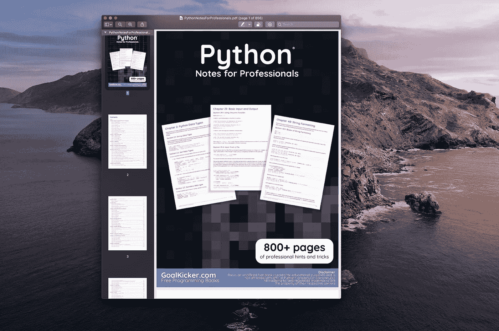

# 2020 年每个数据科学家都应该阅读的 7 本免费编程书籍

> 原文：<https://towardsdatascience.com/7-free-programming-books-every-data-scientist-should-read-in-2020-608c00d7cf3c?source=collection_archive---------19----------------------->

## 这些免费书籍将向你展示如何培养许多数据科学家缺乏的技能


[杨雅筑](https://unsplash.com/@sylviasyang?utm_source=medium&utm_medium=referral)在 [Unsplash](https://unsplash.com?utm_source=medium&utm_medium=referral) 上拍照

两周前，我出版了 7 本免费电子书，每个数据科学家都应该在 2020 年阅读。我得到了惊人的回应！所以很自然的事情就是展开这个话题。

[](/7-free-ebooks-every-data-scientist-should-read-in-2020-32508ad704b7) [## 2020 年每个数据科学家都应该阅读的 7 本免费电子书

### 学习一项新技能不一定要很贵。2020 年你只需要时间和付出就能学会一项新技能。

towardsdatascience.com](/7-free-ebooks-every-data-scientist-should-read-in-2020-32508ad704b7) [](/top-7-free-artificial-intelligence-courses-from-the-ivy-league-universities-7c951f787a55) [## 常春藤大学的 7 大免费人工智能课程

### 顶级人工智能课程精选列表。向该领域最优秀的人学习——有选择地使用你的时间、精力和…

towardsdatascience.com](/top-7-free-artificial-intelligence-courses-from-the-ivy-league-universities-7c951f787a55) 

现实世界的数据科学不仅仅是拟合模型。数据科学家还需要了解最佳编码实践、Bash、Git 和基本 web 框架。本文中的书籍将帮助你发展这些技能。

> 很多读者评论说，“我没时间看”。

编程书不是你必须从头到尾看完的小说。我尝试阅读 10%的技术书籍——通常不是从一开始。我浏览了目录。这样我就了解了这本书的要点。

> 当我在现实世界中面临问题时，我知道去哪里找解决方案。

**如果您想投资自己，请查看以下课程:**

```
- [Labeling and Data Engineering for Conversational AI and Analytics](https://www.humanfirst.ai/)- [Data Science for Business Leaders](https://imp.i115008.net/c/2402645/880006/11298) [Course]- [Intro to Machine Learning with PyTorch](https://imp.i115008.net/c/2402645/788201/11298) [Course]- [Become a Growth Product Manager](https://imp.i115008.net/c/2402645/803127/11298) [Course]- [Deep Learning (Adaptive Computation and ML series)](https://amzn.to/3ncTG7D) [Ebook]- [Free skill tests for Data Scientists & Machine Learning Engineers](https://aigents.co/skills)
```

*上面的一些链接是附属链接，如果你通过它们购买，我会赚取佣金。请记住，我链接课程是因为它们的质量，而不是因为我从你的购买中获得的佣金。*

现在，让我们从 2020 年每个数据科学家都应该阅读的 7 本免费编程书籍开始。

# 面向专业人士的 Python 注释

作者:堆栈溢出的人



阅读[面向专业人士的 Python 笔记](https://goalkicker.com/PythonBook/)

这本 [Python 书籍](https://goalkicker.com/PythonBook/)是我见过的最完整的 Python 指南之一。它是由栈溢出文档编译的，内容是由栈溢出的人编写的。

这本书广泛涵盖了你(很可能)会用到的 Python 的每个领域。我建议你不要从头到尾读一遍，而是把它作为你想进一步了解的某个主题的参考。

如果你不精通 Python，我推荐你深入阅读这本书。这本书有 816 页，提供的信息足以让你精通 Python。

# 您没有使用(但应该使用)的 20 个 Python 库

作者:Caleb Hattingh


Jukan Tateisi 在 [Unsplash](https://unsplash.com?utm_source=medium&utm_medium=referral) 上拍摄的照片

对于精通 Python 的程序员，我推荐阅读 Caleb Hattingh 的 [20 个你不用的 Python 库](https://www.oreilly.com/content/20-python-libraries-you-arent-using-but-should/)。本书篇幅较短，涵盖了标准 Python 库、Python 系统工具、Web APIs 和一些通用库的基本库。

当您需要用 Python 编写多处理脚本或任何其他高级脚本时，这是一本很好的参考书籍。

# 面向对象设计的构建技巧

作者:史蒂文·f·洛特


乔治·帕甘三世在 [Unsplash](https://unsplash.com?utm_source=medium&utm_medium=referral) 上的照片

许多来自静态类型语言(如 Java 或 C)的程序员在很短的时间内就开始使用 Python 了。他们说“我输入的一切都能正常工作”或者“我一边说一边编码”。但是这种方法经常会导致无用的代码。Python 有它自己的怪癖。

另一边是来自数学背景的数据科学家，他们甚至没有听说过面向对象设计模式。

对于以上两组数据科学家，我建议做几个来自[构建面向对象设计技能](https://web.archive.org/web/20190914230227/http://www.itmaybeahack.com/book/oodesign-python-2.1/latex/BuildingSkillsinOODesign.pdf)书的练习。它提供了一系列有趣的、相对复杂的面向对象设计练习。

**作者就“为什么要读这本书？”**

一些软件开发人员在尝试进行面向对象(OO)设计时发现自己停滞不前。作为程序员，他们已经理解了编程语言的语法，并拼凑了一些小例子。然而，要成为一名设计师往往很难迈出下一步。从语言功能的引导学习到自我指导的设计工作的过渡经常被忽视。程序员在没有适当技能或支持的情况下，不得不艰难地完成他们的第一个设计项目。

# 学习熊猫

作者:埃尔南·罗哈斯


[斯坦 Y](https://unsplash.com/@stanyw?utm_source=medium&utm_medium=referral) 在 [Unsplash](https://unsplash.com?utm_source=medium&utm_medium=referral) 上拍照

Pandas 成为 Python 中数据科学的事实上的标准。[学熊猫](https://bitbucket.org/hrojas/learn-pandas)这本书是用 Jupyter 笔记本写的，并附有文字。

它从如何创建数据框架的基本课程开始，以创建 Excel 报表结束。它的目标是那些仍在熟悉熊猫的初级数据科学家。

要了解更多先进的熊猫技巧，我建议你查看我的熊猫系列进行数据分析:

[](https://medium.com/@romanorac/pandas-data-analysis-series-b8cec5b38b22) [## 熊猫数据分析系列

### 从提示和技巧，如何不指南到与大数据分析相关的提示，熊猫文章的精选列表。

medium.com](https://medium.com/@romanorac/pandas-data-analysis-series-b8cec5b38b22) 

# 会话 Git

作者:艾伦·霍恩


照片由 [Unsplash](https://unsplash.com?utm_source=medium&utm_medium=referral) 上的 [Yancy Min](https://unsplash.com/@yancymin?utm_source=medium&utm_medium=referral) 拍摄

许多初级数据科学家不知道最佳编码实践，其中之一就是 Git。我已经在我的 [5 个数据科学家应该学习的技能](/5-skills-data-scientists-should-learn-27d186820d17)文章中写了这个话题。

[](/5-skills-data-scientists-should-learn-27d186820d17) [## 数据科学家应该学习的 5 项技能

### 有哪些数据科学家在网络课程或大学里学不到的？了解这 5 项技能的基础知识会让你…

towardsdatascience.com](/5-skills-data-scientists-should-learn-27d186820d17) 

[Conversational Git](http://blog.anvard.org/conversational-git/) 是一本令人惊叹的书，以一种可理解的方式展示了 Git 中的基本操作。我建议你花一个下午的时间浏览这本书。花一些时间学习 Git 是一项很好的投资，因为它会带来更好的开发实践。

如果你只是需要一个 Git 速成班，查看一下 [Git 指南](http://rogerdudler.github.io/git-guide/)，它以一种有趣的方式介绍了基本的 Git 操作。

# 给专业人士的 Bash 笔记

作者:堆栈溢出的人


由 [Max Duzij](https://unsplash.com/@max_duz?utm_source=medium&utm_medium=referral) 在 [Unsplash](https://unsplash.com?utm_source=medium&utm_medium=referral) 上拍摄的照片

与 Git 一样，如果您打算长期留在软件开发领域，学习 Bash 也是一项不错的时间投资。Git 和 Bash 会一直在这里！

[Bash Notes for Professionals](https://books.goalkicker.com/BashBook/)是一本关于 Bash 的综合书籍。它涵盖了您需要了解的关于 Bash 的所有内容。

阅读和学习 Bash 可能会很乏味，所以请将这本书作为参考。随着时间的推移，你会做得更好的。

对于不熟悉 Bash 的初级软件开发人员，我建议花些时间通读这本书并学习 Bash 基础知识。有一点是肯定的——你迟早会遇到巴什。

# 探索烧瓶

作者:罗伯特·皮卡德


[的照片](https://unsplash.com/@halacious?utm_source=medium&utm_medium=referral)在[的 Unsplash](https://unsplash.com?utm_source=medium&utm_medium=referral) 上

让一个机器学习模型在 Jupyter 笔记本上进行预测是很酷的！你知道什么更酷吗？拥有一个模型在云中进行预测的 Web 应用程序！

Explore Flask 是一本关于用 Flask 开发 web 应用程序的最佳实践和模式的书。普通的烧瓶应用程序有很多部分。这本书试图展示如何用 Flask 做事情的“正确方法”。

您想了解如何使用 Flask 在云中部署机器学习模型吗？那你应该查一下我的课程:

[](https://medium.com/@romanorac/hands-on-data-science-course-e764853f516b) [## 你在云中的第一个机器学习模型

### 一步一步的指导，将告诉你如何训练一个机器学习模型，建立一个网络应用程序，并部署到…

medium.com](https://medium.com/@romanorac/hands-on-data-science-course-e764853f516b) 

# 在你走之前

在 [Twitter](https://twitter.com/romanorac) 上关注我，在那里我定期[发布关于数据科学和机器学习的](https://twitter.com/romanorac/status/1328952374447267843)消息。


照片由[Courtney hedge](https://unsplash.com/@cmhedger?utm_source=medium&utm_medium=referral)在 [Unsplash](https://unsplash.com/?utm_source=medium&utm_medium=referral) 上拍摄