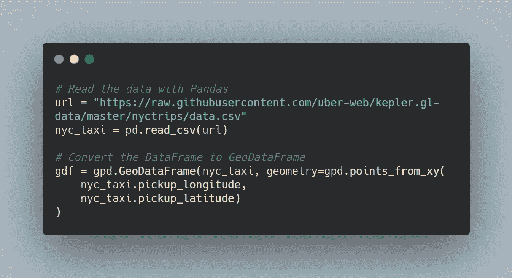
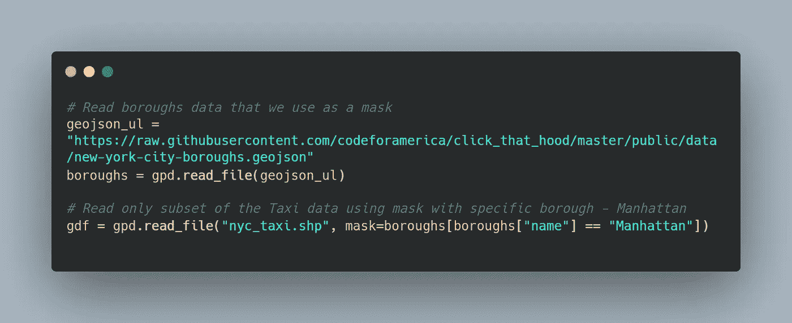
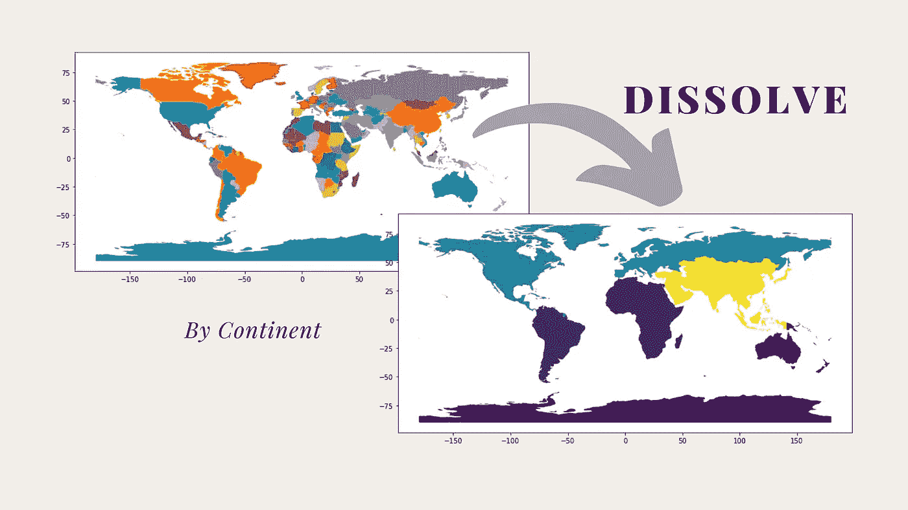
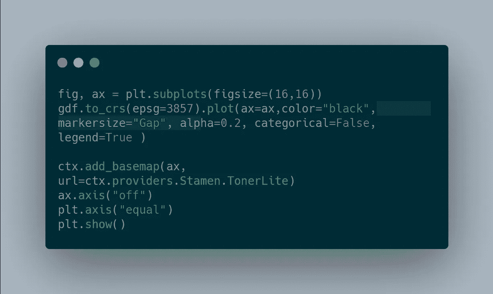
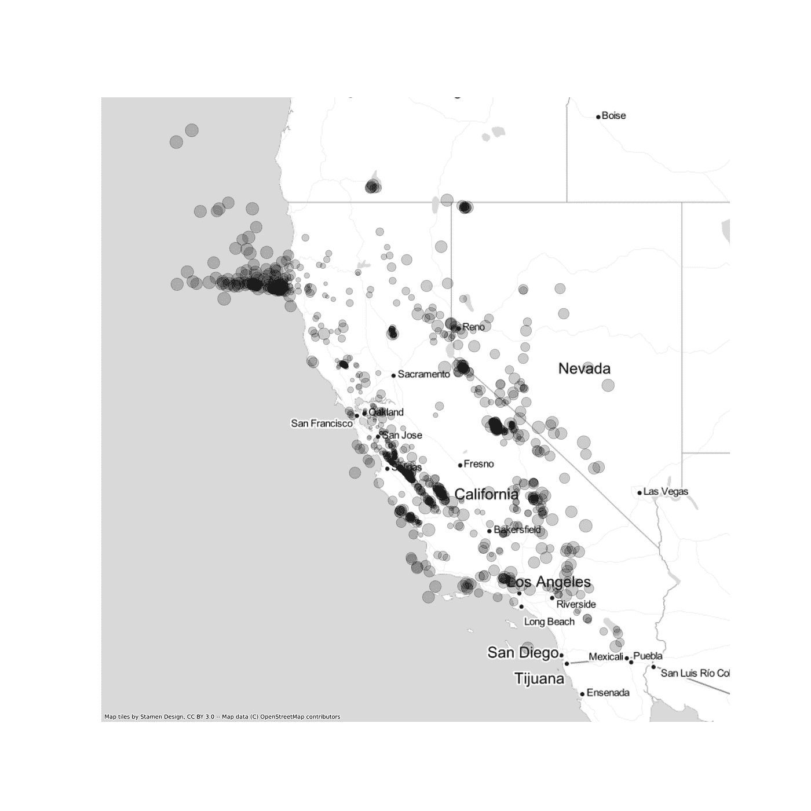
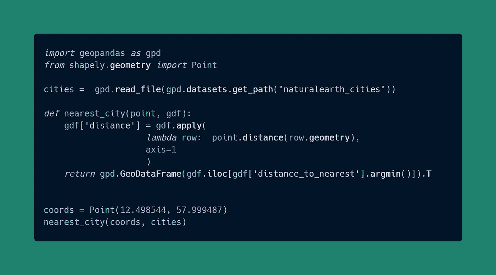
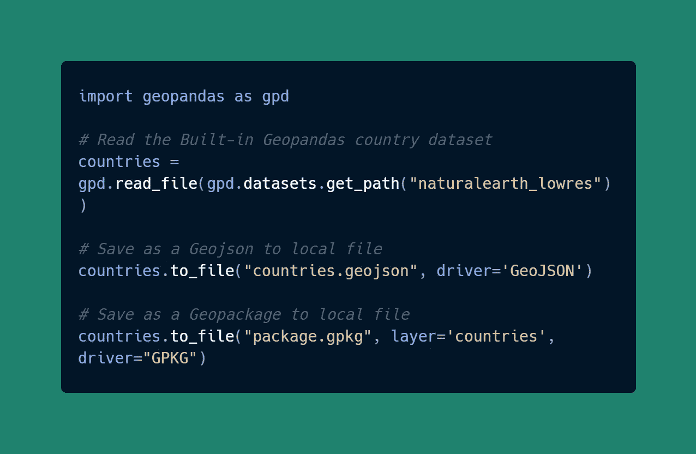
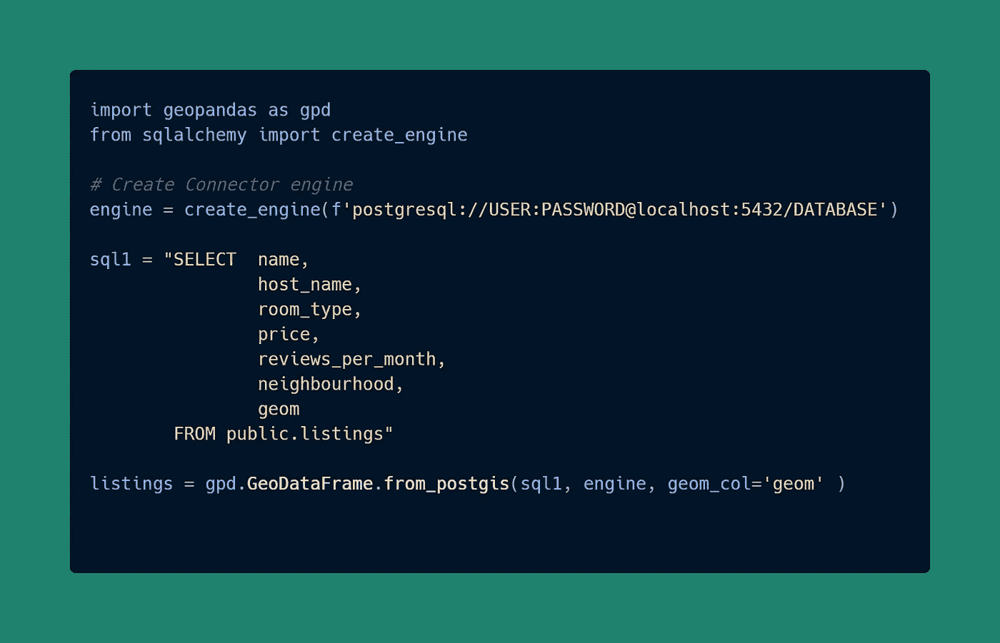

# Python 中的 7 个地理空间数据处理技巧

> 原文：<https://towardsdatascience.com/7-geospatial-data-processing-tips-in-python-dac5e4d28439?source=collection_archive---------24----------------------->

## 第 2 部分:如何使用 Geopandas 在 Python 中轻松有效地集成空间要素

Lucas Ludwig 在 [Unsplash](https://unsplash.com?utm_source=medium&utm_medium=referral) 上拍摄的照片

我喜欢使用 Geopandas，在过去的两个月里，我分享了一些使用 Geopandas 处理地理空间数据的最佳技巧和诀窍。本文是该系列的第二部分，在这里我将分享另外七个技巧和诀窍，让您在用 Python 处理地理空间数据时更加轻松。

Geopandas 技巧的第一部分涵盖了五个专业技巧，您可以通过下面的链接阅读这篇文章。

 [## Python 中的 5 个地理空间提示和技巧

### 第 1 部分:如何使用 Geopandas 在 Python 中轻松有效地集成空间要素。

towardsdatascience.com](/5-geospatial-tips-and-tricks-in-python-eef86aec5110) 

以下是我们在本文中包含的技巧列表。

*   [CSV 转地理数据框架](#f280)
*   [几何过滤器](#48a0)
*   [溶解](#4b76)
*   [创建气泡图](#d402)
*   [查找最近距离](#dc62)
*   [至 Geojson/Geopackage](#fb9d)
*   [从 PostGIS 中读取](#ab8f)

## 提示 1-CSV 转地理数据框架

很多数据集都是 CSV 格式的，而且很多数据集都有坐标(纬度和经度)。将这些数据集转换为地理数据框架可以在 Geopandas 中实现大量地理空间处理功能。

要将 CSV 转换为地理数据框架，我们首先读取包含 Pandas 的 CSV 文件，如以下代码片段所示。然后，我们可以使用 Geopandas 中的 points_from_xy 函数将数据框转换为地理数据框。

使用 Geopandas 将数据框转换为地理数据框— *作者提供的图片*

将数据框转换为地理坐标框架后，我们现在可以执行几何操作，包括绘制地理空间数据、计算距离等等。

## 技巧 2 —几何过滤器

有了 pandas，我们可以使用行或列来过滤数据。使用地理数据框架，除了熊猫过滤之外，您还可以通过其几何来过滤数据。以下示例显示了读取著名的出租车数据。该数据集是一个相对较大的文件，因此我们可以避免使用几何过滤器读取整个数据集，因为我们只读取曼哈顿边界内的点。

通过几何图形过滤数据—作者的*图像*

mask 参数采用一个几何图形，因此我们在这里提供一个行政区名称，Geopandas 将在读取数据集时排除所有其他行政区。

## 技巧 3 —溶解

通常，我们有不同的多边形来处理地理边界，包括其他邮政编码、社区、地区等..如何合并这些子单元而不丢失原始数据集中的统计数据？

对于非地理数据，我们只需要使用`groupby`函数。但是，对于空间数据，我们还需要聚合几何要素。在这种情况下，我们可以使用溶解。以下示例显示了将国家边界分解为洲

消失的边界——作者的*图片*

下面的可视化显示了使用上述代码将国家边界(左上)分解为洲边界(右下)。

溶解示例(国家边界到大陆)——*作者图片*

请注意，要使用聚合溶解，您需要有一个列。此外，您可以进行不同的统计计算。在本例中，我们展示了如何计算总和。

## 技巧 4——创建气泡图

当您拥有点数据集并希望按大小显示数量时，气泡图是 choropleth 图的绝佳替代方案。在 Geopandas 中创建气泡图并不难，但我相信如何创建一个气泡图并不明显。

要创建气泡图，只需将标记大小参数设置为任何数量列，如下面的代码片段所示。

使用 Geopandas 创建气泡图— *作者图片*

此外，你需要照顾重叠的点圆；因此，我在这里将 alpha 设置为一个较低的值以保持透明。您可以看到输出可视化。

气泡图— *作者图片*

## 技巧 5——找到最近的距离

距离和查找附近的内容是空间分析的重要组成部分。在这篇技巧中，我将向您展示如何有效地计算距离并找出最近的点。

让我们说:我们有城市。nearest_city 函数采用一个点(纬度和经度)和城市地理数据框，并返回距离所提供坐标最近的城市。

最近邻计算— *作者图片*

你也可以拥有你的数据。它不一定是城市本身。但是对于任何点数据集，您现在都可以使用此函数计算最近的邻域。

## 提示# 6-至 Geojson/Geopackage

谁不喜欢 shapefiles！除了 shapefiles，我们还可以将地理处理后的数据导出为其他格式以在本地存储。在本例中，我展示了如何在本地将地理数据框存储为 GeoJSON 和 Geopackages。

将地理空间数据存储为 Geojson/Geopackage。— *作者图片*

对于 GeoJSON，您需要将驱动程序指定为 GeoJSON。保存为地理包格式，我们需要设置图层名称和驱动程序为 GPKG。

## 技巧 7——阅读 PostGIS

成为超级用户并设置您的 PostGIS 数据库。通过 Geopandas，您可以使用 SQL 读取数据。该代码片段展示了一个使用 Geopandas 和 Sqlalchemy 从 PostgreSQL 数据库读取数据的示例。

连接到 PostgreSQL/PostGIS 数据库— *作者的图片*

SQL 语法可以包装成字符串，Geopandas 将执行它。这种方法是通过空间数据库访问数据的好方法。您可以从本文开始安装和使用 PostgreSQL:

 [## 使用 PostgreSQL/PostGIS 的空间数据科学

### PostgreSQL 和 Python 空间数据入门实用指南。

towardsdatascience.com](/spatial-data-science-with-postgresql-postgis-2f941c8c367a) 

## 结论

我希望您喜欢这一轮 Python 中的地理空间数据处理技巧。在本文中，我们看到了有效使用 Geopandas 进行地理空间数据分析的七个技巧。

其中一些技巧是直接的几何操作，对于处理地理空间数据至关重要:将数据框架转换为地理数据框架、几何过滤和融合。作为一名地理空间数据科学家，繁重的几何功能是救命的。

其他技巧涉及地理空间数据可视化、空间数据库连接、查找最近邻和地理空间矢量数据格式输出。

如果你喜欢我在推特上发布的这些提示和技巧，你可以在 [@spatialML](https://twitter.com/SpatialML) 找到它们