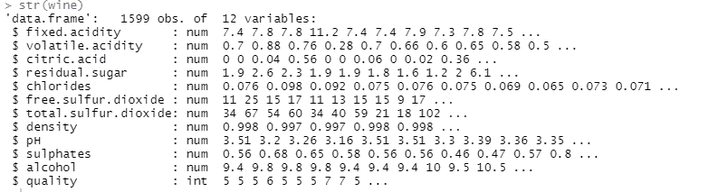
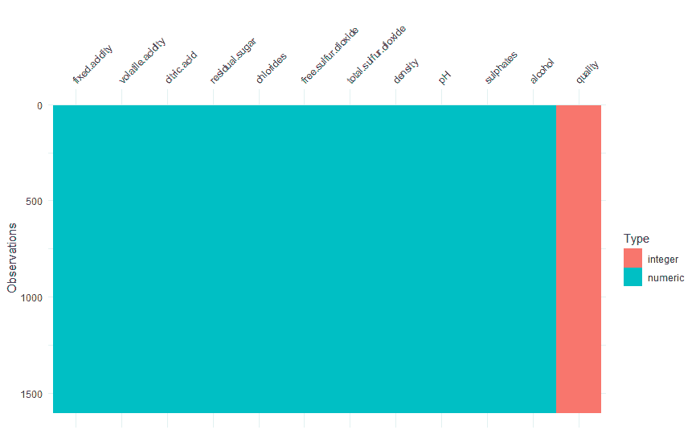
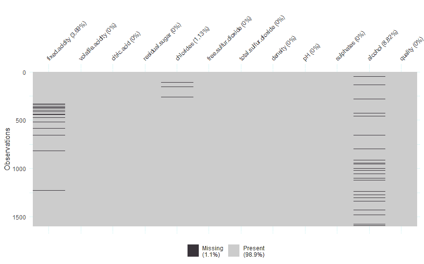
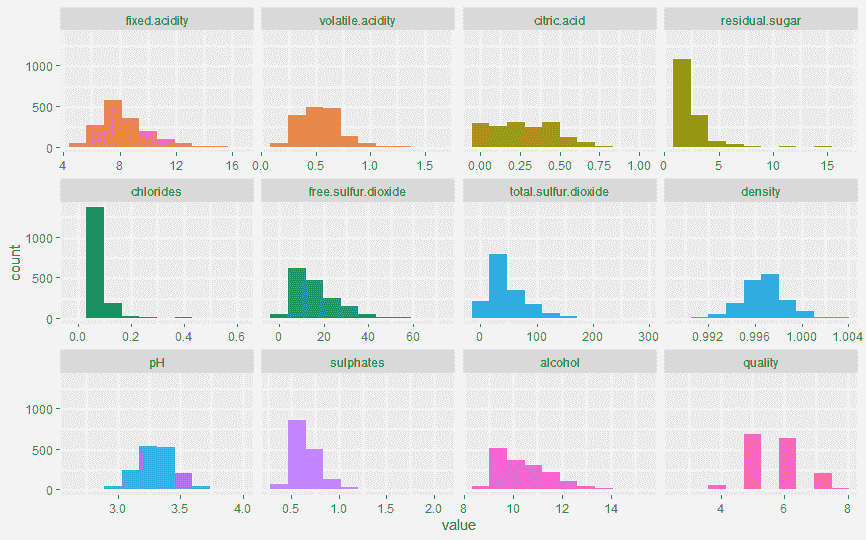
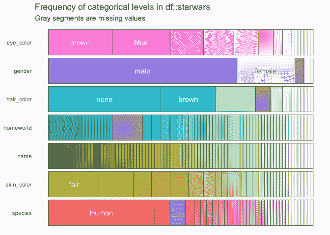
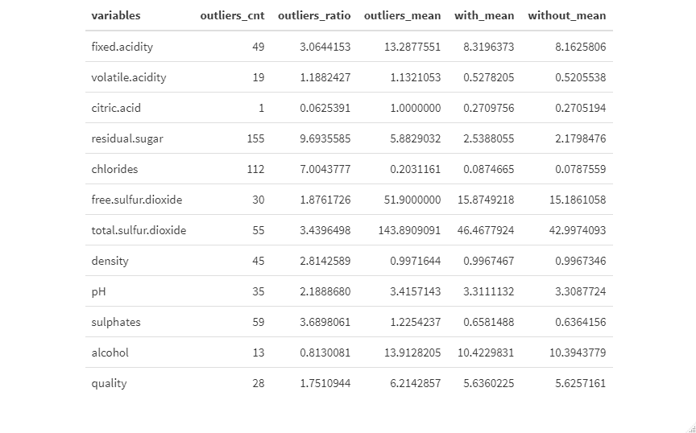
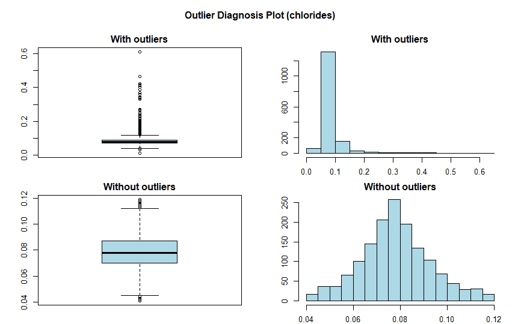
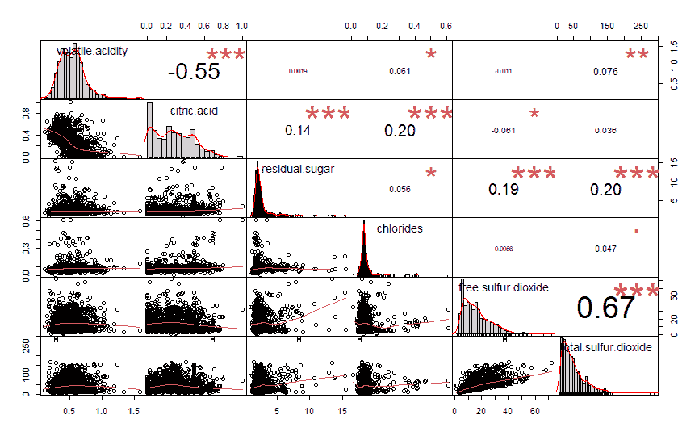
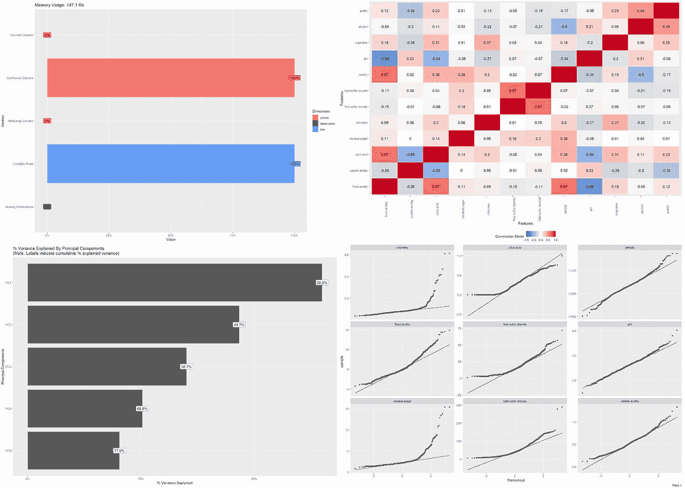

# R 语言中探索性分析的 7 大功能

> 原文：<https://towardsdatascience.com/7-great-functions-for-your-exploratory-analysis-in-r-a569de3db3a?source=collection_archive---------20----------------------->

## 这些功能将把您的探索性分析提升到下一个层次


在 [Unsplash](https://unsplash.com?utm_source=medium&utm_medium=referral) 上由 [Carlos Muza](https://unsplash.com/@kmuza?utm_source=medium&utm_medium=referral) 拍摄的照片

数据挖掘框架的 EDA(探索性数据分析)阶段是从数据集中提取信息的主要活动之一。无论你的最终目标是什么:神经网络、统计分析或机器学习，一切都应该从对你正在处理的数据的良好理解和概述开始。

EDA 的一个主要特征是，它是一个有点开放的过程，依赖于工具箱和数据科学家的创造力。不幸的是，这既是福也是祸，因为做得不好的 EDA 可能会隐藏数据中的相关关系，甚至损害研究的有效性。

EDA 中通常执行的一些活动(这绝不是一个详尽的列表):

*   数值变量分析:平均值，最小值和最大值，数据分布。
*   类别变量分析:类别列表，每个类别中记录的频率。
*   异常值的诊断以及它们如何影响每个变量的数据分布。
*   预测变量之间的相关性分析。
*   预测变量与结果变量之间的关系。

谈到 EDA，没有什么神奇的公式，但在分析数据时，一定要记住一些软件包和函数，以保持分析中敏捷性和灵活性的完美平衡。

# 数据集

研究或实践数据科学的人都非常熟悉本文中使用的数据集。在这里可以找到[和](https://archive.ics.uci.edu/ml/datasets/wine+quality)，它包含了 2008 年在葡萄牙推出的葡萄酒信息。它包含 1599 个观察值，葡萄牙红葡萄酒的 11 个心理化学属性和 1 个目标变量，数字离散质量指数从 0 到 10。



1599 obs 数据集的展望。x 12 变量(图片由作者提供)

# 软件包和功能

R 编程语言是数据爱好者中最广泛使用的编程语言之一。经过广泛的研究，我编制了一个列表，其中列出了对数据执行 ed a 时应该知道的一些最佳函数，重点是那些允许进行更直观分析的函数，以及表格和图形。

# 数据集概述

visdat 包有两个有趣的函数，可以快速、实用地查看数据集。 *vis_dat* 函数以一种非常容易理解的方式显示变量、观察值的数量以及每个变量的类型。

```
 visdat::vis_dat(wine,sort_type = FALSE) 
```



vis_dat 用于可视化变量的类型(图片由作者提供)

来自同一个包的 *vis_miss* 函数允许您查看每个变量缺失值的数量，从而给出数据集完整性的概述。



vis_miss 用于查看丢失的值(图片由作者提供)

注意:所讨论的数据集没有任何带有缺失值的变量，因此一些缺失值是为了更好地可视化而“人工”生成的。

# 可视化数字变量

名为 *funModeling* 的软件包提供了强大的功能来绘制关于数据集的有用信息，从关于变量的基本信息到更具体的信息，如每个变量提供的信息增益，以及预测变量和结果变量之间的关系。

要记住的函数之一是 *plot_num* 函数，它绘制每个数值变量的直方图。在其他包中有几个类似的函数，甚至有直接通过 ggplot2 完成相同任务的方法，但是 plot_num 函数大大简化了任务。



plot_num 用于绘制数值变量的分布(图片由作者提供)

这样，你就可以在一个图中得到所有的东西——当然，这取决于变量的数量——一个数字多样性的概述。

# 可视化分类变量

与数值变量一样，对数据集的分类变量有一个总体的了解是很重要的。包 *inspectdf* 的 *inspect_cat* 函数允许您一次绘制所有分类变量的摘要，显示每个变量中最常见的类别。



inspect_cat 用于查看分类变量中最常见的类别(图片由作者提供)

注意:本文中使用的数据集没有任何分类变量，因此该图像是说明性的，它取自此处的。

# 异常值识别和处理

*dlookr* 包是一个具有非常有趣的分析、数据处理和报告功能的包，它为 R 语言的 EDA 带来了一些最佳解决方案。这个软件包的一个亮点是关于数值变量中异常值的信息。

首先， *diagnose_outlier* 函数生成一个数据框，其中包含每个变量的信息:离群值计数、离群值 x 总观察值比率，以及包含和不包含离群值的平均值。

```
dlookr::diagnose_outlier(wine)
```



用于查看异常值信息的 diagnose_outlier(图片由作者提供)

同一个包还提供了 *plot_outlier* 函数，该函数显示了包含和不包含上述异常值的值分布中所有变量的图形。

```
dlookr::plot_outlier(wine)
```



plot_oulier 查看有无异常值时变量的外观(图片由作者提供)

从氯化物变量中可以看出，当应用统计模型时，几个高值肯定会影响结果，尤其是当一些模型假设数据呈正态分布时。

注:重要的是要记住，异常值不应该总是被删除，因为在这种情况下，它们可能表明葡萄酒的一个特定子类别，特别是由于这个变量中异常值的高度集中(值的 7%)。

# 相关可视化

有许多软件包都具有生成数据集中变量之间的相关图的功能，但很少像*图表那样提供几个因素的完整可视化。 *PerformanceAnalytics* 包的关联*功能。

```
chart.Correlation(wine[,2:7], histogram = TRUE, pch = 15)
```



图表。查看变量之间交互的相关性(图片由作者提供)

它呈现:

*   数据集中数值变量之间的数值相关性(皮尔逊系数),较大的源表示较大的相关性
*   每对变量之间的微型散点图
*   每个变量的直方图和密度图

注意:该函数只接受只有数字变量的数据框作为输入，因此如果数据集包含分类预测变量，则应事先执行此处理。这种处理的一个建议是使用 keep 方法(在 dplyr 包中提供):

```
wine %>%
    keep(is.numeric)
```

这样，数据集中只保留数值变量。

# 自动报告

有些软件包还具有自动生成数据集 EDA 报告的功能。当前可用的报告选项在所呈现的分析的范围和维度方面有所不同，但都显示数据集变量的某种摘要、关于缺失值的信息、每个变量的直方图和条形图等。

我测试过的最好的函数可能是 *DataExplorer* 包的 *create_report* 函数。对于更标准的分析(已经相当全面了)，它允许您只使用一行代码生成报告:

```
DataExplorer::create_report(wine)
```



DataExplorer 包中的 create_report 函数示例，用于创建完整的 EDA 报告(图片由作者提供)

幸运的是，这个函数远远不止于此，因为它可以定制报告的各个方面，从更改布局和主题到调整特定的参数或准确选择哪些图形应该包含在报告中。

注意:请务必记住，对于数据分析和可视化来说，没有一个解决方案可以涵盖所有基础，而且自动报告生成功能也不应该如此对待。

# TLDR

*   您是否需要数据集的**高级概述**？visdat::vis_dat(概述)和 visdat::vis_miss(缺少值)。
*   你需要关于**数字变量**的信息吗？funModeling::plot_num。
*   那么**分类变量**呢？inspectdf::inspect_cat。
*   **变量之间的相关性**？performance analytics::chart . correlation。
*   一个**自动化和可配置的报告**怎么样？包 DataExplorer::create_report。

你呢？在探索性分析中，有没有一个不可错过的功能来自动化或帮助可视化您的数据？请在评论区告诉我！😁

# 来源和致谢

我们首先要感谢负责创建和维护这些令人难以置信的包的开发人员——这些包都可以在 R 的官方资源库中找到，也可以在我的研究中参考以下来源:

[](https://alastairrushworth.github.io/Exploring-categorical-data-with-inspectdf/) [## 使用 Inspectdf 探索分类数据

### inspectdf 是什么，有什么用？我经常发现自己在整个过程中查看和检查数据帧…

alastairrushworth.github.io](https://alastairrushworth.github.io/Exploring-categorical-data-with-inspectdf/) [](https://www.littlemissdata.com/blog/inspectdf) [## 第 2 部分:使用 inspectdf 的 R 中的简单 EDA 少量缺失数据

### 我喜欢这个包，因为它有很多功能，而且非常简单易用。简而言之，它…

www.littlemissdata.com](https://www.littlemissdata.com/blog/inspectdf) [](https://www.groundai.com/project/the-landscape-of-r-packages-for-automated-exploratory-data-analysis/1) [## 自动化探索性数据分析的 R 包前景

### 具有大量异构变量的大型但有噪声的数据集的可用性不断增加，导致…

www.groundai.com](https://www.groundai.com/project/the-landscape-of-r-packages-for-automated-exploratory-data-analysis/1)