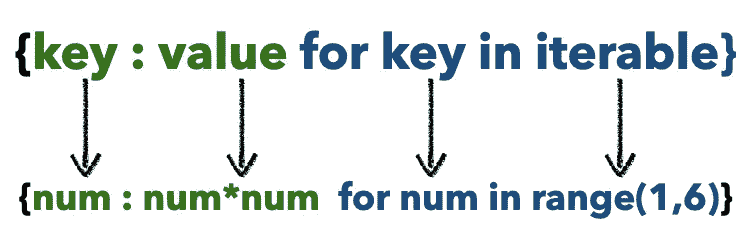

# Python 中字典理解的 7 个便利用例

> 原文：<https://towardsdatascience.com/7-handy-use-cases-of-dictionary-comprehensions-in-python-f7c37e462d92?source=collection_archive---------18----------------------->

## PYTHONIC 式的编码方法

## 展平、反转、合并、过滤等等


照片由 [Unsplash](https://unsplash.com?utm_source=medium&utm_medium=referral) 上的 [Larm Rmah](https://unsplash.com/@larm?utm_source=medium&utm_medium=referral) 拍摄

Python 中的理解是用于从其他序列构建序列的语法结构。本质上，理解是一种更简洁、更易读的编写循环的奇特形式。

所有的理解都可以使用`for`循环重写，但反之则不成立。总的来说，Python 中有四种理解技术。

*   列出理解
*   词典释义
*   集合理解
*   生成器理解

这篇文章的目的是向你展示字典理解的力量，以及如何以不同的方式利用它。在我们探索一些有趣的案例之前，让我们先了解一下语法，因为它可能会让许多开发人员在开始时感到困惑。

# 词典理解的句法

考虑下面的代码，该代码从一系列数字中创建一个字典，其值是键的平方:

```
square_dict = {num: num*num for num in range(1, 6)}
print(square_dict)
#Output
{1: 1, 2: 4, 3: 9, 4: 16, 5: 25}
```

现在让我们使用上面的代码作为参考来分析字典表达式的语法:



上面的语法代表了编写字典理解的最小形式。词典理解的输出以绿色突出显示。所有的键值对都被分配给构造的字典。

iterable 不一定是字典。它可以是任何可以循环的 python 对象——列表、元组、字符串等。

与列表理解不同，字典理解也可以同时迭代一组键和值。通过调用字典上的`items()`方法，您可以将它转换成一个键值元组列表进行循环。

还可以在字典理解中的`for`循环后设置一个条件语句，如下所示:

```
fruits = ['Apple', 'Orange', 'Papaya', 'Banana', '']fruits_dict = {f:len(f) for f in fruits if len(f) > 0}print(fruits_dict)
#Output
{'Apple': 5, 'Orange': 6, 'Papaya': 6, 'Banana': 6}
```

既然我们已经很好地了解了字典理解的语法，让我们来看看它的应用。

# 1.字频率

通常情况下，您需要构建一个字典来保存字符串中每个单词的计数。使用 for 循环实现这一点的经典方法是:

```
s = 'I felt happy because I saw the others were happy and because I knew I should feel happy'dict = {}
for token in s.split(" "):
    dict[token] = dict.get(token, 0) + 1
```

但是我们可以使用字典理解使它明显更短，如下所示:

```
frequency_dict = {token: s.split().count(token) for token in set(s.split())}#Output
{'felt': 1, 'and': 1, 'should': 1, 'others': 1, 'saw': 1, 'were': 1, 'knew': 1, 'happy': 3, 'feel': 1, 'the': 1, 'because': 2, 'I': 4}
```

# 2.修改字典的键和值

对于大型字典，可能会出现这样的情况，您需要在所有的字典后面追加一个字符。例如，它可以是一个简单的`$`符号。

在另一种情况下，您可能需要从键或值字符串中删除一个字符。以下是如何使用字典理解功能通过修改键和值来创建新字典的示例:

```
d = {'My_Article1': '1', 'My_Article2' : '2'}my_dict = { k[3:] : '$' + v for k, v in d.items()}#Output
{'Article1': '$1', 'Article2': '$2'}
```

# 3.按一组关键字过滤词典

您可能只对字典中具有特定键集的部分感兴趣。下面是一个基于键列表过滤和创建新字典的示例:

```
d = {1: 'a', 2: 'b', 3: 'c', 4: 'd'}
keys = [1, 2]my_dict = {key: d[key] for key in keys}
#Output
{1: 'a', 2: 'b'}
```

但是当列表`keys`包含一个字典中没有的无关值时，上面的代码会抛出一个错误。因此，我们不迭代`keys`，而是使用`sets`来寻找`d`和`keys`中的公共键，如下所示:

```
my_dict = {key: d[key] for key in set(keys).intersection(d.keys())}
```

下面是第三种情况，我们通过包含指定字符串的关键字来过滤字典:

```
d = {'num_1': 'a', '2': 'b', 'num_3': 'c', '4': 'd'}filter_string = 'num'
filtered_dict = {k:v for (k,v) in d.items() if filter_string in k}
#Output
{'num_1': 'a', 'num_3': 'c'}
```

# 4.反转字典的映射

如果您的字典有唯一的键和值，并且想要反转从`k:v`到`v:k`的映射，您可以通过以下方式使用`for`循环来实现:

```
d = {'1': 'a', '2': 'b', '3': 'c', '4': 'd'}my_dict = {}
for k,v in d.items():
    my_dict[v] = k
```

通过使用字典理解，我们可以在一行中做同样的事情:

```
my_dict = {v: k for k, v in d.items()}
#Output
{'a': '1', 'b': '2', 'c': '3', 'd': '4'}
```

# 5.元组和稀疏向量到字典

接下来，我们有一个元组列表，其中每个元素包含国家代码和名称。我们将使用理解技术创建一个字典，以国家名称作为关键字，以国家代码作为值:

```
tuples = [("US", '+1'), ("Australia", '+61'), ("India", '+91')]
my_dict = {k[0]: k[1] for k in tuples}
```

稀疏向量一般包含很多零值。我们可以考虑在字典中只保存非零值，这样可以节省一些空间。通过使用下面的字典理解技术，我们可以将稀疏向量转换成键值对，其中`key`是稀疏向量的索引:

```
values = [0,0,21,0,0,0,100]
my_dict = { values.index(v) : v for v in values if v}
#Output
{2: 21, 6: 100}
```

还有另一种方式来编写上面的字典理解，可读性稍微好一点:

```
my_dict = {n: v for n,v in enumerate(values) if v}
```

`if v`表示仅当稀疏向量的元素不是 False、0、None 等时，才将键和值添加到字典中。

# 6.整理字典

对字典进行分类有不同的方法。我们可以用键或值，按升序或降序来做。让我们来看看。

下面是一个按关键字升序和降序排序的示例:

```
d = {"a": 3, "b": 4, "d": 1, "c": 2}
dk_ascending = {k: d[k] for k in sorted(d)}
#Output
{'a': 3, 'b': 4, 'c': 2, 'd': 1}dk_descending = {k: d[k] for k in sorted(d, reverse=True)}
#Output
{'d': 1, 'c': 2, 'b': 4, 'a': 3}
```

以下示例显示了如何按升序和降序对值进行排序:

```
d = {"a": 3, "b": 4, "d": 1, "c": 2}
dv_ascending = {k: d[k] for k in sorted(d, key=d.get)}
#Output
{'d': 1, 'c': 2, 'a': 3, 'b': 4}dv_descending = {k: d[k] for k in sorted(d, key=d.get, reverse=True)}
#Output
{'b': 4, 'a': 3, 'c': 2, 'd': 1}
```

# 7.将字典列表展平为单个字典

假设 Python 列表中有未知数量的字典，如下所示:

```
l = [{'a':1}, {'b':2}, {'c':3, 'd' : 4}]
```

现在，我们想把这个列表展平成一个字典，这样所有的子字典合并成一个字典。我们可以使用下面的双重嵌套字典理解技术:

```
my_dict = {k: v 
for d in l 
for k, v in d.items()
}#Output
{'a': 1, 'b': 2, 'c': 3, 'd': 4}
```

# 结论

我们看到了在 Python 中应用字典理解的许多不同的用例。这个想法是有效地使用它，不要过度使用。很容易误用它来进行相当简单的操作。

这一篇就到此为止——感谢阅读。