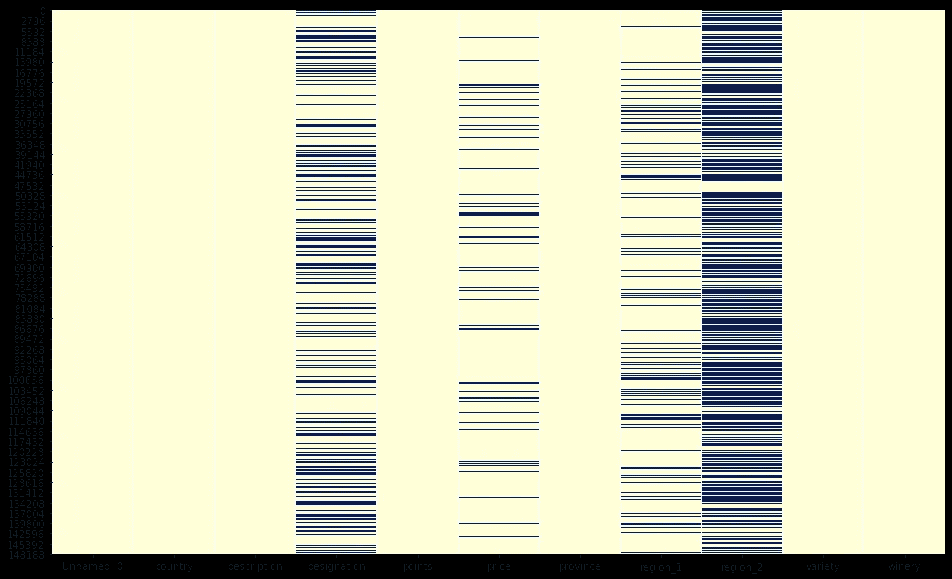

# 每个数据科学家都应该知道的获取缺失值的 7 个习惯用法

> 原文：<https://towardsdatascience.com/7-idioms-to-acquire-missing-values-every-data-scientist-should-know-2edf4224360c?source=collection_archive---------24----------------------->

## 数据科学提示

## 你应该把命令自动化


卢多维克·沙雷特在 [Unsplash](https://unsplash.com?utm_source=medium&utm_medium=referral) 上的照片

M 缺失数据肯定会在数据集分析过程中产生问题。即使是确定丢失值的事实，更不用说它们的数量和分布，也可能消耗大量的时间。这就是为什么您可能应该保留一些有用的命令，以提高自动化和分析速度，并保持代码整洁和准确。

我们将使用 Kaggle 的免费[葡萄酒评论数据集](https://www.kaggle.com/zynicide/wine-reviews)来展示这些命令的影响。

# 1.DataFrame.describe()(但不完全是)

在这里你可以想到可能和 **describe()** 方法一样司空见惯的东西。尽管该方法处理了关于整个数据集的大量信息(但没有一个字是关于丢失的数据的)。实际上，我们不会使用这个命令的所有潜力，而是可以应用一个简单的技巧来提取我们需要的数据。只需查看输出的 count 列:

```
wine_data.**describe**(include='all').loc['count']
```

我们检索所有列的非缺失值的数量:

```
Unnamed: 0     150930
country        150925
description    150930
designation    105195
points         150930
price          137235
province       150925
region_1       125870
region_2        60953
variety        150930
winery         150930
Name: count, dtype: object
```

它不是我们需要的确切信息，因为它期望我们知道数据集的大小来计算数据缺口的数量。但是，我们可以很容易地将输出转换成现值的百分比，这相当有用:

```
wine_data.**describe**(include='all').loc['count'] / wine_data.shape[0] * 100
```

**describe()** 方法的过滤能力(包含/排除参数)为我们提供了必要的灵活性。

# 2.Series.value_counts()(但不完全是)

通常这是一个非常有用的命令，有很多输出。但是，我们将再次应用一个小技巧。这是我们可以用来检索单个列中缺失值的数量的习语。不再多言:

```
wine_data['country'].**value_counts**(dropna=**False**).loc[np.nan]Out[1]: 5
```

# 3.DataFrame.count()

对于那些不需要 describe()方法及其过滤能力的人来说，pandas 已经内置了 count()方法:

```
wine_data.**count**()Out[1]:
Unnamed: 0     150930
country        150925
description    150930
designation    105195
points         150930
price          137235
province       150925
region_1       125870
region_2        60953
variety        150930
winery         150930
dtype: int64
```

对于单列:

```
wine_data.**count**()['country']Out[1]: 150925
```

很简单，有点无聊。

# 4.isnull()。总和()习语

非常常见和非常有用的习语检索缺失数据的数量。看起来正是我们从一开始就想要的命令:

```
wine_data.**isnull**().sum()Out[1]:
Unnamed: 0         0
country            5
description        0
designation    45735
points             0
price          13695
province           5
region_1       25060
region_2       89977
variety            0
winery             0
dtype: int64
```

页（page 的缩写）对于紧凑代码爱好者来说， **isna()** 别名是存在的:

```
wine_data.**isna**().sum()
```

# 5.isnull()。sum()。sum()(深入)

有时我们不需要数据缺口的数量，而是需要它们存在的事实(例如，对于自动化管道)。我们会发现下一个习语很有用:

```
wine_data.**isnull**().sum().sum()Out[1]: 174477
```

但是它返回一个数字，我们可能想把它转换成布尔值。所以，还有一个习语返回布尔值:

```
wine_data.**isnull**().values.**any**()Out[15]: True
```

简短回答的简短代码。

# 6.NaNs 热图

但是，如果需要更多关于数据集中缺失值分布的信息，该怎么办呢？我们应该有意识地画出差距的热图！

```
**import** **seaborn** **as** **sns**
**import** **matplotlib.pyplot** **as** **plt**plt.figure(figsize=(16,10))
sns.heatmap(wine_data.isnull(), cbar=**False**, cmap="YlGnBu")
```



seaborn 的热图。黑线显示数据差距。

看一下分布就可以为分析提供很多信息。

# 7.缺失值的索引

之前的所有脚本都没有回答我们数据缺口在哪里。当然，我们可以使用数据帧过滤器来隔离丢失的数据或简单地丢弃它。但是在少量缺失数据的情况下(还记得“国家”栏的 5 个缺口吗？)我们可能希望现在它完全没有重新索引的问题。因此，多一个内置的熊猫方法将帮助我们:

```
wine_data['country'].isnull().**to_numpy**().**nonzero**()Out[18]:
(array([  1133,   1440,  68226, 113016, 135696], dtype=int64),)
```

这样，一个索引数组就准备好了。

这种简短紧凑的命令可以在数据集调查过程中节省一些时间。对我来说，我总是在不同的组合中使用它们，用更少的代码获得更多有价值的信息。你可以在我的 GitHub 上找到整个工作笔记本:

[](https://github.com/Midvel/medium_jupyter_notes/blob/master/missing_data_idioms/missing-data-tips.ipynb) [## 中级/中等 _jupyter_notes

### 此时您不能执行该操作。您已使用另一个标签页或窗口登录。您已在另一个选项卡中注销，或者…

github.com](https://github.com/Midvel/medium_jupyter_notes/blob/master/missing_data_idioms/missing-data-tips.ipynb) 

在您的数据科学项目中，您使用了哪些单行惯用语？