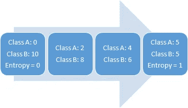

# 7 个机器学习算法的 7 个要点

> 原文：<https://towardsdatascience.com/7-key-points-on-7-machine-learning-algorithms-945ebda7a79?source=collection_archive---------43----------------------->

## 引擎盖下到底发生了什么？

在 [Unsplash](https://unsplash.com/s/photos/seven?utm_source=unsplash&utm_medium=referral&utm_content=creditCopyText) 上由 [Waldemar Brandt](https://unsplash.com/@waldemarbrandt67w?utm_source=unsplash&utm_medium=referral&utm_content=creditCopyText) 拍照

感谢各种库和框架，我们可以只用一行代码实现机器学习算法。有些则更进一步，让你立刻实现和比较多种算法。

易用性也有一些缺点。我们可能会忽略这些算法背后的关键概念或思想，而这些概念或思想对于全面理解它们是必不可少的。

在这篇文章中，我将提到 7 个机器学习算法的 7 个关键点。我想指出的是，这不会是对算法的完整解释，所以如果你对它们有一个基本的了解就更好了。

我们开始吧。

# **1-支持向量机(SVM)**

点:C 参数

SVM 创建了一个**决策边界**来区分两个或更多的类。

软利润 SVM 试图通过以下目标来解决优化问题:

*   增加决策边界到类别(或支持向量)的距离
*   最大化训练集中正确分类的点数

这两个目标之间显然有所取舍。决策边界可能必须非常接近某个特定类，才能正确标注所有数据点。然而，在这种情况下，新观测值的准确性可能会较低，因为决策边界对噪声和独立变量的微小变化过于敏感。

另一方面，决策边界可能被放置在尽可能远的每个类，代价是一些错误分类的异常。这种权衡由 **c 参数控制。**

**C 参数**为每个错误分类的数据点增加一个惩罚。如果 c 很小，则对误分类点的惩罚也很低，因此以更大数量的误分类为代价选择了具有大余量的决策边界。

如果 c 很大，SVM 试图最小化由于高惩罚导致的错误分类的例子的数量，这导致了具有较小裕度的决策边界。对于所有错误分类的例子，惩罚是不一样的。它与到决策边界的距离成正比。

# **2-决策树**

要点:信息增益

当选择要分割的特征时，决策树算法试图实现

*   更多的预测
*   杂质少
*   低熵

**熵**是不确定性或随机性的度量。一个变量的随机性越大，熵就越大。均匀分布的变量具有最高的熵。例如，掷一个公平的骰子有 6 个概率相等的可能结果，所以它有均匀的分布和高熵。

熵 vs 随机性

选择导致更纯节点的分裂。所有这些都表明“信息增益”，这基本上是分裂前后熵的差异。

# **3-随机森林**

要点:引导和特征随机性

随机森林是许多决策树的集合。随机森林的成功高度依赖于使用不相关的决策树。如果我们使用相同或非常相似的树，总体结果与单个决策树的结果不会有太大不同。随机森林通过**自举**和**特征随机性**实现不相关的决策树。

Bootstrapping 是通过替换从训练数据中随机选择样本。它们被称为 bootstrap 样本。

通过为随机森林中的每个决策树随机选择特征来实现特征随机性。随机森林中每棵树使用的特征数量可通过 **max_features** 参数控制。

特征随机性

# **4-梯度提升决策树**

要点:学习率和 n _ 估计量

GBDT 是决策树与 boosting 方法相结合的集合，这意味着决策树是顺序连接的。

**学习率**和 **n_estimators** 是梯度推进决策树的两个关键超参数。

学习率就是模型学习的速度。较慢学习速率的优点是模型变得更加健壮和通用。然而，学习是要慢慢付出代价的。训练模型需要更多的时间，这就引出了另一个重要的超参数。

**n_estimator** 参数是模型中使用的树的数量。如果学习率低，我们需要更多的树来训练模型。然而，我们需要非常小心地选择树的数量。使用太多的树会产生过度适应的高风险。

# **5-朴素贝叶斯分类器**

点:天真有什么好处？

朴素贝叶斯是一种用于分类的监督机器学习算法，因此任务是在给定特征值的情况下找到观察值的类别。朴素贝叶斯分类器计算给定一组特征值(即 p(yi | x1，x2，…，xn))的类的概率。

朴素贝叶斯假设特征是相互独立的，特征之间没有相关性。然而，现实生活中并非如此。这种特征不相关的天真假设是这种算法被称为“天真”的原因。

所有特征都是独立的假设使得**与复杂的算法相比**非常快。在某些情况下，速度优先于更高的精度。

它可以很好地处理文本分类、垃圾邮件检测等高维数据。

# **6-K-最近邻**

要点:何时使用和不使用

k-最近邻(kNN)是一种受监督的机器学习算法，可用于解决分类和回归任务。kNN 的主要原理是一个数据点的值是由其周围的数据点决定的。

随着数据点数量的增加，kNN 算法变得非常慢，因为模型需要存储所有数据点，以便计算它们之间的距离。正是这个原因也使得算法的内存效率不高。

另一个缺点是 kNN 对异常值很敏感，因为异常值对最近的点有影响(即使它太远)。

积极的一面是:

*   简单易懂
*   不做任何假设，因此可以在非线性任务中实现。
*   适用于多个类别的分类
*   处理分类和回归任务

# **7-K-均值聚类**

要点:何时使用和不使用

k-均值聚类旨在将数据划分为 k 个聚类，使得同一聚类中的数据点相似，而不同聚类中的数据点相距较远。

K-means 算法无法猜测数据中存在多少个聚类。集群的数量必须预先确定，这可能是一项具有挑战性的任务。

随着样本数量的增加，算法会变慢，因为在每一步，它都要访问所有数据点并计算距离。

K-means 只能画线性边界。如果数据中存在非线性结构来分隔组，k-means 将不是一个好的选择。

积极的一面是:

*   容易理解
*   相对较快
*   可扩展用于大型数据集
*   能够以一种聪明的方式选择初始质心的位置，从而加速收敛
*   保证收敛

我们已经介绍了每个算法的一些关键概念。给出的要点和注释绝对不是算法的全部解释。然而，在实现这些算法时，了解它们对于做出改变是非常重要的。

感谢您的阅读。如果您有任何反馈，请告诉我。