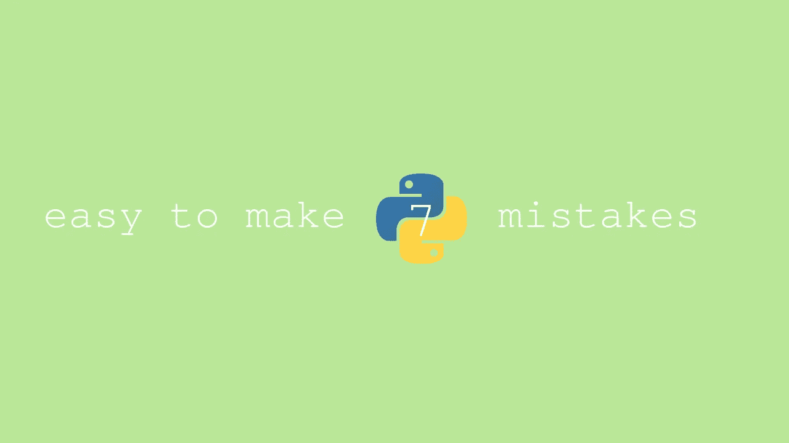
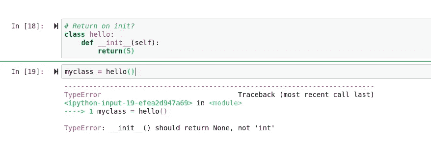
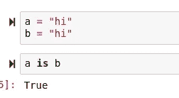
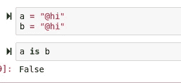

# 现在修复 7 个现代 Python 错误！

> 原文：<https://towardsdatascience.com/7-modern-python-mistakes-to-fix-now-6ff6f1dedbf3?source=collection_archive---------14----------------------->

## Python 中常见的 7 个不该犯的错误。



> [笔记本](https://github.com/emmettgb/Emmetts-DS-NoteBooks/tree/master/Python3)

# 介绍

Python 是一种相对容易掌握的语言，但是由于很多事情都是假设的，所以很容易出错。此外，这些错误可能会在很长一段时间内被忽视。提前给我的另外四头*菜鸟巨蟒失误*。

[](/avoid-these-rookie-python-mistakes-9cc17cccd051) [## 避免这些 Python 新手的错误

### 他们可能会工作，但他们可以工作得更好。

towardsdatascience.com](/avoid-these-rookie-python-mistakes-9cc17cccd051) 

今天我将分享更多在 Python 3.8 中容易犯的错误。

# №1: +=

在很多情况下，我肯定会犯的一个错误是使用了+=操作数。假设加法必须用两个独立的操作数来完成似乎太容易了，一个用于加法，另一个用于断言。幸运的是，Python(以及许多其他编程语言)支持可以同时执行数学和断言运算的操作数。

> 而不是:

```
x = x + 5
```

> 做:

```
x += 5
```

# №2:位置变元表示

在大多数现代脚本语言中，有两种主要类型的参数可以用作函数的参数:

> 位置和
> 
> 关键词。

在 Python 3.8 发布之前，没有办法表示位置参数，使得位置参数缺省基本上不可能。然而，由于 Python 3.8 中的更新，我们可以使用\将所有以前的参数表示为位置参数。您应该使用它们，因为位置参数是高性能 Python 代码的基础。如果在 Python 中有什么东西是你的代码需要补偿的，特别是在机器学习的时候，那可能就是性能。

关键字参数在函数定义时计算一次。这对递归算法的性能尤其有害。如果你喜欢写成本函数，使用位置参数是绝对必要的。这并不是说根本不应该使用它们，但是尽可能使用位置参数绝对是一个更好的主意。

> 而不是:

```
def numbers(custom, five=5,ten=10,fifteen=15):
    total = five + ten + fifteen + custom
    return(total)
```

> 做:

```
def numbers(custom,\,five=5,ten=10,fifteen=15):
    total = five + ten + fifteen + custom
    return(total)
```

同样重要的是要记住，这个特性是相当新的，所以为了提高性能而使用仅位置参数的概念将仅限于 Python 3.8+版本

# №3:初始化时返回

虽然这种方法并不常见，而且可能是一个相当大的新手动作，但我见过有人尝试在初始化函数中执行 returns。在 Python 面向对象的世界中，每次实例化一个类时都会调用 __init__ 函数。init 函数对于设置变量、移动数据和构造类型非常有价值。然而，随着强大的能力而来的是巨大的责任，Python 的 __init__ 函数应该用于类初始化，而不是监视、循环、定向，只是类初始化。并且拜托(我有经历过有人这么做！)

> 初始化时不要返回！

(没有任何意义！)



# №4:循环依赖

当用完成相似目标的不同部分编写一个大的 Python 包时，通常你的包会互相依赖。这可能会产生很大的问题，并导致所谓的“循环依赖”发生这种情况时，当模块中的不同位置试图相互访问时，就会遇到问题。

# №5:空格还是缩进？

众所周知，Python 使用缩进而不是分隔符来将代码包含在其他代码中。对许多人来说，这使得代码更容易阅读和编写，尽管我个人主观上很鄙视它。然而，在其他语言中，我通常倾向于用缩进(tab 键)来缩进代码。)然而，根据 PEP8，你应该使用四个空格来缩进。老实说，这是我和很多人一起做项目时唯一遵循的原则。对我来说，只要保持一致，我不认为空格或缩进有什么关系——但正式来说，你应该使用空格。也就是说，在为一项工作或需要许多其他用户观察的大型团队项目编写代码时，遵循 PEP8 的标准可能是一个好主意。

# №6:块迭代

当执行迭代 for 循环时，当您编写完整长度的 for 循环时，在代码中表达您的想法会容易得多。然而，一般来说，如果您需要执行的操作只需要一行，那么最好是循环一行。这不仅会使您的代码更加漂亮和简洁，而且还会带来相关的性能提升。

> 而不是:

```
for i in x:
    i += 5
```

> 做:

```
[i + 5 for i in x]
```

# №7:内部字符串

对于要考虑的最后一个错误，我想谈谈互联网字符串。在某些情况下，Python 会尝试重用不可变的对象，字符串实习就是这种情况的一个例子。所有长度为 1 的字符串都被保留。除 ASCII 字符、数字和下划线之外的任何字符串都不会被保留。



这里我试图创建两个不同的对象，a 和 b，但是这不是 Python 所做的。Python 实际上把 b 变成了指向 a 的指针，而不是产生一个新的字符串。但是如果我们添加一个 ASCII 字符:



所以在使用不可变字符串的时候要记住这一点，因为它确实给我带来了很多麻烦。