# 7 个月的关系，WhatsApp 消息分析

> 原文：<https://towardsdatascience.com/7-months-of-a-relationship-whatsapp-messages-analyzed-e5c34b8aaa63?source=collection_archive---------19----------------------->

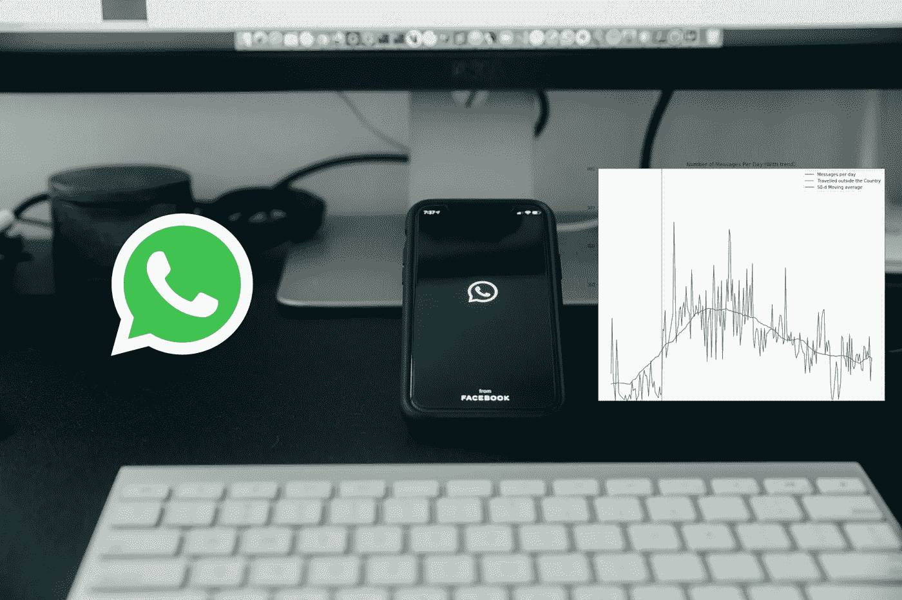

[莫兰](https://unsplash.com/@ymoran?utm_source=unsplash&utm_medium=referral&utm_content=creditCopyText)在 [Unsplash](https://unsplash.com/s/photos/whatsapp?utm_source=unsplash&utm_medium=referral&utm_content=creditCopyText) 上的照片

他们说，交往是关键。没有交流，任何关系都是生不如死。在这个时代，就通信而言，技术占据了中心舞台。在这篇文章中，我们将分析我和我未婚夫之间的 WhatsApp 消息，最终你可以在 WhatsApp 数据上应用这些知识。我们将在这个分析中使用 Python，并具体处理:Pandas 表、数据可视化、数据清理等等。

在我们开始之前，我想提一下，我们已经有一年半的关系了，可用的聊天时间是从 2019 年 12 月 18 日到 2020 年 8 月 10 日(236 天或 7 个月 23 天)。在这期间，我离开了我的祖国，离开了她的家乡。我们是土生土长的肯尼亚人，但我目前在南非。

现在让我们继续分析数据。我希望我们一步一步来，这样你就清楚了。

# 步骤 1:获取 WhatsApp 数据

WhatsApp 允许用户将整个聊天记录下载到一个文本文件中。要做到这一点，请打开您有兴趣获取数据的对话。在**右上角点击 3 个点>更多>导出聊天>无媒体**。之后，将下载一个文本文件，它将包含从开始到结束的转换中的所有消息。为了清楚起见，我把我的保存为`whatsapp.txt`。

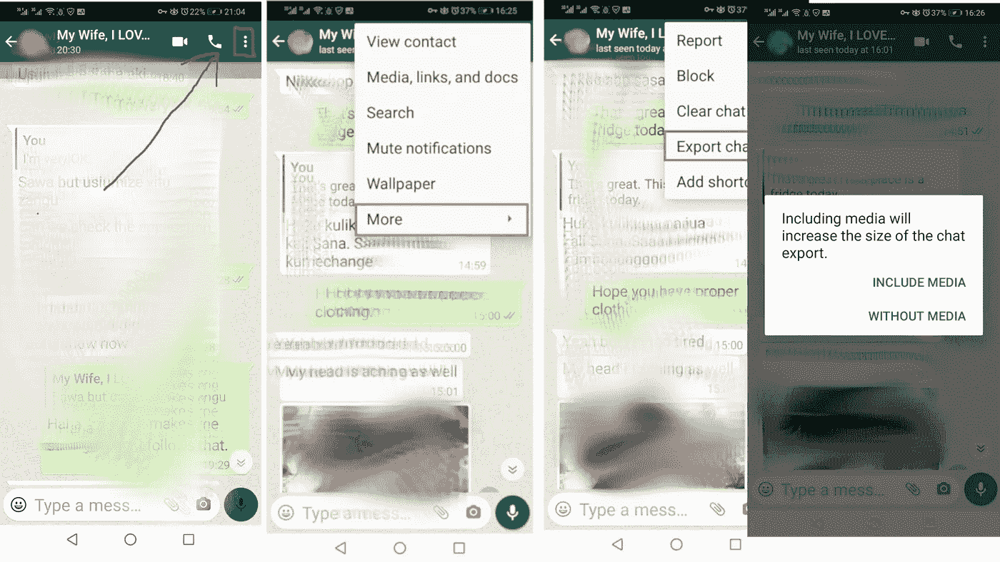

图 1:获取转换数据的过程。(来源:作者)

# 第二步:查看数据

打开文件`whatsapp.txt`时，你会看到这样一个文件

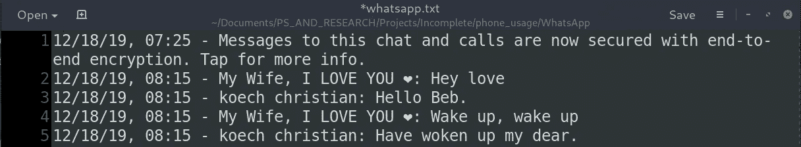

图 whatsapp.txt 文件的前 5 行(来源:作者)

*   **第 1 行:**这是 WhatsApp 的一条消息，确保消息是端到端加密的。这是一个特例，我们将在分析中跳过它。
*   **第 2 行到第 5 行:**通常，每一行代表发件人的一条消息。它将包含**日期、时间、发送者**以及**消息**。

**注**:有两个寄件人(我和我未婚夫)。我把我未婚夫的名字保存为**我的妻子，我爱你❤** ，我的 WhatsApp 用户名是 **koech christian** 。

# 步骤 3:处理数据并将其保存到 CSV 中

对于每一行，我们需要提取消息发送的日期和时间、发送者和消息本身。

*   **第 2 行:**这是一个空列表，用来保存我们的数据。
*   **第 3 行和第 4 行**:这里，我们以读取模式(r)读取我们的文件，并且一次遍历每一行。
*   为了理解**第 6–8 行**，让我们以其中一行为例:

```
**line** = 12/18/19, 08:15 - koech christian: Have woken up my dear.In 6, we will **strip** the **line** of trailing white spaces and **split** the **line** by the hyphen (-)Result: 
12/18/19, 08:15 **#send_time**
koech christian: Have woken up my dear. **#message_section**Note: **send_time** still has both the date and the time while **message_section** has the sender and the message.Code line 7: We will split the content of **message_section** by the first occurrence of a full colon (:) hence **maxsplit = 1**. If we don't do this split function may split at the middle of the message in case a sender uses a full colon.You now know what 8 does.
```

*   **第 9 行到第 15 行**:我们将感兴趣的值传递到一个字典中，然后将其追加到数据中。
*   **第 19 行和第 20 行**:将数据写入名为`messages.csv`的 CSV 文件。
*   由**行 1** 引发的异常将由`try...except...`处理

# 步骤 4:查看 CSV 文件

让我们加载我们在步骤 3 中保存的 CSV 文件(`messages.csv`)，看看几行是什么样子的。

输出:

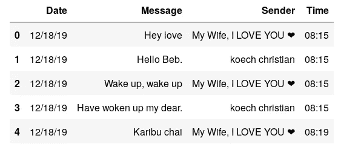

接下来的事情是分析数据，但在此之前，我只是想做出我的猜测，可能是我的预期。第一，我知道这很傻，但我给我的句子加标点符号，她不 LoL！。她睡得很早，甚至没有说晚安，所以我打赌我会在任何一天结束谈话。她也比我醒得早，我想她会开始大部分的“早上好”信息。

当我们回到肯尼亚时，她很少在 WhatsApp 上和我聊天。这意味着我去南非之前(2020 年 2 月 2 日之前)的信息数量肯定会比我在这里时我们互相发送的信息少。

# **第五步:数据分析**

在数据分析中，我们将使用 Pandas 库进行描述性统计，并使用 Matplotlib 中的 Pyplot 模块来可视化我们的分析结果。

让我们开始吧！

# **活动天数**

在我们有数据的 236 天中，有多少天我们实际上交换了 WhatsApp 信息？

输出:

```
Active days:  222
First Day: 2019-12-18
Last Day:  2020-08-10
Difference of Dates:  236
```

让我们再来看看代码实际上在做什么

*   **第 1 行**:将日期字符串转换成 Python 日期时间对象。
*   **第 3 行和第 4 行**:通过简单地计算**日期**列中唯一值的数量来确定活动天数。
*   **第 6 行到第 10 行**:获取聊天历史的第一天和最后一天。对话中包含的消息是从 2019 年 12 月 18 日到 2020 年 8 月 8 日。
*   **第 12–15 行**:获取 6–10 中确定的第一个和最后一个日期之间的差值。

从这里可以看到我们在 WhatsApp **上聊过 236 天的 222 天** (94%的时间)。事实上，造成差异的 14 天是选择存在的。我们使用了另一种交流方式(当我回到肯尼亚的时候)。我在南非的时候，我们有 100%活跃的日子。我们马上就会发现。

# 谁的消息最多？

我想我是留言最多的人，但差别不会很大。让我看看。

输出:

```
Total Messages:  34491
My Wife, I LOVE YOU ❤   18030
koech christian         16461
```

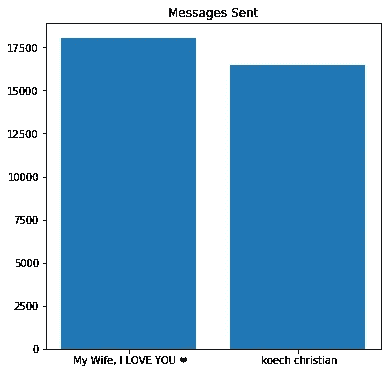

哎呀！总共 34491 条信息，其中大部分是她写的。她得听听这个。

# 第一条和最后一条消息(一天的开始和结束)

正如我所说的，我很确定这一点:她通常会开始这一天，而我通常会结束这一天。那位女士总是在说晚安之前就睡觉，而且总是在早上道歉。

**早晚信息(第 1-7 行)**

*   **第 2 行**:在这一行中，我们按照**日期**和**时间**对数据帧进行排序，这样我们就可以将第一天的消息放在当天聊天的顶部。我们还删除了重复的消息，这样我们就可以在每天的数据帧中保留最早的消息。最后，我们统计每个**发送者**的早期消息。
*   第 3 行:输出(早间消息)

```
My Wife, I LOVE YOU ❤    157
koech christian           63
```

*   第 11 行:输出(当天的最后一条消息)

```
koech christian          156
My Wife, I LOVE YOU ❤     64
```

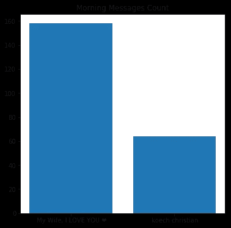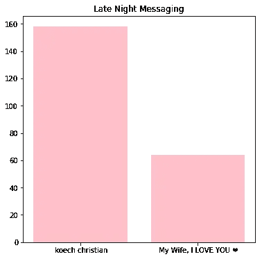

惊人的发现！的确，大多数日子里她写第一条信息，而大多数晚上我写最后一条信息。更令人惊讶的是它们的对称程度。这就好像我们在平等地进行“晨跑”和“夜跑”。

自从我们开始这段关系到现在，我一直不明白为什么她总是不说晚安就睡觉。开始的时候我很不舒服，但是我最终接受了那个层次的她。

# 一段时间内每天的邮件数量

嗯，对于这一个，我知道期待什么，但我不知道理想的关系应该是怎样的。当关系变得稳固时，发信息的速度是否会下降，或者下降意味着一段失败的关系？我不知道，但对我来说，我认为有一些因素在起作用。首先，我一直致力于减少我的手机瘾。这可能是下降趋势的一个原因。

我也希望当我在家(肯尼亚)的时候会有很少的消息，而在这里(南非)会有更多的消息，因为 WhatsApp 现在是主要的沟通渠道。

让我看看。

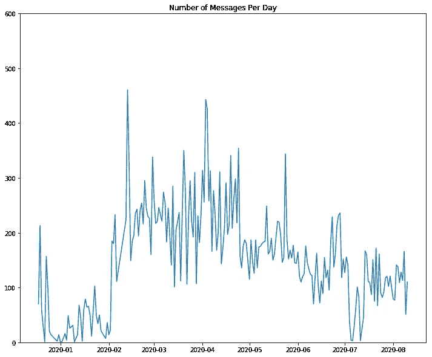

看来我的预测是对的。自从我旅行以来，每天的信息数量有所增加，但持续下降。为了真正理解这一点，让我们在上面的图上画一条趋势线，也画一条我出国旅行那天的垂直线。

# **趋势平滑**

有很多方法可以形成平滑的趋势线。这些方法包括重采样和滚动窗口。

**重采样**

将**时间序列数据重新采样到更低或更高的频率通常是有用的。重新采样到较低的频率(**下采样**)通常涉及一个聚合操作——例如，从每日计数中计算每月邮件总数。**

重新采样到更高的频率(**上采样**)不太常见，通常涉及插值或其他数据填充方法，例如，将每日数据插值到每小时间隔中，以输入到模型中。

Pandas `resample()`方法，该方法将数据索引分成时间仓，并按时间仓对数据进行分组。`resample()`方法返回一个重采样器对象，类似于熊猫`group-by()`函数。聚合方法如`mean()`、`median()`、`sum()`等。，然后可以应用于每个时间仓的数据组。

**滚动车窗**

**滚动窗口**操作是时间序列数据的另一个重要转换。类似于下采样，滚动窗口将数据分成时间窗口和，并且每个窗口中的数据用诸如`mean()`、`median()`、`sum()`等函数聚集。但是，与时间窗不重叠且输出频率低于输入频率的下采样不同，滚动窗口重叠并以与数据相同的频率“滚动”,因此转换后的时间序列与原始时间序列具有相同的频率。

对于我们的数据，我们将使用滚动窗口来拟合趋势线

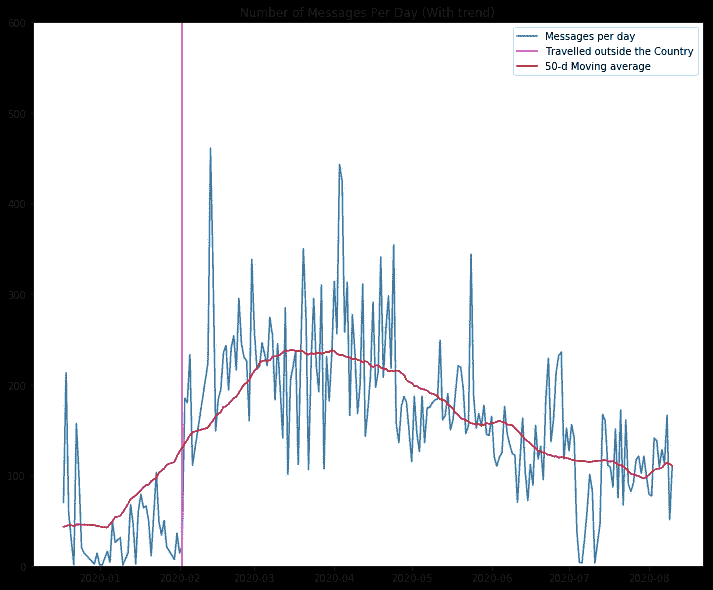

从上图中，我们可以看到趋势线(窗口大小为 50 天)实际上与我们的预测相匹配。在我旅行之前(洋红色垂直线的左边)，我们使用 WhatsApp 的频率比旅行之后(右手边)要少。同样清楚的是，每天的消息数量正在随着时间的推移而下降。

# **一天中最大和最小的消息数量**

最大:一天 461 条消息。日期:2020 年 2 月 13 日

最小:每天 1 条消息。日期:2019 年 12 月 22 日，2020 年 1 月 1 日及其他

# 实际单词和句子的分析

如果我们了解我们每个人使用的常用单词/表情符号，那将会非常有趣。在本节中，我们正是这样做的。

**每位发送者的总字数**

在本节中，我们将统计每个发件人的所有消息的所有单词(注意，我们跳过了一些填充词，如下面的**行 10 和 16** 所示的`a`、`and`、&、`the`

输出:

```
Number of words(Myself): 105612
Number of words(mylove): 113716
```

又来了！她赢了！。

让我们看一下上面的代码片段，这样你就能理解它是做什么的了。

*   第 6 行和第 12 行的 If…else…语句用于调节**发送器上的过滤器。**
*   第 8 行和第 14 行在理论上做同样的事情。让我们看一个例子。

```
message = "Okay. Bye for now 💕💕💕💕"word_list = message.strip().lower().translate(str.maketrans('', '', string.punctuation)).split(" ")print(word_list)**Result:** ['okay', 'bye', 'for', 'now', '💕💕💕💕']
```

在这部分代码中，我们**剥离**尾部空格的消息，将单词改为**小写**，将标点符号的消息**剥离**(注意句号被剥离)，最后**通过空格分割**消息，这样我们就有了一个单词列表。

**最常见的单词有哪些？随着时间的推移，有哪些独特的词语被使用？**

`collections`库中的模块让我们的事情变得简单。在第 4 行和第 5 行，我们计算字数。结果是单词计数元组对的列表，例如，

```
**text** = "dog is a pet, hen is a bird"
**result** = Counter(text.split()).most_common()
**print(result)**
**[('is', 2), ('a', 2), ('dog', 1), ('pet,', 1), ('hen', 1), ('bird', 1)]**
```

从这里开始，可以通过简单地获得结果列表的长度来确定唯一单词的数量(**第 7–9 行**)。

第 7–9 行的输出:

```
Unique words used:
Unique words She used:  8783
Unique words I used:  7281
```

她又赢了。我不知道这是不是衡量智力的好方法，但我相信她是更聪明的一个。难怪！

接下来，我们想得到最常用的单词

注意，我们已经在两个变量`most_common_me`和`most_common_her`中有了最常见的单词。在下面的代码片段中，我们将只选择前 10 个。

一旦我们有了最常用单词的列表和计数，我们现在就可以把它们放在一个熊猫的数据框架上，还可以制作一些柱状图来直观显示这些单词，如下所示

**结果:**

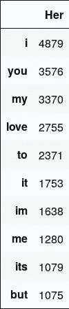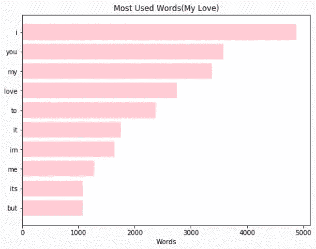

她最常用的词

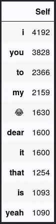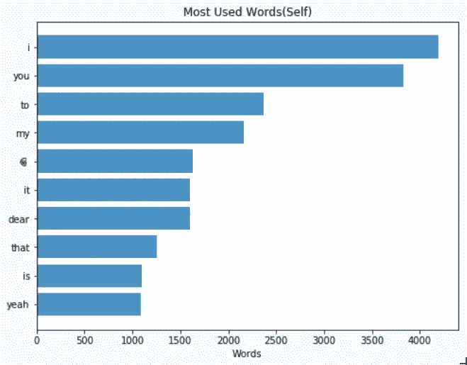

我常用的词

说实话，数据不会说谎。从她的统计数据来看，我对`I, you, my`和`love`名列榜首并不感到惊讶。她经常使用它们，当她写下像“*我爱你，我的爱人*”这样的信息时，我总是不会感到惊讶，哈哈！。另一方面，我最了解的就是如何笑。难怪😂位居前十。但是相信我，我不会用很多表情符号，我可能只知道两个表情符号:😂和🙈。

事实上，让我们继续分析表情符号的用法。

# **表情符号爱情**

表情符号主要用于表达情感，只是一种增加交流乐趣的方式。让我们深入分析一下

*   **Line 1–4**:我们正在使用`emoji`包，借助`extract_emojis`函数从句子中提取表情符号，例如，

```
extract_emojis("K😂ip 😆rono🤣   El😂ij😁 😆ah")result: '😂😆🤣😂😁😆'
```

*   **第 6–24 行**:遍历所有消息，并将所有表情提取到发送者列表中。

输出:

```
Most Common emojis used (Me)
('😂', 1652)
('🙈', 270)
('😍', 85)
('😘', 52)
('😋', 45)
Most Common emojis used (Her)
('😂', 1577)
('♀', 132)
('🤦', 120)
('😘', 81)
('❤️', 67)
```

情节:

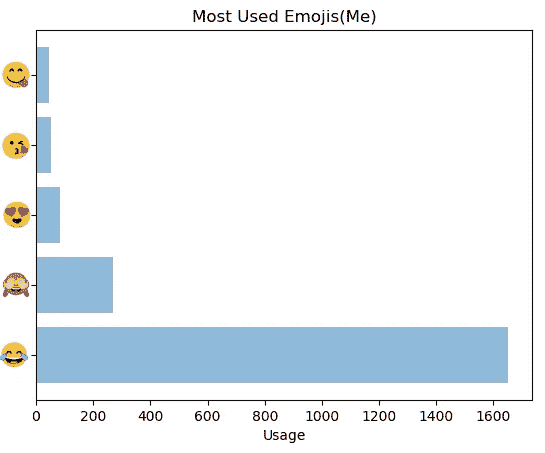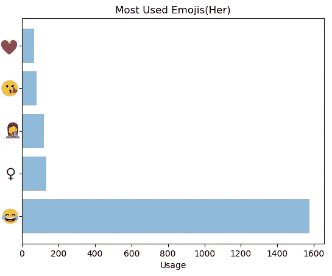

最常用的表情符号

我们是最开心的一家人。我们俩都用😂不过当然我用的最多还是比她多。

# 时间和活动分析

了解聊天在一段时间内的分布也很有趣。


我们的确主要在周四和周五聊天，但实际上没什么区别。

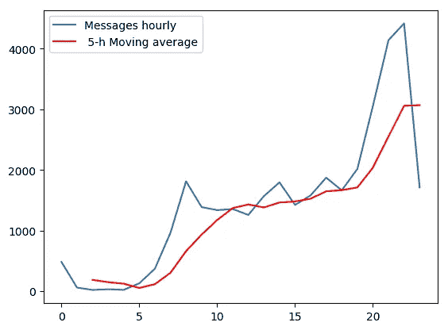

上图显示了平均一天的聊天分布。在 0000 到 0500 之间的大多数日子里，我们都在睡觉，因此没有太多的活动。聊天量逐渐增加，在 2000 小时到 2100 小时之间达到峰值，然后随着我们继续睡觉，聊天量迅速下降。

我做的最后一项分析是确定我们写过的最长的信息，

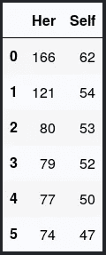

再一次，她用她自己最长的包含 166 个单词的信息来引导我，而我只有 62 个单词。

# **结论**

在这篇文章中，我希望你玩得开心，也学到了东西。我们使用 pandas 对数据进行了清理、描述和可视化，通过这样做，你可以做出调整，使你们的关系更好，或者更好地理解字符串操作。

您可以使用自己的 WhatsApp 数据按照相同的步骤复制相同的内容。

一如既往，感谢阅读:-)