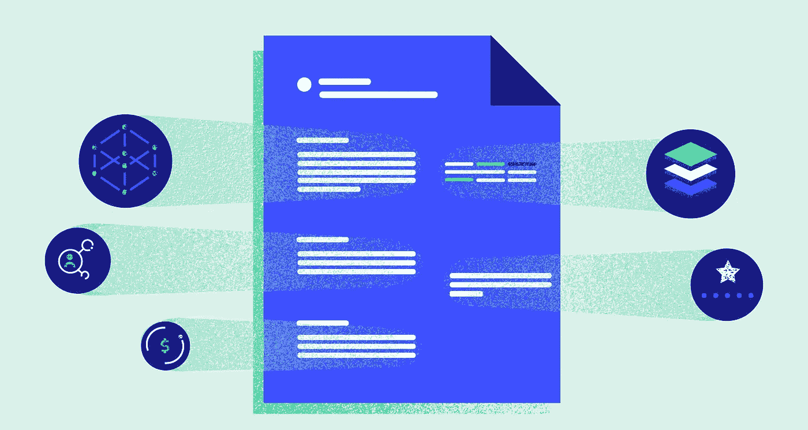
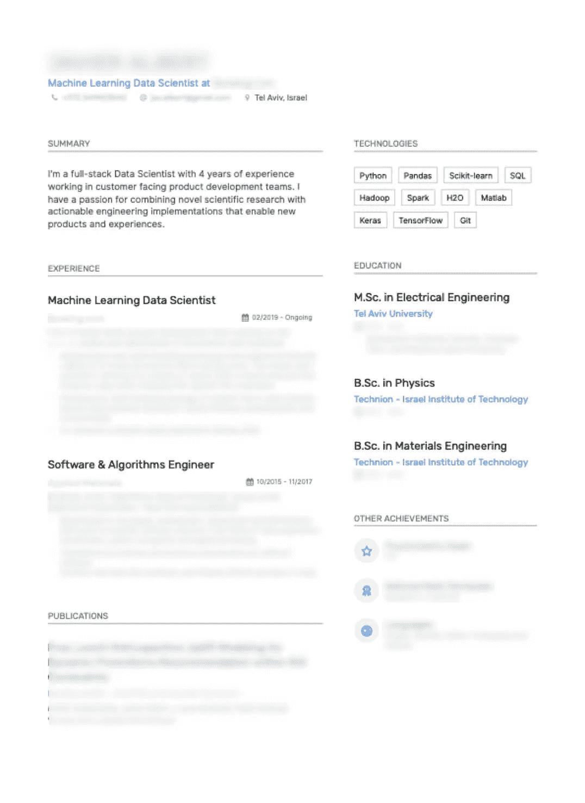

# 数据科学简历中的 7 个必备要素

> 原文：<https://towardsdatascience.com/7-must-haves-in-your-data-science-cv-9316841aeb78?source=collection_archive---------0----------------------->

## 寻找新角色？一定要检查这些临界点才能脱颖而出，通过简历筛选。

图片由[授权](https://www.riskified.com/)(经许可使用)

管理 [Riskified 的](https://medium.com/riskified-technology)数据科学部门需要大量招聘——我们在不到一年半的时间里增加了一倍多。作为几个职位的招聘经理，我也看了很多简历。招聘人员[用 7.4 秒](https://www.prnewswire.com/news-releases/ladders-updates-popular-recruiter-eye-tracking-study-with-new-key-insights-on-how-job-seekers-can-improve-their-resumes-300744217.html)筛选一份简历，在招聘了几年之后，我的平均时间相当快，但没有那么快。在这篇博客中，我将向你展示我的个人启发法(“作弊”)，它可以帮助我筛选简历。虽然我不能保证其他人使用相同的启发式方法，并且不同的角色在每个要点的重要性方面会有所不同，但注意这些要点可以帮助你征服 CV 屏幕阶段。此外，其中一些试探法可能看起来不公平，或者可能会忽略合格的候选人。我同意，没有在简历上投资的有才华的机器学习从业者可能会被这个屏幕拒绝，但考虑到时间，这是最好的权衡。记住，一个非常抢手的职位可能会吸引上百份简历。如果你想要一个高效的流程，简历筛选必须快速。

以下是用于快速筛选你的数据科学简历的 7 种试探法:

## 1.作为数据科学家的先前经验

我将快速浏览您的简历，看看您以前的职位，看看哪些被标记为“数据科学家”。还有一些其他相邻的术语(取决于我招聘的角色)，如“机器学习工程师”、“研究科学家”或“算法工程师”。我没有将“数据分析师”包括在内，因为日常工作通常不同于数据科学家的工作，而且数据分析师的头衔是一个非常宽泛的术语。
如果你在目前的工作岗位上从事数据科学工作，并且你有一些其他创造性的工作描述，那么将你的头衔改为数据科学家可能对你最有利。对于事实上是数据科学家的数据分析师来说，这是千真万确的。请记住，即使简历包含了你所从事项目的描述(其中包括机器学习)，除了数据科学家之外的头衔也会增加不必要的模糊性。
此外，如果你参加过数据科学训练营或该领域的全日制硕士课程，这可能会被视为你数据科学经历的开始(除非你之前从事过类似的工作，这将保证在稍后阶段提出问题)。

## 2.面向业务的成就

理想情况下，我想看看你做了什么(技术方面)和业务成果是什么。缺乏精通技术、能够用商业术语交流的数据科学家。如果你能分享你的工作所影响的业务 KPI，在我看来这是一个很好的建议。例如，表明您的模型在 AUC 方面的改进是没问题的，但解决由于您的模型改进而导致的转化率增加意味着您“明白了”——业务影响才是最终真正重要的。比较以下描述相同工作但侧重点不同(技术与业务)的选项:

a.银行贷款违约率模型——将模型的精确召回 AUC 从 0.94 提高到 0.96。

b.银行贷款违约率模型—将业务部门的年收入提高了 3%(每年 50 万美元)，同时保持不变的违约率。

## 3.教育

你的正规教育是什么，在什么领域。是知名机构吗？对于更多的应届毕业生，我也会看看他们的平均绩点，以及他们是否获得过任何优秀奖或荣誉，比如上了校长或院长的名单。由于数据科学是一个完全开放的领域，没有任何标准化的测试或所需的知识，人们可以通过各种方法进入该领域。在我的上一篇博客中，我写了进入这个领域的 [3 条主要途径](/3-ways-to-break-into-data-science-6a7a8fd679b3)，基于你的教育和时机，我会找出你可能选择了哪一条。因此，时机有助于理解您的故事，即您是如何以及何时过渡到数据科学的。如果你没有接受过任何数据科学方面的正规教育，那很好，但你需要证明你在该领域的工作记录和/或类似领域的高等学位。

## 4.布局/视觉吸引力

我见过一些漂亮的简历(我保存了一些作为个人灵感)，但我也收到过文本文件(。txt ),缺少任何格式。写简历可能是一件痛苦的事，如果你选择了数据科学作为你的努力方向，那么你很可能不喜欢在业余时间创造美学设计。在不走极端的情况下，您确实希望寻找一个好的模板，使您能够在有限的空间内完成所有工作。明智地使用空间——将页面分开，突出不属于按时间顺序排列的工作/教育经历的特定部分是很有用的。这可以包括你熟悉的技术栈，一个自我项目列表，到你的 github 或博客的链接等等。一些简单的图标也有助于强调章节标题。
许多候选人在他们熟悉的每种语言/工具旁边使用 1-5 颗星或条形图。就我个人而言，我不太喜欢这种方法，原因有几个:

*   这非常主观——你的“5 星”和别人的“2 星”是一样的吗？
*   他们把语言和工具混在一起，在最糟糕的情况下，还把软技能混在一起——说你在领导力方面的“4.5 星”没有帮助。作为一个对[成长心态](https://www.brainpickings.org/2014/01/29/carol-dweck-mindset/)深信不疑的人，声称最大限度地发挥一项技能(尤其是一项更难量化、更难掌握的软技能)感觉非常放肆。

我还看到这种方法被进一步滥用，采取主观的方法，并把它们变成一个饼图(30% python，10%团队成员，等等)。虽然这可能被认为是一种脱颖而出的创造性方式，但它表明了对不同图表概念背后的基本理解的缺乏。

这里有两个我觉得视觉上很吸引人的简历例子，为了匿名细节被模糊了。

信用伊娃米舍(经许可使用)

视觉上吸引人的数据科学家简历，细节模糊。请注意两个例子中使用的垂直分割来区分经验、技能、成就和出版物。在这两种情况下，简短的总结段落有助于描述他们的背景和愿望。经所有者许可使用。

## 5.机器学习种类

我寻找两种类型的变化:

1.  算法类型—结构化/经典 ML vs 深度学习。一些候选人只从事深度学习，包括可能更适合基于树的模型的结构化数据。虽然成为 DL 专家本身没有问题，但是限制您的工具集会限制您的解决方案。正如马斯洛所说:“如果你拥有的唯一工具是一把锤子，你往往会把每个问题都视为钉子。”在 [Riskified](https://medium.com/riskified-technology) ，我们处理结构化的、领域驱动的、特征工程化的数据，这些数据最好用各种形式的提升树来处理。拥有一个整个简历都指向 DL 的人是一个问题。
2.  ML 领域——这通常与两个需要大量专业知识的领域相关——计算机视觉和 NLP。这些领域的专家很受欢迎，在许多情况下，他们的整个职业生涯都将专注于这些领域。如果你正在寻找从事该领域工作的人，这一点至关重要，但通常来说，这不适合从事更一般的数据科学工作的人。因此，如果你的大部分经验是在 NLP 领域，而你申请的是该领域之外的职位，试着强调你在结构化数据领域工作过的职位/项目，以展示多样性。

## 6.技术堆栈

这通常可以分为语言、特定的包(scikit learn、pandas、dplyr 等)、云和它们的服务(AWS、Azure、GCP)或其他工具。一些候选人将这与他们熟悉的算法或架构混为一谈(RNN，XGBoost，K-NN)。就个人而言，我更喜欢围绕技术和工具；当提到一个特定的算法时，我不禁想知道候选人的理论上的 ML 知识是否仅限于这些特定的算法。在这里，我在寻找技术组合的相关性——它们是否来自过去几年(这是一个积极的迹象，表明候选人正在实践和学习新技能),组合的广度(它们是否非常局限于特定的工具，或者它们是否熟悉相当多的东西)以及与我们的组合的契合度(我们需要教它们多少)。

## 7.项目

你有什么工作可以在 GitHub 上分享的吗？任何 Kaggle 竞赛或附带项目都非常有帮助，可以查看简明代码、预处理类型、功能工程、EDA、算法选择以及现实项目中需要解决的无数其他问题。给你的 GitHub 和 Kaggle 账户添加一个链接，让面试官深入了解你的代码。如果你没有太多的经验，很有可能你会被问到这些项目中的一个或多个。在我参加的一些面试中，候选人不太记得这个项目，我们无法就他们做出的选择及其背后的原因展开对话。一定要重温你做过的工作，或者把它从简历中去掉。同样，确保你展示了你最好的作品，并且你投入了足够的时间和精力。最好有 2-3 个高质量的项目，而不是 8-10 个中等(或较低)质量的项目。

## 摘要

如果你正在寻找一个新的数据科学职位，请花些时间浏览一下本文中的要点。如果你不能检查所有这些标记，这没关系，但是你能检查的越多越好。希望这些建议能帮助你脱颖而出，顺利通过简历筛选。

祝你好运，找工作愉快！

在筛选数据科学简历时，你有不同的方法吗？
请在下方评论区分享！