# 让我的代码更好更聪明的 7 个小技巧

> 原文：<https://towardsdatascience.com/7-numpy-tricks-to-make-my-code-better-and-smarter-9e8a4ccf43d1?source=collection_archive---------25----------------------->

## 我希望我早点知道的技巧

由 [Max Duzij](https://unsplash.com/@max_duz?utm_source=medium&utm_medium=referral) 在 [Unsplash](https://unsplash.com?utm_source=medium&utm_medium=referral) 上拍摄的照片

**Numpy** 是 Python 中最重要和最流行的数值计算库之一。它被广泛应用于数据科学和机器学习，许多库都是基于它建立的。我希望在这篇文章中分享 7 个数字游戏技巧，我希望我作为一个初学者能早点知道。

# 1.numpy.linspace()

`np.linespace(start, stop, num)`返回一个数组，数组中的数字从`strat`到`stop`均匀分布

例如:

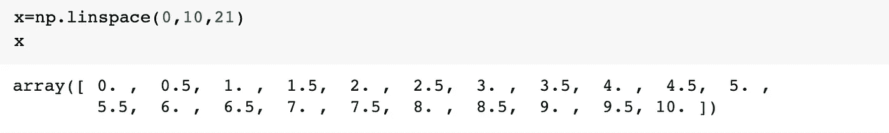

画数学函数很方便:

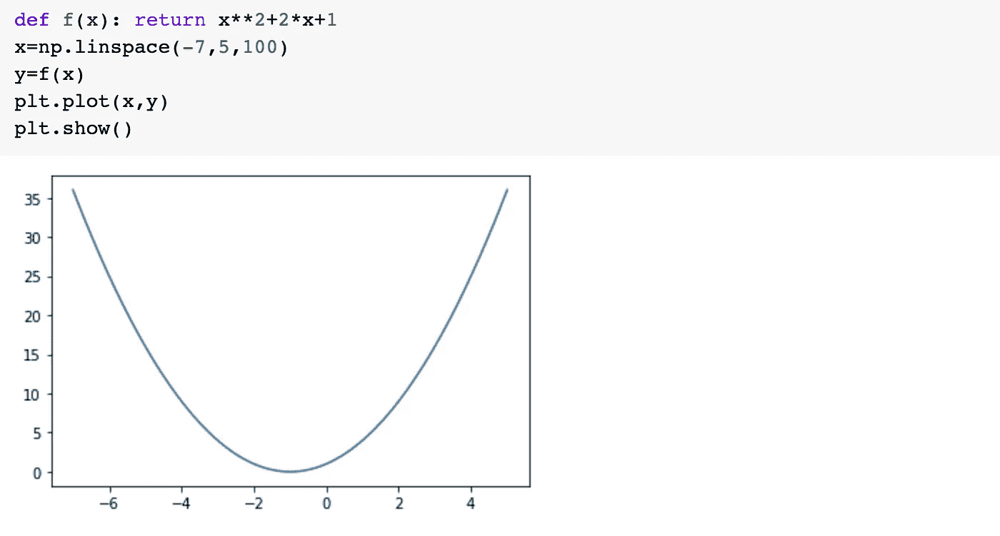

## numpy.arange()

`np.arange(start, stop, step)`提供了类似的功能，它创建了一个从开始到停止的一步数组。

例如:

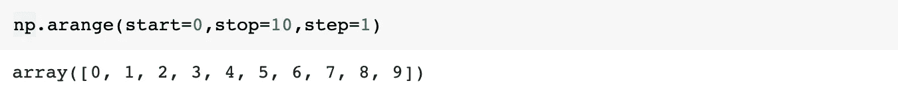

# 2.numpy.random

我们经常需要生成随机数来进行统计计算。Numpy 提供了一些函数来生成随机数。

## np.random.randint()

`randint(low, high, size)`生成一个范围(低—高)内的随机整数数组(size=size)。

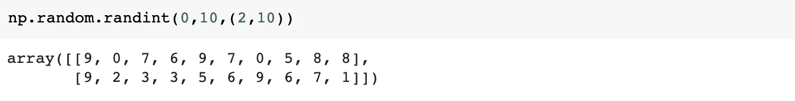

## np.random.rand()

`rand()`生成在给定形状下均匀分布在 0 到 1 之间的随机数。

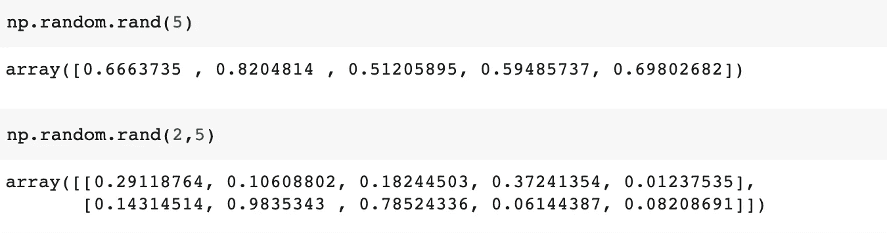

## 随机的

`randn()`生成正态分布的随机数。

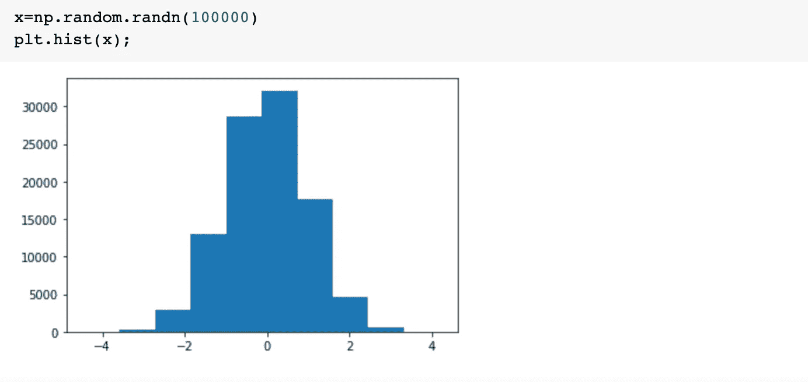

## np .随机数.选择()

`random.choice()`允许我们从给定的数组中随机选择样本。传递一个概率也是可以的。

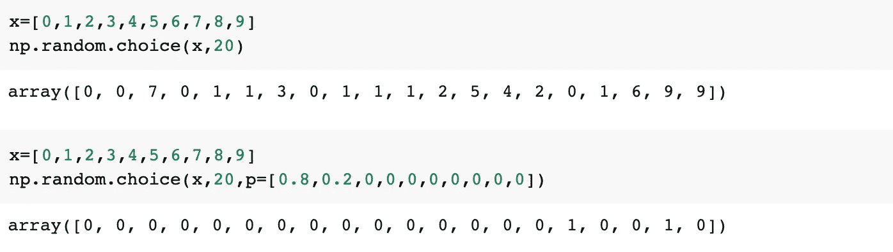

# 3.numpy.argmax()

`np.argmax()`返回沿轴最大值的索引。

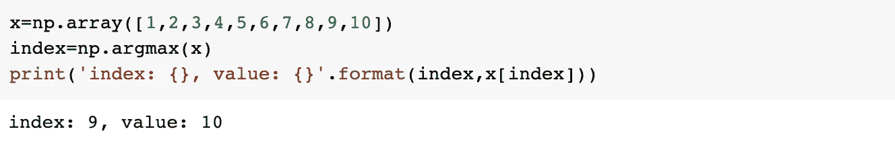

在对象分类和检测中，找到具有最高概率的对象是有用的。

还有类似`argmin()`、`argwhere()`、`argpartition()`的功能

# 4.numpy.setdiff1d()

`np.setdiff1d()`返回一个数组中不在另一个数组中的值。

例如，我们有两个数组:

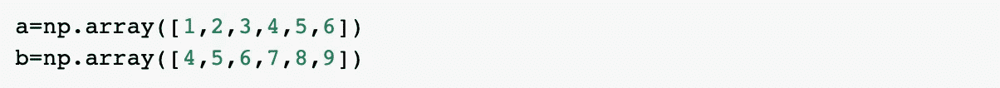

如果我们想找到`a`中没有出现在`b`中的值(答案应该是[1，2，3])，我们可以使用`setdiff1d()`:

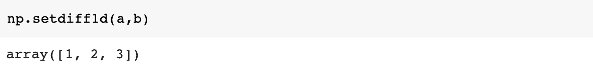

我们也可以反过来做，在 b 中寻找 a 中没有的值:

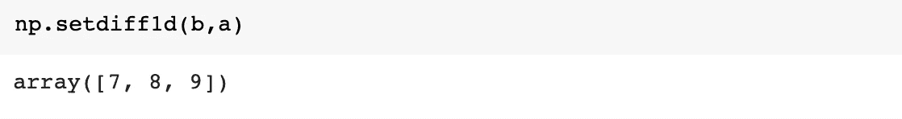

## numpy.intersect1d()

一个类似的函数是`intersect1d()`，它返回 2 个数组的交集，在本例中是[4，5，6]。

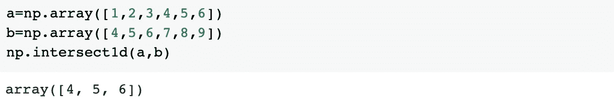

# 5.numpy 在哪

`np.where(condition,x,y)`根据条件返回从 *x* 或 *y* 中选择的元素。

例如，我们有一个包含考试分数的数组:

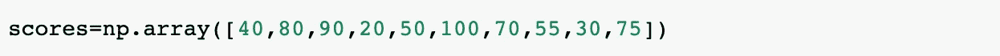

我们想用‘pass’或‘not _ pass’代替分数。条件可以设置为`scores>60`:

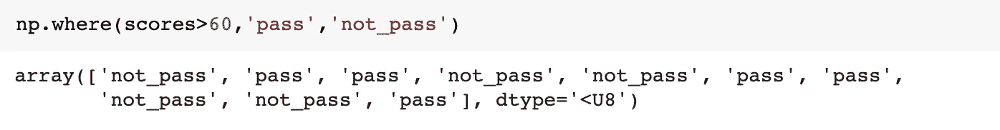

如果 x 和 y 没有传递给`np.where`，将返回满足条件的元素的索引位置。

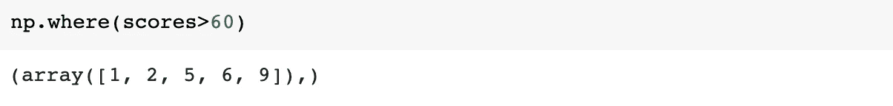

# 6.重塑()

有时我们需要重塑数组，我们可以使用`resphape()`的方法。

例如，我们有一个一维数组:

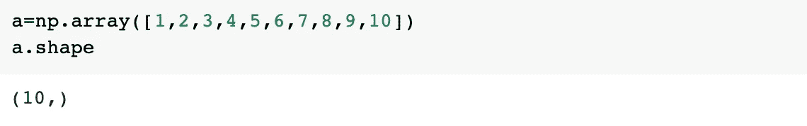

我们可以将其改造成 2×5 阵列:

我们可以使用`-1`，numpy 为您计算尺寸。

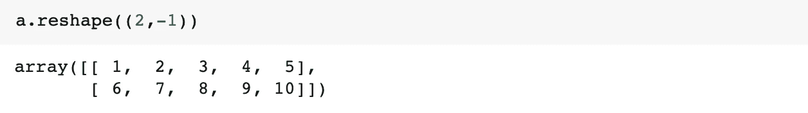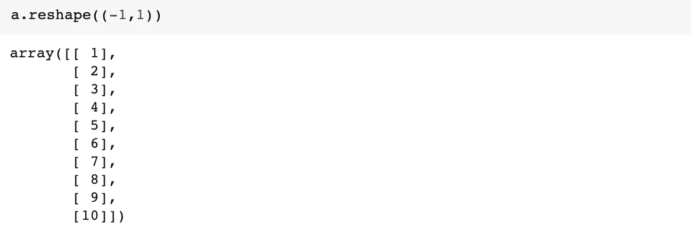

## 展平()

如果你想把一个多维数组重塑成 1D 数组，你可以使用`flatten()`

## 堆栈()

您也可以使用`np.stack()`将多个数组堆叠在一个数组中。

例如:

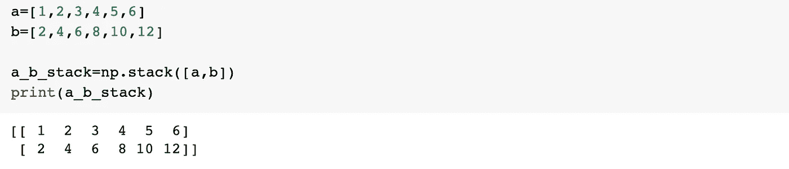

您可以在其他轴中执行此操作，

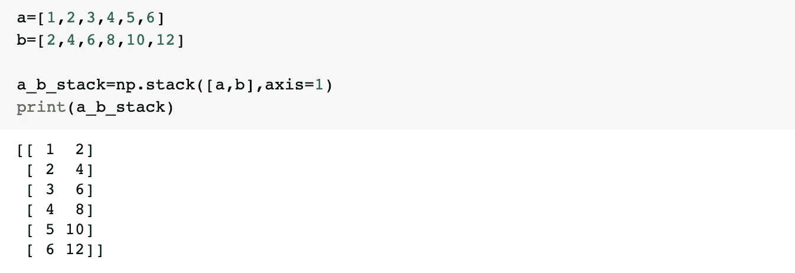

您也可以使用`hstack()`来水平堆叠数组:

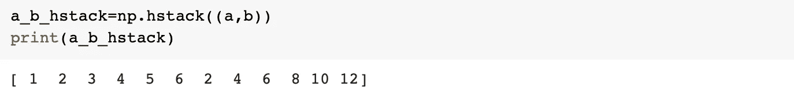

# 7.numpy.clip()

如果您有一个包含一些数字和一个范围的数组，您可以使用`clip()`将数字限制在该范围内。对于超出范围的数字，它返回边缘值。

例如:

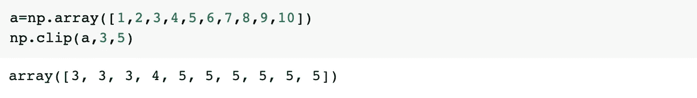

它将数组裁剪在 3 到 5 之间。

就是这样。这些 Numpy 技巧使我的代码变得更加简单和高效。我希望这些也能帮助你

我也写过关于 Python 和熊猫的文章。有兴趣可以看看。

 [## 让我的代码更好更聪明的 7 个 Python 技巧。

### 我希望我能早点知道的技巧。

towardsdatascience.com](/7-python-tricks-to-make-my-code-better-and-smarter-60dfde0b6c49)  [## 让我的数据分析过程更高效的 10 个熊猫窍门:第 1 部分

### 我希望我早点知道的技巧

towardsdatascience.com](/10-pandas-tricks-to-make-my-data-analyzing-process-more-efficient-part-1-78a0cc1636f3)  [## 让我的数据分析过程更高效的 10 个熊猫窍门:第二部分

### 我希望我早点知道的技巧

towardsdatascience.com](/10-pandas-tricks-to-make-my-data-analyzing-process-more-efficient-part-2-b72ea43a0bb5) 

感谢阅读，编码快乐。