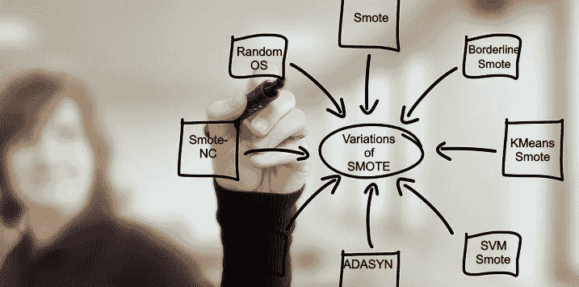
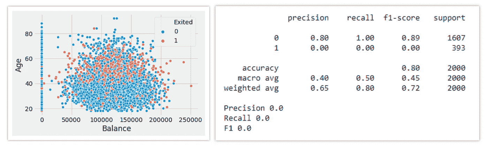
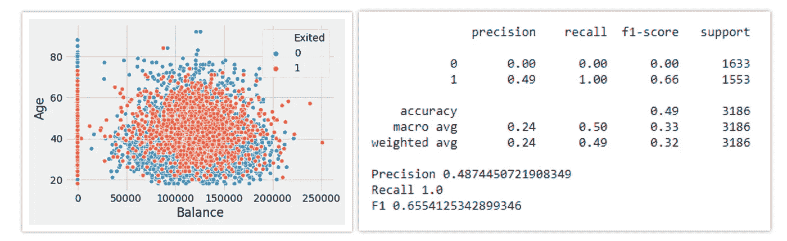
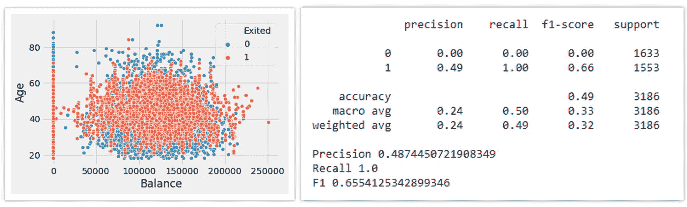
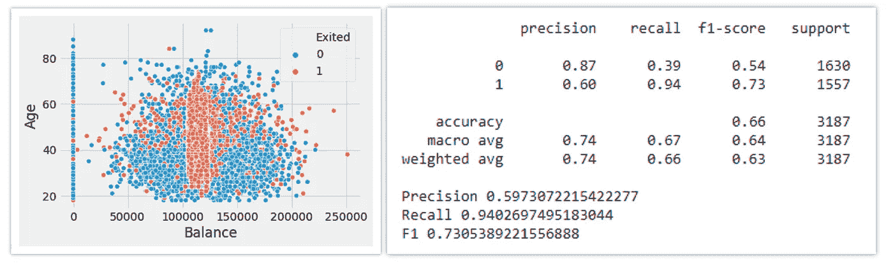
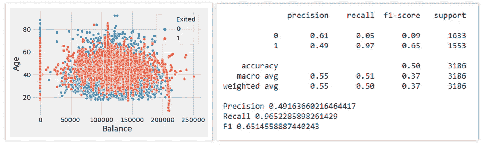
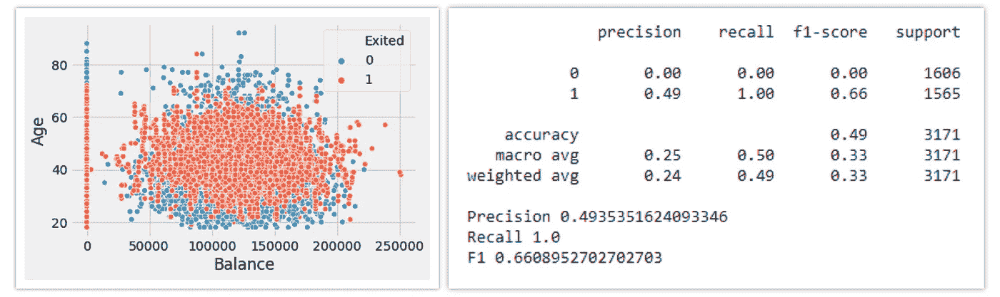
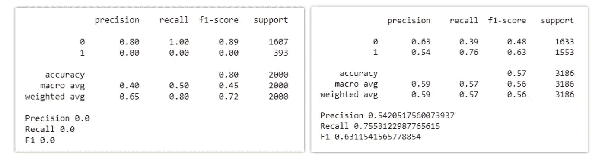

# 7 处理不平衡数据的过采样技术

> 原文：<https://towardsdatascience.com/7-over-sampling-techniques-to-handle-imbalanced-data-ec51c8db349f?source=collection_archive---------8----------------------->

## 各种过采样技术的深度分析

图片由 [LTD EHU](https://pixabay.com/users/ltdatehu-9079918/?utm_source=link-attribution&amp;utm_medium=referral&amp;utm_campaign=image&amp;utm_content=1095751) 发自 [Pixabay](https://pixabay.com/?utm_source=link-attribution&amp;utm_medium=referral&amp;utm_campaign=image&amp;utm_content=1095751)

M 对不平衡数据建模是我们在训练模型时面临的主要挑战。为了处理分类问题，目标类别标签的类别平衡在建模中起着重要的作用。对于不平衡类问题，即数据集中存在少数类，模型会尝试只学习多数类，从而导致有偏差的预测。

不平衡的阶级问题的一些著名例子是:

1.  信用卡欺诈检测
2.  疾病诊断
3.  垃圾邮件检测等等

在训练模型之前，需要处理数据集的不平衡。有各种技术来处理类平衡，其中一些是过采样，欠采样，或两者的结合。本文将深入解释 7 种过采样技术:

1.  **随机过采样**
2.  **重击**
3.  **临界击打**
4.  **克平均击打**
5.  **SVM 击杀**
6.  **阿达辛**
7.  **Smote-NC**

> 对于不同过采样模型的评估，我们使用来自 Kaggle 的[流失建模数据集。](https://www.kaggle.com/shubh0799/churn-modelling)

**不使用任何过采样或欠采样技术的逻辑回归模型的性能。**

# 1.随机过采样:

随机过采样是平衡数据集不平衡性质的最简单的过采样技术。它通过复制少数类样本来平衡数据。这不会导致任何信息丢失，但是当复制相同的信息时，数据集容易过拟合。

(图片由作者提供)，**左:**随机过采样后的散点图，**右:**随机过采样后模型的性能

# 2.击打:

在随机过采样的情况下，当少数类样本被复制时，容易出现过拟合，这里 SMOTE 出现了。SMOTE 代表合成少数过采样技术。它创建新的合成样本来平衡数据集。

SMOTE 通过利用**k-最近邻**算法来创建合成数据。使用 Smote 创建步骤示例:

*   识别特征向量及其最近邻
*   计算两个样本点之间的距离
*   用 0 到 1 之间的随机数乘以距离。
*   在计算出的距离处识别线段上的新点。
*   对识别的特征向量重复该过程。

(图片由作者提供)，**左:**SMOTE 后散点图，**右:**SMOTE 后模型表现

# 3.临界击打:

由于多数类点区域内存在一些少数类点或异常值，因此会创建少数类点的桥。这是 Smote 中的一个问题，使用边界 Smote 可以解决这个问题。

在边界线 Smote 技术中，只有边界线附近的少数样本被过采样。它将少数类点分类成噪声点、边界点。噪声点是少数类点，其大多数点都是其邻居中的多数点，而边界点在其邻居中既有多数类点也有少数类点。边界线 Smote 算法试图仅使用这些边界点来创建合成点，并忽略噪声点。

(图片由作者提供)，**左:**边界平滑后散点图，**右:**边界平滑后模型性能

# 4.KMeans 击打:

K-Means SMOTE 是一种用于类不平衡数据的过采样方法。它通过在输入空间的安全和关键区域生成少数类样本来帮助分类。该方法避免了噪声的产生，并且有效地克服了类之间和类内的不平衡。

K-Means SMOTE 分五步工作:

1.  使用 k-means 聚类算法对整个数据进行聚类。
2.  选择具有大量少数类样本的聚类
3.  将更多合成样本分配给少数类样本分布稀疏的聚类。

这里，使用 SMOTE 对每个滤波后的聚类进行过采样。

(图片由作者提供)，**左:**k means 击打后散点图，**右:**k means 击打后模型性能

# 5.SVM 击打:

边界重击的另一个变体是边界重击 SVM，或者我们可以称之为 SVM 重击。这种技术结合了 SVM 算法来识别错误分类点。

在 SVM-SMOTE 中，在原始训练集上训练支持向量机分类器后，边界区域由支持向量近似。然后，沿着将每个少数类支持向量与其多个最近邻居连接起来的线，随机创建合成数据。

(图片由作者提供)，**左:**SVM 击杀后散点图，**右:**SVM 击杀后模型表现

# 6.自适应合成采样— ADASYN:

边界线 Smote 更重要，或者仅使用作为边界点的极端观测值创建合成点，而忽略其余的少数类点。ADASYN 算法解决了这个问题，因为它**根据数据密度创建合成数据。**

合成数据的生成与少数群体的密度成反比。与较高密度的区域相比，在低密度的少数民族类区域中创建了相对较大数量的合成数据。

换句话说，在少数类的不太密集的区域，合成数据被创建得更多。

(图片由作者提供)，**左:**ADASYN 后散点图，**右:**ADASYN 后模型表现

# 7.Smote-NC:

Smote 过采样技术仅适用于具有所有连续特征的数据集。对于具有分类特征的数据集，我们有一个 Smote 的变体，它是 Smote-NC(名义的和连续的)。

Smote 也可以通过一键编码用于具有分类特征的数据，但它可能会导致维数增加。标签编码也可以用于将分类转换为数字，但是 smote 之后可能会产生不必要的信息。这就是为什么当我们有混合数据的情况下，我们需要使用 SMOTE-NC。Smote-NC 可以通过表示分类特征来使用，Smote 会对分类数据进行重新采样，而不是创建合成数据。

(图片由作者提供)，**左:**SMOTE-NC 前车型性能，**右:**SMOTE-NC 后车型性能

# 实施:

(作者的代码实现)

# 结论:

对不平衡数据集建模是我们在训练模型时面临的主要挑战，使用上面讨论的各种过采样技术可以提高模型的性能。在本文中，我们还讨论了 SMOTE-NC，它是 SMOTE 的一个变体，可以处理分类特征。

通过使用各种欠采样技术，例如随机欠采样、TomekLinks 等，以及过采样和欠采样技术的组合，例如 SMOTEENN、SMOTETomek 等，也可以提高不平衡数据集的模型性能。

# 参考资料:

[1] Imblearn 文档:[https://unbalanced-learn . readthedocs . io/en/stable/API . html # module-imb learn . over _ sampling](https://imbalanced-learn.readthedocs.io/en/stable/api.html#module-imblearn.over_sampling)

[2][https://pypi.org/project/kmeans-smote/](https://pypi.org/project/kmeans-smote/)

> 感谢您的阅读