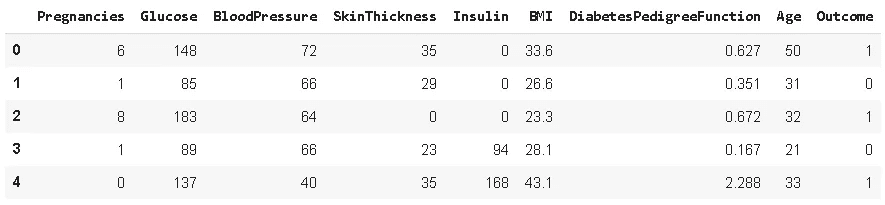
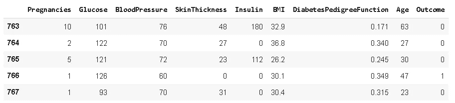
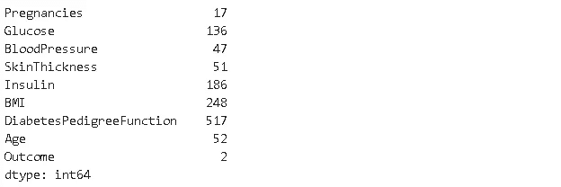
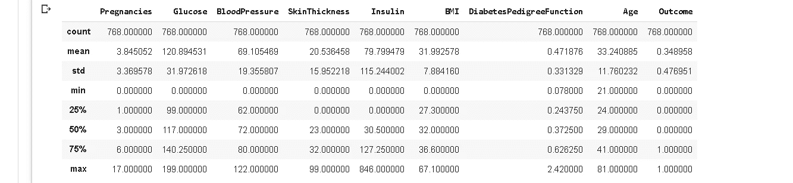
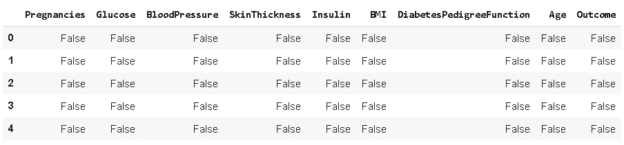
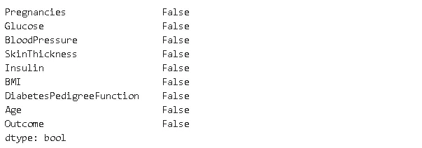
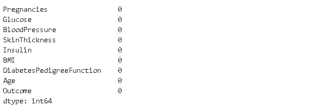
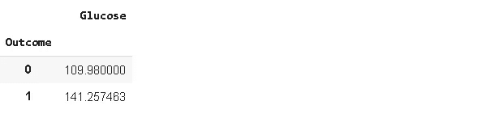
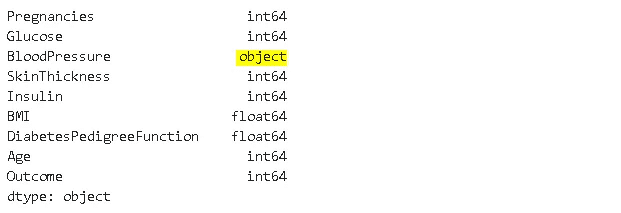
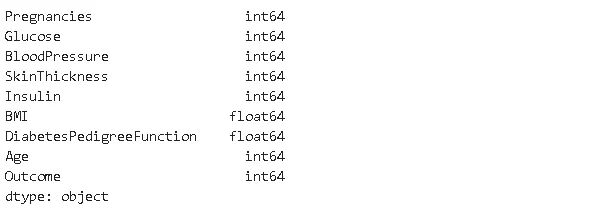

# 我最常用的 7 个熊猫功能

> 原文：<https://towardsdatascience.com/7-pandas-functions-that-i-use-the-most-b83ddbaf53bf?source=collection_archive---------18----------------------->

## 数据分析过程中最常用的函数。


[Icons8 团队](https://unsplash.com/@icons8?utm_source=unsplash&utm_medium=referral&utm_content=creditCopyText)在 [Unsplash](https://unsplash.com/s/photos/seven?utm_source=unsplash&utm_medium=referral&utm_content=creditCopyText) 上的照片

Pandas 是一个著名的数据分析和操作库。它提供了许多加快数据分析和探索过程的功能和方法。

在丰富的函数和方法选择中，有些是更常用的。它们提供了一种快速获得手头数据的基本理解的方法。

在这篇文章中，我将介绍我在数据分析项目中最常用的 7 个 pandas 函数。

我将使用 Kaggle 上的[糖尿病数据集](https://www.kaggle.com/uciml/pima-indians-diabetes-database)。让我们首先将数据集读入熊猫数据帧。

```
import pandas as pd
import numpy as npdiabetes = pd.read_csv("/content/diabetes.csv")
```

# **1。头尾**

一旦我们将一个数据集读入 pandas 数据帧，我们就想看一看它以获得一个概览。最简单的方法是显示一些行。Head 和 tail 允许我们分别从数据帧的顶部和底部显示行。

```
diabetes.head()
```



```
diabetes.tail()
```



默认显示 5 行，但是我们可以通过传递我们想要显示的行数来调整它。例如，diabetes.head(10)将显示前 10 行。

# **2。努尼克**

处理具有离散值的分类数据或要素时，了解唯一值的数量非常重要。这是数据探索的重要一步。

一种方法是使用 **value_counts** 函数，该函数返回一个 pandas 系列，其中包含一列中的唯一值以及每个值出现的次数。这个序列的长度是唯一值的个数。

```
len(diabetes.Pregnancies.value_counts())
17
```

我发现 nunique 更容易使用:

```
diabetes.Pregnancies.nunique()
17
```

我们还可以将其应用于整个数据帧，并查看每列中唯一值的数量，我认为这使 nunique 更具功能性:

```
diabetes.nunique()
```



# **3。描述**

Describe 函数通过提供基本统计数据(如平均值、中值和标准偏差)来快速概述数字列。

```
diabetes.describe()
```



25%、50%和 75%是百分位数。50%也称为**中值**，是所有值排序时位于中间的值。25%是第一个四分位数**因此 25%的值低于该点。你可以把它想象成一个列的下半部分的中值。同样，75%是第三个四分位数**。

基本的统计数据给了我们宝贵的见解。例如，通过比较平均值和中间值(50%)，我们可以了解异常值。如果平均值远高于中值，则在上端有异常值。基本统计数据也给我们提供了数据分布的概况。

您也可以使用**百分点**参数选择不同的百分点进行显示。默认值为[.25、. 50、. 75]。例如，除默认值外，百分点=[.1，. 25，. 5，. 75，.. 9]将显示 10%和 90%的百分点。

# **4。Isna**

[处理缺失值](/handling-missing-values-with-pandas-b876bf6f008f)是构建稳健数据分析流程的关键步骤。缺少的值应该是最优先考虑的，因为它们对任何分析的准确性都有重大影响。

**Isna** 函数返回用布尔值填充的数据帧，true 表示缺少值。

```
diabetes.describe()
```



除非您想要逐个单元地分析数据帧，否则 isna 应该与聚合结合使用。isna()。any()指示列中是否有任何缺少的值，而 isna()。sum()返回列中缺失值的数量。

```
diabetes.isna().any()
```



```
diabetes.isna().sum()
```



我们拥有的数据集没有任何缺失值，但这种情况在现实生活中不太可能发生。

# **5。分组依据**

[Pandas groupby](/pandas-groupby-explained-453692519d0) 函数是探索数据的绝佳工具。它更容易揭示变量之间的潜在关系。下图概述了 **groupby** 函数的功能。


熊猫分组(图片由作者提供)

假设我们有两个特征。一个是颜色，它是分类特征，另一个是数值特征，即值。我们希望**按照**颜色对值**进行分组，并计算不同颜色值的**平均值**(或任何其他集合)。然后最后**根据平均值对颜色进行排序**。**

当然，您可以创建更复杂的分组操作，但概念是相同的。

让我们用数据集创建一个简单的分组操作。下面的代码将向我们展示糖尿病阳性和阴性人群的平均葡萄糖值。

```
diabetes[['Outcome','Glucose']].groupby('Outcome').mean()
```



正如所料，糖尿病阳性患者的血糖值较高(1)。

我们在数据集中没有很多分类变量，所以我们可以在这个数据集上用 groupby 函数做的事情是有限的。然而，如果你想阅读更多关于 groupby 函数的内容，并看到更复杂的例子，我有一个帖子专门讨论熊猫 groupby 函数。

[](/pandas-groupby-explained-453692519d0) [## 熊猫分组——解释

### 如何高效利用熊猫的分组功能

towardsdatascience.com](/pandas-groupby-explained-453692519d0) 

# 6。数据类型和数据类型

我们需要将值存储在适当的数据类型中。否则，我们可能会遇到错误。对于大型数据集，正确的数据类型选择会极大地影响内存使用。例如，对于分类数据来说，“分类”数据类型比“对象”数据类型更合适，尤其是当类别的数量远小于行数时。

**Dtypes** 显示每一列的数据类型。

```
diabetes.dtypes
```



“血压”列的数据类型不合适。应该是 int 或者 float。对象数据类型可以是存储字符串或分类数据。

我们可以很容易地用 **astype** 函数改变数据类型。

```
diabetes.BloodPressure = diabetes.BloodPressure.astype('int64')diabetes.dtypes
```



# **7。形状和尺寸**

**Shape** 可以用在 numpy 数组、pandas 系列和 dataframes 上。它显示维度的数量以及每个维度的大小。

因为数据帧是二维的，所以 shape 返回的是行数和列数。它衡量我们拥有多少数据，是数据分析过程的关键输入。

此外，在设计和实现机器学习模型时，行和列的比率非常重要。如果我们没有足够的关于特征(列)的观察值(行),我们可能需要应用一些预处理技术，如降维或特征提取。

```
diabetes.shape
(768, 9)
```

让我们把它用在一个实际上是熊猫系列的专栏上。

```
diabetes.Glucose.shape
(768,)
```

顾名思义，Size 返回数据帧的大小，即行数乘以列数。

```
diabetes.size
6912
```

感谢您的阅读。如果您有任何反馈，请告诉我。