# 7 个熊猫功能将减轻您的数据操作压力

> 原文：<https://towardsdatascience.com/7-pandas-functions-to-reduce-your-data-manipulation-stress-25981e44cc7d?source=collection_archive---------9----------------------->


左图和来自 Pixabay 的代码图。来自 Unsplash 的熊猫图像。

## 熊猫没有白毛是有原因的

熊猫为什么没有灰毛？显然，因为它们有如此多的智能功能来操纵数据，所以它们不会像人类那样过度紧张。

数据似乎永远不会以我们希望的形式出现。以我个人的经验，花在数据科学项目上的绝大部分时间只是花在操纵数据上。当我们想对数据做些什么，但我们不知道一个方便的熊猫函数来做时，是时候使用旧的`for`循环和`.loc`手动改变单元格了，由`if`语句指导。

在本文中，我将展示和解释 7 个 pandas 函数，当它们单独使用或一起使用时，有望为您节省大量数据操作压力。

为了演示，我们将主要对纽约市 Airbnb 开放数据进行操作，该数据混合了数据类型，包括数字、文本和日期。

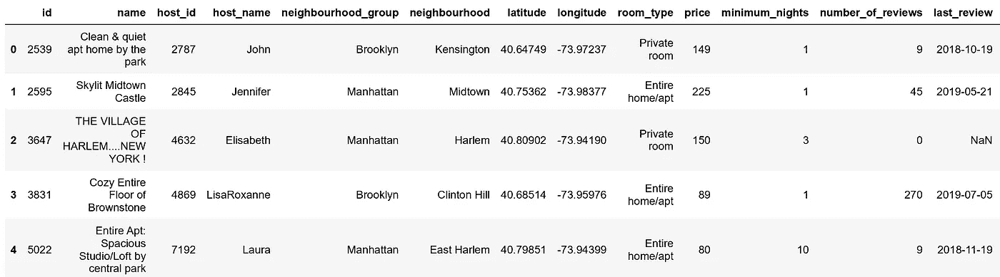

数据的前几列。

# 1 | pandas.factorize(x)

当我们需要对一些东西进行标签编码时，通常你会使用`sci-kit learn`的`LabelEncoder`，但是熊猫可以在没有任何进口的情况下这样做。最重要的是，访问什么标签对应什么需要从`sklearn`中的`LabelEncoder`对象调用函数，但是默认情况下包含在`pandas`中。

假设我们想要对数据中的`neighbourhood`列进行标签编码。

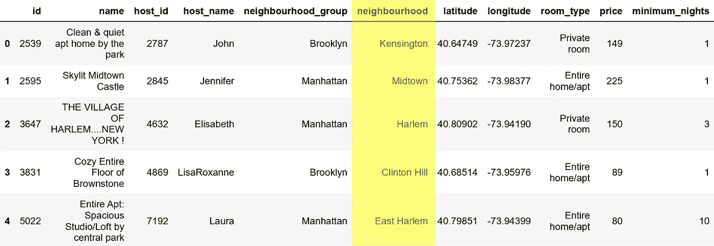

```
pd.factorize(data['neighbourhood'])
```

生产

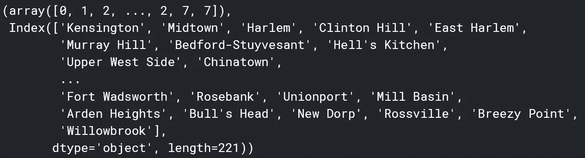

元组的第一个元素是一个数组，包含序列的标签编码值。元组的第二个元素是索引/列表，其中每个元素的索引对应于第一个元素中的标签。例如，第一个标签编码值是 0。这意味着它的反向编码值是第二个 tuple 元素的第 0 个索引，也就是 Kensington(可以向上滚动来确认这一点)。

# 2 | pandas.get_dummies(x)

有时，标签编码不起作用，因为它将数字属性分配给本来就不是数字的对象，例如“哈莱姆是肯辛顿的两倍”或“肯辛顿加三是布鲁克林”。在这种情况下，首选一位热编码，它没有数字偏差，表示相同的数据(尽管以非常稀疏的方式)。

传统的方法是使用`sklearn`的`OneHotEncoder`，这需要导入`sklearn`，并训练一个`OneHotEncoder`对象。

假设我们想对数据集中的同一个`neighborhood` 列进行一次性编码。

```
pd.get_dummies(data['neighbourhood'])
```

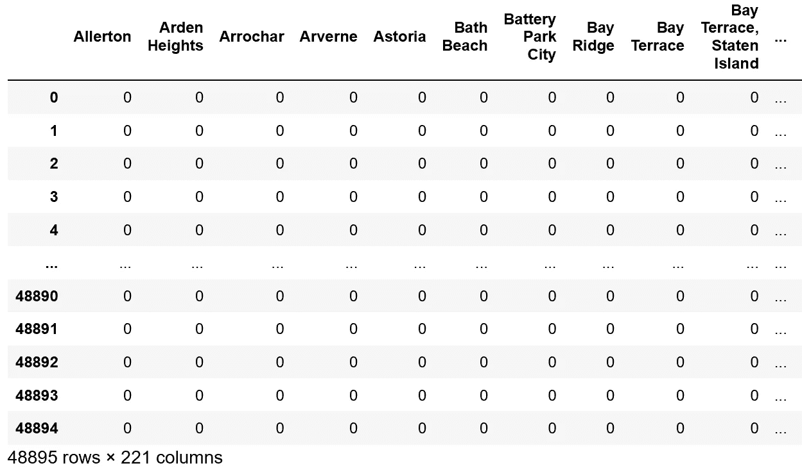

它甚至按字母顺序排列我们的栏目！

# 3 | pandas.qcut(x，分位数)

通常，对于回归任务(例如，在本例中预测 Airbnb 房源的价格)，将价格范围离散为几个分位数(大小相等的桶)可能会有所帮助。在分位数可接受的情况下，这可以提高精确度并减少模型的不确定性。

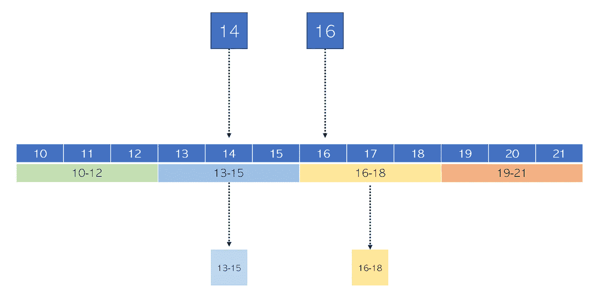

将变量离散化为分位数。原象

熊猫可以用`.qcut`自动为你离散化变量。

假设我们想要将`price`变量离散化为四个分位数。pandas 会自动将价格区间分成你指定的任意数量的分位数。请注意，pandas 将价格范围分成几个桶，每个桶中有相同数量的商品。

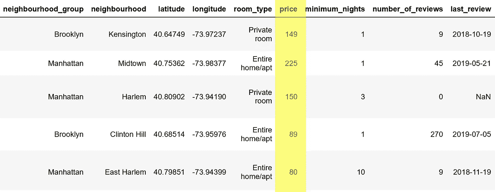

```
pd.qcut(data['price'],4) #second number specifies num of quantiles
```

生产

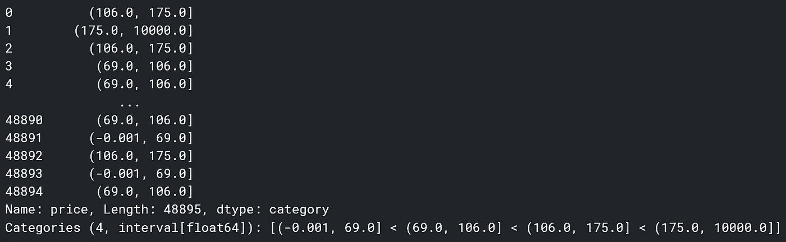

这是一系列的区间对象。在每个间隔中有偶数个对象。看着系列中的第一个物体，

```
pd.qcut(data['price'],4)[0]
```

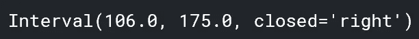

…它是一个区间对象。您可以通过应用`str()`将其转换成可读性更好的形式。

```
str(pd.qcut(data['price'],4)[0])
```

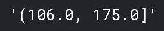

您可以使用`.apply()`将该功能应用于整个系列。然后，如果你喜欢，你可以使用。因式分解对离散化样本进行标签编码。使用这个函数和前面的`.factorize`函数的一个好处是，与某些情况不同，标签编码(而不是之后使用`.get_dummies`的一次性编码)本身是可以的。

一键编码背后的原因是标签编码指定标签之间的数字关系，例如说肯辛顿比哈莱姆小，而对象不能进行数字比较。然而，离散样本可以，因为他们是从一个数字，连续线。

请注意，如果您不希望分位数被分割成每个箱中有相等数量的数据点，而是将范围定量地分成相等的部分，请使用`pandas.cut`。它与`pandas.qcut`接受相同的参数并起相同的作用。

```
pd.cut(data['price'],4)
```

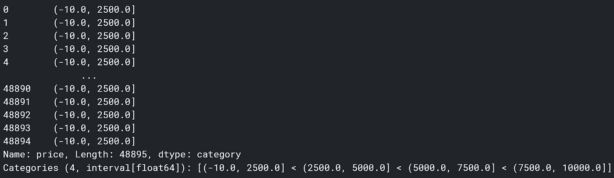

# 4 | pandas.to_datetime(x)

转换数据对象是数据清理和数据操作中最令人沮丧的方面之一，其中最令人沮丧的可能就是日期。它们以如此多的形式出现，以如此多的方式编写，以至于将它们全部转换成一个干净的 datetime 对象是一件麻烦的事情。

输入熊猫的`to_datetime`。这个函数可以合理地推断任何日期，并将其转换为 datetime 对象，而不需要导入 datetime 或任何其他模块！

让我们用不同的命名协议创建四列:

```
data['date1'] = '1,2,2019'
data['date2'] = '1/2/2019'
data['date3'] = '1-2-2019'
data['date4'] = '1.2.2019'
```

…然后应用`to_datetime`看看熊猫是怎么转换的。

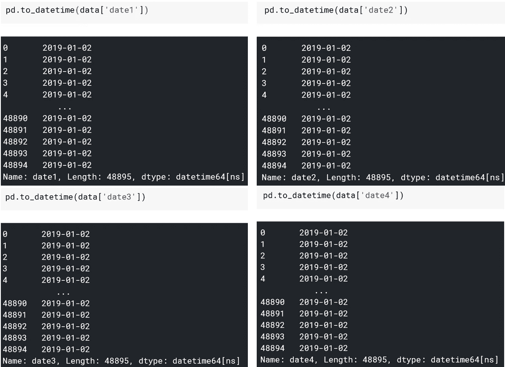

熊猫自动为你转换一切！如果日期的排列有点不同，熊猫也可以接受描述月、日和年的排列的字符串。

# 5 |熊猫。数据框架

矩阵的转置功能是当 *x* 和 *y* 轴相互交换时，因此矩阵反映在对角线上。

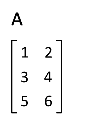

[来源](https://upload.wikimedia.org/wikipedia/commons/e/e4/Matrix_transpose.gif)。图像免费分发和商业使用。

这对数据帧也很有帮助。例如，看看这个按日期排列的每个国家因冠状病毒死亡的时间序列数据。

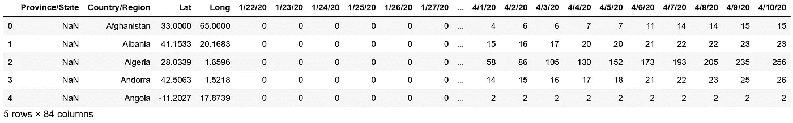

只选择美国来绘制数据，并删除国家、省、纬度和经度等列，我们得到了一个奇怪的数据形状。

```
us = data[data['Country/Region'] == 'US']
us.drop(['Province/State','Country/Region','Lat','Long'],axis=1,inplace=True)
us
```

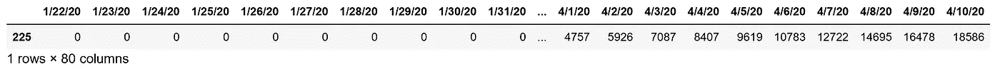

处理这个问题的简单方法是将每个列值复制到一个 numpy 数组中进行可视化。然而，有了移调功能，就简单了。

```
us = us.T
us
```

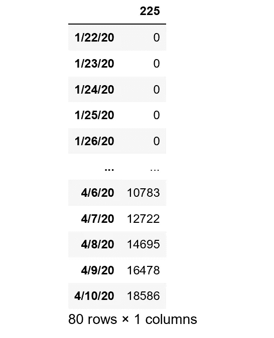

从这里绘图很容易。

```
us.plot()
```

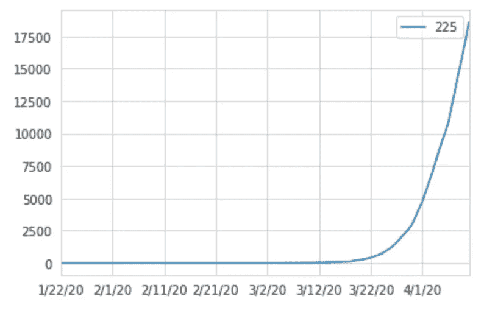

那省了我们很多工作！

# 6 |熊猫。DataFrame.drop_duplicates()

数据中的一个大问题是重复数据。在从多个来源收集的数据中，重复数据通常会出现，从而导致重复行。太多重复的行会使分析或机器学习模型产生偏差，因此删除它们非常重要。

熊猫有一个默认的删除重复的功能，`drop_duplicates()`。

让我们设置第一行等于第二行，然后删除任何重复的。

```
data.loc[1] = data.loc[0]
data.drop_duplicates()
```

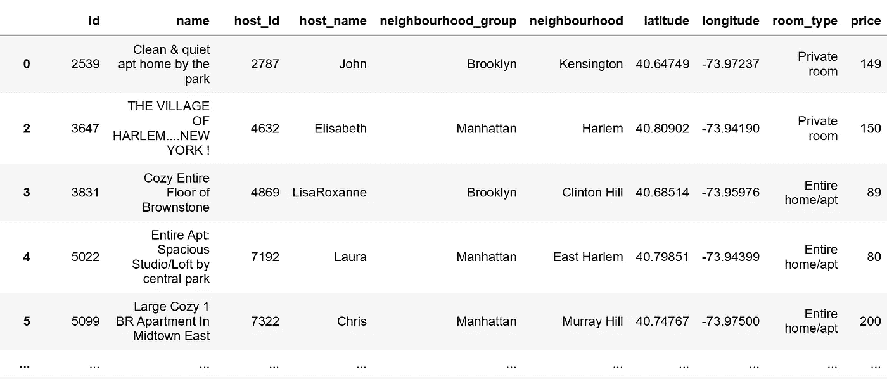

向右多列。

第一排没了。出于演示的目的，我们保留了索引以演示第一行中的分隔符(第一个索引，第二个“行”，如果您想这样引用它的话)。然而，`.drop_duplicates()`接受了一个额外的可选参数`ignore_index`，如果设置为 True，将创建一个不会被删除中断的连续索引。

# 7 |熊猫。Series.clip()

离群值。他们搞砸了分析，丢弃了数据。为了处理异常值，pandas 有一个方便的函数。clip()，不仅要删除异常值，还要删除数据中的潜在错误(比如我最近在一个数据集中看到的，冠状病毒病例数量为负数)。

`.clip()`接受两个参数——一个上限和一个下限——并将上限以上的任何值赋给上限，下限以下的任何值赋给下限。

例如，假设 Airbnb 有一个规则，人们可以列出他们的财产的最高价格是 125 美元，最低价格是 100 美元，超出这些界限的任何东西都是错误的(夸大的假设)。

供参考，原始价格:

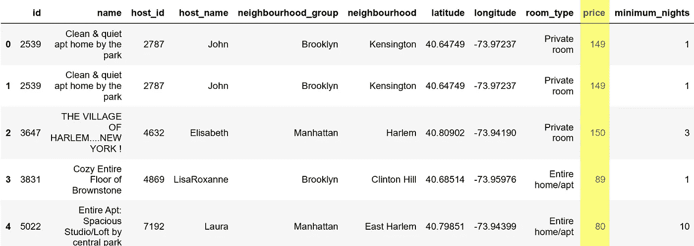

让我们将 price 列设置为其自身的一个裁剪版本，其下限和上限是我们从真实世界上下文中理解的。

```
data['price'] = data['price'].clip(100,125)
data.head()
```

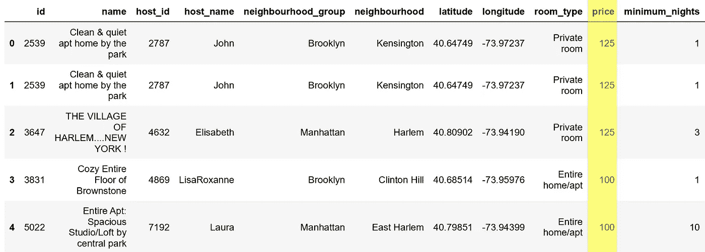

所有高于 125 美元的价格都被设置为 125 美元，任何低于 100 美元的价格都被设置为该值。`.clip()`应始终与上下文知识一起应用，以确保没有错误，或/和与统计异常值界限一起使用。

# 感谢阅读！

我希望这七个功能能够让你的数据操作、清理和分析更加顺畅。