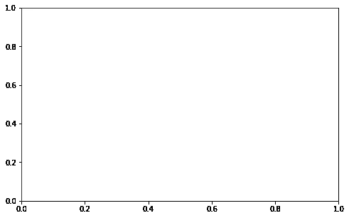
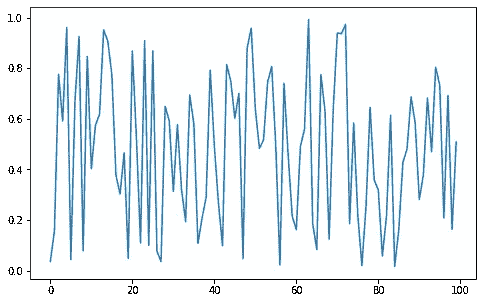
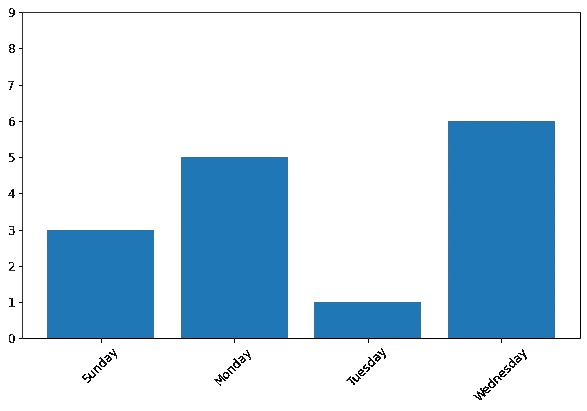
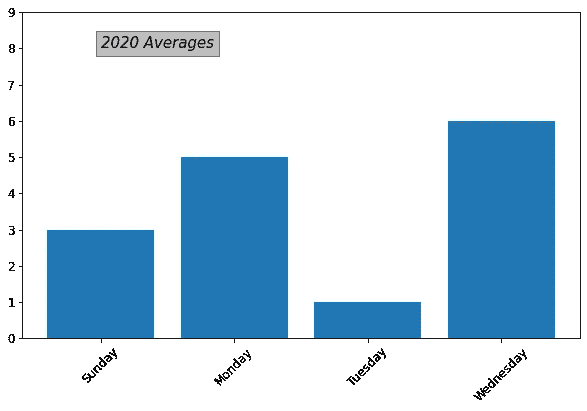
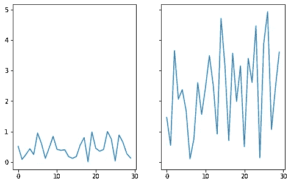
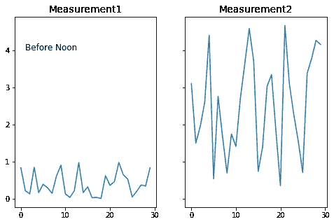

# 更有效地使用 Matplotlib 的 7 个要点

> 原文：<https://towardsdatascience.com/7-points-to-use-matplotlib-more-efficiently-53a1b318b8b1?source=collection_archive---------41----------------------->

## 理解结构，美化你的情节


卢卡斯·本杰明在 [Unsplash](https://unsplash.com/s/photos/paint?utm_source=unsplash&utm_medium=referral&utm_content=creditCopyText) 上的照片

Matplotlib 是一个广泛使用的 Python 数据可视化库。在某些情况下，它的语法可能很乏味，但它提供了对情节的大量控制。

在这篇文章中解释的七点都与 matplotlib 的结构和对绘图做小调整的语法有关。

重要的是要很好地了解结构，以便我们理解如何创建和渲染复杂的情节。因此，我们将从结构概述开始。然后，我们会看到几个有助于创造高级剧情的招数。

## **1。脚本层**

Matplotlib 由三层组成。


(图片由作者提供)

脚本层是 matplotlib.pyplot 接口。当我们在下面的命令后使用“plt”创建图时，脚本层就是我们所使用的。

```
import matplotlib.pyplot as plt
```

脚本层使得创建情节相对容易，因为它自动化了将所有东西放在一起的过程。因此，它是数据科学家使用最广泛的图层。

## 2.后端层

除非你是开发人员，否则不要太担心这一层。后端层由三个抽象类组成，分别是 FigureCanvas、Renderer 和 Event。下面的类比将为后端层如何工作提供一些见解。

假设你想画一幅画。你得到一张白纸(图画布)和一个画笔(渲染器)。你问你朋友画什么(事件)。

## 3.艺术家层

这一层由艺术家对象组成。它是 Matplotlib 的核心对象。我们在图上看到的一切都是 artist 对象的一个实例。

有两种类型的艺术家对象:

*   复合:图形，轴
*   图元:直线、圆、文本

## 4.图形和轴

人物是艺术家的主要对象，它将一切联系在一起。假设你为晚餐准备了 4 种不同的开胃菜。你不能用手端给他们。上菜的好方法是把它们放在盘子里。盘子是图形对象，开胃菜是绘图的组成部分，如线条、刻度、标签等。

让我们使用脚本层创建一个图形。

```
import matplotlib.pyplot as pltplt.figure()
<Figure size 432x288 with 0 Axes>
```

我们创建了一个图形，但上面没有任何内容可以构成一个情节。我们需要向 Figure 添加一个 Axes 对象来创建一个实际的绘图。

```
plt.figure(figsize=(8,5)).add_subplot()
```



(图片由作者提供)

因为没有数据，所以还是一个空图。绘图功能可用于将数据传递给轴。

```
arr = np.random.random(100)
plt.figure(figsize=(8,5)).add_subplot().plot(arr)
```



(图片由作者提供)

我们已经看到了 Matplotlib 结构的概述。下一个技巧将是关于如何在图上做小的调整。

## **5。Xticks 和 Yticks**

这些功能用于调整 x 轴和 y 轴上的刻度标签和位置。默认设置通常是合适的，但在某些情况下可能需要进行细微的调整。

下面是 xticks 和 yticks 用于修改绘图的示例。

```
plt.figure(figsize=(10,6))
plt.bar(x=[1,2,3,4], height=[3,5,1,6])plt.xticks(ticks=[1,2,3,4],
labels=['Sunday','Monday','Tuesday','Wednesday'], rotation="45", fontsize=12)plt.yticks(ticks=np.arange(10), fontsize=12)
```



(图片由作者提供)

旋转参数旋转标注，这在长标注的情况下非常有用。它们甚至可能重叠，这绝对不是所希望的。

如果我们不调整，y 轴上的范围将是 0-6。我认为如果顶部有一个空间会更好看。我有时会利用这个空间添加文本或注释。

## **6。添加文本**

文字可以用来指出某事或给情节增加额外的信息。text 函数提供了一种灵活的方式，可以调整文本的位置、字体大小和样式。我们甚至可以把文本放在一个盒子里。

以下代码将在前面的绘图中添加一个文本框。

```
plt.text(1, 8, '2020 Averages', style='oblique', fontsize=15,
bbox={'facecolor': 'grey', 'alpha': 0.5, 'pad': 5})
```



(图片由作者提供)

文本功能可应用于 pyplot (plt)界面或 Axes 对象。

## **7。创建一个有支线剧情的人物**

在某些情况下，我们需要在同一个图形上有多个图。Matplotlib 提供了不同的方法来生成这样的图。subplots 函数创建一个具有一组 subplots 的图形。

我们指定行数和列数，然后创建一个绘图网格。支线剧情的数量是行数和列数的乘积。

```
fig, (ax1, ax2) = plt.subplots(nrows=1, ncols=2,
                               sharey=True, figsize=(8,5))ax1.plot(np.random.random(30))
ax2.plot(np.random.random(30)*5)
```



(图片由作者提供)

因为每个子情节都被分配给一个 axes 对象，所以我们可以完全控制它们。下面的代码将分别编辑 ax1 和 ax2。

```
ax1.set_title("Measurement1", fontsize=14)
ax1.text(1,4, "Before Noon", fontsize=12)ax2.set_title("Measurement2", fontsize=14)
```



(图片由作者提供)

> 注:除非另有说明，所有图片均由作者创作。

# **结论**

我们在这篇文章中介绍的只是 Matplotlib 功能的一小部分。我分享的一些信息可以被认为是细节，而其中一些是非常基本的。然而，它们都有助于充分利用 Matplotlib。

和其他学科一样，掌握 Matplotlib 的最好方法是实践。一旦您熟悉了基本功能，就可以继续使用更高级的功能。

感谢您的阅读。如果您有任何反馈，请告诉我。