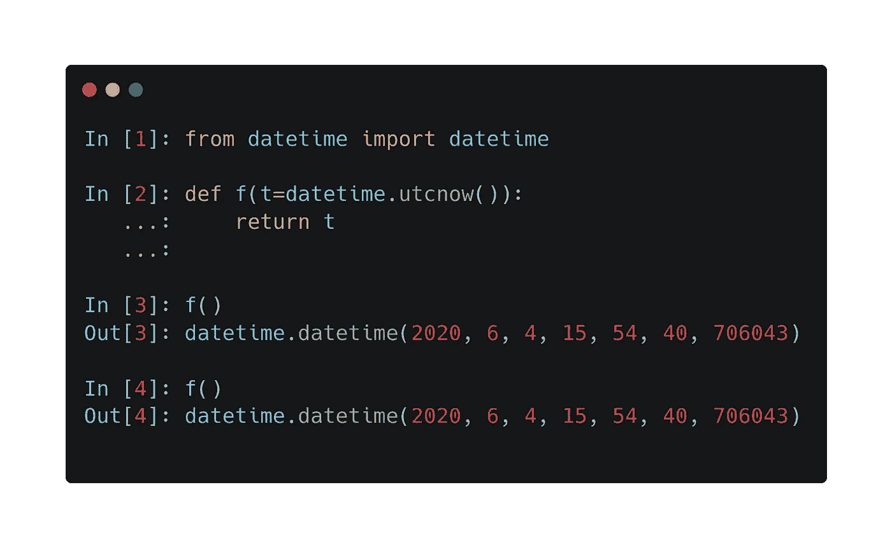
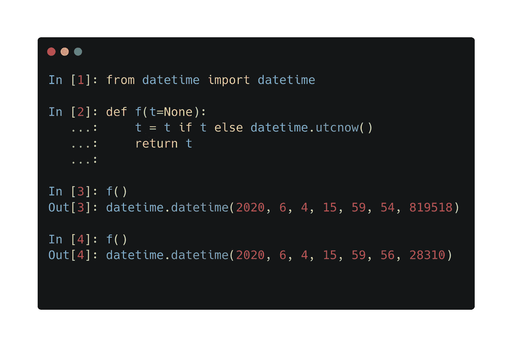
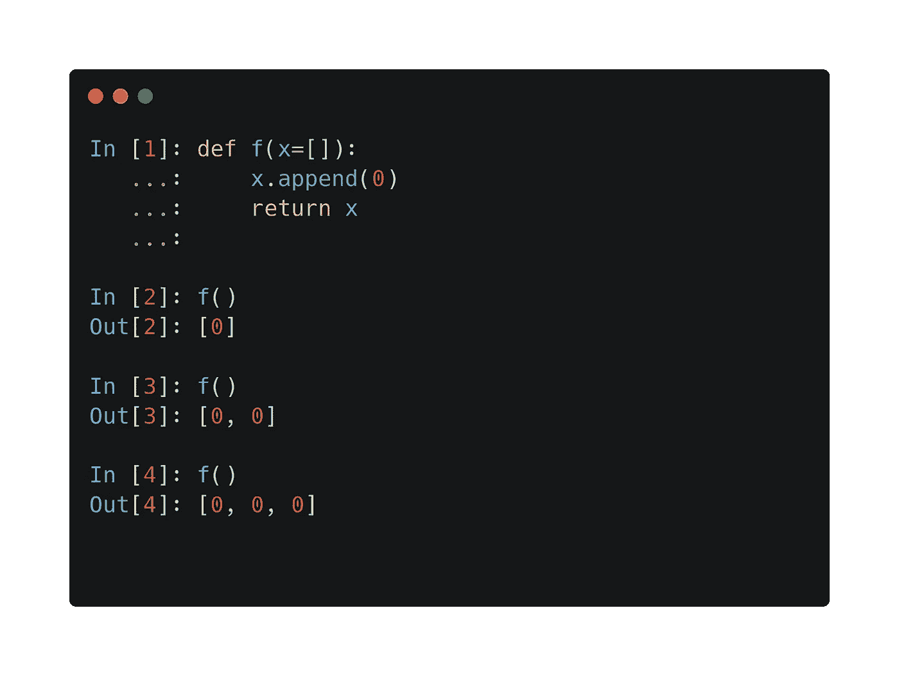
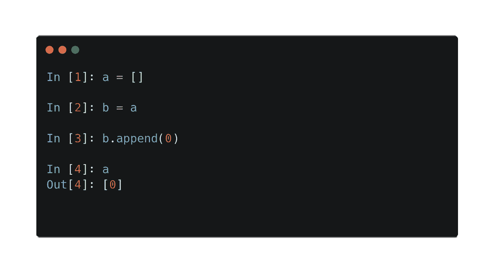
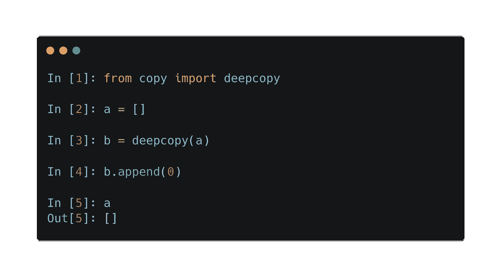

# 你不想犯的 7 个 Python 错误

> 原文：<https://towardsdatascience.com/7-python-mistakes-you-dont-want-to-make-77ac068c847?source=collection_archive---------13----------------------->


照片由[伊万·阿列克西奇](https://unsplash.com/@ivalex?utm_source=medium&utm_medium=referral)在 [Unsplash](https://unsplash.com?utm_source=medium&utm_medium=referral) 上拍摄

## 注意这些可以节省几天的调试时间

早上开始得很完美。甚至在我喝完咖啡之前，我就已经完成了一部新电影。我的生产率直线上升。那时候我还不知道，好得不像真的。

这个问题只花了几个小时就浮出水面了。然而，找到问题的根源需要更多的时间。修复需要一整天的时间。那时我还是个初学者。由此，我学到了关于 Python 中列表的重要一课。

这听起来熟悉吗？这发生在每个人身上，但是从别人的错误中学习总是更好的。在本帖中，我收集了其中的七个，可以为你节省无数个小时的调试时间。

# 1.有副作用的函数

由于 Python 不是像 Haskell 那样的纯函数式语言，函数会产生副作用。严格来说，这不算是*失误*，但是很容易无意中把事情搞砸。下面的例子说明了这个问题。


在 Python 中，对象是*引用类型。所以当你传递一个列表作为参数时，传递的是一个引用而不是值。这意味着如果你在一个函数中改变它们，这些变化将会反映到外部。*

这可能会导致一些令人讨厌的意外和数小时的调试。(见我的介绍。)提防这些，早点给自己省事。

# 2.默认参数中的函数调用

默认参数有时会很难使用。看看下面。



为什么每次调用的返回值都一样？原因是 Python 在定义函数时会计算默认参数中的表达式。如果希望动态生成默认参数，可以执行以下操作。



# 3.可变默认参数

这个问题是以上两者的结合。你遇到过以下场景吗？



这里发生了两件事。

1.  当函数被定义时，Python 对表达式`[]`求值。(这相当于调用`list()`。)
2.  此对象的引用被绑定到参数。因此，无论何时调用该函数，都将使用同一个对象。

因此，使用可变对象作为默认参数不是一个好主意。你永远不应该那样做。

# 4.意外的参考分配

正如我们所见，Python 中的每个对象都是一个引用类型。除了将它们传递给函数之外，这会导致一些混乱。请参见以下示例:



当你执行`b = a`时，你实际上存储的是`a`的*引用*。因此，`a`和`b`指向同一个对象。要解决这个问题，你应该使用内置的`deepcopy`函数。这会递归地将所有的*值类型*属性复制到新变量中。



如果你用整数而不是列表来做同样的尝试，一切都会如你所料。原因是整数类型是不可变的，所以当你改变它们时，你覆盖了引用。

# 5.从进口的东西*

我知道，我们都曾经这样做过。这有几个缺点。

首先，不同名称空间中的函数可能具有相同的名称，这会在整个代码库中造成混乱。

第二，当您在 Python 中导入一个模块时，该模块中的所有代码都将被执行。如果有许多子模块要导入，这会大大降低速度。因此，如果您只导入 NumPy 来生成随机数，那么您可能更适合使用

```
from numpy.random import random
```

比

```
import numpy as np
```

# 6.用字符串串联连接路径

假设您必须从变量`data_folder`给出的文件夹中打开一个名为`data.csv`的文件。应该如何确定文件路径？如果你在做

```
data_path = data_folder + "/data.csv"
```

那你做的不对。例如，这在 Windows 上是行不通的。您可能没有亲身经历，但是您的使用不同开发设置的同事肯定会感受到这种痛苦。

要解决这个问题，您应该使用 Python 的内置工具`pathlib`，或者简单地使用`os.path.join`函数:

```
data_path = os.path.join(data_folder, "data.csv")
```

# 7.低测试覆盖率

这是一个高层次的问题。尤其是当你是一个初学者时，单元测试的好处并不清楚。然而，每个经验丰富的开发人员都可以告诉你，这是绝对必要的。使用未经测试的代码就像玩打地鼠游戏:修复一个错误，引入另一个错误。

从项目一开始就要避免这种情况。一旦您添加了一个特性(甚至是一个功能)，您就应该编写测试用例来验证实现。这方面有几个很棒的库，例如内置的 [unittest](https://docs.python.org/3.4/library/unittest.html) 或者非常流行的 [pytest](https://docs.pytest.org/en/latest/) 。

你应该认真投入时间测试你的代码。这可能需要一些时间，但这是一项长期投资。您将节省更多的调试时间。

# 摘要

简而言之，这是你在 Python 中可能犯的七个最痛苦的错误。在您追求 Python 熟练程度的过程中，您肯定会遇到更多。然而，有了这个指南，你将有知识避免最常见的错误。

现在去建造一些令人敬畏的东西吧！:)

(通过适当的单元测试。)

[***如果你喜欢把机器学习概念拆开，理解是什么让它们运转，我们有很多共同点。看看我的博客，我经常在那里发表这样的技术文章！***](https://www.tivadardanka.com/blog)