# 让你的代码更好更聪明的 7 个 Python 技巧

> 原文：<https://towardsdatascience.com/7-python-tricks-to-make-my-code-better-and-smarter-60dfde0b6c49?source=collection_archive---------16----------------------->

## 我希望我早点知道的技巧


由 [Max Duzij](https://unsplash.com/@max_duz?utm_source=medium&utm_medium=referral) 在 [Unsplash](https://unsplash.com?utm_source=medium&utm_medium=referral) 上拍摄的照片

我是一名工程师。我在大学学过 Fortran 和 MATLAB 来解决像能量和传质这样的工程问题，但是我没有扎实的软件工程训练。当我最近开始为数据科学和机器学习学习 Python 时，我是以一种“面向结果”的方式进行的，这使得我的代码有点混乱和低效。

通过我的自学之旅，我发现几个 Python 函数极大地改进了我的代码。我希望在这篇文章中分享 7 个 Python 技巧，我希望我作为初学者能早点知道。

# 1.列表理解

**列表理解节省时间和代码。**与使用循环相比，这是一种生成列表的简单方法。

我们来看一个例子:我们有一个列表:x，包含 5 个整数，我们想做一个列表，x_square，包含 x 中 5 个整数的平方。

for 循环方法如下所示:

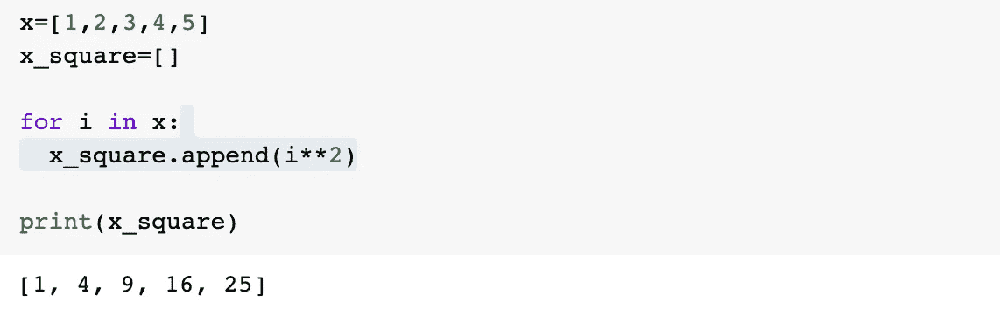

列表理解可以在一行代码中完成同样的工作:

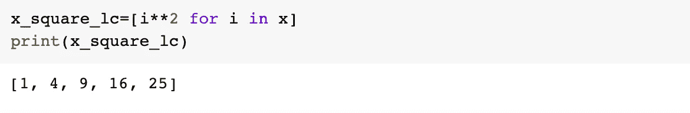

它还可以包含一个**条件**，比如我们只想要一个包含大于 2 的整数平方的列表。对于循环方法，我们可以添加一个 if 语句:

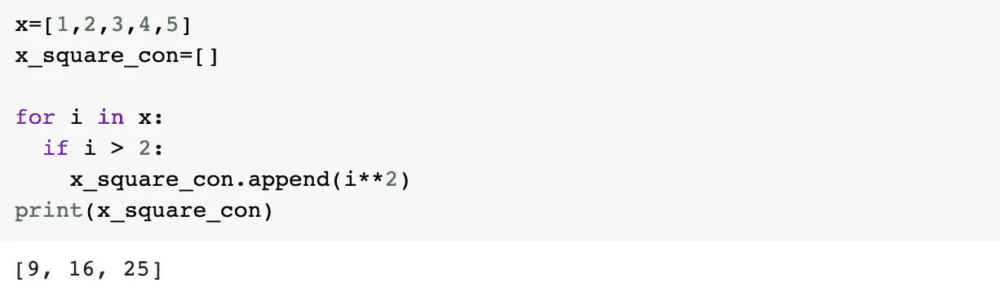

列表理解:在末尾添加条件——仍然是一行代码

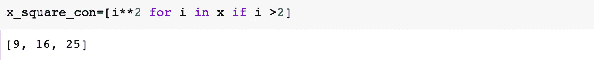

# 2.λ函数

`lambda`是一个小型匿名函数，其行为类似于普通函数。

例如，一个计算平方的函数可以定义为:

```
def cal_square(x):
   returm x**2
```

使用一个`lambda`函数，可以这样做

```
cal_square = lambda(x:x**2)
```

使用自己定义函数对事物进行排序非常方便，例如:

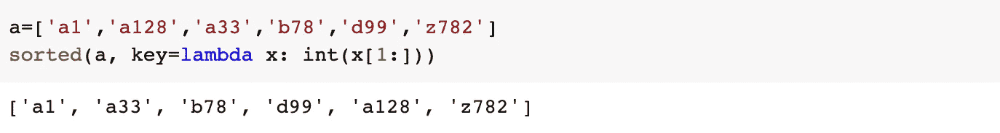

使用`apply`操作熊猫数据框也非常有用:

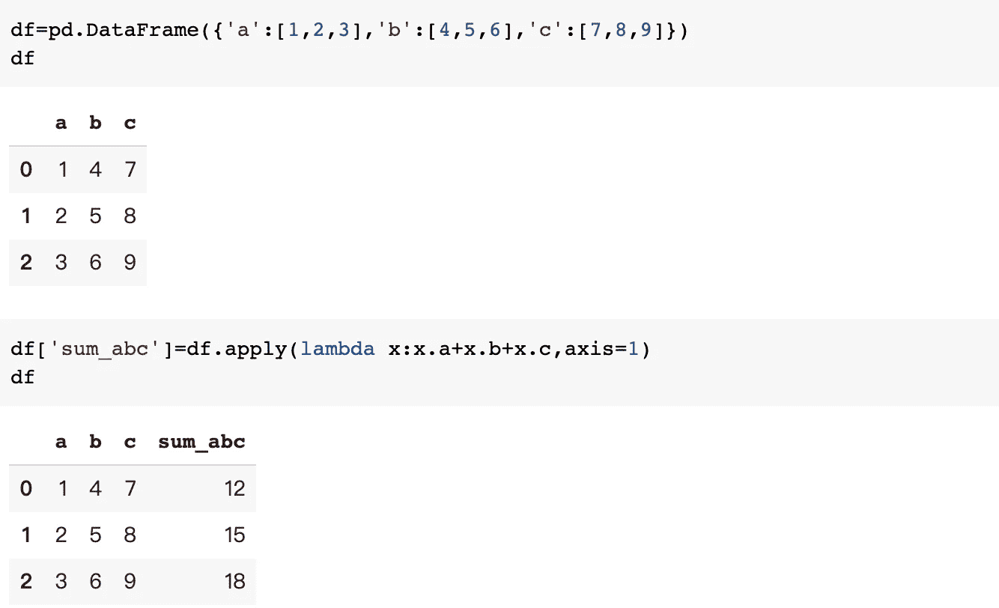

# 3.地图()

`map`以一个函数和一个列表作为参数，它将函数应用于列表中的每一项。它确实很方便，因为它避免了使用循环，而且速度更快。

以一个简单的函数为例，如果我们想计算列表中每一项的平方，我们可以定义一个函数来进行计算，并使用`map()`将该函数应用到列表中

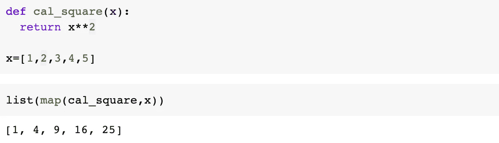

## 4.过滤器()

顾名思义，`filter`对列表应用过滤器并返回满足条件的条目。如果我们只想要列表中的肯定项，我们可以定义一个过滤函数，然后将`filter`应用到列表中。

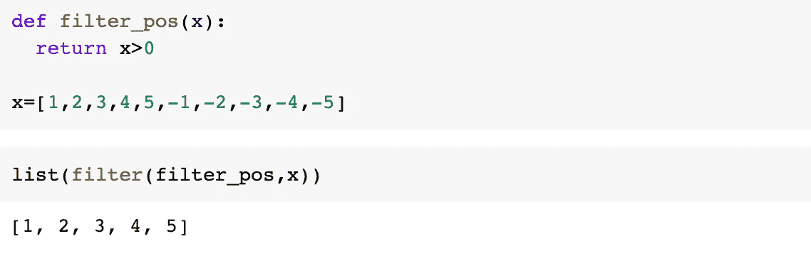

这里也可以用`lambda`来简化。

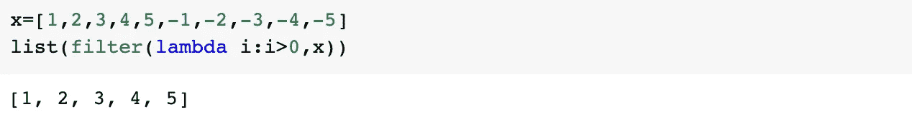

## 5.加入()

`join`是一种将字符串连接在一起的方法。连接字符串的直接方法是使用`+`，例如:

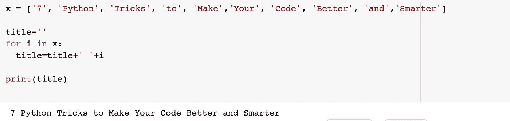

这可以通过使用`join`更容易地完成:

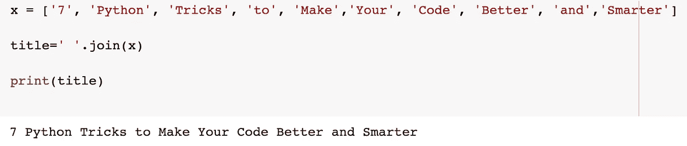

## 6.枚举()

`enumerate`给数据添加计数器。例如:

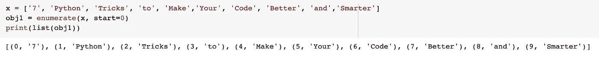

在循环中使用非常有用:

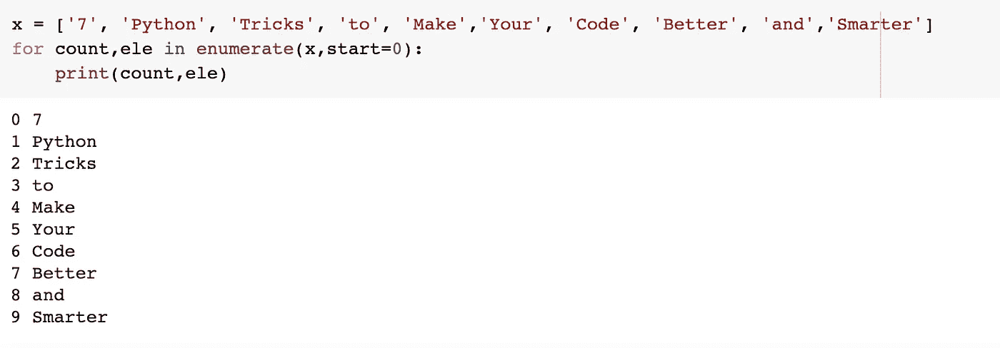

## 7.格式()

`format()`是 Python3 中的一种字符串格式化方法。用多个变量生成或打印字符串是很方便的。

例如:

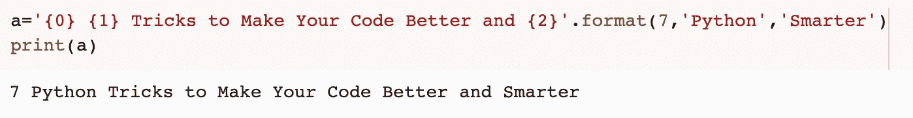

它在循环中非常有用:

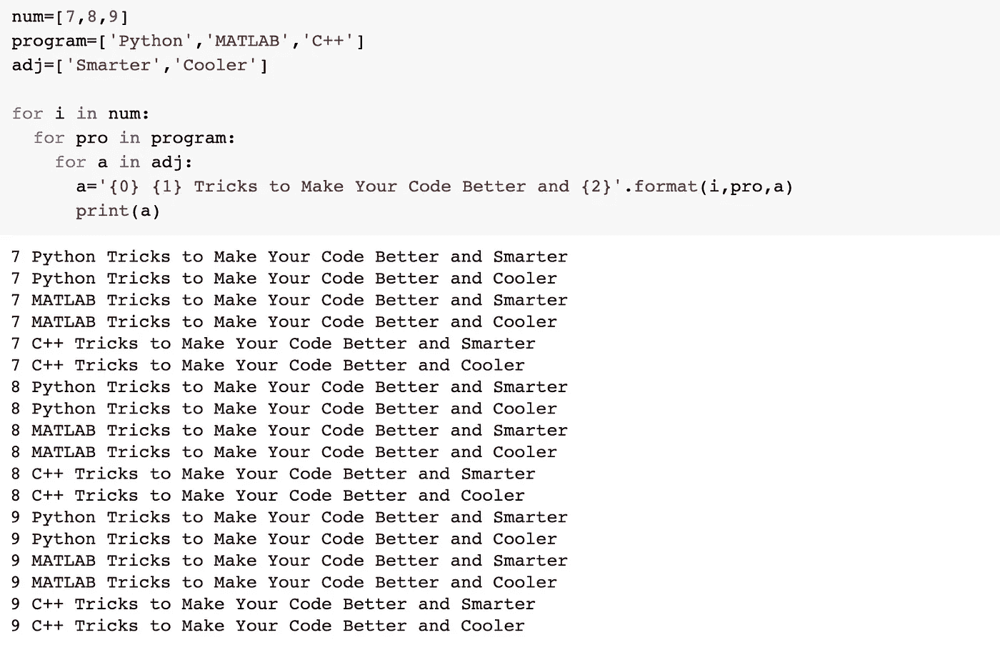

您也可以使用`.5f`摆弄数字:

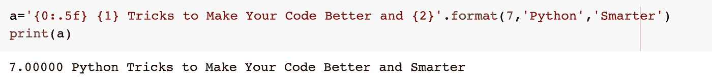

f 弦是另一种玩弦的方式，它甚至更聪明，避免了长线。

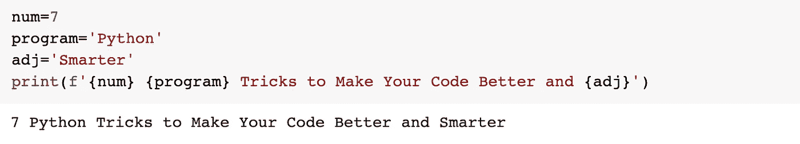

就是这样。这些技巧使我的代码更简单、更好，而不用编写不必要的循环。希望这些招数也能帮到你。

感谢阅读，编码快乐。

我还写了关于 Numpy 和熊猫的文章，有兴趣的可以看看！

[](/7-numpy-tricks-to-make-my-code-better-and-smarter-9e8a4ccf43d1) [## 让我的代码更好更聪明的 7 个小技巧

### 我希望我早点知道的技巧

towardsdatascience.com](/7-numpy-tricks-to-make-my-code-better-and-smarter-9e8a4ccf43d1) [](/10-pandas-tricks-to-make-my-data-analyzing-process-more-efficient-part-1-78a0cc1636f3) [## 让我的数据分析过程更高效的 10 个熊猫窍门:第 1 部分

### 我希望我早点知道的技巧

towardsdatascience.com](/10-pandas-tricks-to-make-my-data-analyzing-process-more-efficient-part-1-78a0cc1636f3) 

[https://towards data science . com/10-pandas-tricks-to-make-my-data-analyzing-process-more-efficient-part-2-b 72 ea 43 A0 bb 5](/10-pandas-tricks-to-make-my-data-analyzing-process-more-efficient-part-2-b72ea43a0bb5)