# 基于阿里云容器服务为 Kubernetes (ACK)构建 AI/ML 项目的 7 个理由

> 原文：<https://towardsdatascience.com/7-reason-to-build-your-ai-ml-project-on-alibaba-cloud-container-service-for-kubernetes-ack-423f84bb448d?source=collection_archive---------72----------------------->

来源:截图来自[阿里云原生日](https://www.alibabacloud.com/campaign/cloud-native-day?utm_campaign=eloqua_nonreg_yes_IDN_CloudNativeDay2nd_20200521&utm_medium=email&utm_source=Eloqua&utm_content=eloqua)

作为数据科学家，我们在大规模运行 AI/ML 项目时经常面临一些挑战。

首先，我们需要端到端的支持来做 AI/ML 实验，包括平台来做数据准备，建立/训练/评估模型，并将模型发布到生产中。有时我们需要多个平台来执行这些特定的任务。

第二，为了支持端到端的实验，我们需要异构的资源类型和管理，以便我们可以有一个高效的项目。

最后，为了能够连续大规模地训练和服务我们的模型，我们还需要找到一种经济高效的方法，这可以通过按需将资源使用从零扩展到数千的能力来实现。

那么，我们如何应对这些挑战呢？

下面我要介绍一下 Kubernetes (ACK)的阿里云容器服务。这种容器服务是由阿里云提供的，以应对这些挑战。ACK 可以支持从数据准备、开发、训练、推理、操作、存储、计算引擎和网络管理端到端 AI/ML 项目。

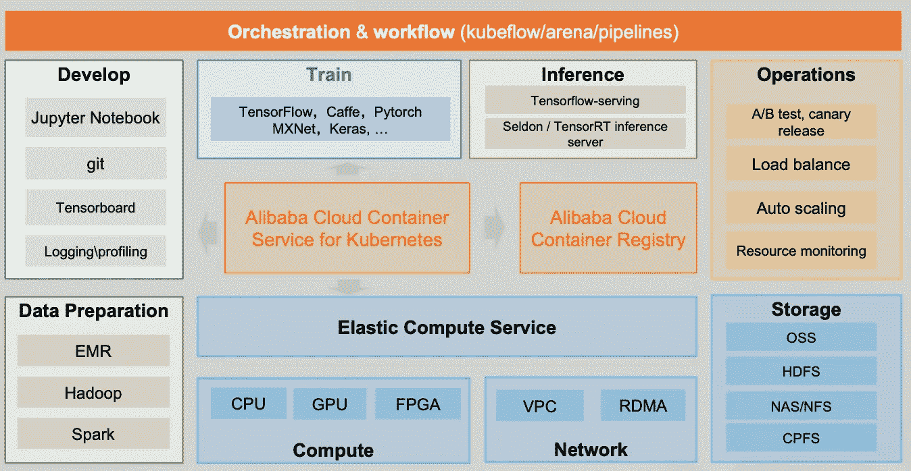

确认时的业务流程。张开在[阿里云本土日](https://resource.alibabacloud.com/webinar/detail.html?spm=a3c0i.14525383.1365508910.9.4c8091e1S9TMGs&id=1894)上的图片

ACK 还提供了该解决方案支持的六个主要特性，这些特性将在本文中描述。

# ACK 上云原生 AI/ML 解决方案的关键特性

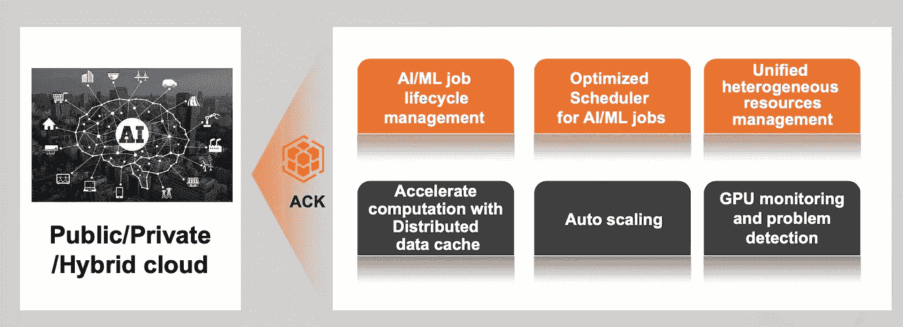

ACK 的主要特性。张开在[阿里云诞生日](https://resource.alibabacloud.com/webinar/detail.html?spm=a3c0i.14525383.1365508910.9.4c8091e1S9TMGs&id=1894)的图片

## 1.AI/ML 作业生命周期管理

ACK 使用 Kuberflow 和 Arena 作为生命周期管理工具。Kuberflow 是 K8s 本地平台，用于使用 Kubernetes 构建可移植的 ML 解决方案。有了 Kuberflow，我们可以让机器学习工作流在 Kubernetes 上的部署变得简单、可移植、可扩展。

ACK 也有 Arena 让数据科学家的生活更轻松。Arena 是一个命令行界面，用于运行和监控机器学习训练、推理作业，并轻松检查它们的结果以及实时的 GPU 利用率。Arena 还拥有对 Python 和 Java 的 SDK 支持，可以快速集成到用户的平台中。

要获得关于 Kuberflow 和 Arena 的更多信息，请通过以下链接查看 Github 页面:

 [## 库贝弗洛

### 解散 GitHub 是超过 5000 万开发者一起工作的家。加入他们，发展您自己的开发团队…

github.com](https://github.com/kubeflow) 

[https://github.com/kubeflow/arena](https://github.com/kubeflow/arena)

## 2.AI/ML 作业的优化调度程序

ACK 支持多种资源分配模式，包括:

*   一伙
*   拓扑感知
*   传播
*   Binpack
*   捆

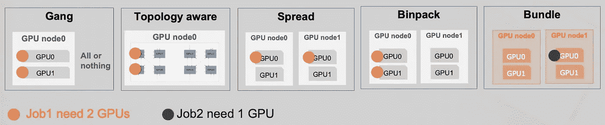

资源分配模式。张开在[阿里云本土日](https://resource.alibabacloud.com/webinar/detail.html?spm=a3c0i.14525383.1365508910.9.4c8091e1S9TMGs&id=1894)上的图片

此外，ACK 具有多种类型的调度策略:

*   先进先出。比较 LIFO
*   容量
*   公平分配

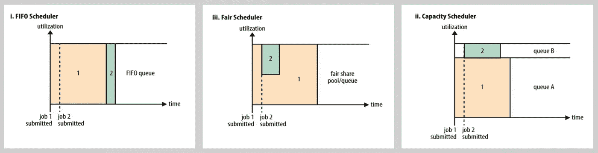

ACK 调度策略。张开在[阿里云诞生日](https://resource.alibabacloud.com/webinar/detail.html?spm=a3c0i.14525383.1365508910.9.4c8091e1S9TMGs&id=1894)的图片

## 3.统一异构资源管理

ACK 支持各种资源管理来管理各种资源类型。

*GPU 管理*

ACK 支持全自动的 GPU 设置、调度、监控和管理。ACK 还通过在特定场景的多个容器之间共享一个 GPU 设备来实现优化的 GPU 利用率。此外，ACK 提供了 GPU 扩展能力，以按需处理工作负载变化。

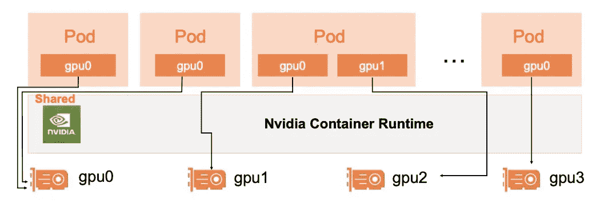

GPU 分享图解。张开在[阿里云诞生日](https://resource.alibabacloud.com/webinar/detail.html?spm=a3c0i.14525383.1365508910.9.4c8091e1S9TMGs&id=1894)拍摄的图片

*VGPU 管理*

这种 VGPU 管理通过 GPU 共享提高了 GPU 利用率，同时确保了多租户的隔离。ACK 支持多种虚拟化比率选择，包括 1:2、1:4、1:8，没有额外的许可证要求。这个 VGPU 适合 AI 推理和图形工作负载。

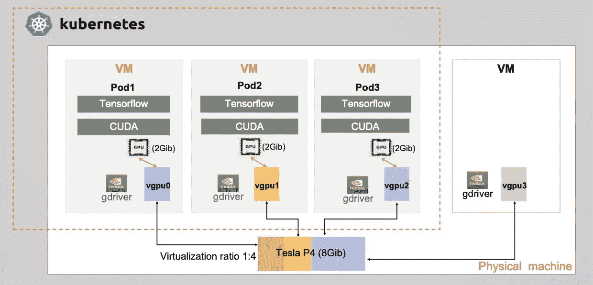

VGPU 模式。张开在[阿里云诞生日](https://resource.alibabacloud.com/webinar/detail.html?spm=a3c0i.14525383.1365508910.9.4c8091e1S9TMGs&id=1894)的图片

*阿林普(汉光 800)*

汉光 800 是阿里巴巴做的 AI 推理的神经处理单元。这个单元可以帮助更快更有效地执行机器学习任务。

ACK 有助于提高设备和内核级调度的利用率。ACK 还带来了统一的调度、扩展、监控和管理，以支持端到端的人工智能项目生命周期。

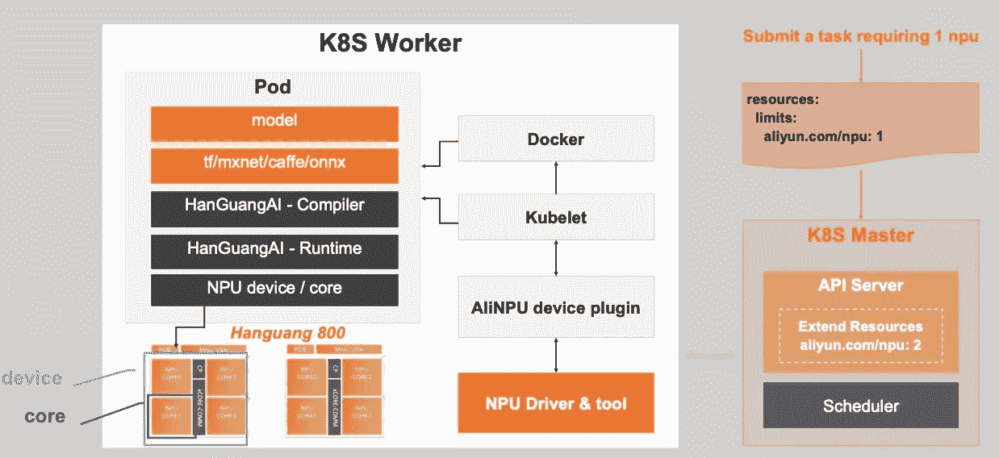

汉光 800 在器件或内核级的应用。张开在[阿里云诞生日](https://resource.alibabacloud.com/webinar/detail.html?spm=a3c0i.14525383.1365508910.9.4c8091e1S9TMGs&id=1894)的图片

*FPGA 管理*

ACK 可以加速 FPGA H265 编码器的交付，并按需扩展实例。

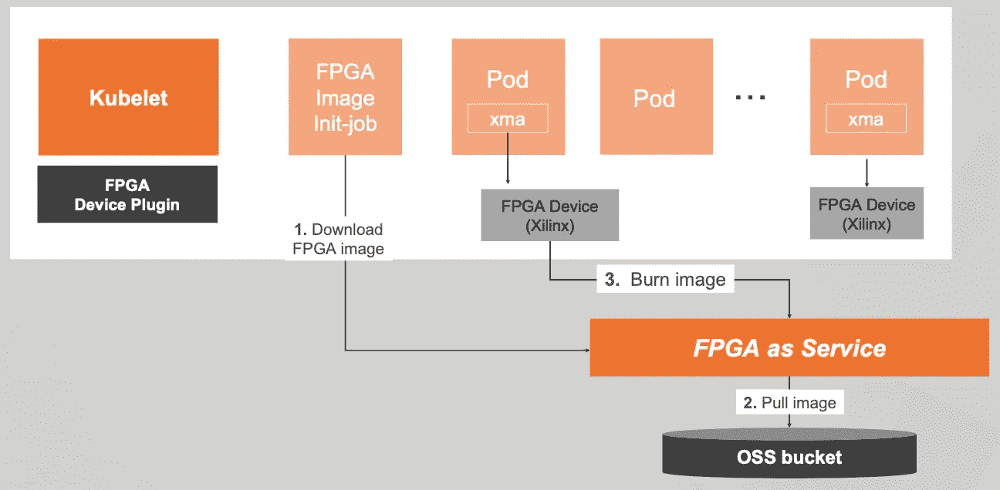

FPGA 管理。张开在[阿里云诞生日](https://resource.alibabacloud.com/webinar/detail.html?spm=a3c0i.14525383.1365508910.9.4c8091e1S9TMGs&id=1894)拍摄的图片

*RDMA 管理*

ACK 可以在 Kubernetes 中为 HPC 和深度学习工作负载调度和管理 RDMA 设备。ACK 能够与英伟达 NCCL 集成，以加速分布式培训。

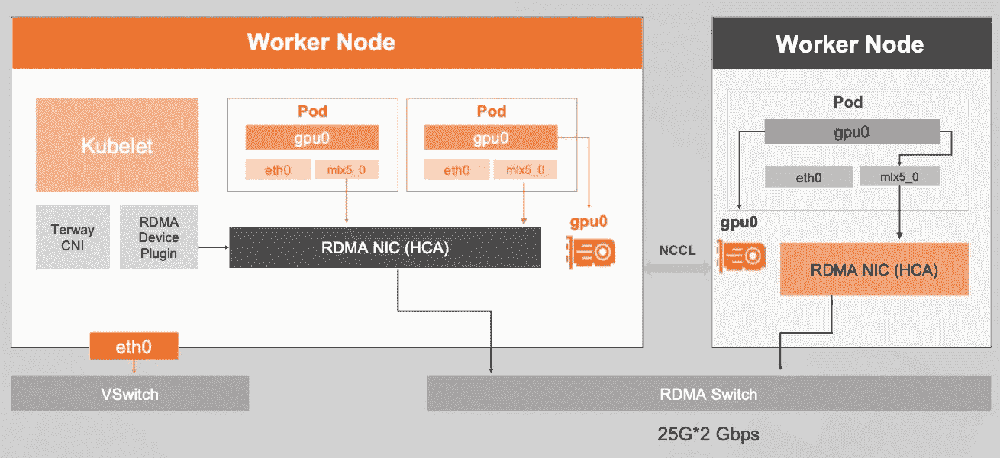

RDMA 管理。张开在[阿里云诞生日](https://resource.alibabacloud.com/webinar/detail.html?spm=a3c0i.14525383.1365508910.9.4c8091e1S9TMGs&id=1894)的图片

## 4.GPU 监控

ACK 提供了出色的 GPU 监控。通过查看该监视器，我们可以看到节点视图指标或应用程序视图指标。

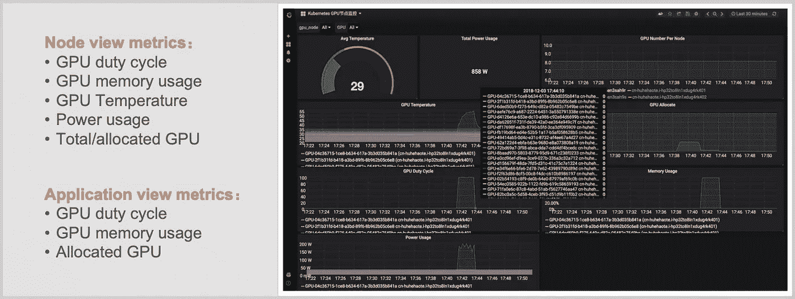

GPU 监控。张开在[阿里云诞生日](https://resource.alibabacloud.com/webinar/detail.html?spm=a3c0i.14525383.1365508910.9.4c8091e1S9TMGs&id=1894)拍摄的图片

## 5.自动缩放

ACK 中的自动 GPU 扩展可以通过多种场景完成。例如:

*   基于 GPU 设备级指标的自动缩放 AI 应用实例
*   用于运行大型人工智能训练作业的自动缩放 GPU 集群节点

## 6.利用分布式数据缓存加速计算

ACK 可以通过摆脱 GPU/CPU 等待时间来加速 AI 训练作业的远程数据读取。ACK 分布式数据缓存(DDC)支持水平扩展，支持不同的存储后端，包括 OSS/HDFS/NAS。此外，ACK DDC 支持多个缓存层，包括 RAM/SSD/HDD，并支持预加载一次，由多个作业读取。

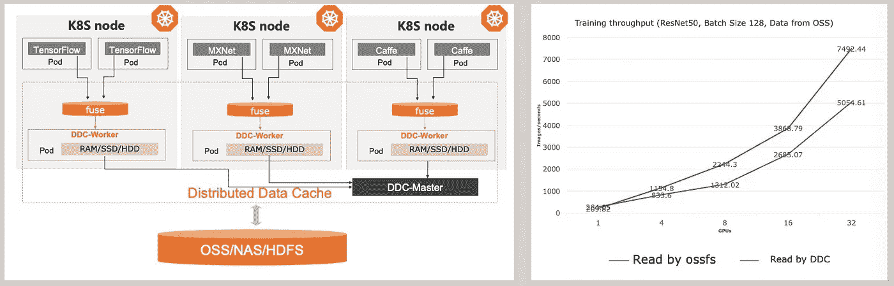

DDC 插图。张开在[阿里云诞生日](https://resource.alibabacloud.com/webinar/detail.html?spm=a3c0i.14525383.1365508910.9.4c8091e1S9TMGs&id=1894)拍摄的图片

## 7.通过 Flink/Blink on ACK 运行流数据处理

ACK 还支持运行 Apache Flink 应用程序，以云本地方式处理流数据。此外，ACK 还支持 Spark。

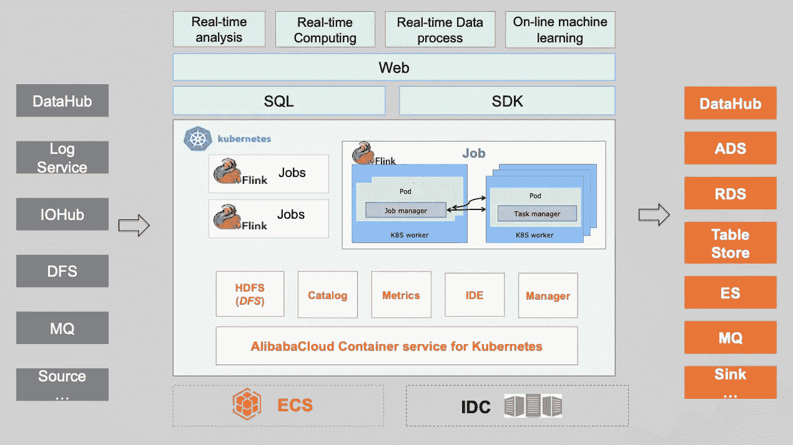

阿帕奇弗林克图。张开在[阿里云诞生日](https://resource.alibabacloud.com/webinar/detail.html?spm=a3c0i.14525383.1365508910.9.4c8091e1S9TMGs&id=1894)拍摄的图片

# 最后的话

作为总结，在云环境中构建人工智能/人工智能作业可能是解决常见人工智能/人工智能挑战的答案。特别是通过使用阿里云平台，我们可以体验一些关键功能，这些功能将使我们的项目更加高效。

# 参考

张，凯。(2020).*在 Kubernetes 上构建 AI/机器学习【演示】*。阿里云原生日。(访问日期:2020 年 6 月 3 日)。