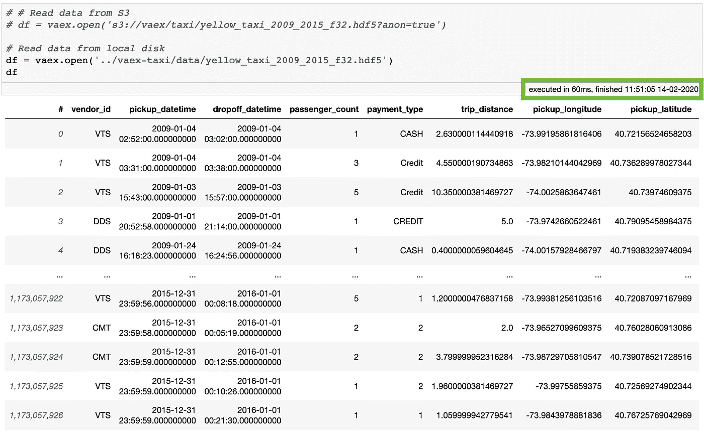
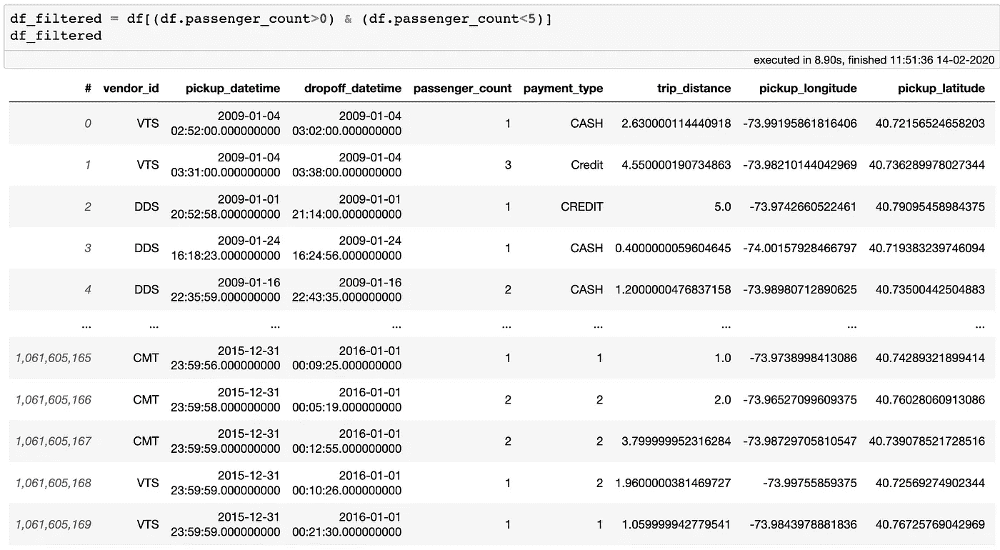
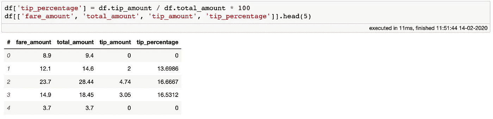
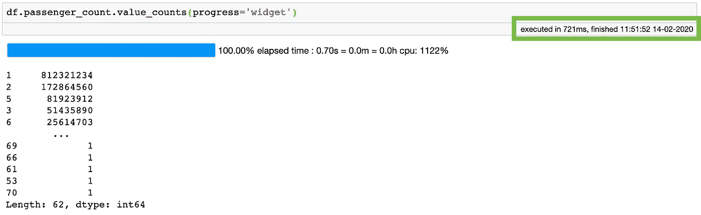
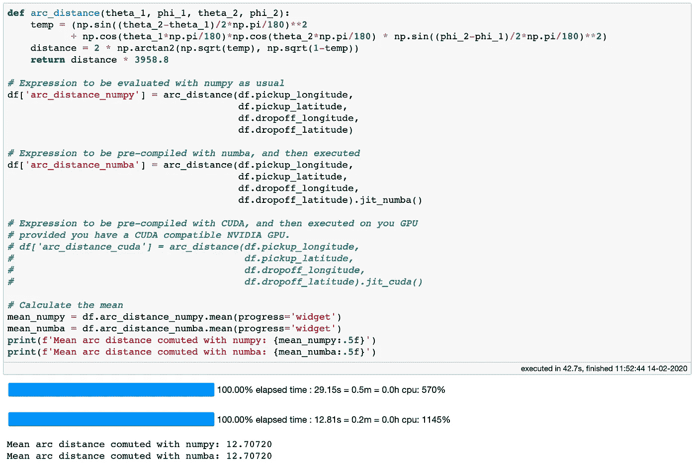
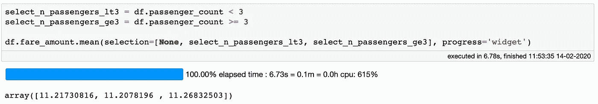
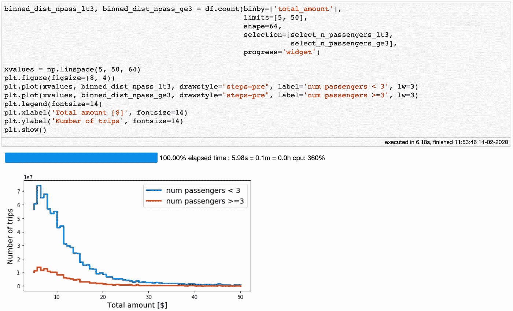
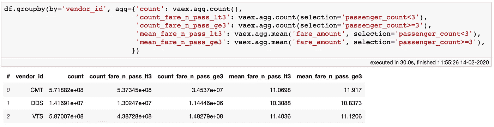

# 我喜欢 Vaex 用于数据科学的 7 个原因

> 原文：<https://towardsdatascience.com/7-reasons-why-i-love-vaex-for-data-science-99008bc8044b?source=collection_archive---------11----------------------->

摄影:[塔拉斯·马卡连科](https://www.pexels.com/@taras-makarenko-188506)(经由 www.pexels.com)

[Vaex](https://github.com/vaexio/vaex) 是一个开源的 Python 数据框架库，其 API 与 [Pandas](https://pandas.pydata.org/docs/index.html#) 的 API 非常相似。我已经在学术和行业环境中使用 Vaex 好几年了，它是我正在从事的几个数据科学项目的首选库。在本文中，我想分享一些我最喜欢的 Vaex 功能。有些现在可能是显而易见的，但有些可能会让你大吃一惊。

以下代码示例在 MacBook Pro (15 英寸，2018，2.6GHz 英特尔酷睿 i7，32GB 内存)上运行。本文也可以[作为 Jupyter 笔记本阅读。](https://nbviewer.jupyter.org/github/vaexio/vaex-examples/blob/master/medium-7-reasons/7%20reasons%20why%20I%20love%20Vaex%20for%20data%20science.ipynb)

## 1.易于处理非常大的数据集

如今，遇到大于典型笔记本电脑或台式机工作站可用 RAM 的数据集变得越来越常见。 [Vaex](https://github.com/vaexio/vaex) 通过使用内存映射和惰性求值，很好地解决了这个问题。只要您的数据以内存可映射文件格式存储，如 [Apache Arrow](https://arrow.apache.org/) 或 [HDF5](https://en.wikipedia.org/wiki/Hierarchical_Data_Format#HDF5) ，Vaex 将立即打开它，无论它有多大，或您的机器有多少 RAM。事实上，Vaex 只受您拥有的可用磁盘空间量的限制。如果您的数据不是内存可映射的文件格式(例如 CSV、JSON)，您可以通过将丰富的 Pandas I/O 与 Vaex 结合使用来轻松转换它。[参见本指南](https://docs.vaex.io/en/latest/faq.html#I-have-a-massive-CSV-file-which-I-can-not-fit-all-into-memory-at-one-time.-How-do-I-convert-it-to-HDF5?)了解如何操作。

使用 Vaex 打开和预览 100GB 的文件是即时的。

## 2.没有记忆副本

Vaex 有一个零内存复制策略。这意味着过滤数据帧只需要很少的内存，并且不会复制数据。考虑下面的例子。

过滤 Vaex 数据帧不会复制数据，占用的内存可以忽略不计。

创建`df_filtered`数据帧不需要额外的内存！这是因为`df_filtered`是*浅*对`df`的复制。创建过滤后的数据帧时，Vaex 会创建一个二进制掩码，然后应用于原始数据，而无需制作副本。这种过滤器的内存成本很低:过滤一个**10 亿**行数据帧需要大约 1.2 GB 的 RAM。与其他“经典”工具相比，这可以忽略不计，在其他“经典”工具中，仅读入数据就需要 100GB，过滤后的数据帧需要大约 100GB。

## 3.虚拟列

将 Vaex 数据帧的现有列转换为新列会导致创建*虚拟列*。虚拟列的行为就像普通列一样，但是它们不占用任何内存。这是因为 Vaex 只记得定义它们的*表达式*，而不会预先计算这些值。这些列仅在必要时进行延迟评估，从而保持较低的内存使用率。

“tip_percentage”列是一个虚拟列:它不占用额外的内存，并且在需要时被动态地延迟计算。

## 4.表演

[Vaex](https://github.com/vaexio/vaex) 是*快速*。我是说*认真快*。虚拟列的评估是完全并行的，只需对数据进行一次处理即可完成。诸如“value_counts”、“groupby”、“unique”等列方法以及各种字符串操作都使用快速高效的算法，这些算法是在 C++中实现的。它们都以核外方式工作，这意味着您可以处理比 RAM 中容纳的更多的数据，并使用处理器的所有可用内核。例如，对超过 10 亿行执行“value_counts”操作只需一秒钟！

使用 Vaex,“value _ counts”操作对于超过*11 亿行需要大约 1 秒的时间！*

## 5.即时编译

只要虚拟列是仅使用 [Numpy](https://numpy.org/) 或纯 Python 操作定义的，Vaex 就可以通过 jitting 或通过 [Numba](http://numba.pydata.org/) 或[Python ran](https://pythran.readthedocs.io/en/latest/)进行实时编译来加速其求值。如果你的机器有支持 CUDA 的 NVIDIA 显卡，Vaex 还支持通过 CUDA 加速。这对于加速计算量相当大的虚拟列的计算非常有用。

考虑下面的例子。我已经定义了两个地理位置之间的弧距离，这个计算涉及到相当多的代数和三角学。计算平均值将强制执行这个计算量相当大的虚拟列。当执行完全用 Numpy 完成时，只需要 30 秒，我觉得这令人印象深刻，因为它是针对超过**11 亿行**完成的。现在，当我们对 numba 预编译的表达式做同样的事情时，我们的执行速度提高了 2.5 倍，至少在我的笔记本电脑上是这样。不幸的是，我没有 NVIDIA 显卡，所以我现在不能用 CUDA 做同样的事情。如果你这样做了，如果你能尝试一下并分享结果，我会非常高兴。

一个小但重要的好处:注意缺少一个`.compute`或任何这样的方法——Vaex 自动知道什么时候懒惰，什么时候执行计算。

对于计算开销很大虚拟列，Jitting 可以使执行速度提高 2.5 倍。

## 6.选择

Vaex 实现了一个叫做*选择*的概念，用来选择数据。例如，当您想要通过计算数据不同部分的统计数据来浏览数据，而不需要每次都创建新的参考数据帧时，这是非常有用的。使用选择的真正强大之处在于，我们只需对数据进行一次处理，就可以计算多个选择的统计数据。

您可以通过一次数据计算多个选择的统计数据。

这对于进行各种可视化也是有用的。例如，我们可以使用`.count`方法在不同的选择上创建一对直方图，只需对数据进行一次遍历。相当高效！

只需对数据进行一次处理，就可以在不同的选择上创建多个直方图。

## 7.Groupby 带有选择的聚合

我最喜欢的特性之一是在聚合函数中使用选择的能力。我经常发现自己想要进行分组操作，其中的聚合遵循一些附加的规则或过滤器。SQL 式的方法是运行几个单独的查询，首先过滤数据，然后进行分组聚合，最后将这些聚合的输出合并到一个表中。使用 Vaex，只需一次操作，只需一次数据传递，就可以做到这一点！下面的分组示例在我的笔记本电脑上只需要 30 秒就可以执行，运行了超过 11 亿行。

可以在 groupby 聚合函数中使用选择。

## 奖励:进度条

查看上面的例子，您可能已经注意到在 Vaex 中实现的许多方法都带有进度条。我绝对喜欢这个功能！由于我经常对较大的数据集使用 Vaex，知道一个操作可能需要多长时间非常方便。而且看起来很好看，让时间过得更快:)。

Vaex 是一个相当强大的数据框架库，尤其是对于大型数据集。它有各种有用的数据操作和可视化方法。这些就是我喜欢使用这个库的 7 大原因。你的呢？