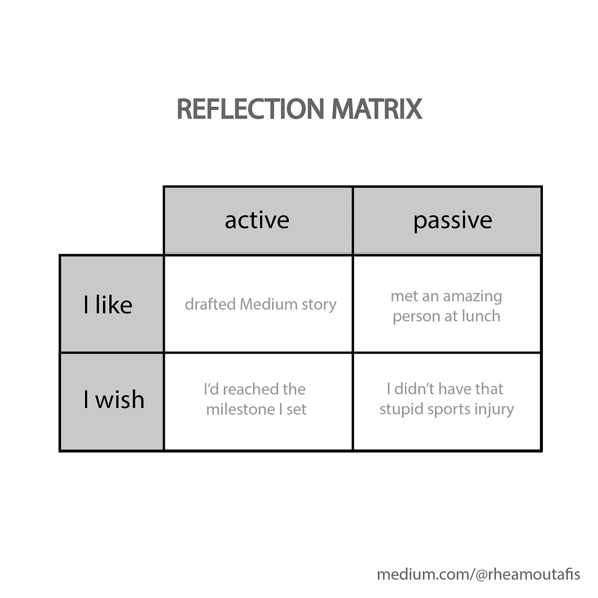

# 程序员精疲力竭的 7 个原因

> 原文：<https://towardsdatascience.com/7-reasons-why-programmers-burn-out-44a40bf8948d?source=collection_archive---------1----------------------->

## 和 7 种解决方法

倦怠在程序员中极其普遍。杰奎琳·戴在 [Unsplash](https://unsplash.com/s/photos/burnout?utm_source=unsplash&utm_medium=referral&utm_content=creditCopyText) 拍摄的照片

  W   *当 Jerry 作为初级开发人员开始工作时，他们每天早上都迫不及待地开始工作。每天晚上，即使他们工作了 10 个小时，他们仍然感到精力充沛。现在，两年后，杰里看起来像他们曾经的影子。现在起床很难，工作更难。一天下来，他们感到筋疲力尽。他们已经开始害怕明天回去，浪费生命中的另一天。*

听起来很熟悉？就我个人而言，我还没有见过一个程序员没有经历过至少一次倦怠。

这听起来很矛盾:同一个人在十几岁或二十几岁时爱上了代码，在过去三年里参加了至少五次黑客马拉松，并在周末为开源项目做出贡献——这个人怎么可能抱怨倦怠呢？

是的，他们可以。

## 原因一:工作单调

编程就是整天坐在屏幕前，除了午休时间和偶尔的几次会议。当然，许多其他工作也是如此。但是*坐在非常不健康的位置上盯着屏幕的强度*在编程中是最高的。

即使你发现你的工作在精神上很刺激，这种单调也会很快导致身体的迟钝。这意味着你不能很快完成工作，所以你开始变得没有动力，所以你工作得更少，…

走出这种恶性循环意味着采取健康的生活方式。理论上听起来很容易。但是预期寿命的下降显示了这有多难。

 [## 健身如何让我成为一名更好的网络开发人员

### 运行以获得更好的运行时间

medium.com](https://medium.com/better-programming/how-fitness-transformed-me-into-a-better-web-developer-ac51a2b08cb4) 

## 原因 2:赶时间

如果你曾经使用过 Scrum 和类似的方法，或者如果你有一个雄心勃勃的经理，你知道我在说什么。

 [## Scrum 方法论的简短介绍

### 或者我如何学会拥抱变化

medium.com](https://medium.com/chingu/a-short-introduction-to-the-scrum-methodology-7a23431b9f17) 

你在追逐一个又一个截止日期。你可能会错过一些截止日期。人们期望你在昨天之前把所有东西都送出去，没人在乎人类没有能力做到这一点。

结果，当你思考你的工作时，你感觉不到快乐或成就感。你感到压力。

这吸干了你对编码的所有热情。你被期望成为一个机器人，总是产生一流的输出，并提前交付。但你是人，所以你会有倦怠的症状。

## 原因 3:糟糕的同事

考虑以下情况:你的项目让你兴奋，你觉得你正在取得进展。然而，每天你都害怕去工作。这个简单的想法会让你焦虑和不开心。怎么了?

当然，你在工作中的快乐会受到你的工作的影响。但更重要的是，你的快乐会受到你的人际关系的影响——无论是工作中还是工作之外。

所以，如果你对你正在做的事情感到满意，但你仍然害怕，那可能是你的同事。不管是他们不认同你的价值观，还是企业文化让他们做出愚蠢的行为，你都不应该受到如此恶劣的对待。

如果你正经历由讨厌的同事引起的倦怠症状，要知道*这不是你的错*。您可能想尝试本文后面列出的一些修复方法。或者你可能想更激进一点，换个部门，或者在完全不同的公司找份工作。

这取决于你。只要知道*你值得更好的*。

如果你的同事不认同你的价值观，你的工作会很糟糕。照片由[阿里·叶海亚](https://unsplash.com/@ayahya09?utm_source=unsplash&utm_medium=referral&utm_content=creditCopyText)在 [Unsplash](https://unsplash.com/s/photos/coworker?utm_source=unsplash&utm_medium=referral&utm_content=creditCopyText)

## 原因四:不认可

这部分和你的工作关系有关，但是在另一个层面上。你的项目可能精彩刺激，你的同事可能牛逼。

但是每当你觉得你已经完成了一些事情，你的经理就会带着一个完全不同的任务出现。每当他们这样做的时候，旧的任务就变得完全无关紧要了。

听起来很熟悉？我知道这对我很重要。

你可以对你的领域感到兴奋或充满激情。如果你的工作不断被否定，你会失去动力。

你会开始害怕去那里，因为你知道你不会创造任何有用的东西。当一天结束的时候，你会很开心——因为结束了——但是不开心，因为今天不是星期五，你明天还得去上班。在某些时候，你会开始认为，即使是你通过完成任务而获得的技能也是无关紧要的。

随着时间的推移，这可能会导致更严重的症状。这都是因为你的经理不知道你应该做什么。

## 原因 5:获得报酬

工资太少——或者太多！—会加重你的倦怠症状。

工资太低是导致精疲力竭的一个显而易见的原因。*(是的，爆料程序员存在！如果你对编码的热情不足以维持生计，你可能会觉得自己的工作没有价值。这又让我们回到了原因 4。*

但是当你得到太多的报酬时，倦怠也会恶化。虽然大额支票在理论上听起来很棒，但在现实生活中可能会导致灾难。让我用我的亲身经历来说明这一点。

作为一名本科生，我非常喜欢编程。我日日夜夜在研究实验室为科学目的编写软件，有时甚至因此而忽略了我的课程。我太喜欢它了，所以我从来没有期望得到任何补偿。多年来我免费工作。即使这意味着我在超市买不起西红柿。

当我进入研究生院时，这种情况彻底改变了。突然我得到了报酬。突然我所有的账单都被支付了。突然间，我可以买西红柿而不用考虑一分钱。*我在谋生。代码！*

然后一个愚蠢的想法进入了我的脑海:如果我被支付代码，那么每个月我应该交付一段代码，至少值那么多钱。

突然之间，原本狂热的激情变成了压力的来源。交付压力。执行的压力。返还我收到的金钱价值的压力。

但是你给自己的压力越大，你的表现就越差。尤其是当你想到钱的时候。

沉溺于你的任务会导致灾难。照片由 [nikko macaspac](https://unsplash.com/@nikkotations?utm_source=unsplash&utm_medium=referral&utm_content=creditCopyText) 在 [Unsplash](https://unsplash.com/s/photos/burnout?utm_source=unsplash&utm_medium=referral&utm_content=creditCopyText) 上拍摄

## 原因 6:无意义的任务

原因 3 到 5 解决你可能遇到的问题，尽管有一个伟大的项目。但有时你的项目真的很烂。

也许你的项目只是一堆公司的废话，对程序员来说没什么实质内容。你想要的只是编码，而不是负责所有的管理职责、客户关系等等。

 [## 每个数据科学家都需要向商业领袖学习什么

### 因为软技能很重要。

towardsdatascience.com](/what-every-data-scientist-needs-to-learn-from-business-leaders-47dcf3204076) 

也许你看不到你的项目的意义，因为你不能从中学到任何新的东西。程序员属于这个星球上最好奇的生物——如果你不能从中学习，你就不喜欢它。

也许这个项目超出了你的能力范围。你觉得你无法掌握它，你的经理完全高估了你的技能。

或者也许你在过去的几个月里一直在做一个项目，但你仍然不知道你应该做什么。这项任务是个谜，似乎没有人能向你解释清楚。这通常源于管理不善。不幸的是，这种情况发生的次数比你想象的要多。

无论如何，从公司的角度来看，你的项目是你工作的主要原因。所以如果它很糟糕，难怪你会感到精疲力尽。

## 理由 7:行走死亡之旅

这一条与原因 6 密切相关。简而言之，死亡行军就是当你在做一个注定要失败的项目时。

这可能有很多原因:期限太紧，你没有足够的资源，或者你的团队太小，无法执行。尤其是当你在一个大项目上工作了好几个月，而且风险很高的时候，这会给你带来巨大的压力。

你对此的反应有两种:要么你陷入完全的冷漠，迟到早退，因为你知道你的工作不会改变任何事情。或者你开始每天工作 14 个小时，相信这样你就能扭转乾坤。

你的冷漠是由消极情绪引起的，并导致更多的消极情绪。你基本上是在移除让你的火继续燃烧的燃料。

或者，如果你是那种埋头于工作的人，那么你投入的所有时间都在扼杀你的激情。

这两者都是自然反应。和以前一样，只要知道如果项目进展不顺利，*这不是你的错*。你是一名优秀的程序员，你可能已经在其他项目中证明了这一点。如果出了问题，那是因为环境，而不是因为你！

 [## 一个程序员倦怠的故事；如何识别并避免它| CoderHood

### 我将告诉你一个名叫博尔博的软件工程师的故事，他在职业生涯的某个时刻陷入了死亡行军。

www.coderhood.com](https://www.coderhood.com/a-programmer-burnout-story-how-to-recognize-it-and-avoid-it/) 

## 程序员不是机器人

精疲力尽的棘手之处在于，始于工作的问题会蔓延到生活的方方面面。你开始忽视你的家庭、你的朋友、你的爱好和你的自我照顾。突然间，你陷入的不是工作危机，而是生活危机。

理解这一点至关重要——我怎么强调都不为过——*这不是你的错*。当然，认识到自己的错误对个人成长至关重要。但是为你没有犯过的错误责备自己会毁了你。

很多时候，程序员职业倦怠问题的根源在于公司文化内部或者某种形式的管理不善。

这并不意味着你需要马上换部门或者辞职。虽然这对于真正困难的情况可能是一个很好的解决方案，但是使用一些更软的修复已经可以提供巨大的帮助。

同情心是关键。裘德·贝克在 [Unsplash](https://unsplash.com/s/photos/compassion?utm_source=unsplash&utm_medium=referral&utm_content=creditCopyText) 上的照片

## 修复 1:对自己有同情心

我知道这听起来很无聊。但是听我说完。

精疲力尽不是你的错。这不是软弱的表现。你经历的痛苦不是因为你是个白痴。这是真的。它是有效的。

我如此强调这一点，是因为我是这个谬论的罪魁祸首。当我应该对自己好一点的时候，我倾向于责备自己没有引起的问题，责备自己。

对自己有同情心是我仍在学习的东西。但我发现的一件事是这很有帮助:

> 做自己最好的朋友。

这并不意味着你不应该和你最好的朋友保持经常联系。但是试着把自己当成最好的朋友。

当你为自己明显的无知、无能或其他原因而自责时，想想这个:如果你最好的朋友处在你的处境，你会对他们说什么？你会怎么和他们说话？

我发现，自怜是获得更多自爱的不可思议的方法。这导致——你猜对了——更多的快乐和生产力。

 [## 幸福的秘密是同情

### 要有同情心，要快乐

medium.com](https://medium.com/publishous/the-secret-to-happiness-is-compassion-e50b37b2a190) 

## 修复 2:想想曾经让你兴奋的事

我曾经对编程非常感兴趣，但当我进入研究生院时，我失去了激情。对我来说，原因是我得到了报酬(原因 5)；但对你来说，它可能是上述任何一个原因。

有帮助的是诺贝尔奖获得者物理学家理查德·费曼的回忆录，当他收到非常著名的高等研究院的工作邀请时，他正经历一段精疲力竭的时期:

> 高等研究院！特殊例外！一个甚至比爱因斯坦更好的位置！这是理想的；这是完美的；这太荒谬了！
> 
> 这太荒谬了。在某种程度上，其他的提议让我感觉更糟。他们希望我能有所成就。但是这个提议太荒谬了，对我来说是不可能实现的，太荒谬了。【……】我一边刮胡子一边笑，想着这件事。
> 
> 然后我对自己说，“你知道，他们对你的看法是如此的不可思议，这是不可能实现的。你没有责任辜负它！”
> 
> 这是一个绝妙的想法:你没有责任达到别人认为你应该达到的目标。我没有责任像他们期望的那样。这是他们的错，不是我的错。
> 
> 高级研究学院期望我有那么好，这并不是我的失败；这是不可能的。这显然是一个错误，当我意识到他们可能是错的时候，我意识到其他地方也是如此，包括我自己的大学。我就是我，如果他们期望我表现好，并为此给我一些钱，那是他们的不幸。
> 
> ——摘自《费曼先生，你肯定是在开玩笑吧？》，作者理查德·费曼，版权 1985 年，第。100.

费曼并没有完全编码。尽管如此，还是这篇文章让我在博士之初走出了我的兔子洞。由此我得出结论，如果我的博士学校给我的报酬过高，那是他们的错。我会像费曼先生一样不负责任，随心所欲。我做到了。

先做小任务，然后达到更高的目标。由[布拉德·巴莫尔](https://unsplash.com/@bradbarmore?utm_source=unsplash&utm_medium=referral&utm_content=creditCopyText)在 [Unsplash](https://unsplash.com/s/photos/hiking?utm_source=unsplash&utm_medium=referral&utm_content=creditCopyText) 上拍摄

## 修复 3:合并日常任务

当你知道你什么也做不了的时候，不得不去工作是令人畏惧的。根据定义。

不管这个项目是太难了，还是管理不当，或者完全没有意义——你都不得不放弃让你快乐的多巴胺激增。

有一件事可以帮助你重新设定动机，那就是合并日常任务。我喜欢从简单的、几乎是琐碎的事情开始我的一天。这个任务应该是有用的，但主要目的是从我的待办事项列表中去掉一个勾。

这欺骗了我的猴脑，让它想要完成下一个任务——因为这样我就会获得另一个成功的时刻。然后我慢慢地从最容易的部分到最难的部分。

这听起来像是对困难事情的拖延。但是很管用！我经常惊讶于自己通过先做简单的事情实际上完成了多少。

## 修复 4:反射

每天留出一些时间来练习反思。每个人都有自己的技术，你可以自由发展自己的技术。我使用每天晚上填充的反射矩阵:

我把主动事件和被动事件分开。活动事件是我所做的事情的直接后果。被动事件是在我什么都不做的情况下发生的事情。这让我意识到并非一切都在我的掌控之中。

在“我喜欢”类别中，我写下了那天我感激的事情。这建立了我的成就感和心理弹性。这样我就能积极主动地对抗消极情绪。

“我希望”类别包含了本可以做得更好的事情。这是我吸取教训和寻找解决方案的地方——例如，我可能会以不同的方式设定我的里程碑，或者寻找新的方法来应对我的受伤。

 [## 极简主义日志:一个有趣而有效的改变习惯的工具

### 如何创建你自己的习惯仪表板，激励你坚持任何习惯

medium.com](https://medium.com/better-humans/draft-how-to-hack-your-brain-to-achieve-consistency-that-lasts-7f5fdc520d28) 

你可以通过写日记，或者和朋友聊天，或者给自己发电子邮件来反思。我建议你不要只在头脑中做这件事——因为你会忘记这件事，而且很难养成习惯。此外，信不信由你，待会查看积压的工作会很有趣。

你可以在任何你想去的地方这样做——在你的办公室，在家里或者在公园。但是试着每天在同一个地方做——这将帮助你养成习惯。此外，试着在每天的同一时间做这件事，最好在你的日历上把这段时间划掉。

通过反思，你在回顾过去的成功。你意识到你经常无法控制事情。这在应对倦怠症状方面对我帮助很大。

## 第五招:培养一个爱好

你是个程序员。你是个怪人。我明白了。

当你不在工作的时候，你不是在睡觉就是在编码取乐。这太神奇了。

但是当你面临严重的倦怠时，你可能根本不想碰电脑。现在你的生活面临着巨大的空虚。

积极主动地做这件事，同时做一些活动——最好是不涉及电脑的活动。它可以是一项运动，或者音乐，或者烹饪，或者室内设计。找到你感兴趣的事情——并且定期去做。

对我有帮助的一件事是有一个实用的爱好。比如一周至少一次，我喜欢做好吃的。对我来说保持这种状态很容易，因为我无论如何都需要吃东西。此外，这样我可以确保我得到一些健康的东西，这对我的工作有积极的影响。

无论你选择做什么，任何爱好或业余项目都会给你一种成就感，而这正是你在工作中所缺乏的。爱好有助于稳定你的情绪，这样工作危机就不会变成生活危机。

培养一个能激励你的爱好。[自由股票](https://unsplash.com/@freestocks?utm_source=unsplash&utm_medium=referral&utm_content=creditCopyText)在 [Unsplash](https://unsplash.com/s/photos/hobby?utm_source=unsplash&utm_medium=referral&utm_content=creditCopyText) 上的照片

## 修正 6:设定不可协商的界限

这是给那些在筋疲力尽时过度补偿的人的。听起来很矛盾，获得空闲时间也需要一些纪律。

例如，我有一个晚上 9 点以后不做任何有成效的事情的界限——编码或媒体或其他。我在过去五年里一直有这个界限，但我只越过了两次。

它不仅能帮助我放松、反思和睡个好觉。这也让我在白天有所期待。不管生活压力有多大，我知道我总能在晚上 9 点和上床睡觉之前把自己的思绪关掉。

 [## 为什么你的大脑需要空闲时间

### 一些重要的大脑功能需要停机

elemental.medium.com](https://elemental.medium.com/why-your-brain-needs-idle-time-e5d90b0ef1df) 

重要的是，这些界限是*不灵活的*。把它们从你的日历上划掉，并清楚地与你的老板和同事交流，这将有助于你保持它们。

你可能害怕自己看起来很懒。有趣的是，事实并非如此。一个界限清晰的人给人的印象是他们能掌控自己的生活。

## 第七招:为自己辩护

这直接链接到上面。清楚地传达你需要什么——你的界限，以及实现项目目标所需的任何额外资源、人力和资金。

你需要的应该是合理的——否则，你的经理可能会认为你要求太高。但是，表现出要求比羞于表达自己的需求要好。其他人不可能从你的鼻尖上看出来。

一旦你开始养成表达自己需求的习惯，你会惊讶于人们会为你做这么多事情。

## 最后一句话:你并不孤单

正如我前面提到的，我还没有遇到过一个程序员在他们职业生涯的某个阶段没有经历过主要的倦怠期。因此，如果这篇文章教会了你一件事，那就是你不是一个孤立的案例。

小心对待你自己和其他人，要知道无论此刻是什么让你情绪低落，*这都不是你的错*。