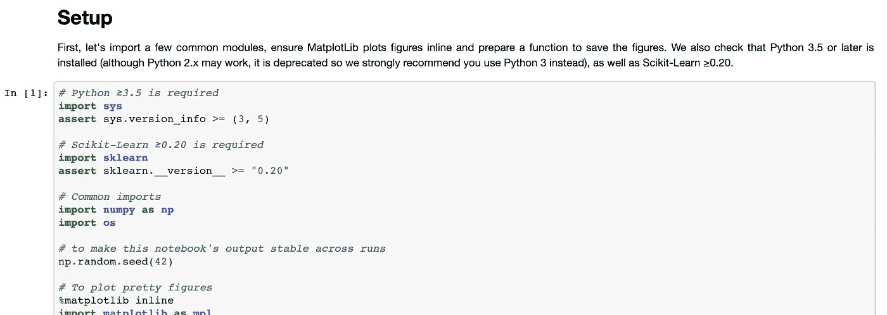
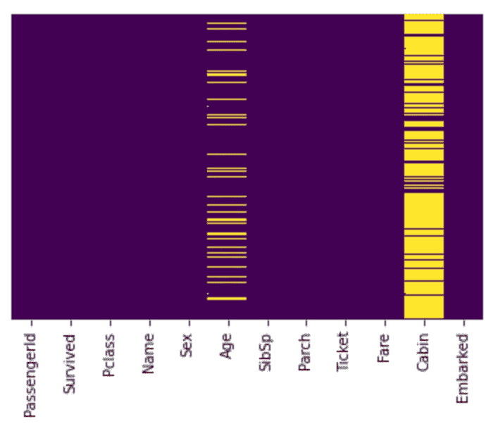
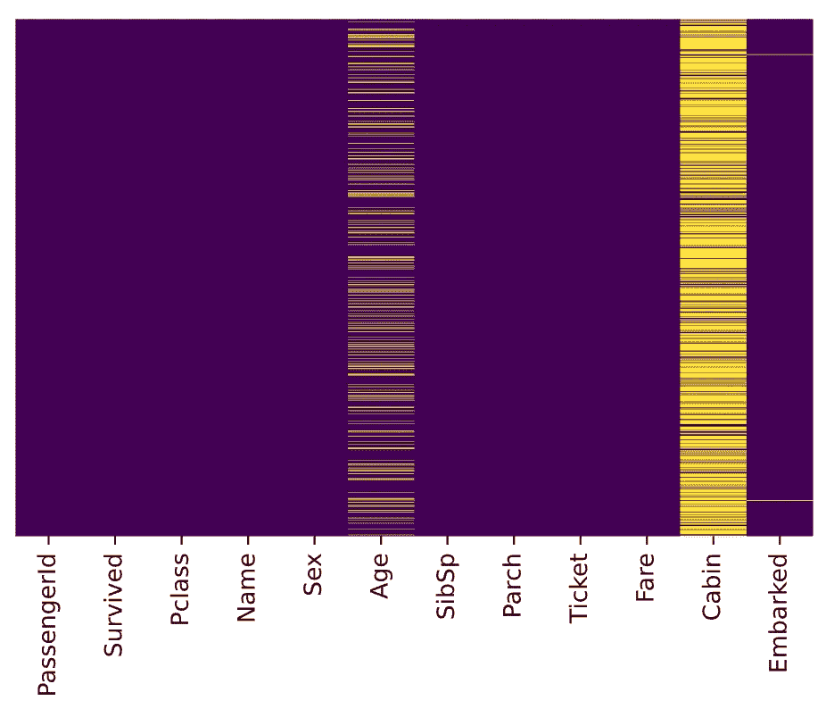
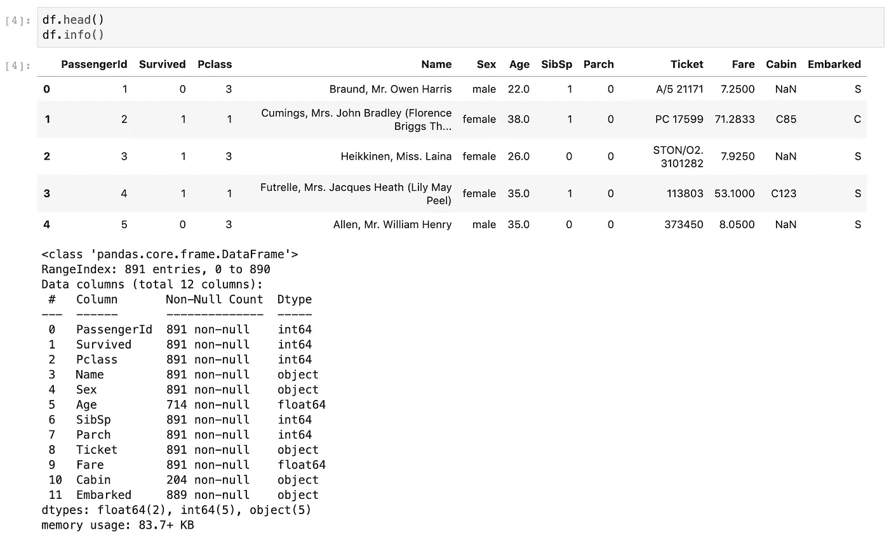
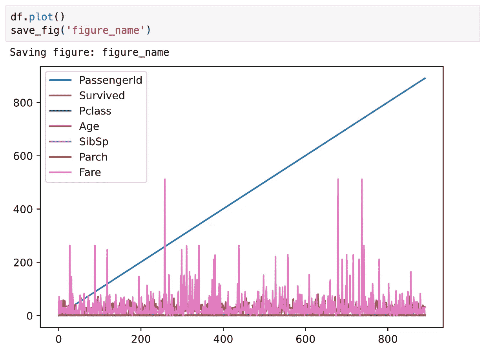
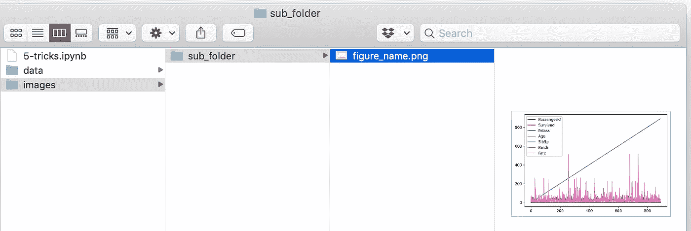

# 数据科学项目开始时应该包括的 7 个设置

> 原文：<https://towardsdatascience.com/7-setups-you-should-include-at-the-beginning-of-a-data-science-project-8232ab10a1ec?source=collection_archive---------16----------------------->

## 为了在不同的运行中保持输出稳定并加快开发速度


Emile Perron 在 [Unsplash](https://unsplash.com/s/photos/programming?utm_source=unsplash&utm_medium=referral&utm_content=creditCopyText) 上的照片

在从事数据科学项目时，通常在开始时会有一个**设置**或**配置**，以确保所需的依赖关系，保持输出稳定，并准备常用功能。



项目设置示例，来自 [Handson-ML2](https://github.com/ageron/handson-ml2/blob/master/04_training_linear_models.ipynb)

在本文中，您将了解 Juypter 笔记本中一些最有用的项目设置

1.  确保 Python 版本
2.  确保包版本
3.  避免绘制模糊的图像
4.  在不同的运行中保持输出稳定
5.  启用多个单元格输出
6.  本地保存绘图的功能
7.  下载数据的功能(如果需要，还可以解压)

源代码请查看我的 [Github repo](https://github.com/BindiChen/machine-learning/blob/master/data-analysis/004-7-setups-for-a-data-science-project/7-setups.ipynb) 。

# 1.确保 Python 版本

在 Jupyter 笔记本中检查 Python 解释器版本

```
**import sys
sys.version**'3.7.6 (default, Jan  8 2020, 13:42:34) \n[Clang 4.0.1 (tags/RELEASE_401/final)]'
```

为了确保您的项目以 Python 解释器的最低版本要求运行，您可以将以下内容添加到项目设置中。

```
# Python ≥3.7 is required
**import sys
assert sys.version_info >= (3, 7)**
```

要求 Python ≥ 3.7。如果不是，它将引发一个***assertion error***。

# 2.确保包版本

要检查已安装的软件包版本，例如 TensorFlow

```
**import tensorflow as tf
tf.__version__**'2.0.0'
```

以确保您的项目使用最低 TensorFlow 2.0 运行。如果不是，它将引发一个***assertion error***。

```
# TensorFlow ≥2.0 is required
**import tensorflow as tf
assert tf.__version__ >= "2.0"**
```

# 3.避免绘制模糊的图像

Juypter Notebook 中的默认绘图可能看起来很模糊。

例如，一个简单的热图来查看哪里缺少值(请查看[源代码](https://github.com/BindiChen/machine-learning)和来自[的数据集准备，使用 Pandas pipe 函数来提高代码可读性](/using-pandas-pipe-function-to-improve-code-readability-96d66abfaf8)以获得详细信息)。

```
import seaborn as sns
import matplotlib.pyplot as plt
%matplotlib inline# Default figure format png
sns.heatmap(df.isnull(), 
            yticklabels=False, 
            cbar=False, 
            cmap='viridis')
```



默认图看起来模糊

在上图中，文字看起来真的很模糊， ***舱*** 列中的缺失值看起来太忙， ***上船*** 列中的缺失值完全无法辨认。

要解决这个问题，请使用

*   `%config InlineBackend.figure_format = 'retina'`
*   或者`%config InlineBackend.figure_format = 'svg'`

在`%matplotlib inline`之后

```
%matplotlib inline
**%config InlineBackend.figure_format = '****retina****'**         # or 'svg'sns.heatmap(df.isnull(), 
            yticklabels=False, 
            cbar=False, 
            cmap='viridis')
```



图形格式设置为 retina 或 svg

与前一个相比，现在清楚多了，可以看到 ***已装载*** 列中缺少的值。

# 4.在运行过程中保持输出稳定

在数据科学项目中，随机数被用在许多地方。例如

*   `train_test_split()`从 **Scikit-Learn**
*   `np.random.rand()`初始化权重

如果随机种子未重置，则每次调用都会出现不同的数字:

```
>>> np.random.rand(4)
array([0.83209492, 0.10917076, 0.15798519, 0.99356723])
>>> np.random.rand(4)
array([0.46183001, 0.7523687 , 0.96599624, 0.32349079])
```

`np.random.seed(0)`使随机数可预测:

```
>>> np.random.seed(0)
>>> np.random.rand(4)
**array([0.5488135 , 0.71518937, 0.60276338, 0.54488318])**
>>> np.random.seed(0)
>>> np.random.rand(4)
**array([0.5488135 , 0.71518937, 0.60276338, 0.54488318])**
```

随着种子复位(每次)，每次都会出现*相同的*组数字。所以项目应该在不同的运行中保持输出稳定。

# 5.多单元输出

默认情况下，Jupyter 笔记本不能从同一个单元格输出多个结果。要输出多个结果，可以用 IPython 重新配置 shell。

```
from IPython.core.interactiveshell import InteractiveShell
**InteractiveShell.ast_node_interactivity = "all"**
```



# 6.将绘图保存到文件

Matplotlib 的一个很好的特性是能够使用`savefig()`方法保存数字。但是，如果给定的路径不存在，它将引发一个错误。

```
plt.savefig('./figures/my_plot.png')**FileNotFoundError: [Errno 2] No such file or directory: './figures/my_plot.png'**
```

最佳实践是将所有图形放在一个地方，例如我们工作区中的`figures`文件夹。我们可以使用操作系统 GUI 或者运行 Juypter Notebook 中的 magic 命令来手动创建一个`figures`文件夹，但是最好创建一个小函数来完成这个任务。如果需要一些自定义图形设置或需要附加子文件夹来对图形进行分组，这尤其有用。

这是将绘图保存到文件的功能。

```
import os
%matplotlib inline
import matplotlib.pyplot as plt# Where to save the figures
PROJECT_ROOT_DIR = "."
SUB_FOLDER = "sub_folder"    # a sub-folder
IMAGES_PATH = os.path.join(PROJECT_ROOT_DIR, "images", SUB_FOLDER)**def save_fig(name, images_path=IMAGES_PATH, tight_layout=True, extension="png", resolution=300):**
    if not os.path.isdir(images_path):
        os.makedirs(images_path)
    path = os.path.join(images_path, name + "." + extension)
    print("Saving figure:", name)
    if tight_layout:
        plt.tight_layout()
    plt.savefig(path, format=extension, dpi=resolution)
```

现在当您调用`save_fig('figure_name')`时，它会在您的工作区创建一个 *images/sub_folder* 目录，并在该目录下将图形保存为“ **figure_name.png** ”。此外，还提供了三种最常用的设置:

*   `tight_layout`自动调整支线剧情填充。
*   `extension`允许以多种格式保存数字。
*   `resolution`可用于设置图形的分辨率。



# 7.下载数据(如果需要，还可以解压)

对我们来说，使用互联网上的数据并不罕见。我们可以使用 web 浏览器下载它，并运行命令来解压或解压缩文件，但最好创建一个小函数来完成这项工作。如果数据定期更改，它尤其有用，因为它允许您编写一个小脚本，您可以在需要获取最新数据的任何时候运行该脚本(或者您可以设置一个计划作业，定期自动执行该任务)。如果需要在多台机器上安装数据集，那么自动获取数据的过程也很有用。

这是下载和解压数据的函数

```
import os
import tarfile
import zipfile
import urllib

# Where to save the data
PROJECT_ROOT_DIR = "."
SUB_FOLDER = "group_name"
LOCAL_PATH = os.path.join(PROJECT_ROOT_DIR, "datasets", SUB_FOLDER)**def download(file_url, local_path = LOCAL_PATH):**
    if not os.path.isdir(local_path):
        os.makedirs(local_path)

    # Download file
    print(">>> downloading")
    filename = os.path.basename(file_url)
    file_local_path = os.path.join(local_path, filename)
    urllib.request.urlretrieve(file_url, file_local_path)

    # untar/unzip file 
    if filename.endswith("tgz") or filename.endswith("tar.gz"):
        print(">>> unpacking file:", filename)
        tar = tarfile.open(file_local_path, "r:gz")
        tar.extractall(path = local_path)
        tar.close()
    elif filename.endswith("tar"):
        print(">>> unpacking file:", filename)
        tar = tarfile.open(file_local_path, "r:")
        tar.extractall(path = local_path)
        tar.close()
    elif filename.endwith("zip"):
        print(">>> unpacking file:", filename)
        zip_file = zipfile.ZipFile(file_local_path)
        zip_file.extractall(path = local_path)
        zip_file.close()
    print("Done")
```

现在当你调用`download("http://a_valid_url/housing.tgz")`时，它会在你的工作区中创建一个 *datasets/group_name* 目录，下载 **housing.tgz** ，并在这个目录中从中提取 **housing.csv** 。这个小函数也适用于 CSV 和文本文件。

# 好了

感谢阅读。

请在我的 Github 上查看[笔记本的源代码。](https://github.com/BindiChen/machine-learning)

如果你对机器学习的实用方面感兴趣，请继续关注。