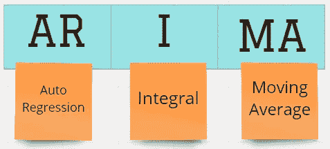
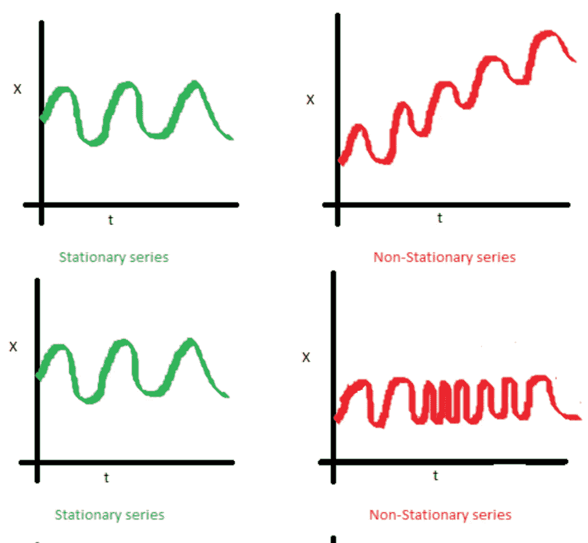
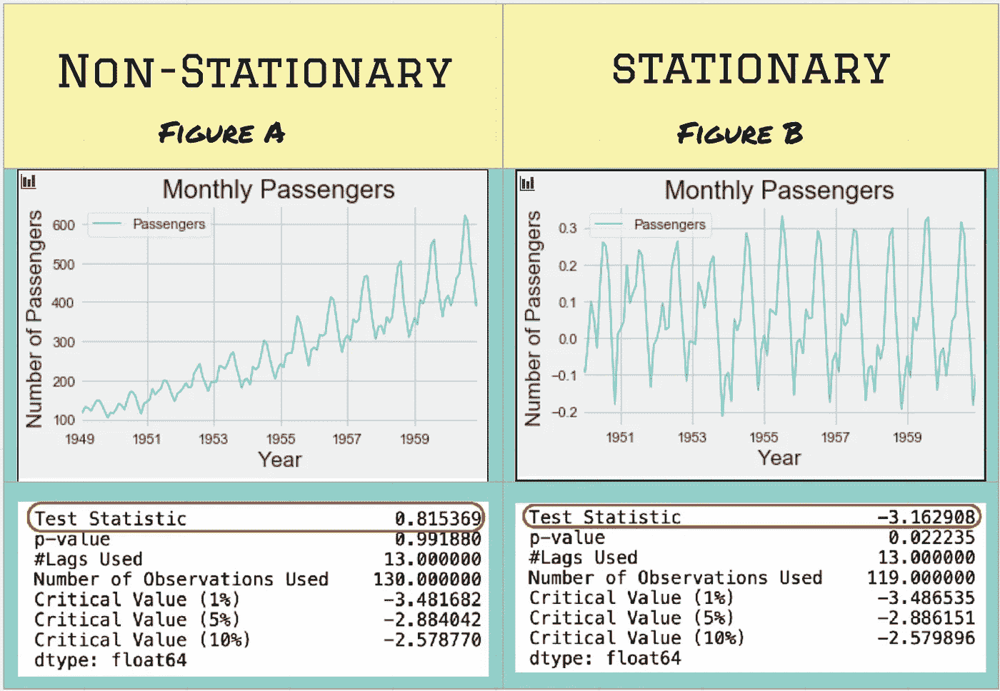
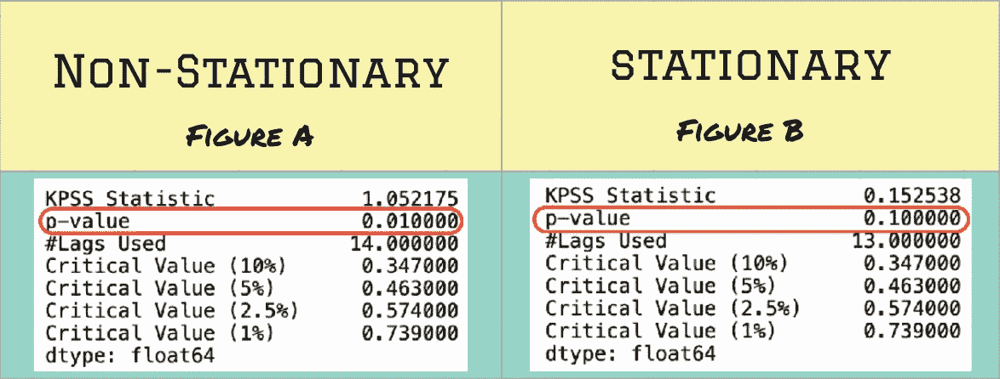
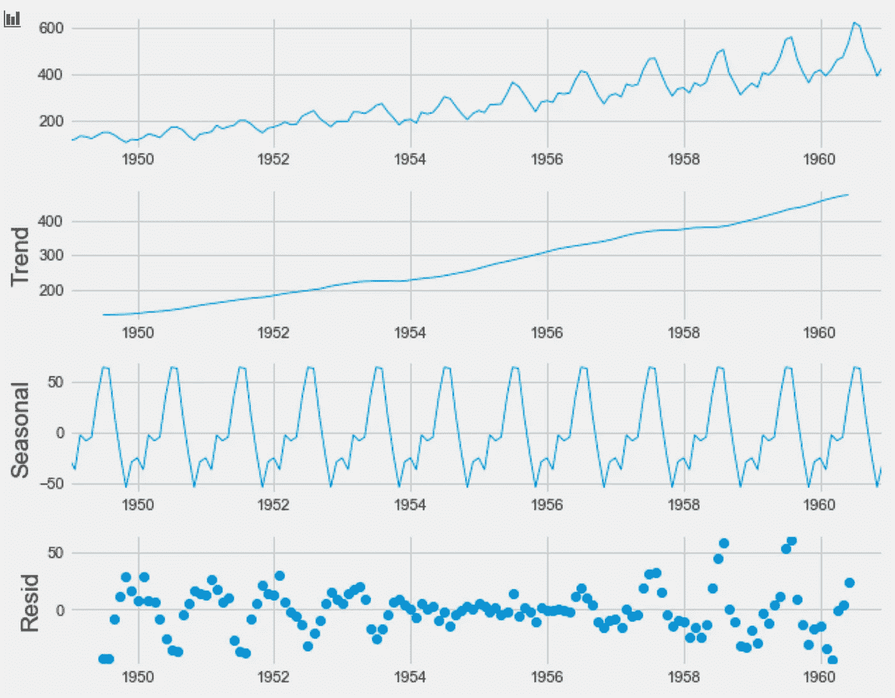
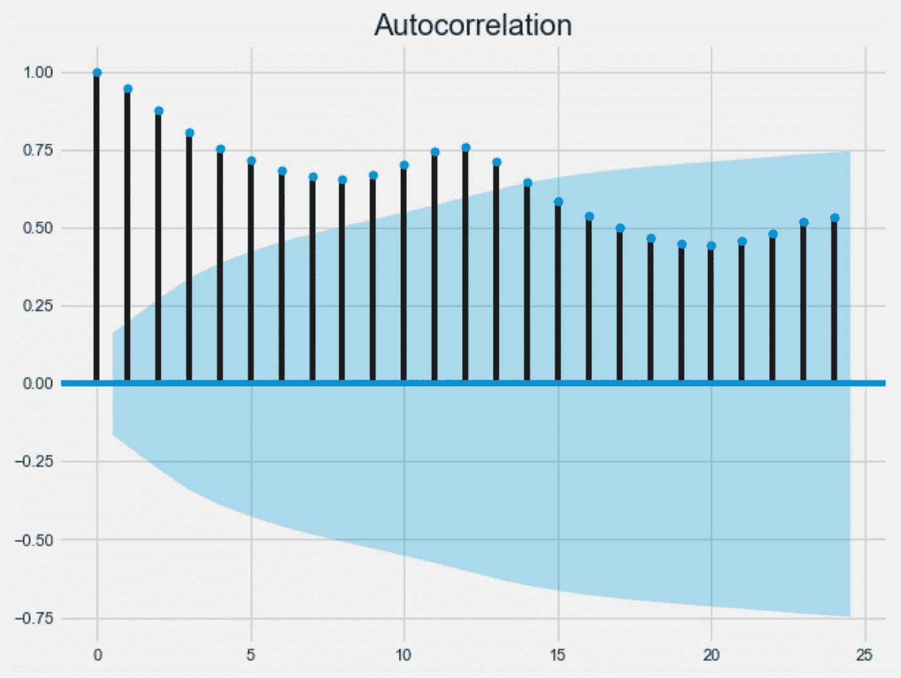

# 7 个统计测试来验证并帮助拟合 ARIMA 模型

> 原文：<https://towardsdatascience.com/7-statistical-tests-to-validate-and-help-to-fit-arima-model-33c5853e2e93?source=collection_archive---------6----------------------->

尼古拉斯·托马斯在 [Unsplash](https://unsplash.com?utm_source=medium&utm_medium=referral) 上拍摄的照片

# 什么是 ARIMA？

在处理单变量时间序列时，ARIMA 模型是最经典和最广泛使用的统计预测技术之一。它基本上使用**滞后值**和**滞后预测误差**来预测特征值。

完整的 ARIMA(由普拉蒂克·甘地创作)

*   **AR:** 使用先前值的*滞后*
*   **I:** *非平稳差分*
*   **马:** *移动平均* 为误差项

其中一些术语在处理时序数据时非常常用。如果我们深刻理解这些术语或数据的组成部分，ARIMA 模型可以准确地拟合。以下是其中的几个例子:

## 趋势:

当数据中存在增加或减少方向时，数据被认为具有*趋势*。例如，夏季期间航空乘客的增加、工作日期间顾客数量的减少等。

克里斯·利维拉尼在 [Unsplash](https://unsplash.com?utm_source=medium&utm_medium=referral) 上拍摄的照片

## 季节性:

如果数据受外部因素影响，则认为数据具有*季节性模式*。例如，树叶的生长和掉落是由大自然母亲的天气/季节驱动的。

克里斯·劳顿在 [Unsplash](https://unsplash.com?utm_source=medium&utm_medium=referral) 上拍摄的照片

## 周期性:

如果存在重复但非周期性的波动，则认为数据具有*循环成分*。简单来说，如果图案是因为某种情况造成的，没有设定的时间量，就可以认为是周期性的。例如，由于特定事件的发生，股票市场表现出具有高点和低点的循环行为，并且这些峰值之间的时间从来都不精确。

## 白噪声:

这是时间序列的随机和不规则部分。换句话说，从信号中提取*趋势+季节性+周期性*后的残差，大多被认为是白噪声。白噪音最好的例子是当你在 90 年代失去与电视的天线连接时(是的，我是一个 90 年代的孩子！).

由[弗兰·雅克耶](https://unsplash.com/@fran_?utm_source=medium&utm_medium=referral)在 [Unsplash](https://unsplash.com?utm_source=medium&utm_medium=referral) 上拍摄的照片

## 平稳性:

具有**常数均值**和**零方差**的时间序列被认为是*平稳的*。当考虑平稳性时，我脑海中总会浮现一个众所周知的图像:

[https://beingdatum.com/time-series-forecasting/](https://beingdatum.com/time-series-forecasting/)

我用来解释这些测试的包主要有:

*   *stats models*:[https://www.statsmodels.org/stable/index.html](https://www.statsmodels.org/stable/index.html)
*   *普姆达里玛*:[http://alkaline-ml.com/pmdarima/index.html](http://alkaline-ml.com/pmdarima/index.html)

有很多测试，但我将谈谈我使用过的一些，它们帮助我解决了时间序列问题:

## 1.增强型迪基-富勒(ADF)试验:

应该使用变换技术(对数、移动平均等)使时间序列平稳。)在应用 ARIMA 模型之前。ADF 检验是一种很好的方法，也是最广泛使用的技术之一，用于确认序列是否平稳。数据可以在[卡格尔](https://www.kaggle.com/rakannimer/air-passengers)上找到。下面是代码:

非平稳数据与平稳数据的差异及其 T 统计量

为了使数据稳定，我们对数据进行了一些转换(如上面的代码所示)。在计算 *t 统计值*时，我们看到该值是显著的，并确认数据现在是稳定的！

## 2.PP 测试:

PP 代表菲利普斯-佩龙试验。在某些情况下，需要用 ARIMA 的 **I** 来表示积分。I=1 或 2 的差值通常起作用。这种 PP 检验是一种单位根检验，以确认时间序列是按照顺序 1 整合的。如果要检查平稳性，这也是 ADF 测试的替代方法。它们在金融时间序列的分析中变得相当流行[3]。下面是代码:

这将返回一个布尔值(1 或 0)，表明该序列是否稳定。

## 3.KPSS 测试:

计量经济学中广泛使用的测试是科维亚特科夫斯基-菲利普斯-施密特-辛特，或简称为 KPSS 测试。这个测试与 ADF 非常相似，可以帮助验证零假设，即一个可观察的时间序列在一个确定的趋势周围是平稳的。虽然它有很高的 I 型错误率，但是它有一个很大的缺点。在这种情况下，通常建议将其与 ADF 测试结合使用，并检查两者是否返回相同的结果[4]。代码类似于 ADF 测试，如下所示:

非平稳数据和平稳数据的区别

从上图中我们可以看到，在应用变换之前(图 A)，数据的 *p 值*是 **< 0.05** ，因此它不是稳定的。转换后(图 B)*p 值*变为 **0.1** to。确认数据的平稳性。

在我们进入下一个测试之前，重要的是要知道 ARIMA 模型可能包含季节性成分，这可以通过在我们的 ARIMA 方程中增加一些参数(P，D，Q，m)来处理。我们可以将 ARIMA 型模型大致分为两种类型:

1.  **ARIMA** :如开头所述处理非季节性组件
2.  **萨里玛** : **S** *季节成分* + **ARIMA**

## 4.CH 测试:

Canova Hansen(CH)检验主要用于检验季节差异，并验证零假设，即季节模式在一个样本期内是稳定的，或者是随时间变化的。这在经济或气象数据中非常有用[5]。这已经在 pmdarima 库中用 Python 实现了。

## 5.OCSB 测试:

Osborn，Chui，Smith 和 Birchenhall (OCSB)检验用于确定数据是否需要季节差异(P，D，Q，m 的 **D 分量**)。 *pmdarima* 包有一个预定义的功能，用户可以利用如下功能:

这里，我们将 m = 12 定义为月度数据。**‘AIC’**是绩效评估的默认 *lag_method* (越低越好)。参考[此处的](http://alkaline-ml.com/pmdarima/modules/generated/pmdarima.arima.OCSBTest.html)了解其他可接受的指标。这个数据的输出是 1，因为我们已经知道季节性成分是明确可见的。

## 6.分解绘图:

当你遇到时间序列问题时，这是一个非常有用的工具。我认为这个功能类似于医生在你第一次出诊时测量生命体征。由于生命体征可能表明患者的一些明显情况，*分解图*给出了数据的细分，并显示是否有任何明确的趋势、季节性和残差模式。下面是代码片段和输出结果:

分解图:显示原始数据(顶部)、趋势、季节和残差(底部)的子图

## 7.ACF 和 PACF 图:

ACF 和 PACF 图分别代表自相关图和偏自相关图。ACF 和 PACF 图有助于系统地确定时间序列平稳化后所需的 AR 和 MA 项。以下是 ACF 和 PACF 图的代码:

航班乘客数据的自相关图

航空旅客数据的偏自相关图

落在蓝色阴影区域内的滞后被认为不显著。基于 ACF 图，我们可以说它是 **AR13** 模型，意味着具有 13 个滞后的*自回归将有所帮助。基于 PACF 图，我们可以说它是 **MA2** 模型:*移动平均线有两个滞后*。有一些方法可以解读这些图，并很好地估计 ARIMA 模型的阶数。*

## 结论:

除了上面列出的，还有许多其他的统计测试可以使用。然而，我在这里提到的测试/工具对于理解数据和拟合精确的 ARIMA 模型来说是非常强大的。

这是我第一次尝试写一篇关于媒介的文章。我从我的作家同事和社区中学到了很多，这是我认为最好的方式来分享或回报我的一些经验给他们。

## 参考资料:

— — — — —

1.  [https://otexts.com/fpp2/stationarity.html](https://otexts.com/fpp2/stationarity.html)
2.  [https://en.wikipedia.org/wiki/Decomposition_of_time_series](https://en.wikipedia.org/wiki/Decomposition_of_time_series)
3.  [https://faculty . Washington . edu/ezi vot/econ 584/notes/unit root . pdf](https://faculty.washington.edu/ezivot/econ584/notes/unitroot.pdf)
4.  [https://www.statisticshowto.com/kpss-test](https://www.statisticshowto.com/kpss-test)
5.  [https://ja lobe . com/testing-for-seasonal-stability-canova-and-Hansen-test-statistic/](https://jalobe.com/testing-for-seasonal-stability-canova-and-hansen-test-statistic/)