# 使用 R 运行线性回归分析的 7 个步骤

> 原文：<https://towardsdatascience.com/7-steps-to-run-a-linear-regression-analysis-using-r-d5897a66b835?source=collection_archive---------6----------------------->

## 我学会了如何用蛮力在 R 中做回归分析。通过这 7 个复制和粘贴步骤，你也可以做到。


照片由[兰斯·安德森](https://unsplash.com/@lanceanderson)在 Unsplash 上拍摄。

我的经理认为我知道如何使用 r 进行回归分析。所以，为了保住我的位置，我决定用整个周末来学习如何做。把这篇文章看作是一个速成班介绍，学习如何用蛮力去做一件事。

跳到你想读的部分。下面的目录:

*   **第一部分** | **我开始写这篇文章的知识范围**
*   **第二部分** | **我如何搜索我的资源**
*   第三部分 | **回归提示:向工程师学习**
*   **第四部分** | **7 复制&粘贴步骤使用 R** 运行线性回归分析
*   **第五部分|下一步:改进你的模型**

# 开始写这篇文章时，我的知识范围

首先，为了建立基础，让我告诉你我对回归了解多少，以及我能在 r 中做些什么。

## 我对周末线性回归的了解是:

*   该方程的格式为:y=ax+b，其中 y 为因变量，x 为自变量，a 为系数，b 为常数/y 截距。我知道这些术语的意思。
*   这是一种计算自变量 x 对因变量 y 的影响的方法。为了做到这一点，您需要使用现有的数据，并根据该方程测试所有情况，以找到最合适的 a 和 b，从而预测您没有数据的 y 值。
*   您可以添加任意数量的独立变量，并为每个变量附加一个系数，以查看每个变量对因变量的影响。也就是说，太多的变量不会改善模型，在某些情况下还会损害模型。
*   最好将数据标准化，以便使用 0 到 1 之间的值。这样，由于独立变量的性质，系数不会很小或很大(例如，4634 天和 13 年是可以在同一个模型中使用的两个变量，但因为它们的大小如此不同，系数可能会有偏差)。

## 周末我能做的是:

*   dplyr 中的基础数据角力(`mutate`、`filter`、`select`、管道运算符`%>%`、`summarize`、点占位符、`group_by`、`arrange`、`top_n`)
*   dplyr 中的图(`plot`、`hist`、`boxplot`)
*   ggplot2 中的图(几何图、`facet_grid`、时间序列图、轴变换、`stratify`、`boxplot`、斜率图)
*   到目前为止，我所知道的关于 R 的一切都是从我参加的两门在线课程中学到的(1。 [R 基础知识](https://www.edx.org/course/data-science-r-basics)，2。[可视化](https://www.edx.org/course/data-science-visualization)。

# 第二部分|我如何搜索我的资源

我是如何想出这个周末该关注什么的。

## 1.在学习 R 基础知识时，r-bloggers 对我来说是一个很好的资源，所以我决定从那里开始。我谷歌了一下“r-bloggers 回归”

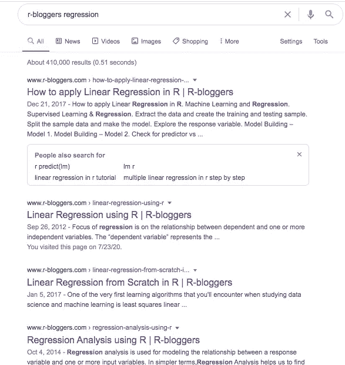

谷歌搜索“r-bloggers 回归”结果

这是我想到的前四个链接:

1.  [https://www . r-bloggers . com/how-to-apply-linear-regression-in-r/](https://www.r-bloggers.com/how-to-apply-linear-regression-in-r/)
2.  [https://www.r-bloggers.com/linear-regression-using-r/](https://www.r-bloggers.com/linear-regression-using-r/)
3.  [https://www.r-bloggers.com/regression-analysis-using-r/](https://www.r-bloggers.com/regression-analysis-using-r/)
4.  [https://www . r-bloggers . com/linear-regression-from scratch-in-r/](https://www.r-bloggers.com/linear-regression-from-scratch-in-r/)

## 2.我浏览了每一个结果，并决定把重点放在第二个结果上，因为我在页面的底部看到它提到它将告诉我如何解决“现实世界的商业问题”


我选择引用的[博客](https://www.r-bloggers.com/linear-regression-using-r/)中的一段话。

我点击了链接“[下一篇博客](https://www.tatvic.com/blog/predict-bounce-rate-based-on-page-load-time-in-google-analytics/)”，结果！"预测跳出率的基础上，在谷歌分析页面加载时间."因为我还没有提到，在这里要注意:我是在性能广告领域，所以这确实是我的拿手好戏。他们甚至做了一个 [part 3](https://www.tatvic.com/blog/improving-bounce-rate-prediction-model-for-google-analytics-data/) 上的改进模型！

我已经找到了这个周末我要关注的事情。我要在这里汇编我学到的任何东西！

# 第三部分|回归技巧:向工程师学习

我和一位工程师进行了一次非常有益的谈话，这位工程师在周末解答了我的问题，我想和你分享一些他分享的技巧。总之，运行回归分析只是评估某些数据是否与其他数据有关系的调查的开始。在这种背景下，这里有一些方法可以确保你得出一个诚实的分析，并帮助你找出下一步。

*   **将数据标准化，以便尽可能公平地比较系数。**虽然没有固定的方法来比较自变量之间的系数，但标准化数据至少可以让你看到自变量对因变量的影响。这是一个很好的研究起点:一旦你发现一个系数比另一个系数大，你就可以开始研究是什么导致了任何“高”系数。如果不对数据进行标准化，则每个值的范围可能会很大，从而导致系数的范围也很大，以补偿较大值的权重。
*   **p 值显著性是确定性的指标。**即使一个系数很高，如果没有统计意义，往好了说是没有意义，往坏了说是毁了模型。(参见[这篇博文](http://svmiller.com/blog/2014/08/reading-a-regression-table-a-guide-for-students/)中的“星号”部分，了解如何解读 p 值。)
*   **运行回归时移除异常值，然后在创建模型后，使用每个异常值测试模型，以比较因变量的预测值和真实值。这可以让你看到你的模型有多健壮。如果离群值的误差很低，那么这个模型就大获全胜；如果误差仍然很高，那么您可以简单地继续断言它们是异常值这一事实。**
*   **除了查看总体误差，查看每个数据点的误差也很重要。通过这样做，你可以深入了解为什么某个点或一组点可能比其他点有更大的误差的任何原因或趋势。**
*   **废话进，废话出。没有好的数据，你就不会有好的结果。确保你知道你的数据来自哪里，并确保它是高质量的。**

# 第四部分| 7 使用 R 运行线性回归分析的复制和粘贴步骤

所以我们在这里。是时候使用 r 实际运行回归分析了。

一般提示和说明:

*   对于引入代码的每一步，我都添加了一个例子的截屏，然后添加了一个相同的代码块，您可以将其复制并粘贴到您自己的 R 脚本中。
*   代码块适用于有 1 个独立变量的情况。如果有一个以上的自变量，请遵循 R 注释中的说明。
*   在每个代码块中，我都用斜体包含了括号，您可以用自己的代码替换它们，比如:`*[[insert your code]]*`。
*   当你用你自己的代码替换时，确保你删除了*和*括号和文本。这样做时，不要添加任何空格。
*   使用我的截图作为指导，特别是如果你有一个以上的自变量。您可以在每个步骤中执行，或者在复制并粘贴所有内容后一次性执行。

开始了。

1.  **获取一个包含所有要测试的变量的数据集。**选择要建模的因变量和自变量。所有好的回归都是从一个问题开始的。为了弄清楚你想要什么样的变量，问自己一个现实生活中的问题，以确定你需要什么。你想测试的关系是什么？
2.  **清理您的数据，并将其保存为 csv 文件** —删除所有不需要的变量列。在我的例子中，我想看看转换是否依赖于花费、影响、点击、usv 和 pv，所以我将保留这六个并删除其他所有内容。此外，请确保删除所有包含总计的行。清理后，保存为 csv 文件。

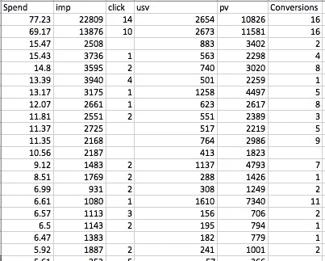

我回归分析要用到的数据。

**3。用函数** `**read.csv()**`将 csv 文件导入 R Studio。(参见此[链接](https://osxdaily.com/2015/11/05/copy-file-path-name-text-mac-os-x-finder/#:~:text=Right%2Dclick%20(or%20Control%2B,replaces%20the%20standard%20Copy%20option)了解如何在 mac 上获取路径名。)

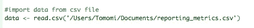

将 csv 文件导入 RStudio。

```
#import data from csv file
data <- read.csv('*[[insert your pathname]]*')
```


从 3055 行数据开始。

**4。使用 tidyverse 中的** `**drop_na()**` **删除因变量的所有 NA 值。**参见[此处的](https://stackoverflow.com/questions/48658832/how-to-remove-row-if-it-has-a-na-value-in-one-certain-column/56183858#:~:text=na.,NA%20is%20in%20column%20B.)了解描述该功能的参考。

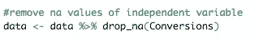

删除所有因变量“Conversions”为“NA”的行

```
#install tidyverse if you don't have it already
install.packages("tidyverse")#launch tidyverse
library(tidyverse)#remove na values of independent variable
data <- data %>% drop_na(*[[insert column name of your independent variable]]*)
```

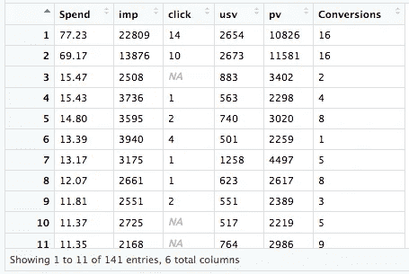

删除了因变量的 NA 值(转换)。行数减少到 142。你已经知道这不是最强的数据集。

**5。标准化你的自变量。我在 R 中通过将每个独立变量除以它们各自的最大值来做这个。**

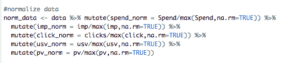

使用 mutate 为每个独立变量追加规范化列。

```
#normalize data (add additional %>% for any number of independent variables you have)
norm_data <- data %>% 
mutate(*[[insert a simple name of independent variable]]*_norm = *[[insert column name of independent variable]]*/max(*[[insert column name of independent variable]]*,na.rm=TRUE))
```

为了分解我在上面所做的事情，让我们看看我对列 Spend 做了什么:`mutate(spend_norm = Spend/max(Spend,na.rm=TRUE))`

*   `mutate()`:用于向现有数据集追加新列的函数
*   `spend_norm`=我的新专栏的名字
*   `Spend/max(Spend)`:归一化公式
*   `na.rm=TRUE`:用于删除空值的参数

因为我用新名称改变了每一列，从而创建了 5 个额外的列，所以我使用了函数`select()` 以便只保留相关的列。

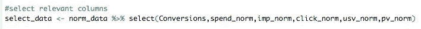

只选择我需要的数据。

```
#select relevant columns (add additional commas and variable names for any number of independent variables)
select_data <- norm_data %>% select(*[[insert column name of dependent variable]]*,
*[[insert new normalized column name of independent variable]]*)
```

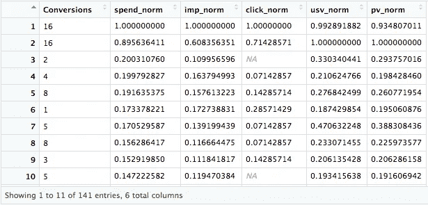

将数据标准化。行数保持不变，仍然是 141，因为我只是将原始列换成了它们的规范化版本。

**6。查找并删除异常值。**

对于我的数据集，我使用的方法是不考虑第一个四分位数以下四分位数间距(IQR)的 1.5 倍或第三个四分位数以上 IQR 的 1.5 倍。见[这里](https://www.r-bloggers.com/how-to-remove-outliers-in-r/)我用来确定这个的参考和我复制的函数。这里有两个小步骤:

*   1.找出异常值。从原始数据集中为每个独立变量确定 IQR 和上/下范围**。**
*   2.移除异常值。从移除先前独立变量的异常值后获得的更新数据集中，仅选择落在步骤 1 **中找到的上限和下限之间的数据。**

我对每个独立变量重复这两步，最终得到子集`removed5`。请参见下面 RStudio 中的我的代码。(你会发现我没有以最有效的方式做到这一点。希望有任何建议能让这更有效率。)


去除每个自变量的异常值的两个步骤。前两个独立变量的屏幕截图。


去除每个自变量的异常值的两个步骤。第三、第四和第五个独立变量的屏幕截图。

```
#removing outliers
#1\. run this code to determine iqr and upper/lower ranges for independent variable
x <-select_data$*[[insert new normalized column name of independent variable]]*
Q <- quantile(x,probs=c(.25,.75),na.rm=TRUE)
iqr <- IQR(x,na.rm=TRUE)
up <-  Q[2]+1.5*iqr # Upper Range
low<- Q[1]-1.5*iqr # Lower Range#2\. run this code to select only the data that's between the upper and lower ranges
removed1 <- subset(select_data, 
select_data$*[[insert new normalized column name of independent variable]]* > 
(Q[1] - 1.5*iqr) & select_data$*[[insert new normalized column name of independent variable]]* < 
(Q[2]+1.5*iqr))#if you're curious, see the new boxplot
ggplot(removed1,aes(*[[insert new normalized column name of independent variable]]*)) + geom_boxplot()#this is the new dataset you'll be working with
View(removed*[[insert # of total independent variables you normalized data for]]*)########if you have two or more independent variables, copy and paste the code below as many times as you need:#2nd independent variable ranges - repeating #1 and #2 above
#1\. run this code to determine iqr and upper/lower ranges for independent variable
x <-select_data$*[[insert new normalized column name of independent variable]]*
Q <- quantile(x,probs=c(.25,.75),na.rm=TRUE)
iqr <- IQR(x,na.rm=TRUE)
up <-  Q[2]+1.5*iqr # Upper Range
low<- Q[1]-1.5*iqr # Lower Range#2\. run this code to select only the data that's between the upper and lower ranges
removed*[[insert # for what number independent variable you are on]]* <- subset(select_data, select_data$*[[insert new normalized column name of independent variable]]* > (Q[1] - 1.5*iqr) & select_data$*[[insert new normalized column name of independent variable]]* < (Q[2]+1.5*iqr))#if you're curious, see the new boxplot
ggplot(removed*[[insert # for what number independent variable you are on]]*,aes(*[[insert new normalized column name of independent variable]]*)) + geom_boxplot()#this is the new dataset you'll be working with
View(removed*[[insert # of total independent variables you normalized data for]]*)
```

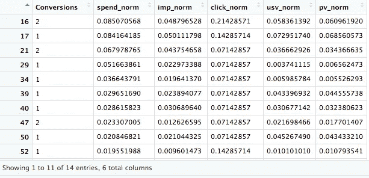

移除所有独立变量的异常值，行数减少到 14。在这一点上，我不确定这些数据是否真的会对我有所帮助，因为这些行的数量很少，但是无论如何，我将尝试对它们进行回归。

**7。**回归时间！**对数据使用 R 函数** `**lm()**` **。**回到我正在学习的[原始帖子](https://www.tatvic.com/blog/predict-bounce-rate-based-on-page-load-time-in-google-analytics/)来了解你在这里做什么的解释。

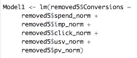

此数据集的回归模型。

```
#add additional variables as needed with + sign
Model1 <- lm(removed*[[insert # of total independent variables you normalized data for]]*$*[[insert column name of dependent variable]]* ~
removed*[[insert # of total independent variables you normalized data for]]*$*[[insert new normalized column name of independent variable]]*)
```

您已经创建了您的模型！现在，为了汇总结果，运行回归的最后一段代码:

```
summary(Model1)
```

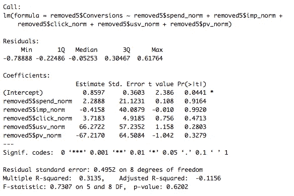

总结(模型 1):回归的结果显示了“转化率”和自变量之间的关系。

我上面提到的工程师看了这些结果，马上说:“是啊，你的数据很烂。”他说每个变量的 T1 与其 T2 相比都太大了。他还提到，对于只有 15 行数据的模型，使用 5 个变量是没有意义的。

但是没关系…我们做到了！万岁！

## 第五部分|后续步骤:改进您的模型

所以我们已经进行了回归分析！…但这并不是结束。俗话说“所有的模型都是错的，但有些是有用的。”因此，你的下一步是找出如何改进你的模型，以确保你拉的东西实际上是有用的。从本周末我所学习的系列文章的第三篇[文章](https://www.tatvic.com/blog/improving-bounce-rate-prediction-model-for-google-analytics-data/)中，以及一篇[更详细的文章](http://www.sthda.com/english/articles/37-model-selection-essentials-in-r/155-best-subsets-regression-essentials-in-r/#computing-best-subsets-regression)的支持下，我发现函数`regsubsets()` 的组合以及经过调整的 R2、Cp 和 BIC 指标允许我们计算出你的数据集中有多少变量实际上对正在讨论的模型有用。这有助于任何有两个以上自变量的模型。

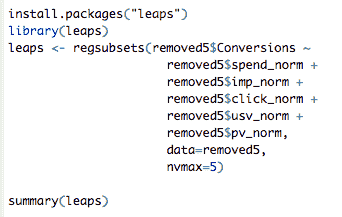

使用`**regsubsets**`函数来看看我的变量是否有用。

```
install.packages("leaps")
library(leaps)#add any number of independent variables that you need to the equation (note: this will not work if you only have 1 independent variable)
leaps <- regsubsets(removed*[[insert # of total independent variables you normalized data for]]*$*[[insert column name of dependent variable]]* ~ 
removed*[[insert # of total independent variables you normalized data for]]*$*[[insert new normalized column name of independent variable]]*,
data=removed*[[insert # of total independent variables you normalized data for]]*,
nvmax=*[[insert # of total independent variables you normalized data for]]*)summary(leaps)res.sum <- summary(leaps)
data.frame(
  Adj.R2 = which.max(res.sum$adjr2),
  CP = which.min(res.sum$cp),
  BIC = which.min(res.sum$bic)
)
```

为了用我上面链接的帖子的话来解释我在上面做的事情，这里有一个帖子的摘录:

> R 函数`regsubsets()` [ `leaps` package]可以用来识别不同尺寸的不同最佳模型。您需要指定选项`nvmax`，它代表了要合并到模型中的预测值的最大数量。例如，如果`nvmax = 5`，该函数将返回最佳 5 变量模型，即返回最佳 1 变量模型、最佳 2 变量模型、…、最佳 5 变量模型。
> 
> 在我们的例子中，数据中只有 5 个预测变量。所以，我们就用`nvmax = 5`。 *(* [*)来源*](http://www.sthda.com/english/articles/37-model-selection-essentials-in-r/155-best-subsets-regression-essentials-in-r/#computing-best-subsets-regression) *)*

关于上面代码的后半部分:

> `summary()`函数返回一些指标-调整后的 R2、cp 和 BIC(参见第[…]章)-允许我们确定最佳总体模型，其中最佳被定义为最大化调整后的 R2 和最小化预测误差(RSS、Cp 和 BIC)的模型。
> 
> 调整后的 R2 代表结果中由预测值的变化所解释的变化的比例。调整后的 R2 越高，模型越好。 *(* [*来源*](http://www.sthda.com/english/articles/37-model-selection-essentials-in-r/155-best-subsets-regression-essentials-in-r/#computing-best-subsets-regression) *)*

根据他们提到的每个度量标准，最好的模型在下面的代码块中，并产生下面的结果。

```
res.sum <- summary(leaps)
data.frame(
  Adj.R2 = which.max(res.sum$adjr2),
  CP = which.min(res.sum$cp),
  BIC = which.min(res.sum$bic)
)
```

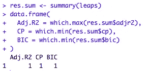

基于这些结果，调整后的 R2 告诉我们，最好的模型是有一个预测变量的模型，Cp 和 BIC 标准也是如此。它说我应该把模型中的变量数量从五个减少到一个。这并不奇怪，因为我一开始只有 15 行数据。

就这样，我结束了我周末用 r 学习线性回归的大丰收。如果你和我一样，强行通过做来学习是了解一个主题的完美开端。我希望你和我一样从中获益匪浅。前进！