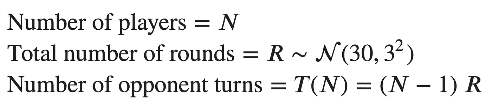
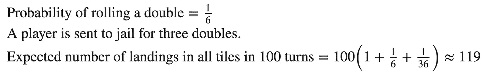
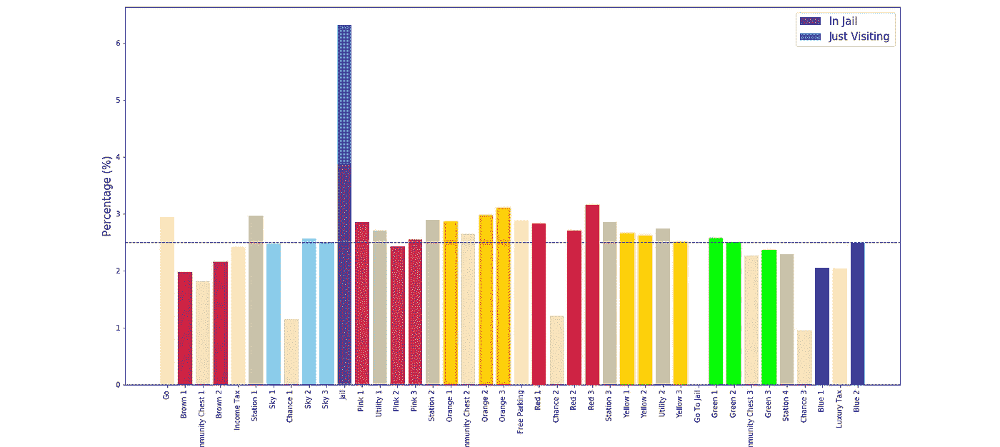
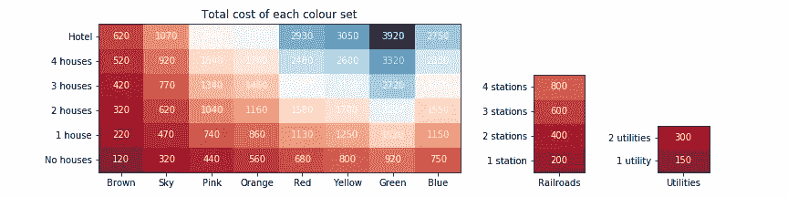
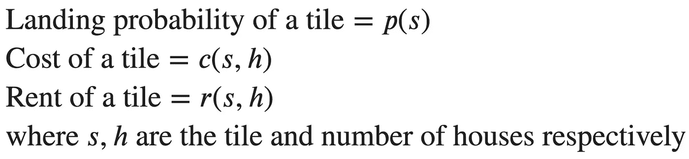
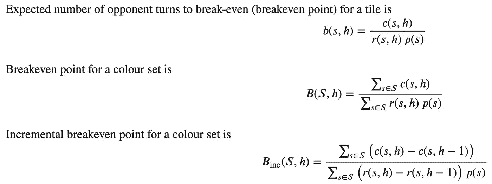
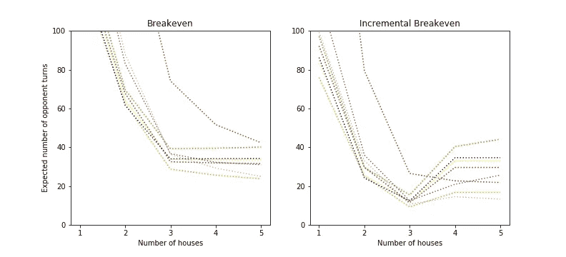
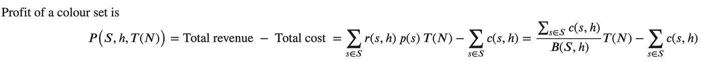
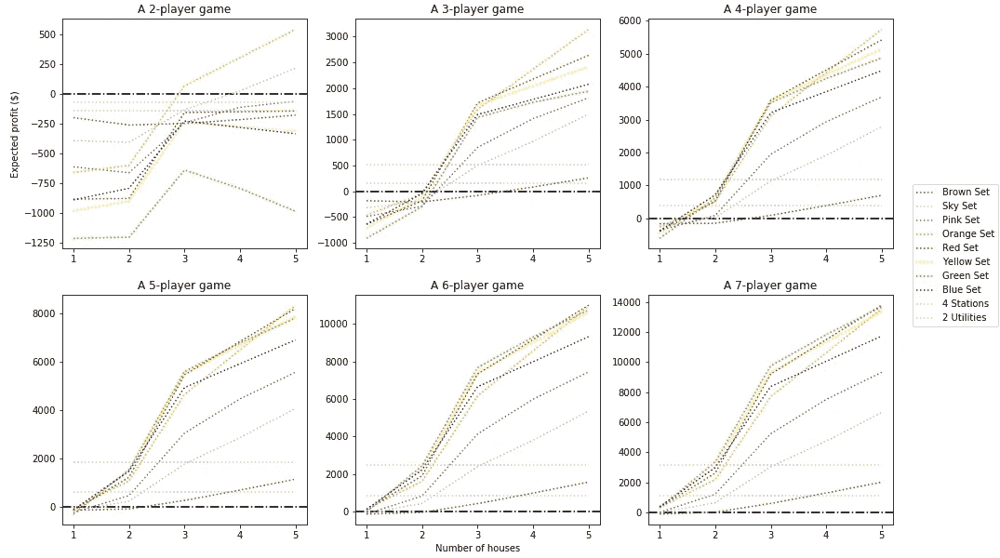

# 赢得垄断的 7 个策略

> 原文：<https://towardsdatascience.com/7-strategies-to-win-monopoly-a89ead18b062?source=collection_archive---------6----------------------->

## 一个关于 Python、统计、可视化和童年记忆的故事

Raivis Razgals 在 [Unsplash](https://unsplash.com?utm_source=medium&utm_medium=referral) 上拍摄的照片

**大富翁**是世界上最受欢迎的棋盘游戏之一。它有许多不同的许可和本地化版本。孩之宝刚刚发布了一个更长版本的大富翁游戏，拥有三重属性，永远玩不完。

这是一款给人(好？)童年回忆。我以前在假期和亲戚的孩子一起玩，通常都是输。

我玩大富翁已经很多年了。但我真的想知道我是否可以打得更好，以增加获胜的机会。也许我能战胜困难。今天，我将分析我们如何最大化赢得垄断游戏的机会。

我们的分析涉及 Python、统计和可视化。

就像在现实世界中，游戏中的属性是不相等的。它们承载着不同的价值观和回报。许多人认为“Go”瓷砖前最昂贵的房产(Mayfair/Boardwalk 或 Blue 2)能给他们带来财富，而其他人更喜欢收集一整套铁路或公用事业。

代码可在 [GitHub](https://github.com/edenau/monopoly-monte-carlo) 上获得。

# 约定

*   ***命名*** :我们将根据黑板上的颜色来命名酒店，因为它们在全球的不同版本中有不同的名称。原来还有各种各样的**配色方案**，但是我们将按照价格的升序使用以下版本——*棕色、天空、粉色、橙色、红色、黄色、绿色和蓝色*。还有*铁路*和*公用事业*。
*   ***标注*** :我们用从 0 到 39 的**整数**来标注从 **Go** 到 Blue 2(即梅菲尔街/木板路)的每一个方块。
*   ***成本*** :投资房产的玩家支付 A)一次性**土地** **价格**，以及 b)房价**价格**，如果他们决定建造一些的话。
*   ***收入*** :当对手拥有的财产落地时，玩家获得**租金收入**。
*   ***双打*** :两个骰子有相同的数字。掷出**双打**的玩家可以再次掷骰子。

# 1.目标

## a.韵律学

你希望**在游戏中实现**什么？你想赢。成为唯一的幸存者。挣钱。你想明智地投资能给你带来利润的房地产。我们正在到达那里。

安妮·斯普拉特在 [Unsplash](https://unsplash.com?utm_source=medium&utm_medium=referral) 上拍摄的照片

投资一套房产，需要多长时间才能达到收支平衡？我在游戏中能赚多少钱？我们需要建立一些**指标**来衡量你的表现。

1.  **盈亏平衡点**:你需要多少个**对手回合**才能收回你投入的资金？棕色的很便宜，但是要很长时间才能收回成本吗？蓝色的很贵，但也许我会很快收回投资？
2.  **预期利润**:一个游戏中每套属性的预期利润是多少？如果一场游戏有无限多轮，我们很有信心蓝色的一轮会给你带来最多的利润。然而，当其他人的钱都用完时，游戏就结束了。蓝色的可能不值得在短期游戏中投资。

一组属性的性能取决于 a)收入，b)成本，以及 c)对手**登陆**的可能性。如果不知何故，你的对手有 2 倍的可能在地产 A 上着陆，即使 B 的租金更高，它也更值得投资。**薄利多销**。

我们知道房产的成本和租金。它们写在他们的地契上。但是我们不知道它们的着陆概率。让我们找出答案。

## b.方法—蒙特卡洛

我们将**落地概率**定义为玩家在回合结束时或下一次掷骰前(如果他们得到双倍)出现在牌上的**概率。**

游戏中影响落地概率的因素有很多。所有玩家在开始时从 Go(平铺 0)开始。他们在自己的回合中掷出一对公平的骰子，并相应地在棋盘上移动。因为掷出 7 比得到 2 或 12 更有可能，所以有些牌可能比其他牌被访问得更频繁。

Geoff Brooks 在 [Unsplash](https://unsplash.com?utm_source=medium&utm_medium=referral) 上拍摄的照片

当玩家落在不是属性的“临时”牌上时，他们会遵循该牌的规则，最终可能会出现在另一张牌上。

1.  到达**的玩家坐牢**(平铺 30)显然是被送进了监狱(平铺 10)。
2.  到达**社区公益金** (CC)(牌 2、17 和 33)的玩家从 CC 牌组中抽取牌并相应移动。他们可能会留在目前的位置，但可能会被送进监狱。
3.  到达**机会**(牌 7、22 和 36)的玩家从机会牌组中抽取牌并相应移动。他们可能会留在当前的牌，但也可能会被送去监狱、牌 5、11、24 或 39。他们可以后退三步。
4.  连续三双的玩家被送进监狱。

你马上可以发现，登陆‘坐牢’的概率是**零**。玩家不能留在这个瓷砖上而不被送进监狱。
*注意**‘免费出狱’**卡让玩家不用付钱给银行就能出狱，它们**不能用来避免入狱**。

*非常复杂。*

我们可以使用**马尔可夫链**和一些巨大的矩阵来解析地找到着陆概率。您可以从每个起始方块解析获得落在每个方块上的**条件概率**。我们不会这么做的。

或者，我们可以通过蒙特卡洛模拟来估算着陆概率。蒙特卡罗方法通过**重复随机抽样**来近似分布。在这种情况下，我们可以模拟垄断游戏一百万次。我们记录玩家出现在每张牌上的频率。记录的频率是着陆概率的近似值。我们模拟的游戏越多，我们对近似值就越有信心。

*但是如何？*

## c.实现—面向对象的编程

我们模拟棋盘。我们模拟玩家掷骰子，在棋盘上走来走去，以及使用**面向对象编程**的其他一切。我们正在用 Python 实现它，代码可以在 [GitHub](https://github.com/edenau/monopoly-monte-carlo) 上找到。

米罗斯拉夫·乔纳斯在 [Unsplash](https://unsplash.com?utm_source=medium&utm_medium=referral) 上的照片

垄断游戏中有两种**对象**—**棋盘**和一些**玩家**。进行模拟时，玩家在棋盘上跑来跑去，通过掷骰子，有时在需要时从机会桌或社区公益金桌上抽牌。然后，玩家在每个牌上结束的概率可以通过蒙特卡洛模拟来近似。

某玩家有 **1。状态**:

*   a **当前在**板上的位置 *∈ [0..39]* ，
*   一个**双倍计数器**，它计算连续掷出的双倍数*∈[0]..3]* 当一名球员连续掷出三个双打时，他会立即被送进监狱，并且计数器会重置
*   **监禁** **布尔**变量*∈【0，1】*区分**‘只是探望’**和**‘坐牢’**；

**2。所有物**:

*   随机牌组 *∈ [0，1]* 中的**监狱自由牌**，以及
*   一张**社区公益金*∈【0，1】*的监狱自由牌**；

和 **3。记录**，

*   落在棋盘上每块瓷砖上的**事件总数**，以及
*   登陆监狱时“只是访问”和“在监狱中”的总次数。

玩家可以

1.  **掷骰子**一对公平的骰子，
2.  **更新**并记录他们的**新位置**，
3.  **更新**他们的其他**状态**和**所有物**，以及
4.  开始新游戏时清理他们的身份和财产。

另一方面，理事会

1.  名称、物业类型、物业价格、房价、所有瓷砖的不同数量房屋的租金，以及
2.  **在游戏开始时将**的**牌和**牌洗一次，在这里可以取出和放回免战牌。

板可以

1.  **模拟一个玩家掷骰子的回合**以及之后将要发生的一切，以及
2.  **模拟从每副牌中抽一张牌**。

迪伦·诺尔特在 [Unsplash](https://unsplash.com?utm_source=medium&utm_medium=referral) 上的照片

# 2.变量

## a.着陆概率

让我们模拟一个**四人**垄断游戏**一百万次**。为了保持模拟简单，我们没有模拟玩家之间的货币交换或交易，因为这将使事情复杂化。

*我们来定义一些变量。*

对于一个 *N* 玩家垄断游戏，我们假设有 *R* **轮**，其中每个玩家在每轮中进行**轮**游戏。对手回合总数为 *(N-1)R* 。我们假设每个玩家在一场游戏中玩相同的回合数，即没有玩家提前退出。

*边注* 1:按照官方垄断规则，连续双打算一次单回合。我们的模拟中仍然记录了每个替身的着陆。因此，对于每 100 圈，所有牌的**预期落地数**约为 **119** 。

照片由[布雷特·乔丹](https://unsplash.com/@brett_jordan?utm_source=medium&utm_medium=referral)在 [Unsplash](https://unsplash.com?utm_source=medium&utm_medium=referral) 上拍摄

为了获得更真实的近似值，我们将**随机性**添加到模拟中，其中一局游戏中的回合数 *R* 遵循平均值为 30 且标准差为 3 的**高斯分布**。平均值取自网上的一篇[文章](https://blog.ed.ted.com/2017/12/01/heres-how-to-win-at-monopoly-according-to-math-experts/)，方差是任意的。

蒙特卡洛模拟的主脚本

让我们用一个条形图来可视化每个瓷砖 *s* 的落地概率 *p(s)* 。

大富翁棋盘上牌的落地概率

*哇。*

我当然没想到会这样。着陆概率并不相等。我们可以观察到

*   你有 0%的几率像预期的那样“进监狱”，
*   你更有可能出现在 CC 牌上，而不是运气牌上，这可能是因为牌组中的牌组合不同，
*   你有 **6.31%** 的几率最终进**监狱**，包括“只是探访”和“进监狱”两种情况，
*   **监狱**是**最常去的**瓦即使我们**排除**‘只是去看看’，
*   **布朗 1 号(老肯特路/地中海大道)**是**最少光顾的房产**有 1.98%的几率，
*   **红色 3(特拉法尔加广场/伊利诺斯大道)**是**最常光顾的酒店**，概率为 3.16%，这可能是因为将玩家送到该酒店的机会卡，以及
*   Orange 3(Vine Street/New York Avenue)和 Orange 2(Marlborough Street/Tennessee Avenue)是访问量最大的房地产竞赛的亚军，这使得 **Orange** 平均成为**访问量最大的颜色集**。这是因为他们经常被刚离开监狱的玩家访问，监狱是棋盘上被访问最多的地方。

也许棕色的那套不值得投资。也许橙色的是必须买的。我们在现阶段不能确定，因为我们没有考虑到他们的租金和成本。让我们也做那件事。

*旁注 2* :监狱落地概率可能**低估**。我们假设一个玩家通过使用免罪卡或者支付 50 英镑/美元来出狱。他们不会试图不付钱就卷铺盖走人。这个假设在游戏开始时成立，但在游戏结束时不成立，因为呆在监狱里是避免付房租的最佳策略。

## b.投资成本

房产的**投资成本** *c(s，h)* 包括**土地**价格和**房屋**价格。不同的房产和上面建的房子数量有所不同。它们被硬编码到程序中。

每种颜色、铁路和公用设施的成本矩阵

请注意，我们考虑的是整个色彩组合的投资成本，而不是单个属性。这是因为房子只有在玩家拥有整套颜色时才能被购买。

我们还以类似的方式对租金收入矩阵 r( *s，h)* 进行了硬编码。

# 3.估价

## a.盈亏平衡点

我们将资产的盈亏平衡点定义为**预期的对手回合数**收回投资所需的时间。这是通过**总财产成本除以每个对手回合的预期租金收入**计算出来的。财产的每个对手回合的预期收入与其落地概率和租金收入成比例。我们可以使用相同的逻辑，通过以下公式找出颜色集的盈亏平衡点。

我们还将**增量**盈亏平衡点定义为**收回*增量*投资**所需的预期对手回合数。这意味着如果玩家决定建造**额外的*房子***，他们需要多长时间才能收回他们的钱。

让我们看看**盈亏平衡点如何随着不同数量的**房屋**而变化**。为了可视化的目的，5 个房屋对应于一个酒店。

每种颜色的盈亏平衡点作为房屋数量的函数

我们发现

*   它需要最长的时间来收回你在棕色电视机上的投资，
*   即使你投资了天空、橘子和 T21，也很容易收支平衡。
*   与 1 或 2 个房子相比， **3 个房子**的房子更容易达到收支平衡
*   如果你投资绿色或蓝色系列中的第四个房子，你可能无法收回你的钱。

我们仅仅基于盈亏平衡点的比较，就想出了以下策略。你应该

1.  **忌棕色**套、
2.  用你所有的其他颜色快速建造 3 栋房子
3.  建造天空中的第四座房子和/或橙色布景，如果你拥有它们的话。

蒂埃拉·马洛卡在 [Unsplash](https://unsplash.com?utm_source=medium&utm_medium=referral) 上拍摄的照片

## b.预期利润

我们都知道游戏的目标不仅仅是收支平衡。

你想挣钱，想让对手破产。一台彩色电视机的**利润**是该电视机的总收入和总成本之间的**差额。**收益与对手回合总数成比例**，而**成本是常数**。它们可以通过以下公式计算。**

我们之前假设一局游戏中的回合数 *R* 或多或少是恒定的。对手回合数 *T=(N-1)R* 线性增加，因此收入(和利润 *P* )随着玩家人数的增加而线性增加。

让我们看看，如果你拥有不同的**颜色组合**和不同数量的**房屋**，你的**利润会随着游戏中不同数量的**玩家**而变化。还绘制了持有所有 4 个站和持有所有 2 个公用事业公司的利润，以供参考。**

N 人游戏中每种颜色的预期利润，N 在 2 到 7 之间

我们发现

*   棕色的那套一文不值，
*   在玩家开始建造房屋之前，获得 4 条铁路可以在游戏开始时给你带来快速的现金，
*   建造第三座房子时利润大幅增加，
*   橙色在双人游戏中占优势，
*   红色、黄色和绿色也很有希望
*   蓝色是普通的。

因此，您应该

1.  **避开公用设施，棕色或粉色**，
2.  如果你一开始能负担得起，就把所有的 **4 条铁路**都拿走，不要坚持用其他财产来换取铁路的收藏，因为从长远来看**做得不好**，
3.  在双人游戏中，选择天空的**和橙色的**和**和**，
4.  在 3+玩家游戏中，选择**橙色**、**红色**和**黄色**，
5.  选择绿色的 4 人以上的游戏，
6.  如果你有足够的现金储备，只在 4 人以上游戏中选择蓝色
7.  快速建造 3 栋房子。这是关键。

由 [Alexander Mils](https://unsplash.com/@alexandermils?utm_source=medium&utm_medium=referral) 在 [Unsplash](https://unsplash.com?utm_source=medium&utm_medium=referral) 上拍摄

# 4.外卖

总之，我们使用蒙特卡洛模拟法来估算着陆概率，以便计算在 N 人游戏中，在一定数量的房屋下，每个颜色集的盈亏平衡点和预期利润。基于上述观察和策略，我们总结出以下 ***7 个你应该遵循的策略*** 。

1.  避免公用事业和棕色设置，
2.  当获得铁路收集以获得短期收益时，或获得 4+玩家游戏中的蓝色设置以获得长期收益时，请注意您的现金储备，
3.  根据游戏中玩家的数量选择橙色、红色、黄色和/或绿色，
4.  为你拥有的每种颜色快速建造 3 个房子，
5.  注意你的现金流，如果经济上可行的话，建造第四所房子来最大化你的利润，
6.  避免购买旅馆，否则你会为对手腾出房子，因为一场比赛中只有 32 个房子
7.  以不交钱的方式呆在监狱里，以避免后期交房租。

你应该对我们的分析持保留态度，因为我们做了很多假设，这些假设在某些情况下可能不成立。每个游戏都不一样，很难一概而论。考虑到**不可预测的人类行为**也是极其困难的，因为玩家被允许和鼓励**彼此自由交易**。

## 有趣的事实

有 **1.94%** 的几率，你在一个回合后**入狱。你可以在替身的帮助下点击“进监狱”,或者从任意一副牌中抽取“立即进监狱”牌。**

***千载难逢的机会。***

一生一次机会的蒙特卡罗模拟

感谢阅读！同样，代码可在 [GitHub](https://github.com/edenau/monopoly-monte-carlo) 上获得。你也可以[注册我的时事通讯](http://edenau.mailchimpsites.com/)来接收我的新文章的更新。如果您对 Python、统计或可视化感兴趣，以下文章可能会有所帮助:

 [## 我希望我能早点知道的 5 个 Python 特性

### 超越 lambda、map 和 filter 的 Python 技巧

towardsdatascience.com](/5-python-features-i-wish-i-had-known-earlier-bc16e4a13bf4)  [## 为什么样本方差除以 n-1

### 解释你的老师没有教过的高中统计学

towardsdatascience.com](/why-sample-variance-is-divided-by-n-1-89821b83ef6d)  [## 使用交互式地图和动画可视化伦敦的自行车移动性

### 探索 Python 中的数据可视化工具

towardsdatascience.com](/visualizing-bike-mobility-in-london-using-interactive-maps-for-absolute-beginners-3b9f55ccb59) 

*最初发表于*[*edenau . github . io*](https://edenau.github.io/)*。*