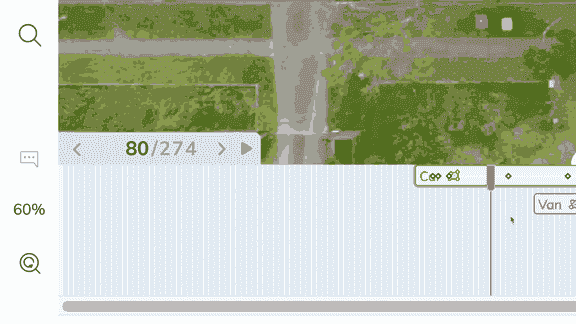

# 我们在视频标签工具中寻找的 7 样东西

> 原文：<https://towardsdatascience.com/7-things-we-looked-for-in-a-video-labelling-tool-705968e39d19?source=collection_archive---------16----------------------->

## 以下是需要注意的问题和要问的问题:

2020 年 7 月， [V7 Labs](https://v7labs.com) 发布了其视频标注工具。这是 6 个月开发旅程的一部分。以下是我们不得不注意的，这将不可避免地影响你的机器学习项目的质量。

# 1.视频帧质量:避免视频压缩

视频压缩，无论是 H264、H265，还是任何以. MP4 结尾的扩展名。AVI。MOV，几乎总是有损耗。大多数流媒体服务中使用的 H264 视频比未压缩的图像系列轻 20 到 200 倍，人眼很难注意到运动中的差异。

然而，当您捕获静止图像时，这种差异是显而易见的，并将影响您的注释质量和训练数据。

来源: [Geeksforgeeks](https://www.geeksforgeeks.org/difference-between-lossy-compression-and-lossless-compression/)

视频压缩主要影响运动中的元素，并且在存在噪声(在黑暗场景中很常见)的情况下表现得非常糟糕。像 H265/HEVC 这样的现代视频压缩在处理较小的移动项目方面做得更好，但是它们仍然比它们应该的更断断续续和更像素化。这将最终影响模型检测运动中较小项目的方式，并学习在运动模糊中检测它们。

来源: [Frame.io](https://blog.frame.io/2018/09/24/hevc-format-wars/)

你可能还需要注意的是**帧采样**。大多数视频以 30FPS 拍摄，但除非你正在测试快速对象跟踪算法，否则你不需要频繁地标记。大多数计算机视觉应用需要 2FPS 的高多样性数据集，或者 15FPS 的以人的速度进行实时跟踪(这不是移动的汽车，而是行走/互动的人)。我们已经内置了一个帧采样器，允许您调整视频的帧速率进行标记。这不会影响视频质量，但可以让你不用注释几乎相同的帧。

来源: [V7 实验室](https://v7labs.com)

确保您使用的任何视频注释系统都允许您**以全分辨率标记未压缩的视频帧。**通常会避免这种情况，以确保视频可以流畅播放。以下是需要注意的事项:

**问题:**从原始文件中标记视频时，我们预计会有什么图像质量损失？

# 2.z 堆叠标签:是什么让视频编辑工具与众不同

早在 2004 年我 11 岁的时候，我的学校购买了一些现已不存在的 Macromedia Flash MX 的许可证。让 Flash 在当时脱颖而出，并导致 2000 年代中期动画和游戏创造性爆发的是它处理如此多同时移动的对象和运动图形关键帧插值的能力。

这是 Adobe Flash Professional 2016，它的化身在被弃用之前的最新版本。来源:Alan Becker flash 教程

类似地，像 Adobe Premiere Pro 或 After Effects 这样的专业视频编辑软件，凭借其可以支持的同步轨道数量，使自己与免费或开源的替代品区分开来。这给 UX 和工程带来了挑战，因为视频注释可能需要*数百个*同时出现的对象，在时间线中有独立的**入口**和**出口**点。

Adobe Premiere Pro 中繁忙的时间线，有 11 个音频和视频轨道。我们将不得不处理 100+。来源:Adobe

这意味着我们不能像在视频编辑中那样使用基于*轨道的*时间轴，因为需要巨大的垂直空间。相反，我们选择在一个单独的层栏中定义重叠的注释，并让时间轴自动调整，以在一个狭窄的范围内适应尽可能多的注释。

我们的视频注释系统的画板草图。来源:V7 实验室，设计

我们选择了基于出现顺序的自动调整时间线，但是水平轨道可以在注释之间共享。这样，当一个对象退出框架时，下一个对象会出现在它的位置上。此外，关键帧会记住它们在时间上的位置，因此如果调整了注释的持续时间，关键帧也会相应地调整。

来源: [V7 视频注释](https://www.v7labs.com/academy/video-annotation)

**问题:**一个视频中可以同时出现多少个物体？
**答**:确保每个都可以有一个在你界面上清晰可见的起点和终点。这将有助于 QA，因为时间错误是视频注释中最常见的错误之一，对网络性能非常不利。

# 3.关键帧:查看发生变化的地方

[关键帧](https://en.wikipedia.org/wiki/Key_frame)用于地球上的每一个视频编辑和动画软件。就像他们说的，如果它没坏，就不要修理它。
根据软件的用途，它们可能会被不同地处理。例如，在像 [Adobe Premiere Pro](https://helpx.adobe.com/uk/premiere-pro/using/adding-navigating-setting-keyframes.html) 这样的视频蒙太奇软件中，它们处于后座位置，只有打开剪辑的设置才能看到。最终剪辑也是如此，一次只能看到一个片段。对于像 After Effects 或 Adobe Animate(ye olde Macromedia Flash)这样的动画软件来说，它们占据了中心位置，因为它们是动画师的主要交互模式。

来源:V7 实验室，Adobe.com，苹果

图像注释比视频编辑更接近运动图形。
在 V7 中，我们希望确保一个形状中的关键帧独立于另一个形状。因此，每个注释都有自己的一组关键帧，可以定义它们的位置、形状、属性或任何其他支持的属性，如可见/隐藏、遮挡等。

来源: [V7 视频注释](https://www.v7labs.com/academy/video-annotation)

我在视频编辑套件中发现令人沮丧的事情是错误地在错误的帧中编辑属性，丢失了一个关键帧，所以我们让每个都成为可点击的快捷方式。

**问题:** *关键帧是如何工作的？注释中发生的事件(如属性变化或形状变化)是如何被明显标记的？*
**回答**:确保很容易发现变化，否则你的 QA 会变得凌乱而耗时。还要确保每种注释类型都支持某种形式的关键帧。

# 4.插值:走多远？

先说**线性** vs **三次**插值。这真的重要吗？

来源:V7 实验室，研究

不完全是，不。我们在这里讨论的是空间插值。大多数对象，例如左边的球，都是按照三次样条曲线移动的。然而，在制造业中这是不正确的，因为齿轮的性质，运动几乎总是线性的。即便如此，最大的区别并不在空间插值上，而是在时间插值上**。*本质上，难处理的不是物体的弧形运动，而是加速和减速。时间插值让用户感到困惑，以至于“时间插值”是 After Effects 教程中搜索最多的概念之一。我们发现保持时间线性在避免用户沮丧方面做得更好，代价是多点击几次。*

**

*来源: [V7 达尔文](https://www.v7labs.com/darwin)*

## *包围盒插值*

*最容易处理的是边界框。本质上是两个坐标点的移动。你唯一想要确保的是边界框可以随着时间改变状态，例如添加或丢失属性，或者隐藏。*

**

*来源:V7 实验室，研究*

## *多边形插值*

**

*当您有潜在的无限数量的点要处理，并且您的源和目标形状使用不同数量的点时，事情会变得更加困难。我们发现在多边形注释中，这几乎适用于每一种情况。*

*在数学中，这被称为稳定婚姻问题。形状还有一个额外的挑战，就是必须确保目标点和原点彼此靠近。实时计算这可能是一个挑战。*

*我们包括了实时多边形插值，因为分割遮罩是我们工具的主要组成部分，我们认为我们在解决它方面做得很好，但是它仍然不完美。*

*如果你有兴趣深入了解为什么多边形插值是棘手的，Flash 动画师 Alan Becker 的这个优秀教程展示了它的一些缺点。*

## *关键点插值*

**

*来源: [V7 变更日志](https://www.v7labs.com/darwin/changelog)*

*[关键点骨架](http://www.v7labs.com/academy/keypoint-skeletons)是多边形插值的一种变通方法，因为它们有一定数量的点。您还需要确保能够插值骨架或自定义多边形。如果数据中有需要，请确保能够标记被遮挡的关节。这里有一个[视频](https://www.youtube.com/watch?v=q17gqr0EIUQ)关于我们如何在 V7 上处理视频注释中的关键点骨架。*

## *基于神经网络的插值*

*最后，我们发现平滑视频中多边形的最有效方法是在每一帧(或 2-5 帧，在它们之间插值)上运行神经网络，并进行任何必要的调整作为网络的输入。这里，我们使用[自动注释](https://www.v7labs.com/automated-annotation)，它是类不可知的，响应用户的点击，作为重新绘制分割蒙版的提示。*

**

# *5.擦洗性能:为什么视频编辑花费$000 的权利编辑套件。*

*因为一个滞后的视频让人抓狂。当人们购买视频编辑软件时，它不是关于预置、效果或过渡的——那些都是购买后从市场上下载的。是因为回放体验和实时渲染的保真度。你要反复播放同一个 3 秒钟的序列十几次，确保它是流畅的！*

**

*有两个因素需要注意:*

1.  *视频播放得有多好，你能以多快的速度跳过视频的各个部分并播放一个序列。*
2.  *视频播放时，注释的渲染有多流畅和忠实？确保您在测试时使用了尽可能多的标签，就像您预计在生产中使用的那样。*

*并且可能*

*3.上传视频后，您能以多快的速度处理视频，并在完成后生成导出？*

*当一个视频被完全标记时，不要低估性能损失。大多数注释系统运行在有性能限制的浏览器上，当您作为数据科学家或评审员检查工作质量时，会变得非常慢。*

# *6.慢速连接性能:它能在世界上的每个地区工作吗？*

*cdn 是 SaaS 的无名英雄。他们通过让内容的一部分更靠近用户来确保内容交付给用户，同时(如果做得好的话)仍然符合 GDPR 或 HIPAA。
这意味着:**如果一个演示在加州的 Macbook Pro 上运行良好，那么它可能在秘鲁的用户中运行不佳。**对你来说 2 秒钟就能加载的内容，对某些用户来说可能需要 60 多秒才能加载，这仅仅是因为他们的位置。在这一点上，标记数据的用户并不总是在超快的连接上。*

**

*当你能在主题中找到的唯一插图是剪贴画时，你就知道有些东西很无聊*

**

*来源:谷歌 Chrome 浏览器*

*通过使用连接到远程国家的 VPN 来测试视频注释的性能。您也可以通过在浏览器的开发工具(CTRL+ALT+I)中转到网络选项卡来模拟较慢的连接。左图是 [Chrome 的](https://developers.google.com/web/tools/chrome-devtools/network#throttle)。*

***问题:** *【地区】是否有用户，他们报告的网络性能如何？*
**回答**:你应该可以[测试](http://cloudharmony.com/speedtest-for-aws:cloudfront)该地区服务的性能，得到一些具体的数字。*

# *7.视频数据集管理:当你深陷数据时会发生什么？*

*事情会大规模崩溃，如果不是不可能的话，修补一个不是为你的最终目标而构建的产品是非常困难的。当寻找一个标签合作伙伴，你把你的业务交付在他们手中。确保他们对其工具的长期和大规模性能坦诚。*

*我们也遇到规模问题，并且从未停止遇到边缘情况。加载几十个正片长度的视频？检查。8:1 纵横比的视频？检查。拥有数千个类别和数万个属性的视频数据集？检查。如果您没有构建支持它们的先决条件，那么支持它们是很棘手的，并且可能会让您付出高昂的代价。*

**

*数据集管理界面中的一系列待标注视频。来源: [V7 达尔文](http://v7labs.com/darwin)*

*我们遇到了太多的企业因为规模表现不佳而放弃了内部工具或开源标签平台。这是一个痛苦的转变，因为它必须发生在你全力生产的时候。对于视频，这些性能问题会成倍增加。以下是要注意的事项和要问的问题:*

***问题:数据集大小-** *当我的一个数据集达到 10 万个视频时，性能会如何下降？100 万怎么样？你能提供一些你如何克服规模问题的例子吗？*
**回答**:没有什么是完全尺度不变的。你可能会发现在检索和搜索视频时速度变慢了。确保该工具的开发人员已经和另一个客户一起经历过这个挑战，并且没有忽视这个挑战。*

***问题:数据集管理** — *我可以通过名称、状态、标签或标记它的用户来搜索或检索任何视频吗？*
**回答**:你会需要这个的。在培训结束后，有时需要对数据集进行拆分、重新调整用途、清理或故障排除。*

***问题:数据集完整性** — *你是否保留了每个视频的变化历史，以备我们遇到地面真相的问题？您是否备份了这些资产？*
**回答**:你至少要确保你有机会发现一批*坏数据*，因为错误往往要么发生在同一*时间段*内，要么发生在*用户*内。您还希望确保每天都备份注释、数据以及任何性能和历史指标。删除中的人为错误是我们每天都会遇到的事情，而且太常见了。*

*我希望这是一个有用的指南，告诉你应该注意什么。确保在开始机器学习数据标记时，你已经涵盖了所有可能的场景，因为你使用的工具将是你的 ML 进展的基石。如果你想看看我们最终在 V7 中构建了什么，下面是一个视频摘要:*