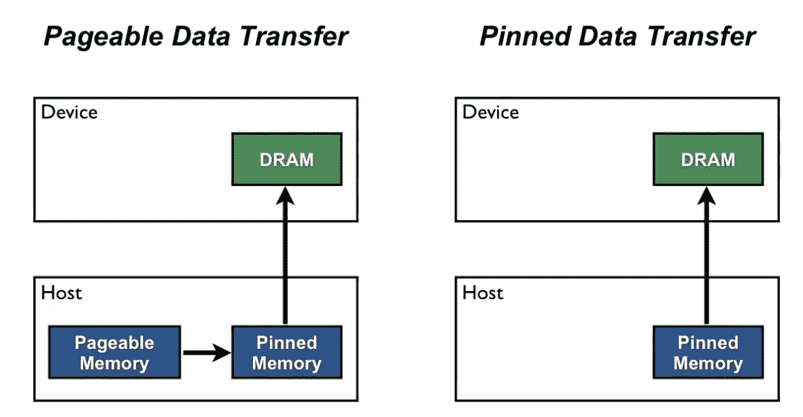
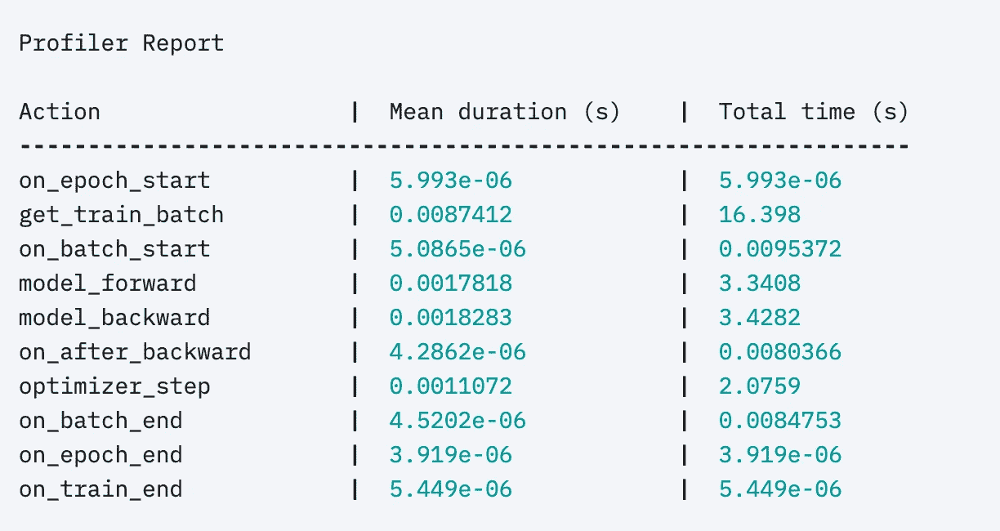
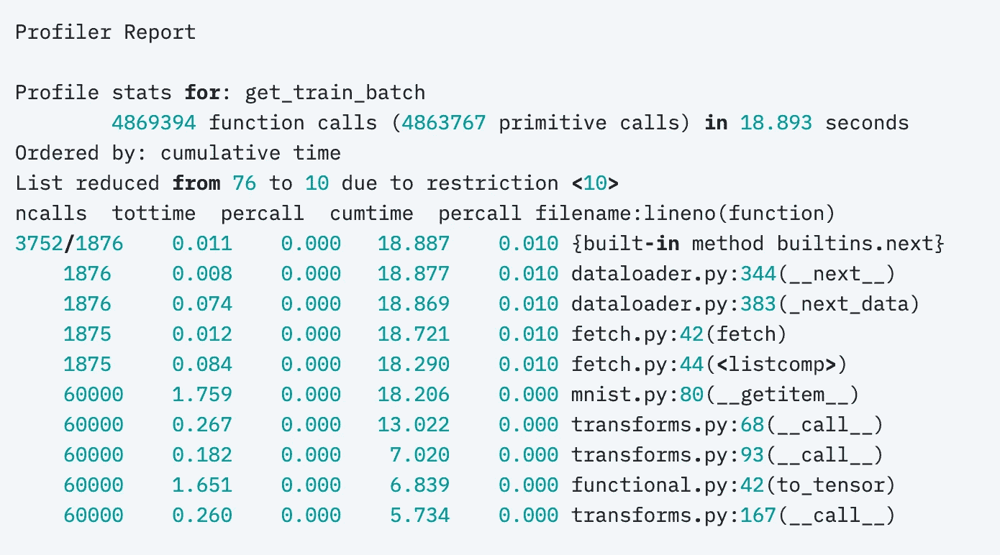
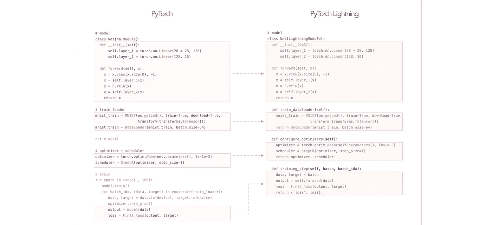

# 最大化 PyTorch 性能的 7 个技巧

> 原文：<https://towardsdatascience.com/7-tips-for-squeezing-maximum-performance-from-pytorch-ca4a40951259?source=collection_archive---------1----------------------->


在过去的 10 个月里，在开发 [PyTorch Lightning](https://github.com/PyTorchLightning/pytorch-lightning) 、[时，团队和我](https://pytorch-lightning.readthedocs.io/en/stable/governance.html)已经接触到了许多构建 PyTorch 代码的风格，我们已经确定了一些我们看到人们无意中引入瓶颈的关键地方。

我们非常小心地确保 PyTorch Lightning 不会在我们为您自动化的代码中犯任何这些错误，当我们检测到这些错误时，我们甚至会尝试为用户纠正它们。然而，因为 Lightning 只是结构化的 PyTorch，而你仍然控制着所有的科学 PyTorch，所以在很多情况下我们不能为用户做什么。

此外，如果您不使用 Lightning，您可能会无意中在代码中引入这些问题。

为了帮助你更快地训练，这里有 8 个你应该知道的技巧，它们可能会降低你的代码速度。

# 在数据加载器中使用工作线程


这第一个错误很容易纠正。PyTorch 允许在多个进程上同时加载数据([文档](https://pytorch.org/docs/stable/data.html#multi-process-data-loading))。

在这种情况下，PyTorch 可以通过处理 8 个批处理来绕过 GIL 锁，每个批处理在一个单独的进程中进行。你应该用多少工人？一个好的经验法则是:

```
num_worker = 4 * num_GPU
```

[这个 answe](https://discuss.pytorch.org/t/guidelines-for-assigning-num-workers-to-dataloader/813/7) r 对此有很好的论述。

警告:坏处是你的内存使用量也会增加([来源](https://discuss.pytorch.org/t/guidelines-for-assigning-num-workers-to-dataloader/813/2))。

# 引脚存储器


你知道有时你的 GPU 内存显示已满，但你很确定你的模型没有使用那么多吗？这种开销被称为*固定内存。这个内存已经作为一种“工作分配”被保留*

当您在数据加载器中启用 pinned_memory 时，它会“自动将获取的数据张量放入 pinned memory，并使数据更快地传输到支持 CUDA 的 GPU”([source](https://pytorch.org/docs/stable/data.html#memory-pinning))。



在[这篇 NVIDIA 博客文章](https://devblogs.nvidia.com/how-optimize-data-transfers-cuda-cc/)中描述的固定内存。

这也意味着您不应该不必要地呼叫:

```
torch.cuda.empty_cache()
```

# 避免 CPU 到 GPU 的传输，反之亦然

```
# bad.cpu()
.item()
.numpy()
```

我看到大量使用。项目()或。cpu()或。numpy()调用。这对性能非常不利，因为这些调用中的每一个都将数据从 GPU 传输到 CPU，并且**显著地**降低了性能。

如果您试图弄清楚附加的计算图，请使用。请改为分离()。

```
# good.detach()
```

这不会将内存转移到 GPU，它会删除任何附加到该变量的计算图形。

# 直接在 GPU 上构造张量

大多数人都是这样在 GPU 上创建张量的

```
t = tensor.rand(2,2).cuda()
```

但是，这个先创建 CPU 张量，然后再传递给 GPU……这个真的很慢。相反，直接在你想要的设备上创建张量。

```
t = tensor.rand(2,2, device=torch**.**device('cuda:0'))
```

如果您使用的是 Lightning，我们会自动将您的模型和批次放在正确的 GPU 上。但是，如果你在代码中的某个地方创建了一个新的张量(例如:VAE 的样本随机噪声，或者类似的东西)，那么你必须自己放置这个张量。

```
t = tensor.rand(2,2, device=self.device)
```

每个 LightningModule 都有一个方便的 self.device 调用，无论你是在 CPU、多 GPU 还是 TPU 上，它都可以工作(即:lightning 将为该张量选择正确的设备。

# 使用分布式数据并行而不是数据并行

PyTorch 有两个主要模型用于在多个 GPU 上进行训练。第一个，*DataParallel(****DP****)*，跨多个 GPU 拆分一个批处理。但这也意味着模型必须复制到每个 GPU，一旦在 GPU 0 上计算了梯度，它们必须同步到其他 GPU。

这需要大量昂贵的 GPU 传输！相反，*DistributedDataParallel(****DDP****)*在每个 GPU 上创建模型的孤岛副本(在它自己的进程中)，并且只使一部分数据对那个 GPU 可用。这就像有 N 个独立的模型训练，除了一旦每个模型计算了梯度，它们都跨模型同步梯度…这意味着我们在每个批处理期间只跨 GPU**传输数据一次**。

在[闪电](https://github.com/PyTorchLightning/pytorch-lightning)中，你可以在两者之间轻松切换

```
Trainer(distributed_backend='ddp', gpus=8)
Trainer(distributed_backend='dp', gpus=8)
```

注意 [PyTorch](https://pytorch.org/docs/stable/notes/cuda.html#use-nn-parallel-distributeddataparallel-instead-of-multiprocessing-or-nn-dataparallel) 和 [Lightning](https://pytorch-lightning.readthedocs.io/en/stable/multi_gpu.html#data-parallel-dp) 都不鼓励 DP 使用。

# 使用 16 位精度

这是另一种加快训练速度的方法，我们没有看到很多人使用。在 16 位训练中，模型和数据的一部分从 32 位数字变为 16 位数字。这有几个优点:

1.  您使用了一半的内存(这意味着您可以将批量加倍，并将训练时间减半)。
2.  某些 GPU(V100，2080Ti)可以自动加速(快 3-8 倍)，因为它们针对 16 位计算进行了优化。

在 Lightning 中，这很容易实现:

```
Trainer(precision=16)
```

注意:在 PyTorch 1.6 之前，你还必须安装 Nvidia Apex…现在 16 位是 PyTorch 的原生版本。但是如果你使用的是 Lightning，它支持这两种方式，并根据检测到的 PyTorch 版本自动切换。

# 剖析您的代码

如果没有 Lightning，最后一个技巧可能很难做到，但是您可以使用类似于 [cprofiler](https://docs.python.org/3/library/profile.html) 这样的工具来做到这一点。但是，在 Lightning 中，您可以通过两种方式获得培训期间所有通话的摘要:

一、内置的[基本剖析器](https://pytorch-lightning.readthedocs.io/en/stable/profiler.html)

```
Trainer(profile=True)
```

它给出了这样的输出:



或者高级分析器:

```
profiler **=** AdvancedProfiler()
trainer **=** Trainer(profiler**=**profiler)
```

变得非常精细



闪电剖面仪的完整文档可以在[这里](https://pytorch-lightning.readthedocs.io/en/stable/profiler.html)找到。

# 在你的代码中采用闪电

PyTorch 闪电只不过是结构化的 PyTorch。



如果你已经准备好让这些技巧中的大部分为你自动完成(并经过良好的测试)，那么看看这个关于将 PyTorch 代码重构为 Lightning 格式的视频[！](https://www.youtube.com/watch?v=QHww1JH7IDU)