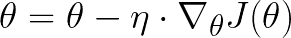
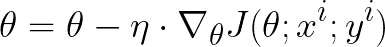
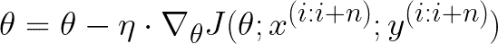

# 选择最佳优化器的 7 个技巧

> 原文：<https://towardsdatascience.com/7-tips-to-choose-the-best-optimizer-47bb9c1219e?source=collection_archive---------7----------------------->

## 根据我的经验。

马库斯·温克勒在 [Unsplash](https://unsplash.com?utm_source=medium&utm_medium=referral) 上的照片

# 介绍

在机器学习中，当我们需要计算预测值和实际值之间的距离时，我们使用所谓的损失函数。

与许多人认为的相反，**损失函数和成本函数**不是一回事。虽然损失函数计算单个预测与其实际值的距离，但成本函数通常更通用。事实上，成本函数可以是，例如，训练集上的损失函数之和加上一些正则化。

另一个经常被错误地用作前两个的同义词的术语由目标函数表示，它是在训练期间被优化的任何函数的最一般的术语。

一旦澄清了正确的术语，我们就可以给出优化器的定义。

机器学习中的优化器用于调整神经网络的参数，以便**最小化成本函数。**

因此，优化器的选择是一个重要的方面，可以区分好的训练和坏的训练。

实际上，有许多优化器，所以选择并不简单。在本文中，我将简要描述最常用的优化器，然后给你一些在不同项目中帮助过我的指导原则，我希望在为你的任务选择最合适的优化器时，这些指导原则也能帮助你。

关于具体优化器如何工作的进一步信息，你可以看看这个[网站](https://ruder.io/optimizing-gradient-descent/index.html)。

# 有多少优化者？

就像刚才说的，有很多优化器。它们中的每一种都有与特定任务相关的优点和缺点。

我喜欢把优化器分为两个家族:梯度下降优化器和*自适应*优化器。这种划分完全基于一个操作方面，在梯度下降算法的情况下，强制您手动调整**学习率**，而在自适应算法中自动调整*——这就是我们使用这个名称的原因。*

***梯度下降:***

*   *批量梯度下降*
*   *随机梯度下降*
*   *小批量梯度下降*

***自适应:***

*   *阿达格拉德*
*   *阿达德尔塔*
*   *RMSprop*
*   *圣经》和《古兰经》传统中）亚当（人类第一人的名字*

# *梯度下降优化器*

*有三种类型的梯度下降优化器，它们在我们使用多少数据来计算目标函数的梯度方面有所不同。*

## *批量梯度下降*

*也被称为香草梯度下降，这是三种算法中最基本的算法。它为整个训练集计算目标函数 *J* 相对于参数 *θ* 的梯度。*

**

*批量梯度下降中更新重量的公式。梯度乘以学习速率η，然后用于更新网络的参数。*

*由于我们使用整个数据集仅执行**一步，**批量梯度下降可能会非常慢。此外，它不适合不适合内存的数据集。*

## *随机梯度下降*

*它是批量梯度下降的改进版本。它不是计算整个数据集的梯度，而是为数据集中的每个示例执行参数更新**。***

*因此，该公式现在还取决于输入 *x* 和输出 *y* 的值。*

**

*用于更新 SGD 中权重的公式*

*SGD 的问题是更新频繁且具有高方差，因此目标函数在训练期间波动很大。*

*相对于批量梯度下降，这种波动可能是有利的，因为它允许函数跳到更好的局部最小值，但同时它可能代表相对于在特定局部最小值中的收敛的不利之处。*

*这个问题的解决方案是缓慢降低学习率值，以便使更新越来越小，从而避免高振荡。*

## *小批量梯度下降*

*这种算法背后的直觉是利用两种梯度下降方法的优势，我们已经看到了。*

*它主要计算小批量数据的梯度，以减少更新的方差。*

**

*在小批量梯度下降中更新重量的公式*

# ***外卖#1***

*   ***小批量梯度下降是大多数情况下三者中的最佳选择**。*
*   ***学习率调优问题:**都受制于一个好的学习率的选择。不幸的是，这个选择并不简单。*
*   ***不适合稀疏数据:**没有机制来证明很少出现的特征。所有参数同等更新。*
*   *陷入**次优局部最小值**的可能性很高。*

# *自适应优化器*

*这个优化器家族已经被引入来解决梯度下降算法的问题。它们最重要的特点是不需要调整学习率值。实际上，一些库——比如 Keras——仍然允许你手动调整它来进行更高级的测试。*

## *阿达格拉德*

*它使学习速率适应参数，对频繁出现的特征进行小更新，对最罕见的特征进行大更新。*

*通过这种方式，网络能够捕获属于不经常出现的特征的信息，将它们放在证据中，并给予它们适当的权重。*

*Adagrad 的问题是，它根据所有过去的梯度来调整每个参数的学习速率。因此，在高数量的步骤之后具有非常小的学习率的可能性——由所有过去梯度的累积产生——是相关的。*

*如果学习率太小，我们就不能更新权重，结果是网络不再学习。*

## *阿达德尔塔*

*它通过引入历史窗口来改进先前的算法，该历史窗口设置了在训练期间要考虑的固定数量的过去梯度。*

*这样，我们就不存在学习率消失的问题。*

## *RMSprop*

*它与 Adadelta 非常相似。唯一的区别是他们管理过去梯度的方式。*

## *圣经》和《古兰经》传统中）亚当（人类第一人的名字*

*它增加了 Adadelta 和 RMSprop 的优点，即存储类似于动量的过去梯度的指数衰减平均值。*

# *外卖#2*

*   ***亚当在大多数情况下是自适应优化者**中最好的 **。***
*   ***擅长稀疏数据**:自适应学习速率非常适合这种类型的数据集。*
*   *没有必要关注学习率值*

# *梯度下降与自适应*

*总的来说亚当是最好的选择。无论如何，许多最近的论文指出，如果结合一个良好的学习率退火计划，SGD 可以带来更好的结果，该计划旨在管理其在培训期间的价值。*

*我的建议是**在任何情况下都首先尝试 Adam**，因为它更有可能在没有高级微调的情况下返回好的结果。*

*然后，如果 Adam 取得了好的结果，那么打开 SGD 看看会发生什么是个好主意。*