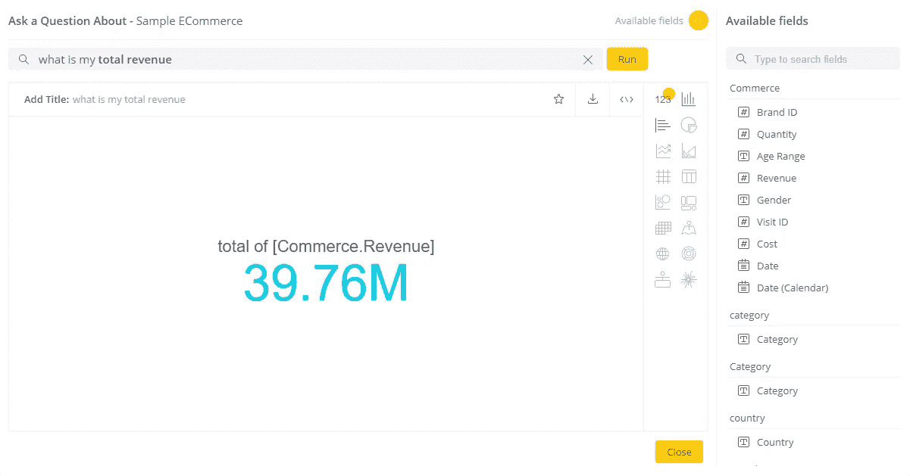
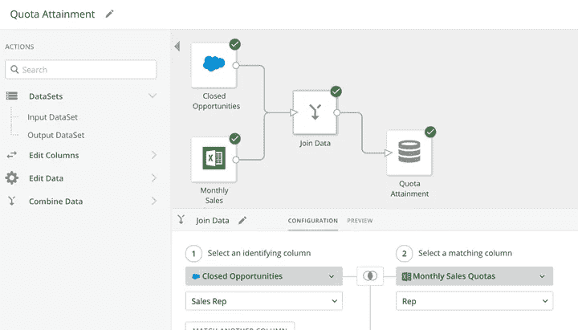
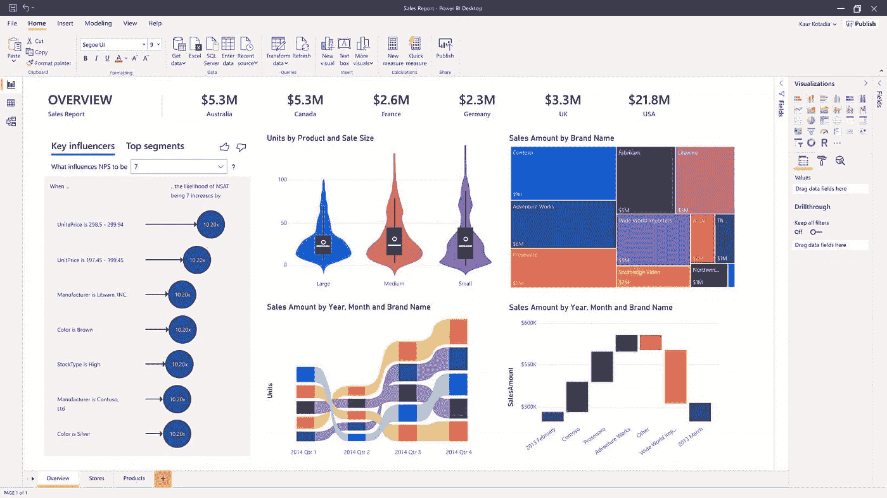
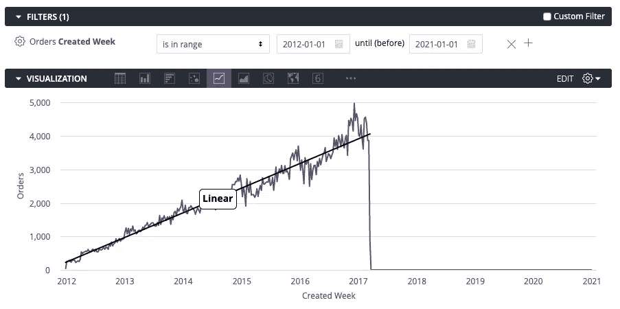

# 2020 年实现卓越商业智能的 7 种工具

> 原文：<https://towardsdatascience.com/7-tools-for-superior-business-intelligence-in-2020-7fb8dfeb9e1f?source=collection_archive---------54----------------------->

图像通过[像素](https://www.pexels.com/pt-br/foto/atividade-caderno-computador-portatil-eletronicos-110078/)

随着公司的不断发展，理解他们长期收集的大量数据变得越来越困难。关键决策者和高层需要智能数据和分析工具来做出明智且有利可图的决策。

商业智能(BI)工具帮助公司收集、分析、监控和预测各种商业场景。他们通过识别趋势、提供数据可视化和提供实时自助数据分析来实现这一点，用户可以在此基础上做出决策。

更具体地说，决策者可以使用 BI 工具来合并和准备来自不同来源的数据集，这些来源通常是非结构化的，并且采用不同的格式。然后，他们可以使用这些工具在交互式嵌入式仪表板中可视化洞察。与老一代企业商务智能软件相比，新的自助式商务智能使 it 部门能够轻松地为业务线用户(也称为“[公民分析师](/most-businesses-dont-use-data-the-right-way-research-e1dcc81a5627)”)设置他们自己的软件环境，让他们能够独立工作。

用户不再需要大量的技术知识或编码查询的能力。这样做的主要好处是业务线用户需要最少的 it 参与，他们能够更快地做出明智的决策[，从而增加公司的利润](/you-have-data-heres-how-to-use-it-to-beat-95-of-the-competition-15ef50d1dc35)。

在本文中，我们将仔细研究一些商业智能的最佳工具，并强调它们的突出特点。

# 1. [Sisense](https://www.sisense.com/)

Sisense 商业智能平台非常用户友好，需要最少的 IT 参与。这使得它成为混合了需要访问它的公民分析师用户和高级用户的组织的完美候选。

Sisense 是一个可扩展的解决方案，这意味着它非常适合初创公司、中小型企业和企业组织。用户可以随心所欲地扩展核心软件，因为该平台提供了对各种插件和库的支持。此外，Sisense 的 SSO 机制允许系统对用户进行身份验证，而无需用户输入单独的登录凭据。

Sisense 允许用户整合来自各种数据源的数据，包括 Google Analytics、AdWords 和 Salesforce，并将其转换为交互式可视化和可操作的应用程序组件。它还使用户能够将分析嵌入到具有完全定制和白色标签的第三方产品中。

图片来自 [Sisense](https://documentation.sisense.com/latest/content/nlq.htm#gsc.tab=0)

Sisense 最强大的功能之一是基于 NLP 技术的自然语言查询(NLQ)支持。用户可以简单地问一些复杂的问题，并立即收到数据切片和图像，为他们的搜索查询提供答案。该平台还会在你构建查询时提供建议。例如，你可以问*我的总收入是多少？*并迅速看到明确的回应。还可以自动合并新的数据集和数据源，甚至是非结构化的数据集和数据源。

使用 Sisense，您可以创建警报，以便您的利益相关者和数据团队可以立即收到 KPI 异常的通知。它还允许您将警报集成并自动化到第三方应用程序中，包括 Slack、Zapier 和 Zendesk，以触发即时响应。最后，您可以使用 Sisense 自动生成每日、每月或每季度报告，按计划向主要利益相关方发送定制的快照。

# 2.[画面](https://www.tableau.com/)

Tableau 是一个用于数据发现和数据可视化的 BI 工具，非常适合个人数据分析师、团队和组织。它让用户能够分析、可视化和共享数据，帮助他们更快地做出明智的业务决策。它提供了一套商业智能工具，包括 Tableau 桌面、Tableau 在线、Tableau 服务器和 Tableau 移动设备。

该平台支持与内部或云中各种数据源的连接。这包括 SQL 数据库、大数据、电子表格和云应用程序，如 Google Analytics 和 Salesforce。用户可以访问和组合来自不同来源的数据集，而无需编写代码。尽管 Tableau 被认为是自助 BI 领域的领导者，但它确实需要一些学习才能有宾至如归的感觉。

用户可以使用自然语言从发布的数据源中提问，并以可视化的形式获得答案。Tableau 的端到端 web 创作功能使用户可以轻松添加额外的数据源或创建交互式仪表板。

该平台还为用户提供人工智能驱动的数据点解释，否则这些数据点可能会被忽视。除此之外，用户还可以将交互式仪表盘嵌入到各种第三方应用中。

# 3. [Domo](https://www.domo.com/)

Domo 是一个基于云的 BI 软件产品，由多个系统组成，让您能够连接多个数据源(包括数据库、电子表格和社交媒体)，并使用 Domo Appstore 中的预建应用程序扩展它们。该工具是为企业用户设计的，尽管它肯定可以被拥有精通技术的数据团队的较小公司使用。

通过 Domo，用户可以用 1000 多个预建的云连接器建立数据管道，并查询它们的托管位置。这包括文件上传(例如 Google Docs 或电子表格)、专有系统和使用 Domo Workbench 的内部部署。

图像通过 [Domo](https://www.domo.com/learn/feature-video-magic-etl)

该平台还具有神奇的 ETL 功能，让用户无需了解 SQL 就能利用数据转换。这有助于团队加快数据分析过程。此外，Domo 建议数据可视化自动使团队能够立即从原始数据源到图形、图表和地图。

Domo 还配备了内置的人工智能引擎 Roboto 先生，可以帮助数据团队创建预测分析模型，并允许他们利用人工智能和机器学习。例如，用户可以设置在 KPI 发生变化时提醒他们。

# 4.[清析毕](https://www.clearanalyticsbi.com/)

Clear Analytics BI 是一款功能强大的工具，可以整合来自内部系统、CRM、云应用和会计软件等各种业务工具的数据，允许您将这些数据导入 Excel。该工具与 Microsoft Power BI 配合使用，非常适合精通 Excel 的用户和使用 Microsoft 服务的公司。

Clear Analytics BI 提供的突出功能是，它直接向 Microsoft Power BI 提供自助服务报告。除此之外，它与 Excel 的集成使数据分析师能够随意调整公式，并管理用户查看权限。

Clear Analytics BI 还提供了完整的审计跟踪，让用户可以跟踪数据来自哪里、使用了哪些过滤器、数据是何时提取的以及谁运行了报告。

# 5.[微软 Power BI](https://powerbi.microsoft.com/en-us/)

Microsoft Power BI 是一个基于 web 的商业智能套件，专注于提供可以在全球数据中心之间共享的交互式数据可视化。它是为企业组织设计的，但它使各个级别的用户都能做出明智的决策。

微软 Power BI 使用户可以轻松地与各种第三方应用程序集成。例如，用户可以将 Excel 查询、数据模型和报告连接到他们的仪表板，以便收集、分析和共享业务数据。

图片来自[微软](https://powerbi.microsoft.com/en-us/)

该平台与 Azure 数据湖无缝集成，这使得用户可以轻松地与主要利益相关者共享大量数据。此外，他们还能够增强部门间的协作，并有效减少获得见解所需的时间。

Microsoft Power BI 使数据分析师能够准备数据并构建机器学习模型，以从结构化和非结构化数据(包括文本和图像)中获得洞察力。更不用说，该平台集成了 Power Apps 和 Power Automate，允许用户构建业务应用和自动化工作流。

# 6.[数据线](https://www.datapine.com/)

datapine 是一个 BI 工具，专为各行各业各种规模的企业而设计。它非常适合高级用户和普通商业用户。该平台允许用户连接来自各种数据源的数据，对其进行分析，创建仪表板，并生成报告。datapine 提供了一个 SQL 模式，使用户能够创建定制查询，尽管它还打包了一个拖放接口，让业务线用户无需高级编码就可以创建数据可视化。

该平台还提供强大的分析功能，包括基于预测引擎的预测分析。用户可以选择 KPI，确定他们想要预测的数据点、特定的先前数据点，并通过设置置信区间来定义模型质量。

此外，datapine 通过简洁的特性简化了数据发现过程，比如向下钻取、小部件链接和层次过滤器。它还提供了与团队成员共享报告的不同方式，包括通过直接 URL、提供查看器访问以及在特定时间间隔发送自动电子邮件。

datapine 基于人工智能的警报和智能洞察在异常情况下向用户发出警报，并且还可以自动生成不同类型的洞察。

# 7.[旁观者](https://looker.com/)

Looker 本质上是一款为初创公司和中小企业设计的数据发现应用。它集成了几乎所有的 SQL 数据库或仓库——包括 Redshift、Snowflake 和 big query——并且非常易于使用。

这款 BI 工具提供强大的协作功能，使用户能够通过电子邮件或第三方应用程序共享数据分析和报告。用户可以利用支持多种数据源和部署方法的多云策略。

图片来自[旁观者](https://help.looker.com/hc/en-us/articles/360041728973-How-to-Forecast-in-Looker-with-Table-Calculations)

Looker 使数据分析师能够跨多个接触点查看每个客户，从而使他们能够基于实际交互发现洞察。这是了解客户使用行为、创建量身定制的信息以及确定追加销售机会以提高业务效率的绝佳方式。

该平台还允许用户集成工具和应用程序，包括 Slack、Segment、Marketo 和 Dropbox，以创建商业智能工作流。

# 结论

BI 工具使关键决策者、高层、数据团队和利益相关者能够更好地理解大量业务数据，分析这些数据并做出快速(且有利可图)的业务决策。全新的自助式 BI 工具让数据团队中的几乎每个人都可以轻松创建和共享交互式数据可视化，并更快地获得洞察力，而无需编写代码。

您有在组织中使用 BI 工具的经验吗？如果是，哪些特性对你来说最重要？