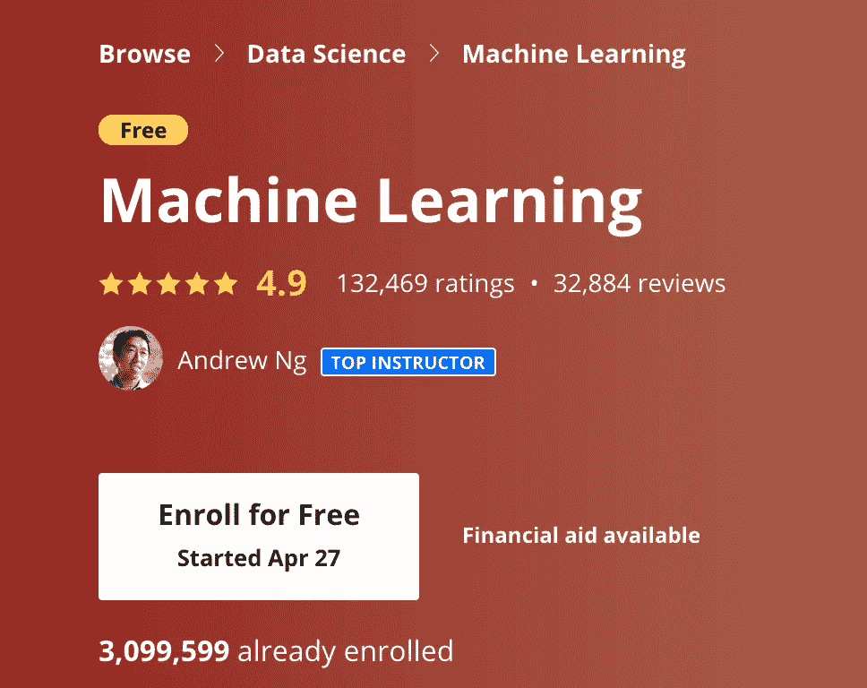
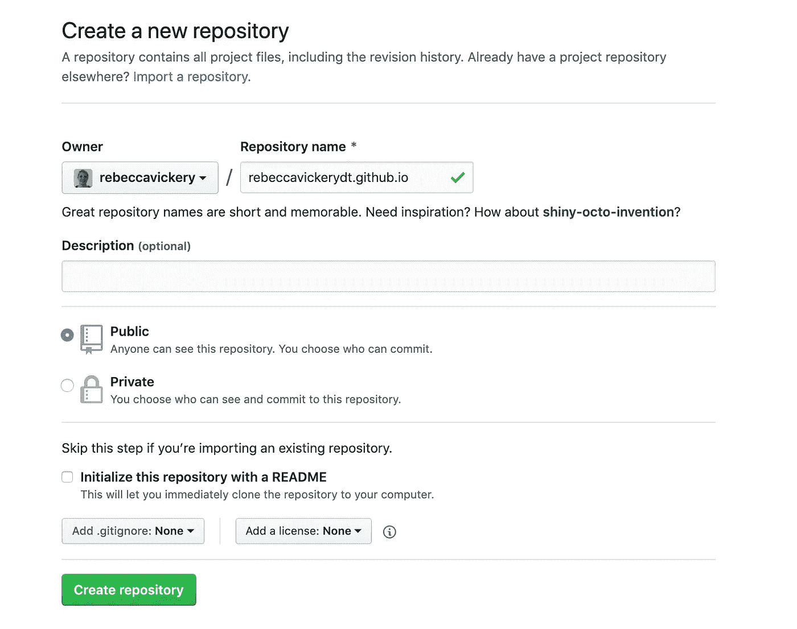
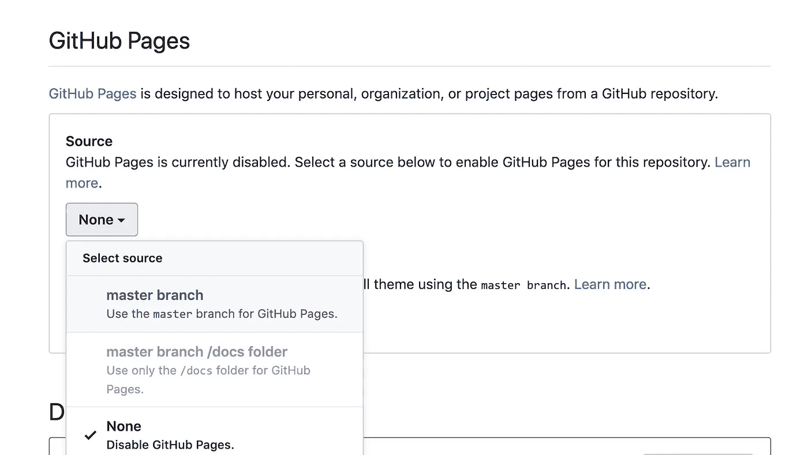
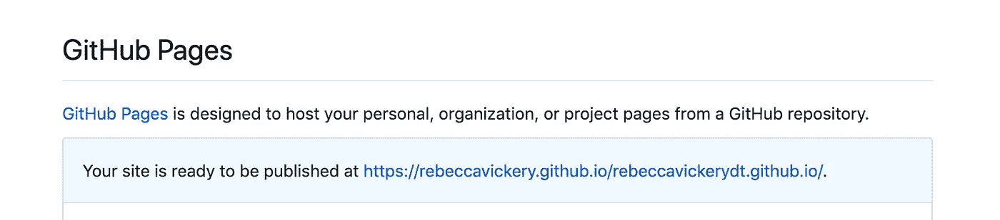
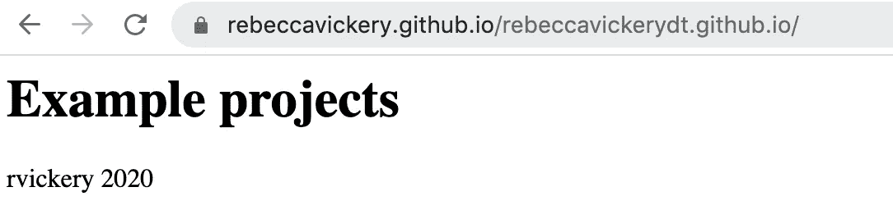
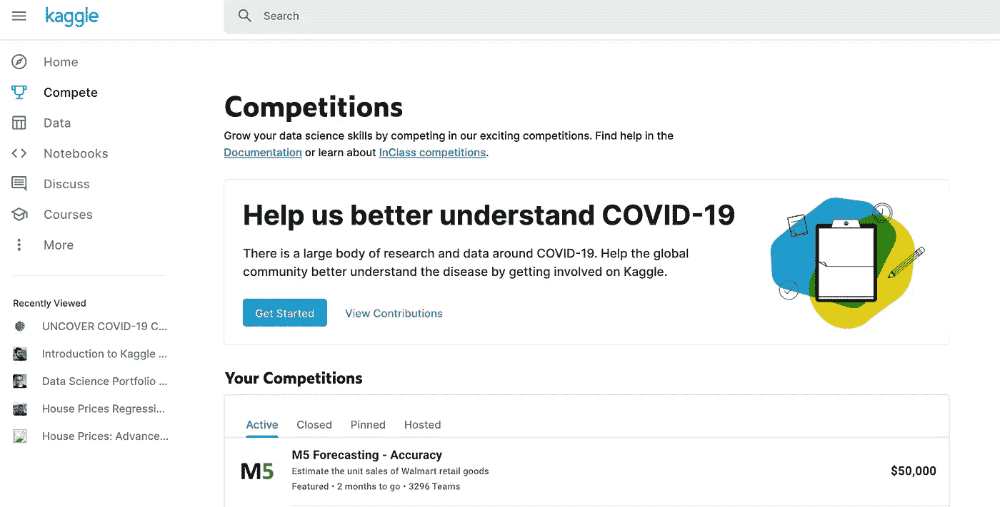
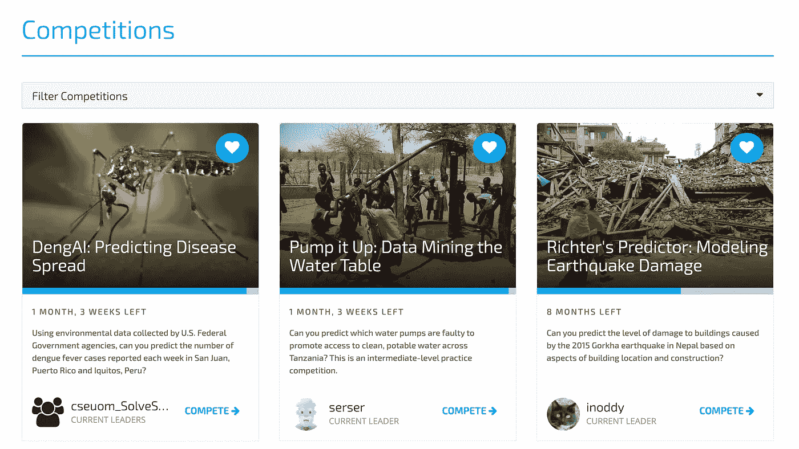
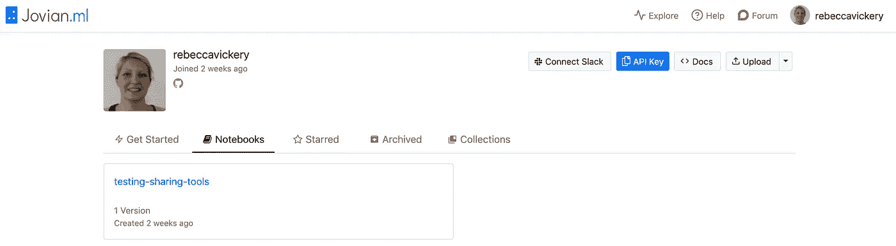
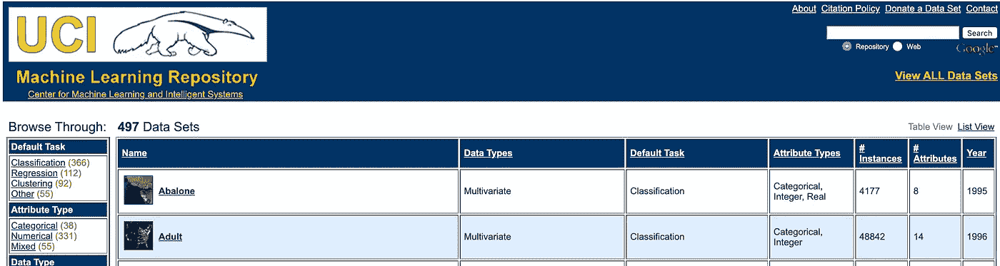

# 创建 Rockstar 数据科学产品组合的 7 种工具

> 原文：<https://towardsdatascience.com/7-tools-to-create-a-rockstar-data-science-portfolio-b31928e62395?source=collection_archive---------7----------------------->


照片由[奥斯汀·尼尔](https://unsplash.com/@arstyy?utm_source=unsplash&utm_medium=referral&utm_content=creditCopyText)在 [Unsplash](https://unsplash.com/s/photos/show?utm_source=unsplash&utm_medium=referral&utm_content=creditCopyText) 拍摄

## 使用这些工具脱颖而出

根据 Coursera 的最新统计，超过 300 万人注册了吴恩达流行的[机器学习课程](https://www.coursera.org/learn/machine-learning)。这只是一个在线课程，还有很多其他类似的课程和在线训练营。这意味着有非常多的人希望进入数据科学领域。

> 超过 300 万人注册了吴恩达广受欢迎的机器学习课程



那么，考虑到这些数字，你如何在申请数据科学职位时脱颖而出呢？企业越来越多地寻找能够证明自己能够实际运用所学技能来改善业务成果的人。

一张课程证书已经不足以在数据科学领域找到一份工作。您需要创建一个实用的数据科学项目组合来展示您的工作，并确保您的应用程序在所有其他应用程序中脱颖而出。

> 一张课程证书不再足以在数据科学领域找到一份工作

已经有很多关于你可以在投资组合中包含的项目类型的文章，我特别喜欢来自 [dataquest](https://www.dataquest.io/blog/build-a-data-science-portfolio/) 的这篇文章。然而，很少有人写你可以用来实际完成和在线展示这些项目的工具。

我目前正在重建我自己的数据科学组合，我认为值得分享我在本文中使用的一些工具和技术。

## Github 页面

Github 可能是任何技术组合中最明显的工具。每个项目都可以很好地展示为一个带有文档和 README.md 的独立存储库。

然而，如果你有许多项目都在不同的存储库中，那么最好在你自己的网站上把这些项目和一些注释整理在一起。Github 有一个非常好的工具来创建一个简单的网站，叫做[**Github pages**](https://pages.github.com/)**。**

要创建您的网站，只需导航到您的 Github 帐户并选择创建新的存储库选项，就像创建任何新项目一样。但是，在存储库名称框中，您需要在名称的末尾添加`.github.io`。



接下来，您需要以通常的方式克隆存储库。从命令行输入。

```
git clone https://github.com/myaccount/myname.github.io.git
```

导航到新目录。

```
cd rebeccavickerydt.github.io
```

添加一个 index.md 文件，添加一点内容。

`touch index.md`

我补充了以下内容。

```
<html>
<head>
  <title>My Portfolio</title>
</head>
<body>
  <h1>Example projects</h1>
  <footer>rvickery 2020</footer>
</body>
</html>
```

提交并将更改推送到 Github 存储库。

```
git add --all
git commit -m "adding landing page"
git push
```

现在转到您的存储库中的设置，向下滚动到 **Github 页面**并选择**源主分支**。



您现在可以在“设置”中访问您的网站 URL。



现在你可以访问你的网站了。



## wordpress 软件

如果你想创建一个外观更丰富的作品集网站，使用 [Wordpress](https://wordpress.com/) 来创建你的作品集是值得一看的。

Wordpress 是一个完全免费的网站开发方式，有很多我认为非常适合作品集的主题，如果你不使用自定义域名，它是完全免费的。这周我刚开始把我的作品集搬到这里，我用了主题。下面是我的登陆页面截图。


所有的主题都非常灵活，添加新页面和改变布局来适应你的风格非常简单。我发现这是一个非常快速的方法来制作一个专业的作品集。

## 卡格尔

一旦你选择了创建投资组合的工具，你需要创建一些项目来添加到其中。

Kaggle 是一个受欢迎的机器学习竞赛网站，它有许多功能，可以用来创建项目来展示你的技能。

比赛本身包含一些非常有趣的数据问题，数据集可能非常复杂和具有挑战性，此外还有一个排行榜，使您能够将自己的技能与其他人进行比较。



[Kaggle 竞赛](https://www.kaggle.com/competitions)页面

Kaggle 还有一个叫做 **Kaggle 内核**的工具。这些是托管笔记本，用于开发和运行您的数据科学代码。导入 Kaggle 数据集来直接处理它们是非常容易的，而且你写的代码是公开的，因此很容易在投资组合中共享。内核还连接到谷歌云服务，允许你展示你查询存储在关系数据库中的数据和访问云计算资源的技能。

Kaggle 还维护着一个公开可用的[数据集](https://www.kaggle.com/datasets)的档案。这里有各种不同的数据集可用，这些数据集对于创建更新颖的项目和展示探索性数据分析非常有用。

## 驱动数据

如果你想展示你的技能，同时帮助解决社会问题，那么 drivendata.org 的[是一个很好的开始。与 Kaggle 类似，这个网站举办数据科学比赛，有数据集和排行榜，但这里的不同之处在于，所有比赛的核心都是用数据科学解决的社会问题。](https://www.drivendata.org/)

这些比赛背后的数据集很有趣，从初学者友好到更具挑战性。



drivendata.org 竞赛[页面](https://www.drivendata.org/competitions/)

## Jovian.ml

如果你正在寻找 Github 的替代品来跟踪、组织或分享你的数据科学代码， [Jovian.ml](https://jovian.ml/) 是一个不错的选择。这是一个用于托管和共享基于笔记本的数据科学项目的开源项目。

您可以创建无限的公共项目，项目中可以包含笔记本、文件(如帮助文件)和环境配置文件。Jovian 还能够跟踪模型版本等输出文件，因此在某些方面比 Github 更适合存储数据科学项目和实验。



jovian . ml[个人资料页面](https://jovian.ml/)

## 谷歌云平台

如今，绝大多数企业正在转向或已经在利用云数据存储和计算能力。因此，这是一个好主意，包括一些应用你在这方面的技能的实际例子。谷歌云平台(GCP)有很多展示你作品的工具。

GCP 有一个免费使用层，所以你应该能够免费创建一些项目。

BigQuery 是 Google 的云数据仓库产品。在该产品中，Google 托管了大量公共数据集，可以通过 BigQuery web UI 访问这些数据集。通过访问这些数据集的文档可以在[这里](https://cloud.google.com/bigquery/public-data)找到。

一旦你可以访问 BigQuery 中的一些数据，你就可以使用 [GCP 人工智能中心](https://cloud.google.com/ai-hub)创建项目，其中包括云托管笔记本电脑、模型部署工具和机器学习 API。

## UCI 机器学习知识库

UCI 机器学习库是另一个公共可用数据集的伟大来源。该网站上有近 500 个数据集，涵盖了广泛的数据科学项目类型。

它们按照任务类型、数据类型、区域和数据集大小进行分类，这很有帮助。这些数据集再次为您的投资组合整合数据科学项目提供了很好的资源。



希望本文为您提供了一系列工具来创建一个真正出色的数据科学组合。我目前正在写我的，但是一旦完成，我会更新这篇文章并提供最终版本的链接。快乐的投资组合建设！

【如约更新——我的作品集现已完成，住在 www.rebecca-vickery.com[](https://rebecca-vickery.com/)**。**

*感谢阅读！*

*[**我每月发一份简讯，如果你想加入，请通过此链接注册。期待成为您学习旅程的一部分！**](https://mailchi.mp/ce8ccd91d6d5/datacademy-signup)*