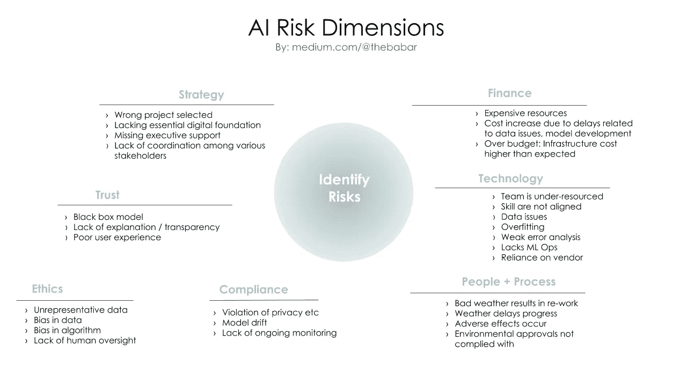

# 7 种人工智能风险以及如何减轻其影响

> 原文：<https://towardsdatascience.com/7-types-of-ai-risk-and-how-to-mitigate-their-impact-36c086bfd732?source=collection_archive---------20----------------------->

## 识别和管理人工智能风险对所有组织都至关重要

由 [Unsplash](https://unsplash.com/s/photos/risk-management?utm_source=unsplash&utm_medium=referral&utm_content=creditCopyText) 上的 [Loic Leray](https://unsplash.com/@loicleray?utm_source=unsplash&utm_medium=referral&utm_content=creditCopyText) 拍摄的照片

从事人工智能/人工智能项目是许多个人和公司的梦想。令人惊叹的人工智能倡议的故事遍布网络，声称拥有这些倡议的人因发言而受到追捧，获得了可观的职位，并赢得了同行的尊重。

在现实中，人工智能工作是高度不确定的，并且有许多类型的风险与人工智能/人工智能工作相关联。

> “如果你知道风险可能潜伏在哪里，不被理解，或者只是未被识别，你就有更大的机会在它们赶上你之前抓住它们。”—麦肯锡[1]。

在这篇文章中，我将总结 7 种风险以及如何减轻它们的负面影响。对于那些喜欢简洁视图的人，这是我整理的一张幻灯片。

人工智能风险的 7 个维度— [巴巴尔·巴蒂](https://medium.com/u/10dee34829b?source=post_page-----36c086bfd732--------------------------------)

1.  **战略风险**——正如我在[一篇早先的文章](/ultimate-ai-strategy-guide-9bfb5e9ecf4e)中所写的，制定人工智能战略并不简单。早期阶段的错误为其他下游问题埋下了伏笔。不幸的是，战略往往掌握在那些对人工智能能力没有透彻理解的人手中。这一类别包括选择错误(不可行)计划的风险(相对于组织的基础现实)、缺乏高管支持、政策不协调、业务团队之间的摩擦、高估 AI/ML 潜力(与宣传相反， [ML 并不是所有分析或预测问题的最佳答案](https://medium.com/swlh/essential-guide-to-ai-product-management-9483688d38d0))、目标或成功指标不清晰或不明确。最明显的缓解方法是在人工智能领导和执行团队之间就战略以及与之相关的风险达成一致。准确理解人工智能将如何影响人和流程，以及当事情不顺利时该做什么。
2.  **财务风险** —一个常见但不经常谈论的假设是，模型开发的成本是 AI/ML 的主要财务因素。只有当我们有最好的数据/人工智能科学家时，我们才会一切就绪。正如本文所讨论的，人工智能的整个生命周期更加复杂，包括数据治理和管理、人工监控和基础设施成本(云、容器、GPU 等)。)人工智能工作总是存在不确定因素，这意味着与软件开发相比，该过程将更具实验性和非线性，即使在所有昂贵的开发工作之后，最终结果也不总是积极的。确保你的财务领导明白这一点，不要把 AI/ML 仅仅当作另一个技术项目
3.  **技术风险** —这是最明显的挑战。这项技术还不成熟，但技术专家或供应商想要推动它。或者，也许企业领导想用前瞻性的眼光给媒体或他们的竞争对手留下深刻印象。[技术风险以多种形式出现](/how-is-machine-learning-different-from-statistics-and-why-it-matters-5a8ed539976) : *数据*:数据质量、适用性、代表性、刚性数据基础设施等等。*模型*风险:能力、学习方法、现实世界中的糟糕表现或可靠性。*概念漂移，*即市场或环境随着时间的推移或由于意外事件而发生变化*。能力*:缺乏合适的技能或经验、实施延迟、错误、测试不彻底、缺乏稳定或成熟的环境、缺乏数据操作、MLOps、IT 团队跟不上 ML/AI 部署或扩展需求、安全漏洞和知识产权盗窃。减轻这些问题的最佳方法是提高您团队的技能，投资现代数据基础设施，并遵循 ML 的最佳实践。
4.  **人员和流程风险** —不言而喻，正确的组织结构、人员和文化对你的工作成功至关重要。有了能干的人和支持性的文化，你就能发现问题，面对挑战。不良文化的标志是人们隐藏问题并逃避所有权。当团队之间有政治和紧张关系时，问题就会被放大。技能差距、僵化的思维模式、沟通不畅、传统 IT 缺乏扩展人工智能的运营知识。流程中的差距、IT 和 AI 之间的协调问题、零散或不一致的实践/工具、供应商炒作。缺乏数据/知识共享(组织结构)，缺少领域专家的输入/审查，缺乏监督/政策控制&后备计划，第三方模型依赖，人力监督不足，学习反馈循环。薄弱的技术基础。
5.  **信任和可解释性风险** —你做了所有的工作，但你的人工智能应用程序的最终用户对使用或采用该模型犹豫不决。这是一个共同的挑战。原因包括模型在特定条件下的不良表现、模型的不透明性(缺乏对结果的解释)、出现问题时缺乏帮助、用户体验差、缺乏激励一致性、对人们的工作流程或日常事务的重大干扰。正如 ML/AI 从业者所知，深度神经网络等最佳模型是最难解释的。这导致了一些困难的问题，例如，模型性能和目标用户的采用哪个更重要？
6.  **合规和监管风险** — AI/ML 会给需要遵守规则和法规的用例或垂直行业带来很大的麻烦。这里有一条微妙的界线——如果你不采取一些行动，竞争对手可能会领先太多。当你采取行动时，你必须防范不可预见的后果和监管机构的调查或罚款。金融和医疗保健行业就是这种紧张关系的很好例子。上面讨论的可解释因素是这里的关键。缓解:确保风险管理团队充分了解 AI/ML 工作及其影响。为人员监控和纠正措施分配资源。
7.  **道德风险**——你的人工智能/人工智能项目拥有大量数据和超级明星技术团队，利益显而易见，也不存在法律问题——但它是*道德的吗*？以警察工作中的面部识别为例。供应商们将此作为一种革命性的方式来推动警务工作，但最初的模型缺乏做出公平准确预测所需的稳健性，并导致对某些少数群体的明显偏见。信用评分和保险模型长期以来一直存在偏见——随着 ML 驱动的应用程序的增长，这已经成为一个更大的问题。

上述每个风险领域本身都是一个巨大的领域，需要大量的阅读和实践经验来熟悉这个主题。我鼓励你看看下面的参考资料，以获得更多关于处理人工智能风险的观点。

注意事项:

[1]直面人工智能的风险，麦肯锡。[https://www . McKinsey . com/business-functions/McKinsey-analytics/our-insights/对抗人工智能风险](https://www.mckinsey.com/business-functions/mckinsey-analytics/our-insights/confronting-the-risks-of-artificial-intelligence)

[2] AI 与风险管理，德勤。[https://www2 . Deloitte . com/global/en/pages/financial-services/articles/GX-ai-and-risk-management . html](https://www2.deloitte.com/global/en/pages/financial-services/articles/gx-ai-and-risk-management.html)

[3]Ulrika jgare，[假人的数据科学策略](https://www.amazon.com/Data-Science-Dummies-2nd-Computers/dp/1119327636/)，2019，Wiley。

[4]衍生机器学习和人工智能，麦肯锡。[https://www . McKinsey . com/business-functions/risk/our-insights/derisking-machine-learning-and-artificial-intelligence](https://www.mckinsey.com/business-functions/risk/our-insights/derisking-machine-learning-and-artificial-intelligence)

[5]理解人工智能和机器学习的模型风险管理，EY。[https://www . ey . com/en _ us/banking-capital-markets/understand-model-risk-management-for-ai and-machine-learning](https://www.ey.com/en_us/banking-capital-markets/understand-model-risk-management-for-ai-and-machine-learning)