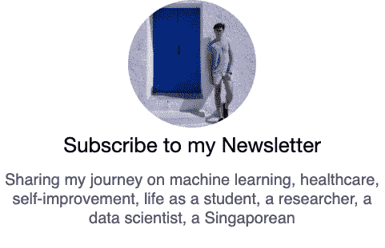

# 7 种入门 ML 的方法，从最容易到最难排列

> 原文：<https://towardsdatascience.com/7-ways-to-get-started-into-ml-ranked-from-easiest-to-hardest-b631cd57727a?source=collection_archive---------51----------------------->

## [入门](https://towardsdatascience.com/tagged/getting-started)

## 永远不要因为事情难做而放弃，没有什么值得拥有的东西来之不易。

图片由[查克·安德伍德](https://pixabay.com/users/finelightarts-890049/?utm_source=link-attribution&utm_medium=referral&utm_campaign=image&utm_content=1073638)从[皮克斯拜](https://pixabay.com/?utm_source=link-attribution&utm_medium=referral&utm_campaign=image&utm_content=1073638)拍摄

机器学习是教计算机如何从数据中学习以做出决策(或预测)。坐在计算机科学和统计学的交叉点上，你可能会看到几个热门词汇，比如:

数据科学、大数据、人工智能、预测分析、计算统计、数据挖掘、监督学习、强化学习等。

那么，如何打入机器学习呢？

# 1.观看 ML 相关视频。

那么，你想开始进入 ML 吗？好消息是网上有无数的教程。YouTubers 没有筛选大量的内容，而是挑选出有趣的内容，使其简洁，并尽可能用通俗的语言解释。

这篇[文章介绍了七个 YouTube 频道](/7-essential-ai-youtube-channels-d545ab401c4)，旨在揭示机器学习领域最新、最酷的发展。例如，[两分钟的论文](https://www.youtube.com/channel/UCbfYPyITQ-7l4upoX8nvctg)视频很有趣，很吸引人，看起来绝对是一种享受。

 [## 7 个必不可少的人工智能 YouTube 频道

### 如何跟上最新最酷的机器学习进展

towardsdatascience.com](/7-essential-ai-youtube-channels-d545ab401c4) 

许多会议邀请著名的演讲者和作者为那些喜欢听行业专家和研究人员自己演讲的人展示他们的论文。神经信息处理系统会议(NeurIPS)，机器学习领域的领先会议之一，发布了他们的[免费访问视频](https://videos.neurips.cc/)。

# 2.阅读 ML 中的趋势和事件。

在《走向数据科学》杂志上，作者向广大读者呈现内容丰富的书面文章。无论你是在寻找了解更多数据科学的步骤，获得机器学习的最新更新，还是听到关于人工智能职业的建议，走向数据科学都可以为你提供全方位的学习体验。

让你跟上机器学习的其他值得注意的来源是

*   [麻省理工学院新闻](https://news.mit.edu/topic/machine-learning)
*   [有线](https://www.wired.com/tag/machine-learning/)
*   [自然研究](https://www.nature.com/subjects/machine-learning)
*   [企业家](https://www.entrepreneur.com/topic/machine-learning)

也可以在 LinkedIn 上联系关注 ML 的人。他们自然会分享 how-tos 教程和最新的 ML 开发。

# 3.参加 ML 课程。

对于初学者来说，AI 的[元素是一系列免费的在线课程，适合广大观众学习什么是 ML，可以(和不可以)用 ML 做什么，以及如何开始创建 ML 模型。](https://www.elementsofai.com/)

吴恩达的《AI For everybody》是一本很好的 ML 入门书；它全面概述了什么是 ML 以及围绕 ML 的各种概念、术语和方法。这门课程大多是非技术性的，适合任何人，是一门优秀的入门课程。

想深潜的可以从选择[深度学习专精](https://www.coursera.org/specializations/deep-learning)课程中自己感兴趣的专精开始。无论是计算机视觉还是自然语言处理，吴恩达教授算法工作背后的关键概念和机制。fast.ai 提供免费的在线课程，这是一种实用的方法，通过提供 PyTorch 的实际操作来补充吴恩达的方法。

对于那些对 TensorFlow 感兴趣的人，谷歌有带 TensorFlow APIs 的[机器学习速成班](https://developers.google.com/machine-learning/crash-course)。这是对机器学习的实用介绍，有视频讲座、真实案例研究和动手实践练习供您遵循。

# 4.写下你的 ML 旅程。

定期消费信息并不是学习和成长的理想方式。在你所有的阅读和学习之后，写下你的想法的过程有助于理清你的思路。这是一个时间和空间来处理这些信息并反思你所学到的东西。

在消费更多内容的同时创造内容的过程，写作可以让你强化你的学习。作为一名数据科学家，有效的沟通是需要磨练的最重要的非技术技能之一。

你可以从写关于数据科学的文章开始([如何投稿](https://towardsdatascience.com/contribute/home))。我们的编辑通过提供反馈来帮助作者表达他们的想法。通过依靠不同的流量来源，如媒体源、社交媒体和时事通讯，在《走向数据科学》中发布可让您接触到更广泛的受众。

或者，你可以托管你的网站，完全控制网站的内容和风格。我建议查看一下 [GitHub 页面](https://pages.github.com/)。您的内容直接托管在您的 GitHub 存储库中，您可以通过使用您的用户名(如`https://username.github.io`)访问这些内容。例如，你可以在 https://jinglescode.github.io/的[查看我的。](https://jinglescode.github.io/)

# 5.从 ML 宠物项目开始。

现在，这是事情变得更加实际的时候。课程有助于培养基本技能，但参与项目是一种很好的学习方式。你将被迫独自批判性地思考问题和解决方案。它建立了无法教授的特定知识和技能；看别人做比自己学做容易多了。

一个宠物项目可以让你在更深的层次上探索和应用你所学到的东西。从职业角度来看，这将使你能够建立一个投资组合，并向潜在雇主展示。你会知道如何问正确的问题，尤其是如何谷歌正确的问题。它让你在一个端到端的机器学习项目中面临各种各样的问题。

这里是一个宠物项目的[例子。一个基于 web 的项目，通过 TensorFlow.js 框架从在线 API 提取股票价格，并使用长短期记忆执行预测。在我称之为](https://jinglescode.github.io/time-series-forecasting-tensorflowjs)[的游乐场](https://jinglescode.github.io/playground/)中查看一些我喜欢的项目。

 [## 用 TensorFlow.js - Hong Jing (Jingles)进行时间序列预测

### 从在线 API 中提取股票价格，并使用递归神经网络和长短期记忆进行预测…

jinglescode.github.io](https://jinglescode.github.io/time-series-forecasting-tensorflowjs/) 

当决定做一个自己喜欢的项目时，最困难的事情之一就是找时间开始。因为我们大多数人都有一份全职工作，剩下的“空闲时间”都可以用来看《网飞》。但是你从个人项目中获得的学习和成长是金子。

# 6.参加纸牌比赛。

对于初学者来说，Kaggle 是一个很好的学习工具，因为每个比赛都是独立的。您不需要确定项目的范围和收集那些数据，这使您可以专注于解决问题。此外，讨论和获奖者访谈很有启发性。每个竞赛都有自己的讨论板，并向获胜者汇报。你可以窥视更有经验的数据科学家的思维过程。

比赛还将迫使你应对应用机器学习过程的每一步，包括探索性分析、数据清理、特征工程和模型训练。团队合作是与比你有更多领域知识的人合作的好方法，可以进一步扩大你的机会和向他人学习。

# 7.为 ML 创业公司工作。

加入一家初创公司是作为数据科学家学习端到端开发运营的绝佳机会。要构建的东西太多了，您将做所有的事情，从获取和清理数据、组织和理解数据，到构建和部署模型。

如果创业时的沉浮态度没有吓到你或让你放弃在创业公司工作，这可能是快速获得一些有价值技能的好方法。由于你将身兼多职，而且你需要随时学习，你将会更好地掌握机器学习以及将机器学习应用于生产的相关流程。

这就是开始机器学习的 7 种方法，从最容易到最难。

1.  观看 ML 相关视频
2.  阅读 ML 中的趋势和事件
3.  参加 ML 课程
4.  写下你的 ML 旅程
5.  从 ML 宠物项目开始
6.  参加纸牌比赛
7.  为 ML startup 工作

你目前处于哪个阶段并不重要。选择一种适合你的学习方式，这种方式对你来说很舒服——[在感知到的任务挑战和个人感知到的技能之间找到恰当的平衡](https://medium.com/now-realise-this/how-i-keep-myself-ridiculously-focused-b37d4fc49ab7?sk=1cf7c62b37d44ac123274d466429e97c)。

你永远不应该因为某件事难做而放弃它。任何值得拥有的东西都来之不易。

## 现在就开始吗？

了解卷积的工作原理。

 [## 深度学习神经网络中卷积层是如何工作的？

### 理解卷积及其参数的生动方式

towardsdatascience.com](/how-convolutional-layers-work-in-deep-learning-neural-networks-2913af333b72) 

了解更多变形金刚，关注。

 [## 变压器图解指南

### 逐个组件的细分分析

towardsdatascience.com](/illustrated-guide-to-transformer-cf6969ffa067) 