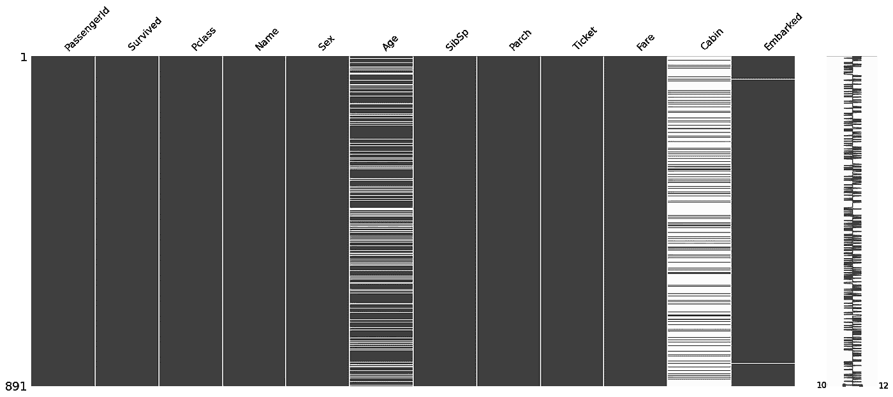
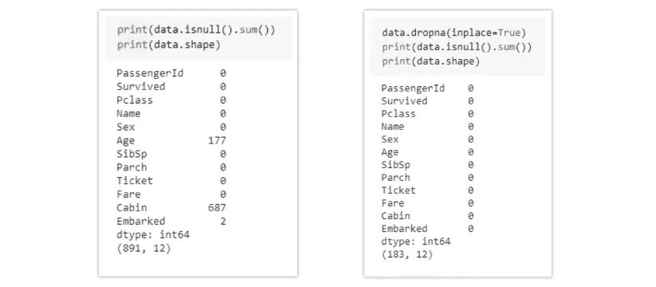
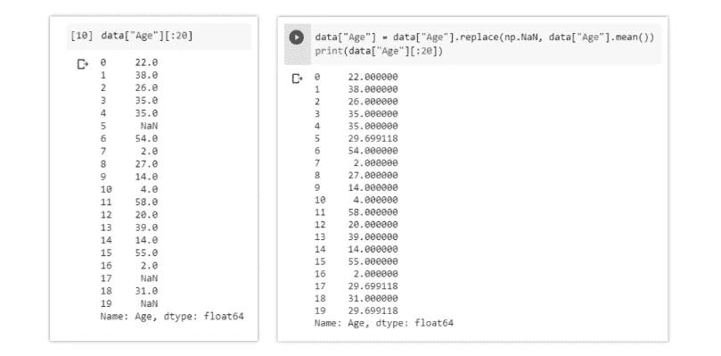
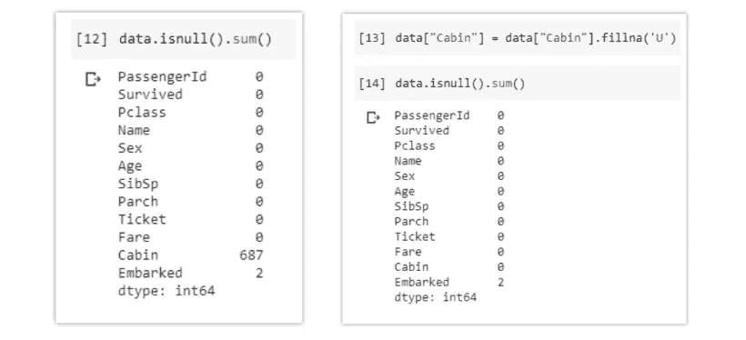

# 机器学习中处理缺失值的 7 种方法

> 原文：<https://towardsdatascience.com/7-ways-to-handle-missing-values-in-machine-learning-1a6326adf79e?source=collection_archive---------1----------------------->


凯文·Ku 在 [Unsplash](https://unsplash.com?utm_source=medium&utm_medium=referral) 上的照片

## 处理数据集中缺失值的常用策略

真实世界的数据通常有很多缺失值。丢失值的原因可能是数据损坏或未能记录数据。在数据集的预处理过程中，缺失数据的处理非常重要，因为许多机器学习算法不支持缺失值。

本文涵盖了处理数据集中缺失值的 7 种方法:

1.  删除缺少值的行
2.  估算连续变量的缺失值
3.  估算分类变量的缺失值
4.  其他估算方法
5.  使用支持缺失值的算法
6.  缺失值的预测
7.  使用深度学习库 Datawig 进行插补

> 使用的数据是来自 Kaggle 的[泰坦尼克号数据集](https://www.kaggle.com/c/titanic)

```
data = pd.read_csv("train.csv")
msno.matrix(data)
```



(图片由作者提供)，**缺失值的可视化**:白线表示存在缺失值

## 删除缺少值的行:

缺失值可以通过删除具有空值的行或列来处理。如果列中有超过一半的行为 null，则可以删除整列。也可以删除一个或多个列值为 null 的行。



(图片由作者提供)**左:**具有空值的数据，**右:**移除空值后的数据

**优点:**

*   通过移除所有缺失值来训练的模型创建了稳健的模型。

**缺点:**

*   大量信息的丢失。
*   如果与完整数据集相比，缺失值的百分比过大，则效果不佳。

## 用平均值/中值估算缺失值:

数据集中具有连续数值的列可以替换为该列中剩余值的平均值、中值或众数。与以前的方法相比，这种方法可以防止数据丢失。替换上述两个近似值(平均值、中值)是处理缺失值的统计方法。



(图片由作者提供)**左:**插补前的年龄栏，**右:**按平均值插补后的年龄栏

在上面的例子中，缺失值由平均值代替，同样，它也可以由中值代替。

赞成者:

*   防止导致行或列删除的数据丢失
*   适用于小型数据集，并且易于实现。

**缺点:**

*   仅适用于数值连续变量。
*   会导致数据泄露
*   不要考虑要素之间的协方差。

## 分类列的插补方法:

当缺失值来自分类列(字符串或数字)时，可以用最常见的类别替换缺失值。如果缺失值的数量非常大，那么可以用新的类别来替换。



(图片由作者提供)**左图:**插补前的数据，**右图:**通过“U”插补后的客舱栏

**优点:**

*   防止导致行或列删除的数据丢失
*   适用于小型数据集，并且易于实现。
*   通过添加唯一的类别来消除数据丢失

**缺点:**

*   仅适用于分类变量。
*   编码时向模型添加新特征，这可能会导致性能下降

## 其他插补方法:

根据数据的性质或数据类型，其他一些估算方法可能更适合估算缺失值。

例如，对于具有纵向行为的数据变量，使用最后一个有效的观察值来填充缺少的值可能是有意义的。这就是所谓的最后观察结转(LOCF)方法。

对于时序数据集变量，对缺失值使用时间戳前后的变量插值是有意义的。

## 使用支持缺失值的算法:

所有的机器学习算法都不支持缺失值，但一些 ML 算法对数据集中的缺失值具有鲁棒性。当缺少值时，k-NN 算法可以忽略距离度量中的列。在进行预测时，朴素贝叶斯也可以支持缺失值。当数据集包含空值或缺失值时，可以使用这些算法。

Python 中朴素贝叶斯和 k-最近邻的 sklearn 实现不支持缺失值的存在。

这里可以使用的另一个算法是 RandomForest，它适用于非线性和分类数据。它适应考虑高方差或偏差的数据结构，在大型数据集上产生更好的结果。

**优点:**

*   不需要处理每一列中的缺失值，因为 ML 算法将有效地处理它们。

**缺点:**

*   scikit-learn 库中没有这些 ML 算法的实现。

## 缺失值的预测:

在早期处理缺失值的方法中，我们没有利用包含缺失值的变量与其他变量的相关性优势。使用没有空值的其他特征可用于预测缺失值。

根据具有缺失值的要素的性质(分类或连续),回归或分类模型可用于缺失值的预测。

```
Here 'Age' column contains missing values so for prediction of null values the spliting of data will be,**y_train**: rows from data["Age"] with non null values
**y_test**: rows from data["Age"] with null values
**X_train**: Dataset except data["Age"] features with non null values
**X_test**: Dataset except data["Age"] features with null values
```

(作者代码)

[](/predict-missing-values-in-the-dataset-897912a54b7b) [## 预测数据集中缺失的值

### 了解如何使用机器学习模型及其实现来预测数据集中的缺失值

towardsdatascience.com](/predict-missing-values-in-the-dataset-897912a54b7b) 

**优点:**

*   给出比早期方法更好的结果
*   考虑缺失值列和其他列之间的协方差。

**缺点:**

*   仅被视为真实值的代表

## 使用深度学习库进行插补— [Datawig](https://github.com/awslabs/datawig)

这种方法非常适用于分类的、连续的和非数字的特征。Datawig 是一个库，它使用深度神经网络来学习 ML 模型，以估算数据报中的缺失值。

```
Install datawig library,
**pip3 install datawig**
```

Datawig 可以获取一个数据帧，并以所有其他列作为输入，为每一列的缺失值拟合插补模型。

下面是估算*年龄*列中缺失值的代码

(作者代码)

**优点**:

*   与其他方法相比相当准确。
*   它支持 CPU 和 GPU。

**缺点:**

*   对于大型数据集可能会非常慢。

## 结论:

每个数据集都有需要智能处理的缺失值，以创建稳健的模型。在本文中，我讨论了 7 种处理缺失值的方法，它们可以处理每种类型的列中的缺失值。没有以特定方式处理缺失值的重击规则，这种方法可以获得具有最佳性能的健壮模型。根据数据的方式和内容，可以对不同的特征使用不同的方法。了解数据集的领域知识非常重要，这有助于了解如何预处理数据和处理缺失值。

**参考文献:**

[1]数据维格:[https://github.com/awslabs/datawig](https://github.com/awslabs/datawig)

*喜欢这篇文章吗？成为* [*中等会员*](https://satyam-kumar.medium.com/membership) *继续无限制学习。如果你使用下面的链接，我会收到你的一小部分会员费，不需要你额外付费。*

[](https://satyam-kumar.medium.com/membership) [## 加入我的推荐链接-萨蒂扬库马尔媒体

### 作为一个媒体会员，你的会员费的一部分会给你阅读的作家，你可以完全接触到每一个故事…

satyam-kumar.medium.com](https://satyam-kumar.medium.com/membership) 

> 感谢您的阅读