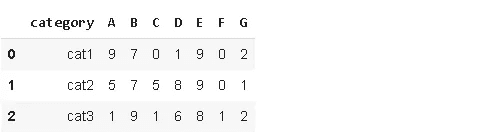
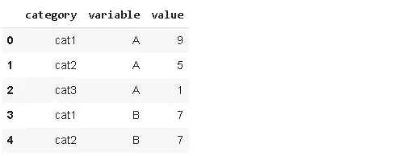
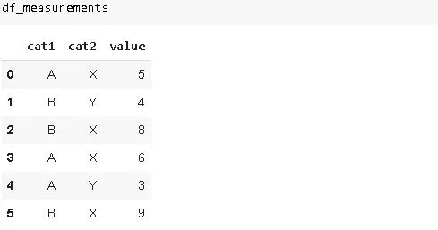
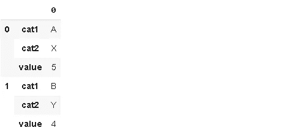
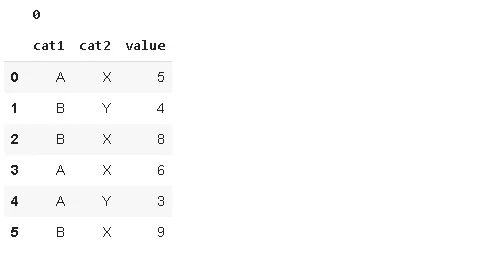
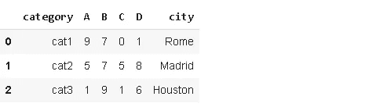
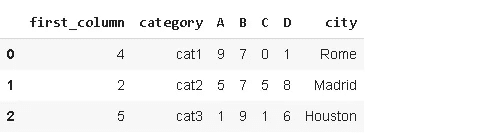
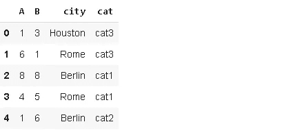
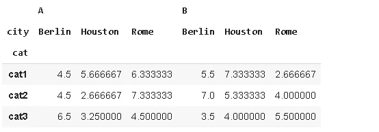

# 操纵熊猫数据框的 7 种方法

> 原文：<https://towardsdatascience.com/7-ways-to-manipulate-pandas-dataframes-f5ec03fe944c?source=collection_archive---------17----------------------->

## 熊猫提供了很大的灵活性

Pandas 是一个非常强大和通用的 Python 数据分析库，它加速了数据分析和探索过程。Pandas 的优势之一是它提供了多种数据操作的功能和方法。


在 [Unsplash](https://unsplash.com/s/photos/seven?utm_source=unsplash&utm_medium=referral&utm_content=creditCopyText) 上由 [Waldemar Brandt](https://unsplash.com/@waldemarbrandt67w?utm_source=unsplash&utm_medium=referral&utm_content=creditCopyText) 拍照

数据帧是熊猫的核心数据结构。为了掌握熊猫，你应该能够轻松流畅地摆弄数据帧。在这篇文章中，我们将讨论不同的方法来操作或编辑它们。

让我们从导入 NumPy 和 Pandas 开始，并创建一个示例数据帧。

```
import numpy as np
import pandas as pdvalues = np.random.randint(10, size=(3,7))
df = pd.DataFrame(values, columns=list('ABCDEFG'))
df.insert(0, 'category', ['cat1','cat2','cat3'])df
```



我们将提到的第一种操作方式是**熔化**功能，它将宽数据帧(大量列)转换成窄数据帧。一些数据帧的结构是连续的测量值或变量用列来表示。在某些情况下，将这些列表示为行可能更适合我们的任务。

```
#1 meltdf_melted = pd.melt(df, id_vars='category')
df_melted.head()
```



用 **id_vars** 参数指定的列保持不变，其他列显示在变量和值列下。

第二种方法是增加索引级别的堆栈函数。

*   如果 dataframe 有一个简单的列索引，stack 返回一个系列，其索引由原始 dataframe 的行列对组成。
*   如果数据帧有多级索引，stack 增加索引级别。

考虑以下数据帧:



```
#2 stackdf_stacked = df_measurements.stack().to_frame()
df_stacked[:6]
```



在这种情况下，stack 函数返回一个 Series 对象，但是我们使用 **to_frame** 函数将其转换为 dataframe。

顾名思义，拆分功能是堆栈功能的反向操作。

```
#3 unstackdf_stacked.unstack()
```



添加或删除列可能是我们做得最多的操作。让我们添加一个新列并删除一些现有的列。

```
#4 add or drop columnsdf['city'] = ['Rome','Madrid','Houston']
df.drop(['E','F','G'], axis=1, inplace=True)df
```



我们创建了一个包含列表的新列。Pandas 系列或 NumPy 数组也可用于创建列。

要删除列，除了列名之外，轴参数应该设置为 1。为了保存更改，将**原位**参数设置为真。

默认情况下，新列会添加到 dataframe 的末尾。如果希望新列放置在特定位置，应该使用 insert 函数。

```
#5 insertdf.insert(0, 'first_column', [4,2,5])df
```



我们可能还想添加或删除行。


append 函数可用于添加新行。

```
#6 add or drop rowsnew_row = {'A':4, 'B':2, 'C':5, 'D':4, 'city':'Berlin'}
df = df.append(new_row, ignore_index=True)df
```


我们可以像删除列一样删除 a。唯一的变化是轴参数值。

```
df.drop([3], axis=0, inplace=True)df
```


对数据帧的另一个修改可以通过 pivot_table 函数实现。考虑以下具有 30 行的数据帧:

```
import randomA = np.random.randint(10, size=30)
B = np.random.randint(10, size=30)
city = random.sample(['Rome', 'Houston', 'Berlin']*10, 30)
cat = random.sample(['cat1', 'cat2', 'cat3']*10 ,30)df = pd.DataFrame({'A':A, 'B':B, 'city':city, 'cat':cat})
df.head()
```



pivot_table 函数也可以被视为从不同的角度查看数据框架的一种方式。它通过允许变量以不同的格式表示数据来探索变量之间的关系。

```
#7 pivot_tabledf.pivot_table(index='cat', columns='city', aggfunc='mean')
```



返回的数据帧包含每个 city-cat 对的平均值。

我们已经介绍了 7 种编辑或操作数据帧的方法。其中一些非常常见，你可能几乎每天都在使用它们。也会有需要使用稀有的情况。

我认为熊猫的成功和流行来自于多功能、强大和易于使用的操作和分析数据的功能。和熊猫一起完成一项任务几乎总是有多种方式。由于花在数据科学项目上的大部分时间都花在数据清理和预处理步骤上，所以非常鼓励学习 Pandas。

感谢您的阅读。如果您有任何反馈，请告诉我。