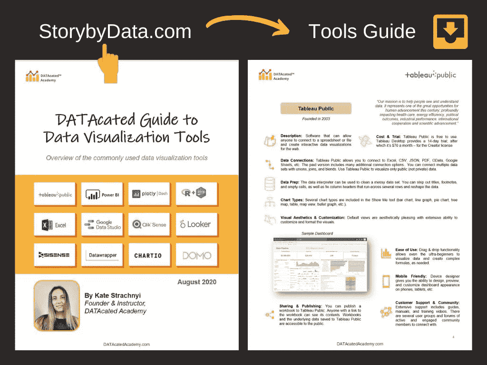
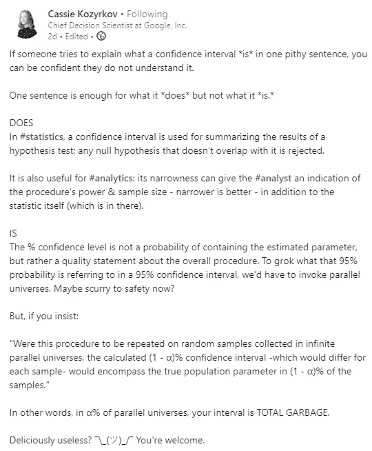
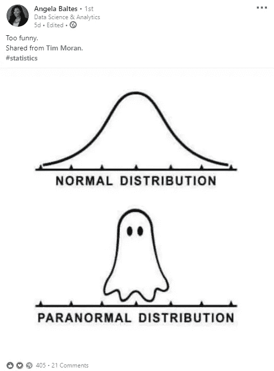
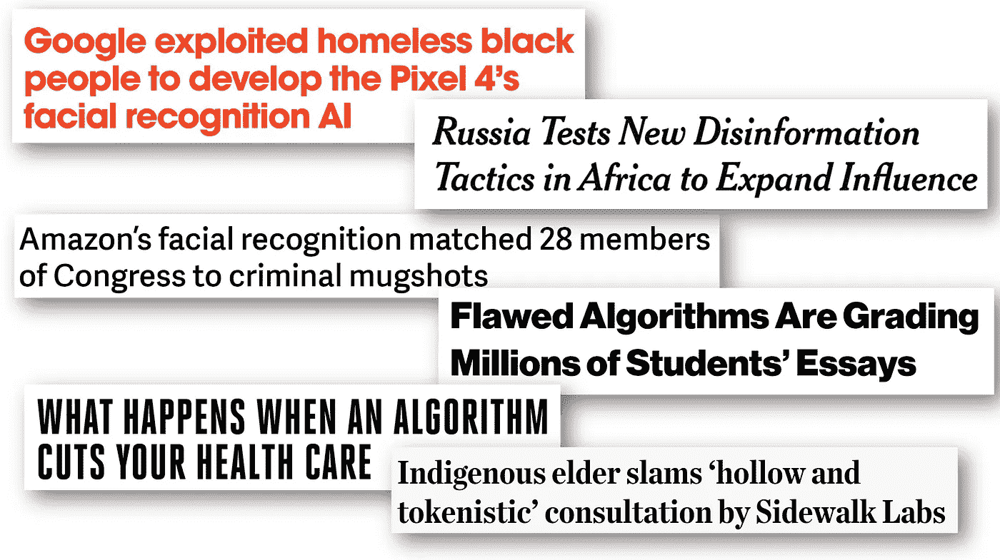

# 你应该在 LinkedIn 上关注的 7 位数据科学领域的女性

> 原文：<https://towardsdatascience.com/7-women-you-should-be-following-on-linkedin-737362a7777f?source=collection_archive---------34----------------------->

## 作为一名数据科学家，不断进步并跟上时代的步伐

布鲁克·拉克在 [Unsplash](https://unsplash.com?utm_source=medium&utm_medium=referral) 拍摄的照片

P 撤回这篇文章我分享了 [*你应该在 LinkedIn 上关注的 8 个人*](/8-folks-you-should-be-following-on-linkedin-75f8fe9e43db) *。当我看到帖子的结尾时，我意识到“等一下……我一个字都没有提到一位单身女士！”*

考虑到您已经阅读了我的上一篇文章，您会惊讶地发现，实际上有许多女性在数据科学领域做出了值得肯定的非凡成就。在女士们联合起来割破我的喉咙之前，我必须声明我真的在 LinkedIn 上关注了很多女性领导者——事实上，我有策略地计划写两篇独立的帖子！

事不宜迟。女士们先生们，你们应该在 LinkedIn 上关注这些开拓创新的女性。

## #1 — [凯特·斯特拉赫妮](https://www.linkedin.com/in/kate-strachnyi-data/)

任何数据可视化？凯特是只山羊。她是数据化学院的创始人，该学院专注于提供数据可视化最佳实践的培训。哦，我说过她写了 4 本书吗？耶！

*   [数据科学之母](https://www.amazon.com/Mothers-Data-Science-Kate-Strachnyi/dp/B08D54RCFL)
*   [儿童数据素养](https://www.amazon.co.uk/Data-Literacy-Kids-Kate-Strachnyi-ebook/dp/B086GHXWVW)
*   [数据科学家之旅](https://www.amazon.co.uk/Journey-Data-Scientist-Interviews-Scientists-ebook/dp/B07847F3P9)
*   [颠覆者:数据科学领导者数据科学领导者:有影响力的领导者集体传记:第一卷](https://www.amazon.com/Disruptors-Science-Collective-Biographies-Influential/dp/1985855216)

我忘了补充一点，她在做这些事情的同时平衡了她作为父母的责任。看，我有一个侄女(我已经提到过几次)，当她在我身边时，我不得不停止我的日常工作，因为她成了老板——老实说，我不知道凯特是怎么做到的，但她做到了，因此她在 LinkedIn 上有超过 10 万名粉丝就很有道理了。

**来源** : [数据可视化工具的数据化指南](https://www.linkedin.com/feed/update/urn:li:activity:6695996276682588160/)

> **附言**凯特还不时在 LinkedIn 上做视频直播，讨论数据可视化。长话短说，跟着凯特就好！

 [## 凯特·斯特拉赫尼·♕——数据学院| LinkedIn 创始人

### " "我只是想分享一个简短的说明，让你知道你和 StorybyData 的团队已经完成了一项…

www.linkedin.com](https://www.linkedin.com/in/kate-strachnyi-data/) 

## #2 — [王梦瑶](https://www.linkedin.com/in/mengyaowang11/)

梦瑶甚至可能会惊讶的发现自己上了这个榜单，不是因为她缺乏自信，不，不可能！梦瑶很可能会因为两个原因而感到惊讶，首先是她可能会对自己受到关注感到震惊，其次是因为她仍在学习数据科学— *“但即使是首席数据科学家 Kurtis 也仍在学习”。不，当我说她还在学习的时候，我的意思是她还在学习！*

从她的 LinkedIn 个人资料来看，她有一些作为数据分析师的经验，这是进入数据科学的一个非常自然的过程，所以她并不是一无所知。虽然她可能不像凯特或其他一些女士那样拥有以下粉丝，但她的帖子仍然很有冲击力——主要包括围绕机器学习和数据科学的免费书籍的链接。

她的 LinkedIn 上的头条是:

> “我与我出色的 LinkedIn 朋友分享我进入数据科学的学习之旅，请关注我，让我们一起成长！”

离开梦瑶的帖子(其中大部分我都会收藏并重新浏览)，如果你问我，这不是个坏建议。

 [## 王梦瑶-营销经理-黑客制造者| LinkedIn

### 在全球最大的职业社区 LinkedIn 上查看王梦瑶的个人资料。梦瑶有 3 个工作列在他们的…

www.linkedin.com](https://www.linkedin.com/in/mengyaowang11/) 

## 第三名——凯西·科济尔科夫

凯西有一份这样的简历，你拿起它开始摇晃，然后想知道到目前为止你是否做出了正确的人生决定。伙计，这位女士很在行！然而，作为她的帖子的热心观众，我感觉她是一个充满活力而又温柔的人，超越了她对非常复杂的话题的简单解释。还记得由数据科学家 解释的 [*P 值的*](/p-values-explained-by-data-scientist-f40a746cfc8) *[Admond Lee](https://medium.com/u/7cfb1b8791bb?source=post_page-----737362a7777f--------------------------------) 的病毒帖子吗？原来是凯西启发阿德蒙德写了那个帖子——这充分说明了她的教学的影响力和有效性。*

在谷歌担任首席决策科学家——这是她在谷歌创立的一个领域…

**来源** : [卡西解释什么是置信区间](https://www.linkedin.com/in/cassie-kozyrkov-9531919/detail/recent-activity/)

**看，如果你现在还不相信，我真的不知道还能说什么。**

 [## Cassie Kozyrkov -首席决策科学家-谷歌| LinkedIn

### 我是谷歌的数据科学家和领导者，我的使命是让决策智能和安全可靠的人工智能民主化。我…

www.linkedin.com](https://www.linkedin.com/in/cassie-kozyrkov-9531919/) 

## **#4 —** [**安吉拉·巴尔蒂斯**](https://www.linkedin.com/in/angelabaltes/detail/recent-activity/shares/)

首先，祝贺安吉拉在纽约大学担任兼职教授的新职务，她将于 2021 年 1 月开始工作。安吉拉非常特立独行，自从跟随她之后，我在她身上看到了两种类型的人。第一个是这个非常严肃的人，表达了她对招聘数据科学家的欺诈行为的担忧，另一个是有很多玩笑的人。

**来源** : [安吉拉·巴尔蒂斯近期活动——LinkedIn](https://www.linkedin.com/in/angelabaltes/detail/recent-activity/shares/)

很明显，她非常有激情，非常有趣，是专业人士的完美结合。

 [## Angela Baltes -机构数据科学家-新墨西哥大学| LinkedIn

### 在世界上最大的职业社区 LinkedIn 上查看安吉拉·巴尔蒂斯的个人资料。安吉拉有 9 份工作列在他们的…

www.linkedin.com](https://www.linkedin.com/in/angelabaltes/) 

## #5 — [克里斯汀·凯尔勒](https://www.linkedin.com/in/kristen-kehrer-datamovesme/)

我第一次见到克里斯汀是在她和凯特(我在上面提到过她)一起生活的早期阶段。这是一次有趣的讨论，讨论开始时谈到了封锁(孩子们不去上学)的困难。这段对话引起了我的一些兴趣，因为当凯特在 LinkedIn 上直播时，她经常和与她工作相关的人说话。

原来克里斯汀是加州大学伯克利分校的数据科学讲师，也是 Data Moves 的创始人——最重要的是，克里斯汀在该领域有超过 10 年的经验。

 [## Kristen Kehrer -加州大学伯克利分校数据科学讲师| LinkedIn

### 我帮助数据科学团队:-解释他们的机器学习模型，并充分传达警告…

www.linkedin.com](https://www.linkedin.com/in/kristen-kehrer-datamovesme/) 

## 瑞秋·托马斯

在我的经理告诉我写作的事之后，我读了 Rachel title 在 Medium 上的一篇文章，[为什么你(是的，你)应该写博客](https://medium.com/@racheltho/why-you-yes-you-should-blog-7d2544ac1045)。当我读完这篇文章的时候，我已经开始写我的第一篇文章了。

雷切尔·托马斯是 USF 应用数据伦理中心的创始主任，该中心旨在解决虚假信息、监控、算法偏见和其他数据滥用等危害，但我与雷切尔的第一次相遇是在 Fast.ai 课程上，她与杰瑞米·霍华德是该课程的联合创始人。

Rachel 对数据世界中的道德规范充满热情，最近发布了一门名为[应用数据道德规范](https://www.fast.ai/2020/08/19/data-ethics/)的免费课程

来源:[应用数据伦理](https://www.fast.ai/2020/08/19/data-ethics/)

关注 Rachel 是一个很好的方式来了解数据的道德方面。

 [## 雷切尔托马斯-主任，应用数据伦理中心-数据研究所，圣…

### Rachel Thomas 是 USF 应用数据伦理中心的创始主任，该中心旨在解决诸如…

www.linkedin.com](https://www.linkedin.com/in/rachel-thomas-942a7923/) 

## 第七名——艾琳娜·泰吉·格雷瓦尔博士

Elena 在 AirBnb 工作了大约 7 年，其中她最后一个职位是数据科学主管*用了 3 年时间。现在，埃琳娜是数据科学咨询公司 Data 2 the People 的创始人。*

我和埃琳娜的第一次相遇是在下面的对话中…

我很好奇，就在 LinkedIn 上找到了她，并关注了她。

 [## Elena Tej Grewal 博士-团队成员，创始人- Data 2 the People | LinkedIn

### 查看 Elena Tej Grewal 博士在世界上最大的职业社区 LinkedIn 上的个人资料。Elena Tej 有 5 份工作…

www.linkedin.com](https://www.linkedin.com/in/elena-grewal/) 

## 包裹

像上一份名单一样，这份名单很难放在一起，数字背后没有任何意义(它们不是排名)。这个名单上可能有很多名字，但我只列出了想到的前 7 个。

如果你有一些很棒的名字要添加，请在评论区用链接随意评论这些名字，让我们在 LinkedIn 上继续对话…

 [## Kurtis Pykes -人工智能作家-走向数据科学| LinkedIn

### 在世界上最大的职业社区 LinkedIn 上查看 Kurtis Pykes 的个人资料。Kurtis 有一个工作列在他们的…

www.linkedin.com](https://www.linkedin.com/in/kurtispykes/)