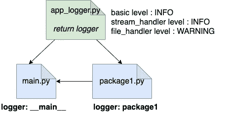
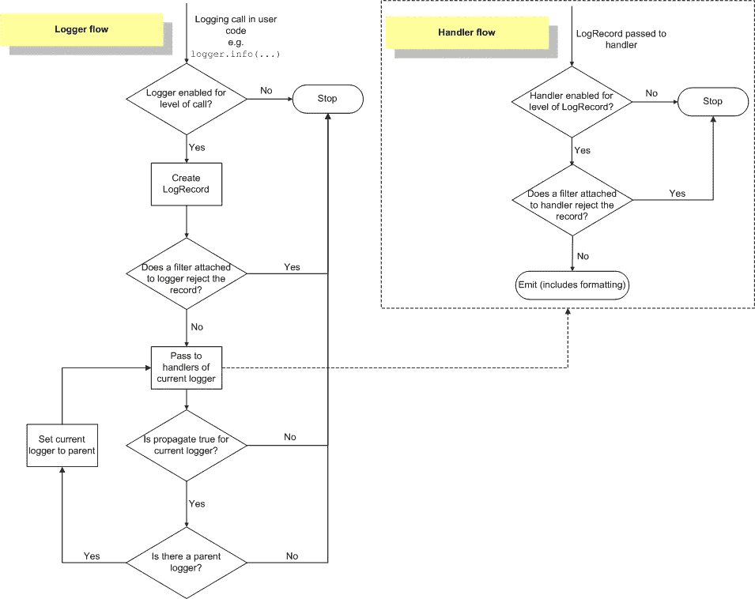

# 不应错过的 8 个高级 Python 日志功能

> 原文：<https://towardsdatascience.com/8-advanced-python-logging-features-that-you-shouldnt-miss-a68a5ef1b62d?source=collection_archive---------2----------------------->

## 在不影响性能的情况下理解你的程序


照片由[巴迪·阿巴斯](https://unsplash.com/@bady)在 [Unsplash](https://unsplash.com/) 拍摄

日志是软件开发中非常重要的一个单元。它帮助开发人员更好地理解程序的执行，并对缺陷和意外失败进行推理。日志消息可以存储诸如程序的当前状态或程序运行的位置等信息。如果出现错误，开发人员可以快速找到导致问题的代码行，并采取相应的措施。

Python 提供了一个非常强大和灵活的内置日志模块，具有许多高级特性。在本文中，我想分享 8 个高级特性，它们将有助于我们开发软件。

## 记录 101

在查看更多高级功能之前，让我们确保对`logging`模块有一个基本的了解。

***记录器***

我们创建来生成日志的实例被称为**记录器**。它是通过`logger = logging.getLogger(__name__)`实例化的。最佳实践是使用`__name__`作为记录器名称，包括包名和模块名。该名称将出现在日志消息中，这有助于开发人员快速找到生成日志的位置。

***格式化程序&处理程序***

每个记录器都有许多可以修改的配置。稍后将讨论更高级的配置，但最常见的是**格式化器**和**处理器**。

格式化程序指定日志消息的结构。每个日志消息都是一个`LogRecord`对象，带有[多个属性](https://docs.python.org/3/library/logging.html#logrecord-attributes)(模块名是其中之一)。当我们定义一个格式化程序时，我们可以决定日志消息应该如何使用这些属性，并且可能使用定制的属性。默认格式化程序如下所示:

```
severity:logger name:message
# e.g: WARNING:root:Program starts!
```

具有更多属性的自定义格式化程序如下所示:

```
"%(asctime)s - [%(levelname)s] -  %(name)s - (%(filename)s).%(funcName)s(%(lineno)d) - %(message)s"# 2020-07-26 23:37:15,374 - [INFO] -  __main__ - (main.py).main(18) - Program starts!
```

处理程序指定日志消息的目的地。日志消息可以发送到多个目的地。日志模块实际上提供了相当多的[标准处理程序](https://docs.python.org/3/library/logging.handlers.html#module-logging.handlers)。最流行的是将日志发送到文件的 FileHandler 和将日志发送到流的 StreamHandler，例如`sys.stderr`或`sys.stdout`。记录器实例支持 0 个或多个处理程序。如果没有定义处理程序，那么它会将日志发送到`sys.stderr`。如果定义了多个处理程序，则目标取决于日志消息的级别和处理程序的级别。

例如，我有一个带有级别警告的 FileHandler 和一个带有级别信息的 StreamHandler。如果我写了一个错误日志消息，那么该消息将被发送到 `*sys.stdout*` *和日志文件中。*

***例如:***

在这个例子中，我们创建了一个`main.py`、`package1.py`和`app_logger.py`。`app_logger.py`包含一个函数`get_logger`，它返回一个记录器实例。logger 实例带有一个自定义格式化程序和两个处理程序:带有信息级别的 StreamHandler 和带有警告级别的 FileHandler。重要的是将基本级别设置为 INFO 或 DEBUG **(默认日志级别为 WARNING)** ，否则低于 WARNING 级别的日志将被过滤掉。`main.py`和`package1.py`都使用`get_logger`来创建它们自己的记录器。



图[高](https://medium.com/u/2adc5a07e772?source=post_page-----a68a5ef1b62d--------------------------------)

基本-日志记录. py

警告日志被发送到控制台输出(sys.stdout)和日志文件，但信息日志仅被发送到控制台输出。如果你能完全理解这个例子中发生了什么以及为什么，那么我们就可以继续开发更高级的特性了。

## 1.使用 LoggerAdapter 创建用户定义的日志记录属性

正如我前面提到的，LogRecord 有许多属性，开发人员可以选择最重要的属性，并将它们放入格式化程序中。除此之外，日志模块还提供了向日志记录添加用户定义属性的可能性。

一种方法是使用`LoggerAdapter`。当您创建一个适配器时，您将 logger 实例和您的属性(在字典中)传递给它。这个类提供了与`Logger`相同的接口，所以你仍然可以调用像`logger.info`这样的方法。

***具有固定值的新属性***

如果您希望在日志消息中有一种固定值属性，比如应用程序名，那么您可以使用默认的`LoggerAdapter`类，并在创建日志记录器时获取属性值。不要忘记在格式化程序中添加这个属性，你可以自由选择它的位置。在下面的代码中，我添加了属性`app`，这个值是在我创建记录器时定义的。

日志适配器固定值. py

***带动态值的新属性***

在其他情况下，您可能需要动态属性，例如，一种动态 ID。然后你可以扩展基本的`LoggerAdapter`并创建你自己的。方法是将额外的属性附加到日志消息的地方。在下面的代码中，我添加了一个动态属性`id`，它可以在每个日志消息中有所不同。在这种情况下，您不需要在格式化程序中添加属性。

日志适配器动态值. py

## 2.使用过滤器创建用户定义的日志记录属性

添加动态用户定义属性的另一种方法是使用自定义过滤器。过滤器提供了额外的逻辑来确定输出哪些日志消息。这是在检查基本日志级别之后，但在将日志消息传递给处理程序之前的一个步骤。除了确定日志消息是否应该向前移动，我们还可以在方法`filter()`中插入新的属性。



图来自 [Python 官方文档](https://docs.python.org/3/howto/logging.html#logging-basic-tutorial)

在这个例子中，我们在`filter()`中添加了一个新的属性`color`，它的值是根据日志消息的级别名确定的。在这种情况下，属性名应该再次添加到格式化程序中。

日志过滤器动态属性. py

## 3.带有日志模块的多线程

日志模块实际上是以线程安全的方式实现的，所以我们不需要额外的努力。下面的代码显示 MainThread 和 WorkThread 共享同一个 logger 实例，没有竞争条件问题。格式化程序还有一个内置属性`threadName`。

记录多线程. py

在幕后，日志模块几乎在任何地方都使用`threading.RLock()`。`RLock`与`Lock`的区别在于:

1.  `Lock`只能获得一次，发布后才能获得。另一方面，`RLock`可以在释放前多次获取，但应该释放相同的次数。
2.  `Lock`可以被任何线程释放，但是`RLock`只能被获取它的同一个线程释放。

任何从类`Handler`扩展的处理程序都有一个方法`handle()`来发出记录。这是`Handler.handle()`的一个代码块。如您所见，处理程序将在发出记录之前和之后获取和释放锁。`emit()`方法可以在不同的处理程序中不同地实现。

handle.py

## 4.带有日志模块的多处理—队列处理器

尽管日志模块是线程安全的，但它不是进程安全的。如果您希望多个进程写入同一个日志文件，那么您必须手动处理对您的文件的访问。根据[测井指南](https://docs.python.org/3/howto/logging-cookbook.html#logging-to-a-single-file-from-multiple-processes)，有几个选项。

***QueueHandler +【消费者】流程***

一种选择是使用`QueueHandler`。这个想法是创建一个`multiprocessing.Queue`实例，并在多个进程之间共享它。在下面的示例中，我们有两个“生产者”进程将日志发送到队列，还有一个“消费者”进程从队列中读取日志并将它们写入日志文件。

队列中的日志可能有不同的级别，因此在`log_processor`中，我们使用`logger.log(record.levelno, record.msg)`而不是`logger.info()`或`logger.warning()`。最后，我们发出信号让`log_processor`停下来。在多个进程或[线程之间共享一个队列实例并不是什么新鲜事](/dive-into-queue-module-in-python-its-more-than-fifo-ce86c40944ef)，但是日志模块可以帮助我们处理这种情况。

日志队列处理程序. py

**queue handler+queue listener**

在`logging.handlers`模块中，有一个特殊的类叫做`[QueueListener](https://docs.python.org/3/library/logging.handlers.html#logging.handlers.QueueListener)`。该类创建一个侦听器实例，该实例具有一个日志消息队列和一个处理日志记录的处理程序列表。`QueueListener`可以用更少的代码替换我们在前一个例子中创建的`listener`流程。

日志队列 listener.py

***SocketHandler***

Cookbook 提供的另一个解决方案是[将来自多个进程的日志发送到一个](https://docs.python.org/3/howto/logging-cookbook.html#network-logging)T4，并有一个单独的进程实现一个套接字服务器，该服务器读取日志并发送到目的地。该文档有一个相当详细的实现。

所有这些解决方案基本上都遵循相同的原则:将日志从不同的进程发送到一个集中的位置，要么是队列，要么是远程服务器。另一端的接收器负责将日志记录写入目的地。

## 5.默认情况下不发出任何库日志— NullHandler

到目前为止，我们已经提到了许多由日志模块实现的处理程序。另一个有用的内置处理程序是`[NullHandler](https://docs.python.org/3/howto/logging.html#configuring-logging-for-a-library)`。NullHandler 的实现基本上什么都没有。然而，它帮助开发人员区分库日志和应用程序日志。

这是`NullHandler`的实现。

nullhandler.py

***为什么我们需要区分库日志和应用日志？***

根据测井模块的[作者 Vinay Sajip:](https://wiki.python.org/moin/LoggingPackage)

> 默认情况下，使用`logging`的第三方库不应该输出日志输出，因为使用它的应用程序的开发人员/用户可能不希望这样。

最佳实践是默认情况下不发出库日志，让库的用户决定他们是否希望在应用程序中接收和处理日志。

作为一个库开发者，我们只需要在`__init__.py`里面一行代码就可以添加`NullHandler`。在子包和子模块中，记录器照常保存。当我们通过`pip install`在我们的应用程序中安装这个包时，默认情况下我们不会看到库中的日志。

记录 nullhandler example.py

使这些日志可见的方法是向应用程序中的库记录器添加处理程序。

```
# your application 
logging.getLogger("package").addHandler(logging.StreamHandler())
```

如果库不使用`NullHandler`，但是你想禁用库日志，那么你可以设置`logging.getLogger("package").propagate = False`。如果 [propagate](https://docs.python.org/3/library/logging.html#logging.Logger.propagate) 设置为 False，那么日志将不会传递给处理程序。

## 6.旋转日志文件—旋转文件处理程序，timedrotating 文件处理程序

`RotatingFileHandler`支持日志文件轮换，这使得处理程序能够根据日志文件的最大大小来轮换日志文件。这里需要定义 2 个参数: **maxBytes** 和 **backupCount** 。 **maxBytes** 告诉处理程序何时旋转日志。 **backupCount** 是日志文件的数量，每个扩展日志文件都有一个后缀“. 1”，文件名末尾有“. 2”。如果当前日志消息将使日志文件超过最大大小，那么处理程序将关闭当前文件并打开下一个文件。

这是一个非常类似于[食谱](https://docs.python.org/3/howto/logging-cookbook.html#using-file-rotation)的例子。您应该得到 6 个日志文件。

日志文件 rotation.py

另一个文件循环处理程序是`TimeRotatingFileHandler`，它允许开发人员基于运行时间创建循环日志。时间条件包括:秒、分、小时、日、w0-w6(0 =星期一)和午夜(午夜翻转)。

在以下示例中，我们每秒轮换 5 个备份文件的日志文件。每个备份文件都有一个时间戳作为后缀。

时间文件 rotation.py

## 7.记录期间的异常

在许多情况下，我们在处理异常时使用`logger.error()`或`logger.exception()`。但是如果记录器本身引发了一个异常，程序会发生什么呢？嗯，看情况。

记录器错误在处理程序调用`emit()`时被处理，这意味着任何与格式化或写入相关的异常都被处理程序捕获，而不是被引发。更具体地说，`handleError()`方法将把引用通告打印给`stderr`，程序将继续。如果你有一个从`Handler`类扩展的自定义处理程序，你可以实现你自己的`handleError()`。

在本例中，第二条日志消息的参数太多。所以在控制台输出中，我们收到了 trackback，程序仍然可以继续。

但是，如果异常发生在`emit()`之外，那么可能会引发异常，程序将会停止。例如，在下面的代码中，我们在`logger.info()`中添加了一个额外的属性`id`，而没有在 LoggerAdapter 中处理它。此错误未得到处理，导致程序停止。

日志记录异常引发. py

## 8.3 种不同的方法来配置您的记录器

我想分享的最后一点是关于配置你的日志。有 3 种方法可以配置记录器。

***使用代码***

最直接的选择是使用代码来配置您的日志记录器，就像我们在本文中看到的所有例子一样。但是这种方法的缺点是任何修改都需要改变源代码。

***使用*** `***dictConfig***`

第二种选择是在字典中编写配置，并使用`logging.config.dictConfig`来读取它。您还可以将字典保存到 JSON 文件中，并从那里读取。优点是它可以作为外部配置加载，但由于其结构，它可能容易出错。

日志配置 json.py

***使用*** `***fileConfig***`

最后但同样重要的是，第三个选项是使用`logging.config.fileConfig`。配置被写入一个单独的`.ini`文件。

日志配置文件. py

可以通过配置服务器在运行时更新配置。食谱展示了一个客户端和服务器端的例子。通过套接字连接更新配置，在客户端，我们使用`c = logging.config.listen(PORT) c.start()`接收最新的配置。

我希望这些日志提示和技巧可以帮助您在不影响性能的情况下，围绕您的应用程序建立一个良好的日志框架。如果你有什么要分享的，请在下面留下你的评论！

## 参考:

 [## 日志记录指南- Python 3.8.5 文档

### 这个页面包含了许多与日志记录相关的方法，这些方法在过去很有用。多次呼叫…

docs.python.org](https://docs.python.org/3/howto/logging-cookbook.html#)  [## 日志记录-Python-Python 3 . 8 . 5 文档的日志记录工具

### 源代码:Lib/logging/__init__。py 这个模块定义了实现灵活事件记录的函数和类…

docs.python.org](https://docs.python.org/3/library/logging.html) [](https://docs.python-guide.org/writing/logging/) [## 日志 Python 的搭便车指南

### 自版本 2.3 以来，该模块一直是 Python 标准库的一部分。它在 PEP 282 中有简洁的描述。的…

docs.python-guide.org](https://docs.python-guide.org/writing/logging/)