# 8 款人工智能驱动的创意应用，适合您和您的孩子

> 原文：<https://towardsdatascience.com/8-ai-driven-creative-apps-for-you-and-your-kids-5fdd71407dc4?source=collection_archive---------14----------------------->

## 新冠肺炎期间你和家人关在一起吗？对整个 AI 宇宙开放。

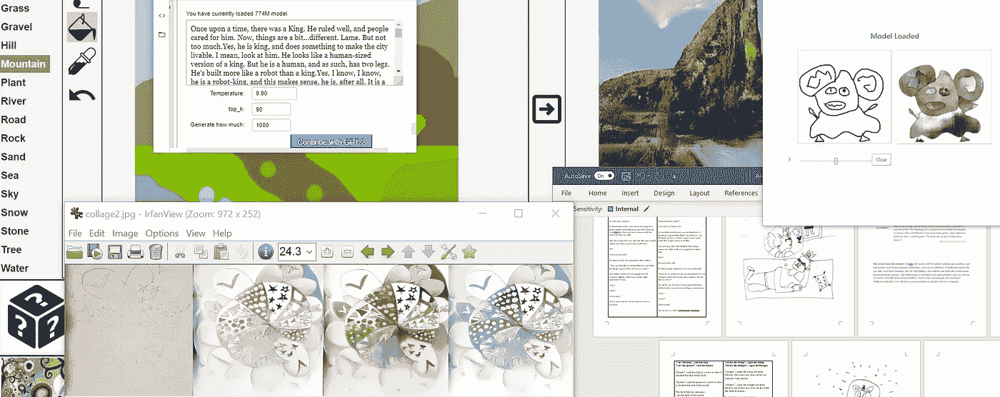

截图:Merzmensch

它不期而至，改变了一切:我们的生活、工作和日常事务。新冠肺炎正以难以想象的方式扰乱我们的世界。现在#SocialDistancing 和#HomeOffice 是热门话题(如果我们必须避免# social distancing，甚至是[，尤其是现在](https://medium.com/datadriveninvestor/3-ways-to-avoid-socialdistancing-in-times-of-corona-2a82fa13f405?source=friends_link&sk=d3b9b1edbbc3e5e845c12dfff0047e79))。

你们中的许多人目前在内政部工作。即使你的雇主不允许，你的孩子也必须在家办公。学校停课了，幼儿园也一样。多重任务不是一种技能:它是存在性的。

# 日冕的积极影响

那么，我们所有的研究和项目、我们的家庭和孩子都处于危险的边缘吗(考虑到潜伏在外面的病毒)？一点也不。尤其是现在。

让我们说一些挑衅性的，但我认为必要的:

感谢科罗纳，我们社会(全球)的平均数字能力即将提高。人们在网上保持联系，孩子们有更多的机会使用数字工具。可能是最后一个曾经对数字化持怀疑态度的人，现在看到了这种存在水平的重要价值。顺便提一下，孩子们:他们现在有一个很好的机会来学习更多关于数字主题，关于在线层，关于人工智能。呆在里面并不意味着被排除在大的外面。

在这篇文章中，我想与你分享一些策略和工具来吸引我们的孩子，启发他们的未来，并创造性地度过锁定期。一起。

# 人工智能和孩子:一个爆炸性的组合。一个用例。

去年夏天，我和女儿(当时 7 岁)决定在 AI 的帮助下做一个小本子。我们用 GPT-2 写了几个童话故事，她亲手画了插图。到那时，我用 TalkToTransformer.com 的[](https://talktotransformer.com/)****进行文本生成。这是我们得到的。(我们对这个故事的提示是“ ***一个国王想要飞*** ”)****

****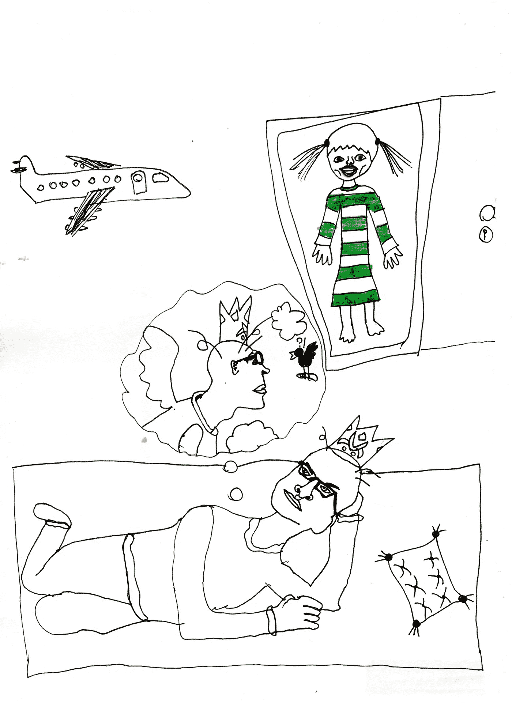****

****插图来自书“世界的开始”(仍未出版)，由索菲亚，7****

```
****A king wanted to fly.** His plane would come."You guys are not coming, so let him fly."The pilot stared at that in the mirror, his eyes wide. His eyes were wide and bloodshot. His back was flat against the wall."Get him through."He looked down. It was true, the door had been opened from the inside. An enormous fist from above."What are you doing now?"And the door opened.In the middle of the room, there was a girl. In a green striped dress that was very short, her hair was short and her eyes were wide as well, her eyes were blue as well.She was young, but very ugly. Her lips were a pale yellow and there weren't any teeth here.No!Hundred-year-old!He stared at her for a long time, then smiled."Gee, you look like a normal child and can't help but laugh, I guess.""How old are you, then?"She looked at him, the young girl's mouth dropped slightly, which was not the right expression to say."Five.""Five?"A hundred!**
```

****这个故事很有趣。我的女儿对人工智能作为一种创作工具产生了兴趣——我们开始了我们的人工智能和艺术之旅。****

****几个月后，我很高兴地读到了贾森·布谷写的这篇美丽而鼓舞人心的文章，这篇文章是关于将纸工艺品和人工智能(GPT-2 和比根)结合起来，增加孩子们的数字技能、乐趣和创造力。****

****[](/helping-kids-play-with-artificial-intelligence-68af8f8ba280) [## 帮助孩子们玩人工智能

### 老派杂志可以教孩子们尖端技能

towardsdatascience.com](/helping-kids-play-with-artificial-intelligence-68af8f8ba280) 

因此，让我们收集和分享基于人工智能的创意工具，提高数字能力，并为我们的孩子带来额外的价值——乐趣。**** 

# ****与您的孩子一起尝试基于人工智能的创意工具。****

# ****讲故事****

******去年 OpenAI 发布的模型[GPT-2](https://openai.com/blog/better-language-models/)**，对自然语言处理产生了重大影响。与此同时，整个 1.5b 版本已经推出。在 40 Gb 文本上训练，它在叙事质量上令人信服。(*当然还有* [*谷歌 BERT*](https://github.com/google-research/bert) *，但如果你在寻找混乱但一致的小说*，GPT-2 是 IMHO 方式有趣)。****

****GPT-2 的一个有趣而重要的方面是*变压器驱动的算法*的**自我关注**:文本生成与第一个人类提示对齐——然后在自身内部保持一致。所以你可以控制最初的倾向或者把注意力放在文本上(文本逐渐变得复杂)。****

****有许多方法可以使用 GPT-2。我推荐用两个。在这些情况下，它是原始模型，而不是在其他来源上训练的。****

******01。与变形金刚对话******

****最直观的实现就是[TalkToTransformer.com](https://talktotransformer.com/)，由[亚当·金](https://medium.com/u/4e7aad6416f0?source=post_page-----5fdd71407dc4--------------------------------)提供。你所要做的就是输入第一句话或一些单词——然后模型继续。****

****感谢自我关注，你可以，比如，唤起一个童话时代的写作，“从前有一个国王”。****

****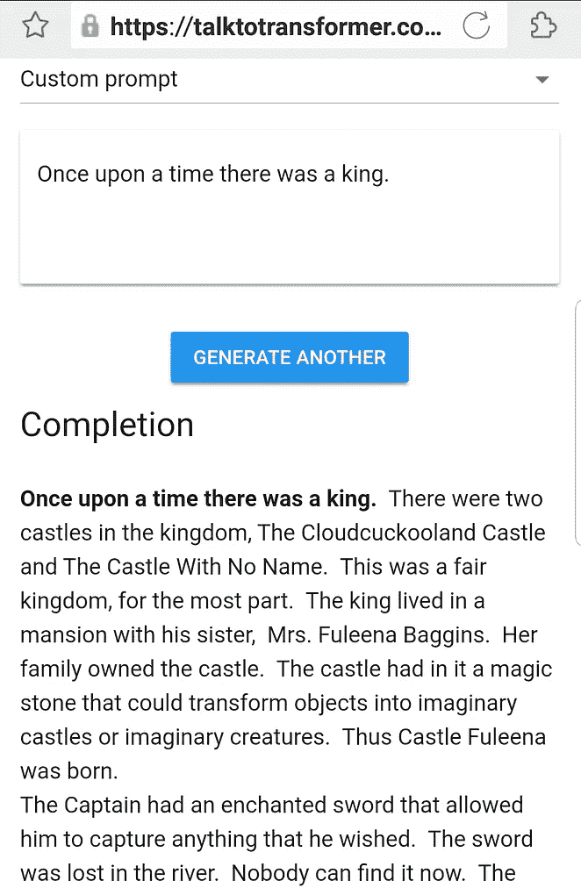****************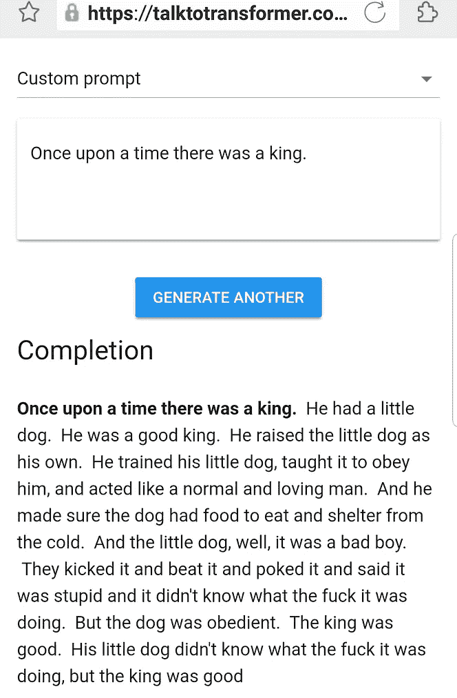****

****由[TalkToTransformer.com](https://talktotransformer.com/)生成的具有一个提示的各种文本。Merzmensch 截图。****

****如你所见，结果可能是滑稽的、超现实的、荒谬的，但也有亵渎的危险。如果这对你来说不成问题，你可以和孩子们一起创造。当然，你可以为你的合作写作“策划”文本。****

> ******优点:**
> 
> 易于使用已经有一些预置可用
> 系统实现了整个 1.5b 型号
> 快速可用，甚至可以通过手机使用****
> 
> ******对比:**
> (实际上只有一个:)它只生成简短的文本片段****

******02。GPT-2 Colab 笔记本******

****如果你想给你的孩子关于 Python 的第一印象——以及关于 GPT-2 如何工作的背景，使用 **Colab 笔记本**(我的一般建议— [有这么多精彩的 Colab 笔记本](/12-colab-notebooks-that-matter-e14ce1e3bdd0?source=friends_link&sk=3cae22488e4bff5f01a1e71fb01975c8))。****

****还有各种各样的 GPT-2 的笔记本电脑。但是我建议试试这个实现:[带 JavaScript 接口的 GPT-2](https://github.com/gpt2ent/gpt2colab-js/blob/master/GPT2_with_Javascript_interface_POC.ipynb)。****

****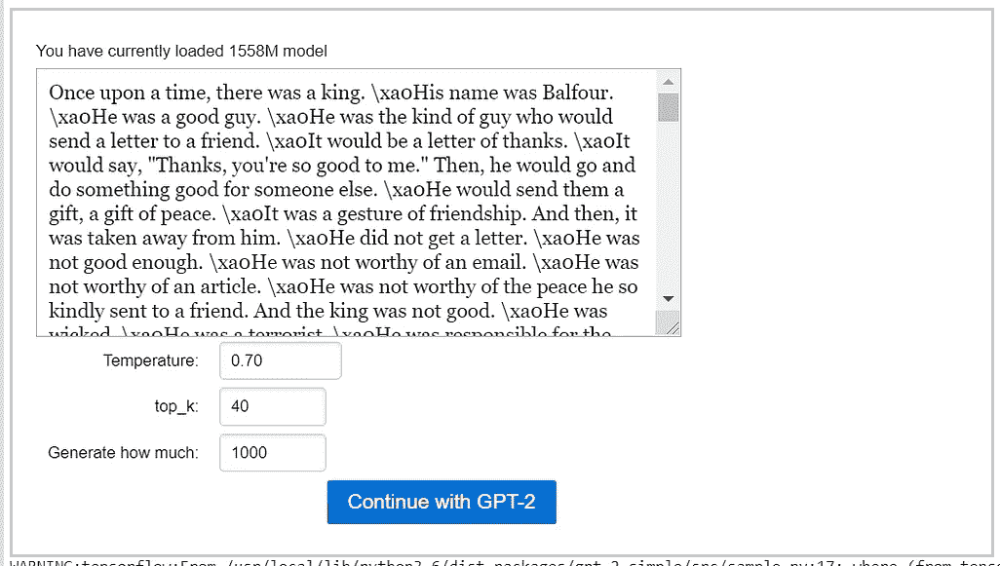********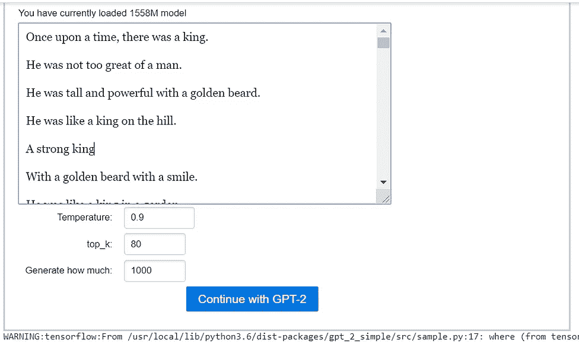****

****文本，由 GPT-2 笔记本生成。截图:Merzmensch****

****我喜欢这种实现的原因是:****

*   ****您可以修改文本长度和其他参数。****
*   ****如果你有 Google-GPU 的运气，你甚至会得到 1.5b 参数的整个模型(就像上面的截图)****
*   ****与其他实现相比，Java 接口是直观的(考虑到你的孩子想玩 GPT-2)。****

```
**To parameters (according to definitions by GitHub folk):**temperature:** Float value controlling randomness in boltzmann distribution. Lower temperature results in less random completions. As the temperature approaches zero, the model will become deterministic and repetitive. Higher temperature results in more random completions.
**top_k:** Integer value controlling diversity. 1 means only 1 word is considered for each step (token), resulting in deterministic completions, while 40 means 40 words are considered at each step. 0 is a special setting meaning no restrictions. 40 generally is a good value.Source: 
[https://github.com/openai/gpt-2/issues/27](https://github.com/openai/gpt-2/issues/27)**
```

****我的收藏设置:
*温度* = 0.9，
*top_k* = 80，
*生成多少* = 1000****

> ******优点:**
> 
> 易于使用；可以使用更长的连贯文本(自我关注机制！)
> 系统实现各种模型，包括 1.5b 参数
> 更多修改参数的可能性****
> 
> ******对比:**
> 【初始化和文本生成需要时间
> 较大的模型可能会产生突然的亵渎和其他奇怪的东西，可能不适合您的孩子。你无法控制结果。****

****语言障碍？假设你的孩子母语不是英语——这不是问题。您可以使用 DL 驱动的翻译服务 Deepl.com，并将其翻译成您的语言:****

****[](https://www.deepl.com/translator) [## DeepL 翻译器

### 科技巨头谷歌、微软和脸书都在将机器学习的经验应用到翻译中，但是一个小的…

www.deepl.com](https://www.deepl.com/translator) 

当然，你甚至可以使用亚马逊 AWS Polly 服务(目前有大约 30 种语言可用)，让人工智能用多种语言大声朗读故事:**** 

# ****画一幅画****

## ****03.Pix2Pix****

****已经一年了，但仍然是由[Zaid Alyafeai](https://medium.com/u/14424af03ecf?source=post_page-----5fdd71407dc4--------------------------------)([GitHub](https://github.com/zaidalyafeai/zaidalyafeai.github.io/tree/master/pix2pix))进行的迷人实验:Image2Image 翻译的 TensorFlow 实现。****

****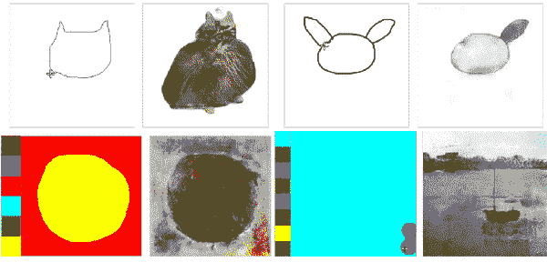****

****Pix2Pix 演示，来源:[github.com/zaidalyafeai](https://github.com/zaidalyafeai/zaidalyafeai.github.io/tree/master/pix2pix)****

****我不需要把 Pix2Pix 介绍给你亲爱的数据科学观众，因为[它已经在这里得到了很好的检验](/search?q=pix2pix)。它使用模式识别将涂鸦转化为图像，并在特定的数据集上接受训练。****

****[这个基于网络的应用](https://zaidalyafeai.github.io/pix2pix/cats.html)提供了一个孩子友好的界面，有输入输出窗口和各种预先训练好的模型:猫、门面、口袋妖怪等等。****

****画个口袋妖怪怎么样？****

****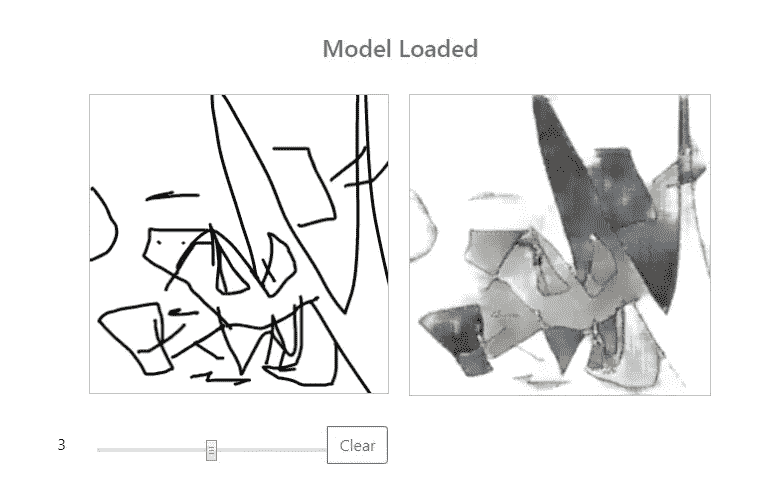********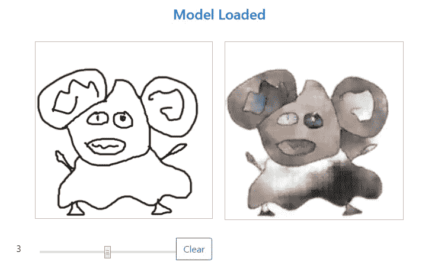****

****一些口袋妖怪，是我女儿画的。截图:Merzmensch****

> ******优点:**
> 
> 易于使用 pix2pix 作为最相关的模型之一的体验
> 体验乐趣****
> 
> ******对比:**
> 大概没什么****

## ****04.高根****

****这一个达到了另一个层次。我打赌你的孩子会对 GauGAN 上瘾。这个由 NVidia AI Lab 提供的[基于 GAN 的实现](http://nvidia-research-mingyuliu.com/gaugan)，将分割图转换为照片级真实感图像。****

****分割图通过颜色来区分，并归属于各种材质和内容:天空、云、树木、建筑物等。****

****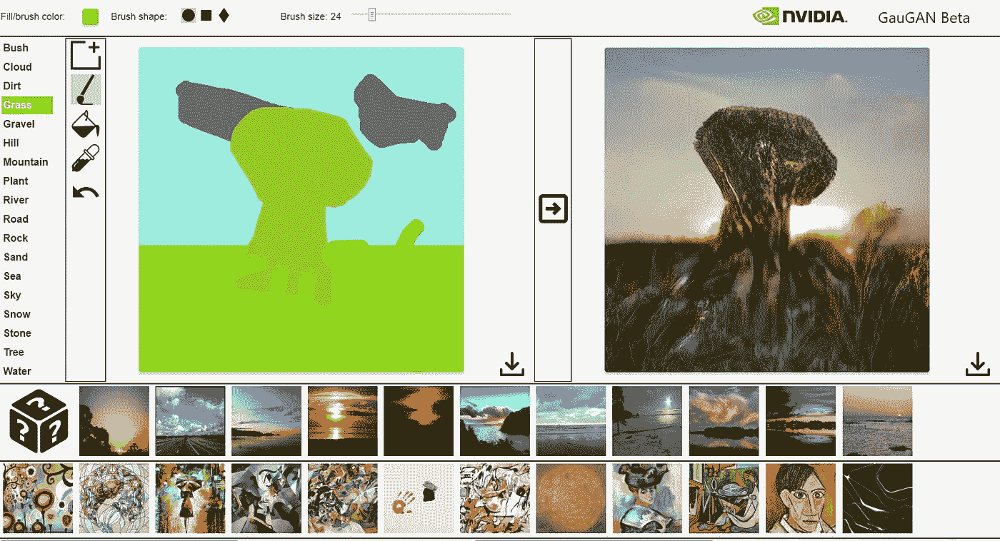****

****左边的分割图:女儿涂鸦的。右图由 GauGAN 实时处理。截图:Merzmensch。****

****如果你使用平板电脑，或者在我的情况下，它是笔记本电脑的触摸屏，你的孩子可以用手(而不是鼠标)画画。触觉体验！****

****在各种型号上也有大量的风格转换预设。创意遇上惊喜=这是你孩子的天堂。你也可以顺便给你的孩子解释一下[图像分割](https://missinglink.ai/guides/computer-vision/image-segmentation-deep-learning-methods-applications/)的原理。****

****以下是 GauGAN 的演示:****

> ******优点:**
> 
> 易于使用
> 实验视野宽广
> 几十个分段和预设****
> 
> ******对比:**
> (…还在找一些不好的地方…)****

## ****05.给你孩子的画上色。****

****你的孩子当然也喜欢用完全模拟的方式(用铅笔在纸上)画画。让 AI 给你孩子的作品上色怎么样？****

****有各种各样的着色实现。其中之一就是 [**Petalica Paint**](https://petalica-paint.pixiv.dev/index_en.html) ，原名 **PaintsChainer** ，由日本在线艺术家社区 [Pixiv](https://www.pixiv.net/) 提供。****

****你可以用工具画画或者上传你孩子的草图。原始文件的质量并不重要。我用智能手机拍摄了我女儿的素描。这是我在不同模式下得到的结果:****

****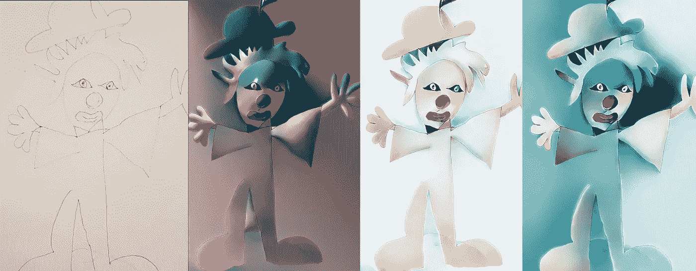****

****我女儿的涂鸦，还有人工智能着色的版本。截图:Merzmensch****

****或者这个:****

****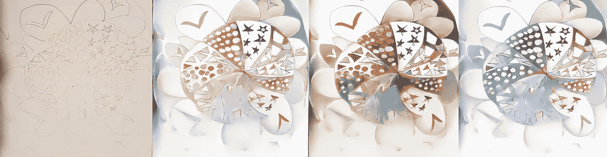****

****我女儿画的素描，还有人工智能上色的版本。截图:Merzmensch****

****如你所见，即使是你的孩子画的抽象画也可以用令人惊讶的方式着色。****

> ******优点:**
> 
> 总是出人意料，甚至支持抽象涂鸦****
> 
> ******对比:**
> 【缺少以前版本的 3D 效果****

# ****再造一个童话！****

## ****06.比根。****

****老好人 BigGAN 正在用这款 Colab 笔记本稳定工作。你可以生成东西，也可以享受种子间的插值(我写的更多的是 [BigGAN](https://medium.com/merzazine/biggan-as-a-creative-engine-2d18c61e82b8?source=friends_link&sk=498b6f23dfa37347ac952e9d209710c4) 和[插值](https://medium.com/merzazine/biggan-and-metamorphosis-of-everything-abc9463125ac?source=friends_link&sk=fde32a2f24a97d0a651c087709fb8a53))。****

****和你的孩子一起重现变形和转变的童话故事怎么样？****

******灰姑娘**，有人吗？****

****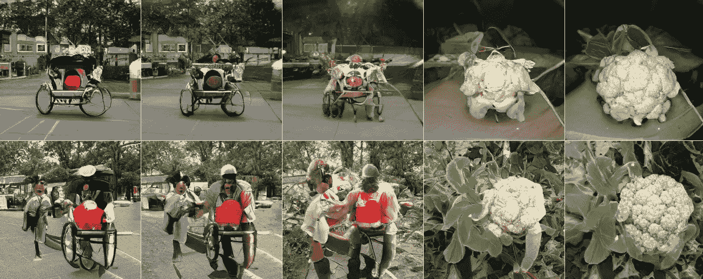****

****比根插值。截图 ty Merzmensch****

****午夜时分，马车变成了——好吧，数据集中没有南瓜，但我希望花椰菜会通过。****

****还是**青蛙**来个**王子**？****

****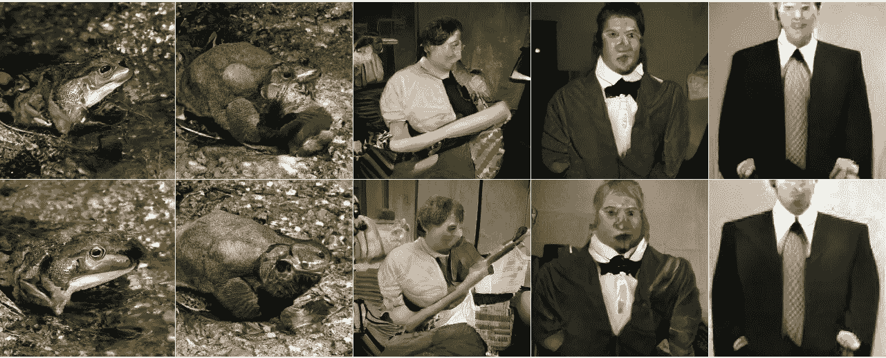****

****牛蛙(#30) = >温莎领带(#906)。截图:Merzmensch****

****你还知道哪种变形？****

> ******优点:**
> 
> 为您的孩子提供完美的甘视觉演示
> 使用有趣
> 重要方法****
> 
> ******对比:**
> 
> 有限的预训练类别选择低分辨率(因为已经是历史)****

# ****建立一个新世界。****

## ****07.艺术育种家****

****肯定，[艺术培育者](https://artbreeder.com/)。毫无疑问，你已经读过[我对这个基于 StyleGAN 的工具集的更长描述](/artbreeder-draw-me-an-electric-sheep-841babe80b67?source=friends_link&sk=2fff2b9e102ce632d725e58bfa4c67dd)，由[乔尔·西蒙](https://medium.com/u/be6acff3480f?source=post_page-----5fdd71407dc4--------------------------------)实现。****

****你可以创造奇迹。**角色生成**为你的合作故事？****

****她你去:一张**脸代**。****

****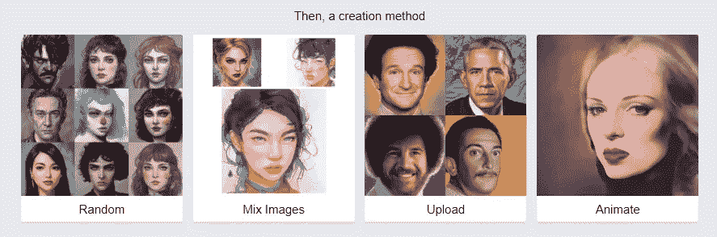****

****艺术育种家。截图:Merzmensch****

****你的世界需要设定吗？使用**风景生成**。****

****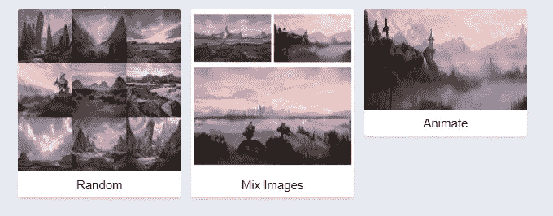****

****艺术育种家。截图:Merzmensch****

****你也可以生成一个全身的角色(注意:因为 Artbreeder 支持全身的服装，如果你尽量少穿衣服，工作会变得不安全，如果你明白我的意思的话)。****

****Artbreeder 也非常适合 BigGAN 插值函数，但是具有更多可能性和种子。****

****因此，如果你想穿越书店、飞船和大灰猫头鹰，你可以循序渐进:****

****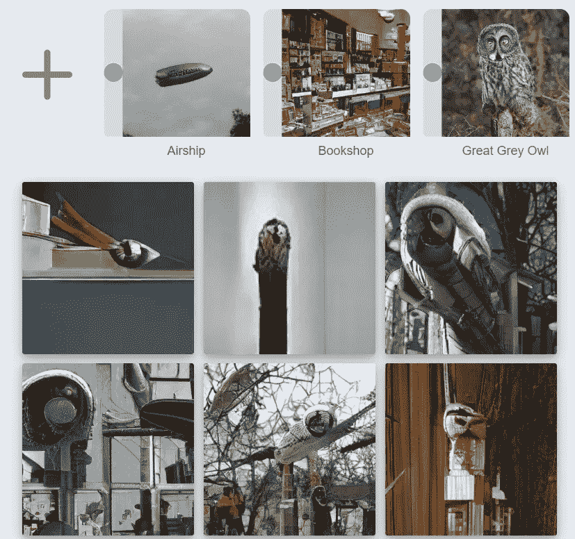****

****截图来自 Merzmensch 的 Artbreeder****

****现在你和你的孩子可以进行各种不可组合的实验——很有趣，可能是你疯狂童话的一部分。艺术育种界面是用户友好的，你的孩子会很快适应自己。****

> ******优点:**
> 【图像生成的多种可能性】
> 每个模型都有大量的参数可以修改
> 结果质量惊人****
> 
> ******对比:**
> 还不是 StyleGAN2(等待)
> “全身人物”的情况下:可以是 NSFW****

# ****赋予角色生命****

## ****08.一阶运动模型。****

****现在你的孩子将需要你的帮助，因为这个模型可以通过 Colab 笔记本操作。(提示:RunwayML 也支持它)****

****[aliak sandr Siarohin(等人)的一阶运动模型](/first-order-motion-model-ab3908407208?source=friends_link&sk=e8772741be0db5da9e3f9af5ec392ffc)将视频镜头中的运动数据转换为单张照片。在这种情况下，你可以像我对妮芙缇一样制作脸部动画:****

****有各种各样的 Colab 笔记本，我推荐这款经过 Bomze 优化的:****

****而且已经有了孩子和人工智能合作动画的完美样本。****

****来自创意视觉工作室的数字艺术家 Mar Canet 用他的女儿和第一个动作顺序模型做实验。他们取得了惊人的成绩:****

****现在想象用动画角色制作一个童话故事(原始的面部镜头可以由你或你的孩子录制并转换)。****

> ******优点:**
> 独特的可能性来制作一个小孩画的涂鸦脸。****
> 
> ******对比:**
> 并非所有视频格式都可用
> Colab 笔记本不可避免(RunwayML 中的这款机型仍有问题)****

## ****09.顺便说一下，RunwayML。****

****如果这还不够——你只需要看看 [RunwayML](https://medium.com/u/2d612be6e147?source=post_page-----5fdd71407dc4--------------------------------) —大量的模型(文本、图像生成、视频、网络摄像头等。).选择是如此之多(并且还在不断增加),以至于它值得一篇特别的大文章。我这就去！****

****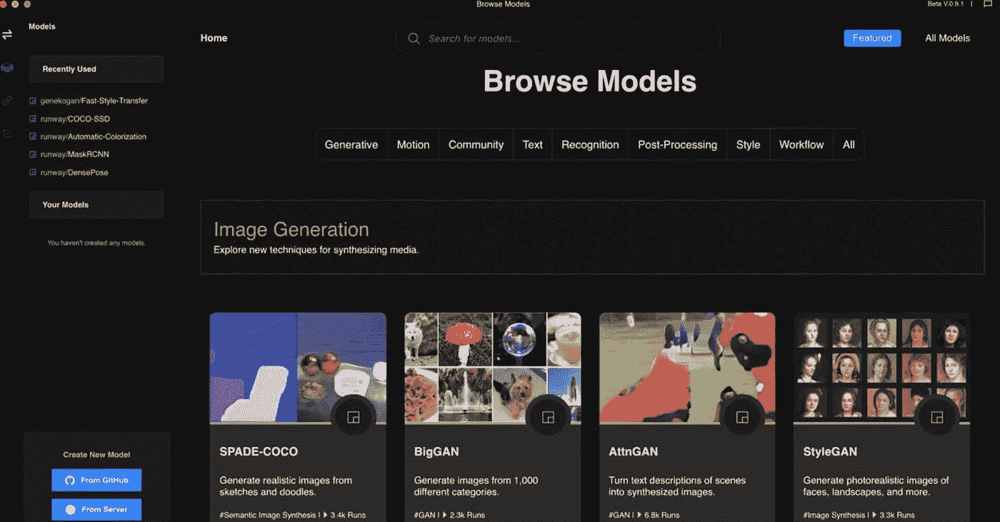****

****你知道其他适合孩子的创造性人工智能应用吗？****

*****你如何与你的孩子度过隔离时间(关于数据科学？)*****