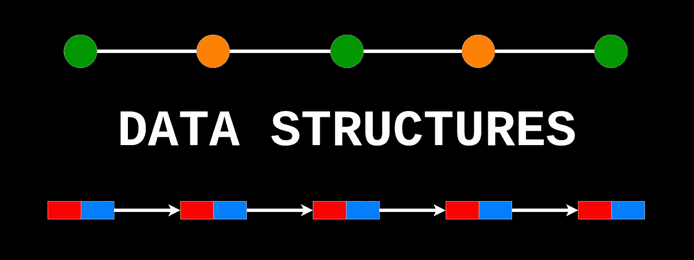
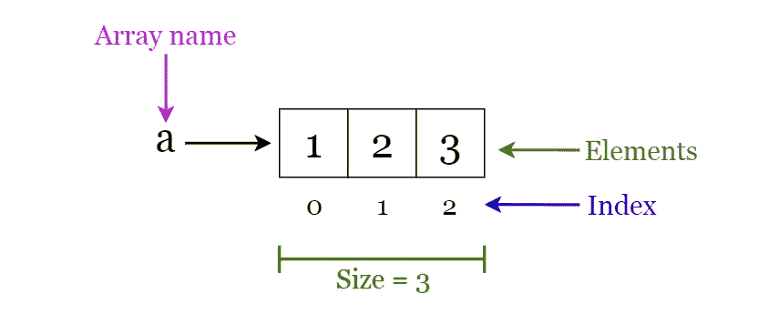
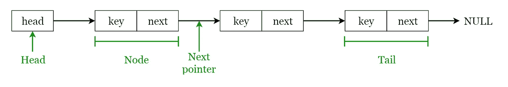
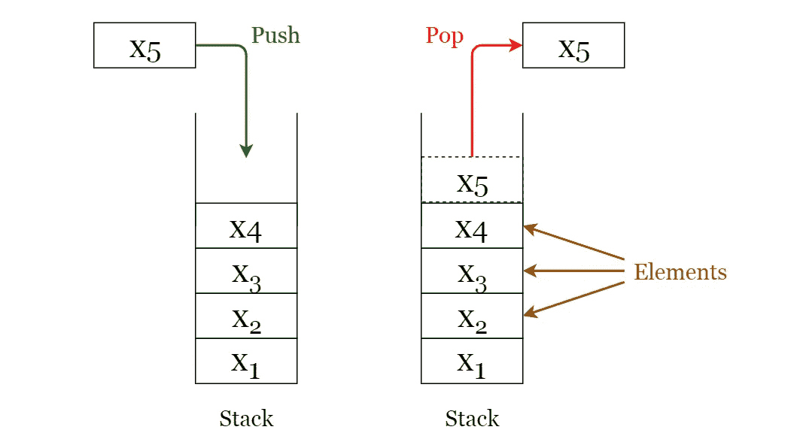
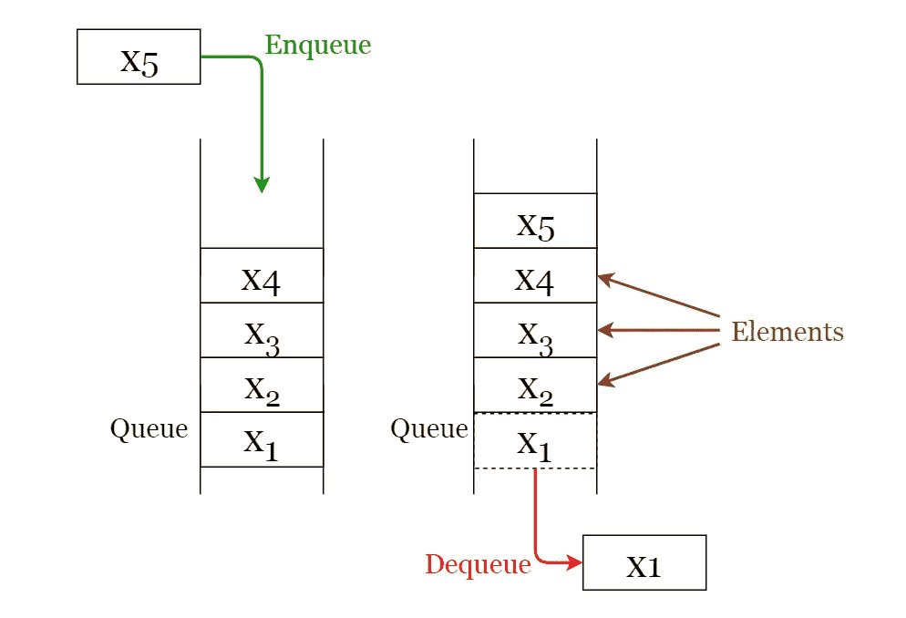
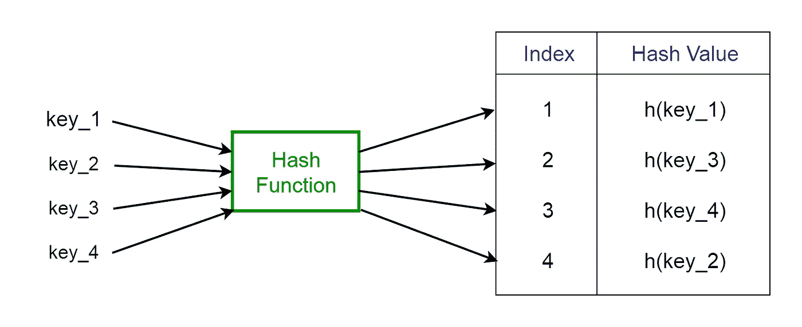
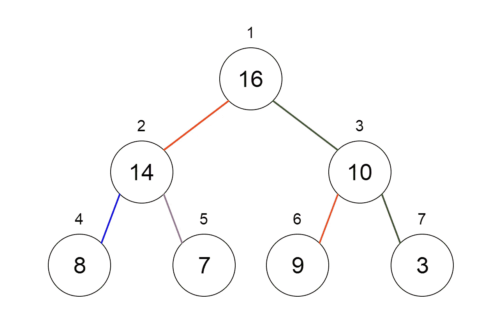
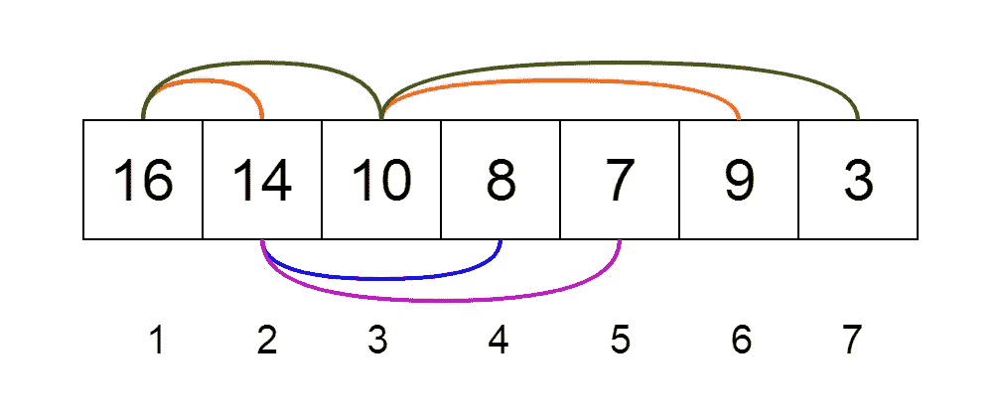
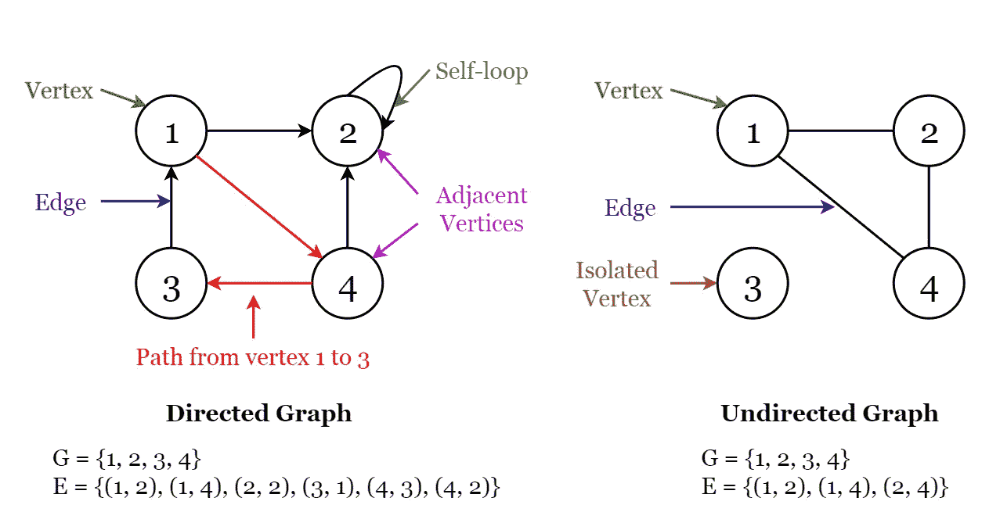

# 每个程序员都必须知道的 8 种常见数据结构

> 原文：<https://towardsdatascience.com/8-common-data-structures-every-programmer-must-know-171acf6a1a42?source=collection_archive---------0----------------------->

## 8 种常用数据结构的快速介绍

**数据结构**是一种在计算机中组织和存储数据的专门方法，通过这种方法，我们可以更有效地对存储的数据执行操作。数据结构在计算机科学和软件工程领域有着广泛而多样的使用范围。

作者图片

几乎每一个已经开发的程序或软件系统都在使用数据结构。此外，数据结构属于计算机科学和软件工程的基础。当涉及到软件工程面试问题时，这是一个关键话题。因此，作为开发人员，我们必须对数据结构有很好的了解。

在这篇文章中，我将简要解释每个程序员都必须知道的 8 种常用数据结构。

# 1.数组

一个**数组**是一个固定大小的结构，它可以保存相同数据类型的项目。它可以是整数数组、浮点数数组、字符串数组甚至数组数组(比如*二维数组*)。数组是有索引的，这意味着随机访问是可能的。

图一。数组基本术语的可视化(图片由作者提供)

## 数组运算

*   **遍历**:遍历元素并打印出来。
*   **搜索**:搜索数组中的一个元素。您可以通过元素的值或索引来搜索元素
*   **更新**:更新给定索引处现有元素的值

**向数组中插入**元素和从数组中删除**元素不能马上完成，因为数组的大小是固定的。如果你想在一个数组中插入一个元素，首先你需要创建一个新的数组，增加它的大小(当前大小+ 1)，复制现有的元素并添加新的元素。这同样适用于删除一个新的减小了大小的数组。**

## **数组的应用**

*   用作构建块来构建其他数据结构，如数组列表、堆、哈希表、向量和矩阵。
*   用于不同的排序算法，如插入排序、快速排序、冒泡排序和合并排序。

# 2.链接列表

**链表**是一个顺序结构，由一系列相互链接的线性顺序的项目组成。因此，你必须按顺序访问数据，随机访问是不可能的。链表提供了一种简单灵活的动态集合表示。

让我们考虑以下关于链表的术语。参考图 2 可以有一个清晰的思路。

*   链表中的元素被称为**节点**。
*   每个节点包含一个**键**和一个指向其后继节点的指针，称为**下一个**。
*   名为 **head** 的属性指向链表的第一个元素。
*   链表的最后一个元素被称为**尾**。

图二。链表基本术语的可视化(图片由作者提供)

以下是可用的各种类型的链表。

*   **单链表** —只能向前遍历项目。
*   **双向链表** —可以向前和向后遍历条目。节点由一个称为 **prev** 的额外指针组成，指向前一个节点。
*   **循环链表** —头的 prev 指针指向尾，尾的 next 指针指向头的链表。

## 链表操作

*   **Search** :通过简单的线性搜索，在给定的链表中找到关键字为 **k** 的第一个元素，并返回指向该元素的指针
*   **插入**:向链表中插入一个键。插入可以通过三种不同的方式完成；在列表的开头插入，在列表的结尾插入，在列表的中间插入。
*   **删除**:从给定的链表中删除一个元素 **x** 。您不能一步删除一个节点。删除可以通过三种不同的方式完成；从列表的开头删除，从列表的结尾删除，从列表的中间删除。

## **链表的应用**

*   用于编译器设计中的*符号表管理*。
*   用于使用 Alt + Tab 在程序之间切换(使用循环链表实现)。

# 3.大量

**堆栈**是一种 **LIFO** (后进先出——放在最后的元素可以首先被访问)结构，这在许多编程语言中都很常见。这种结构被命名为“堆栈”,因为它类似于现实世界中的堆栈——一堆盘子。

图片由[设计](https://pixabay.com/users/congerdesign-509903/?utm_source=link-attribution&utm_medium=referral&utm_campaign=image&utm_content=629987)来自[像素库](https://pixabay.com/?utm_source=link-attribution&utm_medium=referral&utm_campaign=image&utm_content=629987)

## 堆栈操作

下面给出了可以在堆栈上执行的两个基本操作。请参考图 3 来更好地理解堆栈操作。

*   **按下**:将一个元素插入到栈顶。
*   **Pop** :删除最上面的元素并返回。

图三。堆栈基本操作的可视化(图片由作者提供)

此外，还为堆栈提供了以下附加功能，以便检查其状态。

*   **Peek** :返回栈顶元素，不删除。
*   **isEmpty** :检查堆栈是否为空。
*   **是否已满**:检查堆栈是否已满。

## 堆栈的应用

*   用于表达式评估(例如:*调车场算法*用于解析和评估数学表达式)。
*   用于在递归编程中实现函数调用。

# 4.行列

一个**队列**是一个 **FIFO** (先进先出——放在最前面的元素可以最先被访问)结构，这在许多编程语言中都很常见。这种结构被命名为“队列”,因为它类似于现实世界中的队列——人们在队列中等待。

图片来自 [Pixabay](https://pixabay.com/?utm_source=link-attribution&utm_medium=referral&utm_campaign=image&utm_content=50119) 的 [Sabine Felidae](https://pixabay.com/users/sheadquarters-5187/?utm_source=link-attribution&utm_medium=referral&utm_campaign=image&utm_content=50119)

## 队列操作

下面给出了可以在队列上执行的两个基本操作。请参考图 4 来更好地理解队列操作。

*   **入队**:在队列末尾插入一个元素。
*   **出列**:删除队列开头的元素。

图 4。队列基本操作的可视化(图片由作者提供)

## 队列的应用

*   用于管理多线程中的线程。
*   用于实现排队系统(例如:优先级队列)。

# 5.哈希表

哈希表是一种存储值的数据结构，这些值具有与每个值相关联的键。此外，如果我们知道与值相关联的键，它可以有效地支持查找。因此，无论数据大小如何，它在插入和搜索方面都非常有效。

**直接寻址**在表中存储时，使用值和键之间的一对一映射。然而，当有大量的键值对时，这种方法就有一个问题。考虑到典型计算机的可用内存，该表将会非常大，包含如此多的记录，并且可能不切实际，甚至不可能被存储。为了避免这个问题，我们使用了**散列表**。

## 散列函数

名为**散列函数** ( **h** )的特殊函数用于克服直接寻址中的上述问题。

在直接访问中，具有键 **k** 的值被存储在槽 **k** 中。使用散列函数，我们计算每个值所在的表(槽)的索引。使用散列函数为给定键计算的值被称为**散列值**，它指示该值映射到的表的索引。

> **h(k) = k % m**

*   **h:** 哈希函数
*   **k:** 应确定其哈希值的键
*   **m:** 哈希表的大小(可用的槽数)。对于 **m** 来说，不接近 2 的精确幂的质数是个不错的选择。

图五。哈希函数的表示(图片由作者提供)

考虑哈希函数 **h(k) = k % 20** ，其中哈希表的大小为 20。给定一组键，我们希望计算每个键的哈希值，以确定它在哈希表中的索引位置。假设我们有以下键，散列和散列表索引。

*   1 → 1%20 → 1
*   5 → 5%20 → 5
*   23 → 23%20 → 3
*   63 → 63%20 → 3

从上面给出的最后两个例子中，我们可以看到，当哈希函数为多个键生成相同的索引时，会出现**冲突**。我们可以通过选择合适的散列函数 h 来解决冲突，并使用诸如**链接**和**开放寻址**之类的技术。

## 哈希表的应用

*   用于实现数据库索引。
*   用于实现关联数组。
*   用于实现“设置”数据结构。

# 6.树

**树**是一种分层结构，其中数据按层次组织并链接在一起。这种结构不同于链表，而在链表中，项目是以线性顺序链接的。

在过去的几十年中，为了适应特定的应用和满足特定的限制，已经开发了各种类型的树。一些例子是二叉查找树树、B 树、treap 树、红黑树、八字树、AVL 树和 n 叉树。

## 二分搜索法树

**二叉查找树(BST)** 顾名思义，是一种二叉树，其中数据以层次结构组织。这种数据结构按排序顺序存储值。

二叉查找树中的每个节点都包含以下属性。

1.  **key** :存储在节点中的值。
2.  **左**:指向左子的指针。
3.  **右**:指向右孩子的指针。
4.  **p** :指向父节点的指针。

二叉查找树表现出一种独特的属性，区别于其他树木。这个属性被称为**二进制搜索树属性**。

设 **x** 是二叉查找树中的一个节点。

*   如果 **y** 是 x 的**左**子树中的一个节点，那么 **y.key ≤ x.key**
*   如果 **y** 是 x 的**右**子树中的一个节点，那么 **y.key ≥ x.key**

图六。树木基本术语的可视化(图片由作者提供)

## 树木的应用

*   **二叉树**:用于实现表达式解析器和表达式求解器。
*   **二叉查找树**:用于许多数据不断进出的搜索应用。
*   **堆**:JVM(Java 虚拟机)用来存储 Java 对象。
*   **Treaps** :用于无线网络。

查看我下面关于 8 个有用的树数据结构和自平衡二分搜索法树的文章。

 [## 值得了解的 8 种有用的树数据结构

### 8 种不同树形数据结构的概述

towardsdatascience.com](/8-useful-tree-data-structures-worth-knowing-8532c7231e8c)  [## 自平衡二分搜索法树 101

### 自平衡二分搜索法树简介

towardsdatascience.com](/self-balancing-binary-search-trees-101-fc4f51199e1d) 

# 7.很

一个**堆**是二叉树的一个特例，其中父节点与它们的子节点的值进行比较，并相应地排列。

让我们看看如何表示堆。堆可以用树和数组来表示。图 7 和图 8 展示了我们如何使用二叉树和数组来表示二进制堆。

图 7。堆的二叉树表示(图片由作者提供)

图 8。堆的数组表示(图片由作者提供)

堆可以有两种类型。

1.  **最小堆** —父项的键小于或等于其子项的键。这被称为**最小堆属性**。根将包含堆的最小值。
2.  **最大堆** —父项的键大于或等于其子项的键。这称为**最大堆属性**。根将包含堆的最大值。

## 堆的应用

*   用于**堆排序算法**。
*   用于实现优先级队列，因为优先级值可以根据堆属性进行排序，其中堆可以使用数组来实现。
*   队列函数可以在 **O(log n)** 时间内使用堆来实现。
*   用于查找给定数组中 kᵗʰ最小(或最大)值。

查看我下面关于使用 python heapq 模块实现堆的文章。

 [## Python Heapq 模块简介

### 关于如何使用 Python 的 heapq 模块的简单介绍

towardsdatascience.com](/introduction-to-python-heapq-module-53534feda625) 

# 8.图表

一个**图**由一组有限的**顶点**或节点以及一组连接这些顶点的**边**组成。

图的**阶**是图中顶点的个数。图的**大小**是图中边的数量。

如果两个节点通过同一条边相互连接，则称它们为**相邻**。

## 有向图

如果一个图 **G** 的所有边都有一个指示什么是起始顶点，什么是结束顶点的方向，则称该图为**有向图**。

我们说 **(u，v)** 是从或**离开**顶点 **u** 的**事件，是从**或**进入**顶点 **v** 的**事件。**

**自循环**:从顶点到自身的边。

## 无向图

如果一个图 **G** 的所有边都没有方向，则称其为无向图**。它可以在两个顶点之间双向移动。**

如果一个顶点不与图中的任何其他节点相连，则称其为**孤立的**。

图九。图形术语的可视化(图片由作者提供)

你可以从我的文章 [10 图算法直观解释](https://medium.com/@vijinimallawaarachchi/10-graph-algorithms-visually-explained-e57faa1336f3)中读到更多关于图算法的内容。

 [## 直观解释的 10 种图形算法

### 10 种基本图形算法的快速介绍，包括示例和可视化

medium.com](https://medium.com/@vijinimallawaarachchi/10-graph-algorithms-visually-explained-e57faa1336f3) 

## 图表的应用

*   用于表示社交媒体网络。每个用户都是一个顶点，当用户连接时，他们就创建了一条边。
*   用于表示搜索引擎的网页和链接。互联网上的网页通过超链接相互链接。每个页面是一个顶点，两个页面之间的超链接是一条边。用于谷歌的页面排名。
*   用于在 GPS 中表示位置和路线。位置是顶点，连接位置的路线是边。用于计算两个位置之间的最短路线。

# 最后的想法

数据结构操作的时间复杂性的备忘单可以在这个[链接](https://www.bigocheatsheet.com/)中找到。此外，请查看我下面的文章，在这篇文章中，我使用 C++从头开始实现了一些常见的数据结构。

 [## C++中的数据结构—第 1 部分

### 在 C++中实现通用数据结构

towardsdatascience.com](/data-structures-in-c-part-1-b64613b0138d) 

最后，我要感谢 A Alkaff Ahamed 先生为改进本文提供了宝贵的反馈和建议。

我希望作为对数据结构的简单介绍，这篇文章对您有所帮助。我很想听听你的想法。😇

非常感谢你的阅读。😊

干杯！😃

# 参考

[1]《算法导论》，第三版，作者:托马斯·h·科尔曼、查尔斯·e·莱瑟森、罗纳德·L·李维斯特和克利福德·斯坦。

[2]维基百科的数据结构列表([https://en.wikipedia.org/wiki/List_of_data_structures](https://en.wikipedia.org/wiki/List_of_data_structures))